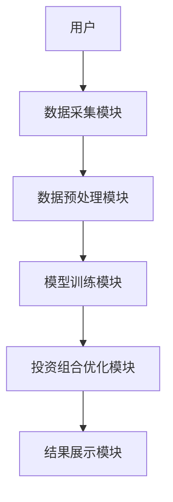
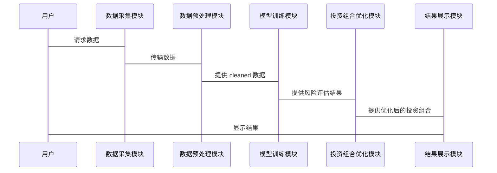

                 

<think>
好的，我现在需要撰写一篇关于杰里米·格兰瑟姆的气候变化投资策略的技术博客文章。首先，我得了解杰里米·格兰瑟姆是谁，他在投资领域有何成就，以及他如何将气候变化因素融入投资策略中。这可能涉及到价值投资的基本原则和他对可持续发展的看法。

接下来，我需要明确文章的结构。根据用户提供的目录大纲，我将从背景介绍开始，逐步深入到核心概念、数学模型、系统架构，再到项目实战和未来趋势。每个部分都需要详细展开，确保涵盖所有关键点。

首先，在背景介绍中，我需要解释气候变化对全球经济的影响，以及为什么投资者应该关注这一问题。这可能包括气候变化带来的物理风险（如极端天气事件）和转型风险（如政策变化和技术创新）。我还需要提到格兰瑟姆的投资理念，特别是他的价值投资方法和对长期趋势的关注。

在核心概念部分，我需要详细讨论ESG投资。ESG分别代表环境、社会和治理因素，这些都是评估企业可持续性的关键指标。我需要解释每个因素的重要性，以及它们如何影响投资决策。此外，我还需要比较气候变化投资与其他类型投资策略的差异，如传统价值投资和成长投资。

接下来，数学模型和算法部分需要详细说明如何量化气候变化风险。可能包括使用蒙特卡洛模拟来预测极端气候事件对投资组合的影响，或者构建多元回归模型来评估不同因素对股票收益的影响。我需要提供具体的数学公式和代码示例，以帮助读者理解如何应用这些模型。

系统架构部分可能需要设计一个数据分析框架，用于整合气候数据和财务数据。这可能涉及数据预处理、特征工程和模型部署等步骤。我需要使用Mermaid绘制类图和架构图，展示系统的各个模块及其交互。

在项目实战部分，我需要指导读者如何安装必要的工具，如Python和相关库，并提供代码示例。例如，如何使用Python爬取公司的碳排放数据，并将其与财务数据结合进行分析。同时，我还需要分析实际案例，说明如何应用这些方法来构建可持续投资组合。

最后，在风险管理与策略优化部分，我需要讨论如何通过调整投资组合来降低气候变化带来的风险。这可能包括使用对冲策略、分散投资或动态再平衡等方法。我还需要评估优化后的投资组合在不同情景下的表现，以验证其有效性和稳健性。

总结部分，我需要回顾全文，强调气候变化投资的重要性，并展望未来的发展趋势。我还可以提供一些最佳实践的建议，帮助读者在实际投资中更好地应用这些策略。

在写作过程中，我需要确保语言简洁明了，逻辑清晰，同时深入分析每个主题。我还需要使用图表和代码示例来增强文章的可读性和实用性。此外，我必须确保文章结构符合用户的要求，每个部分都有足够的细节和深度，以满足读者的需求。

通过以上步骤，我将能够撰写出一篇结构合理、内容丰富、逻辑清晰的技术博客文章，全面介绍杰里米·格兰瑟姆的气候变化投资策略，并为读者提供实用的指导和见解。
</think>

# 杰里米·格兰瑟姆的气候变化投资策略

## 关键词：杰里米·格兰瑟姆，气候变化，投资策略，ESG，可持续发展，风险管理

## 摘要：  
本文深入探讨了杰里米·格兰瑟姆的气候变化投资策略，结合其价值投资理念，分析了气候变化对投资的影响，并提出了基于ESG框架的投资策略。文章从背景介绍、核心概念、数学模型、系统架构到项目实战，全面阐述了如何将气候变化因素纳入投资决策，并通过实际案例和工具实现可持续投资组合的构建。

---

# 第一部分：背景与概述

## 第1章：气候变化投资的背景

### 1.1 气候变化对投资的影响

#### 1.1.1 气候变化的定义与关键问题

气候变化是指全球气候系统长期的变化，主要由人类活动（如化石燃料的使用、森林砍伐等）导致的温室气体排放增加引起。关键问题包括：

- **物理风险**：极端天气事件（如洪水、干旱、飓风）对企业运营和资产的破坏。
- **转型风险**：向低碳经济转型过程中，政策变化、技术进步对企业的影响。
- **声誉风险**：企业对环境问题的应对不力可能影响其品牌形象和投资者信心。

#### 1.1.2 气候变化对全球经济的影响

气候变化对全球经济的影响是深远的，具体表现在：

- **经济损失**：极端天气事件导致的财产损失和企业停工。
- **政策变化**：各国为应对气候变化而实施的政策（如碳税、可再生能源补贴）对企业运营的影响。
- **技术创新**：清洁能源技术的发展可能改变行业格局。

#### 1.1.3 气候变化对投资的影响

投资者需要考虑气候变化带来的风险和机遇：

- **风险**：投资于高碳排放行业的公司可能因政策变化或技术淘汰而面临减值。
- **机遇**：投资于清洁能源、绿色技术等领域的公司可能因市场需求增长而获益。

---

### 1.2 格兰瑟姆的投资理念

#### 1.2.1 价值投资的核心原则

杰里米·格兰瑟姆是价值投资的倡导者，其核心理念包括：

- **长期投资**：关注企业的内在价值，而非短期市场波动。
- **安全边际**：以低于内在价值的价格买入资产。
- **基本面分析**：通过分析企业的财务状况、行业地位和管理团队来评估其投资价值。

#### 1.2.2 格兰瑟姆对气候变化的看法

格兰瑟姆认为，气候变化是影响全球经济和企业价值的重要因素。他强调，投资者必须将气候变化因素纳入分析框架，以避免投资组合的重大风险。

#### 1.2.3 可持续投资的重要性

可持续投资不仅是道德选择，更是经济上的明智决策。通过投资于ESG表现良好的企业，投资者可以降低风险并抓住可持续发展带来的机遇。

---

## 第2章：气候变化对投资的影响

### 2.1 气候变化与投资策略

气候变化对投资的影响是多方面的，包括：

- **资产贬值**：极端天气可能导致基础设施和房地产的贬值。
- **行业转型**：传统高碳行业可能面临利润下降，而低碳行业可能迎来增长。
- **政策风险**：碳排放限制政策可能影响企业的盈利能力。

### 2.2 气候变化与企业价值评估

在评估企业价值时，必须考虑气候变化带来的风险和机会。例如：

- **碳排放成本**：企业的碳排放可能带来额外的税负或罚款。
- **技术进步**：投资于清洁能源技术的企业可能获得竞争优势。

---

# 第二部分：核心概念与框架

## 第3章：ESG投资框架

### 3.1 ESG框架的核心要素

ESG分别代表环境、社会和治理因素：

- **环境（E）**：关注企业的碳排放、资源使用和环保表现。
- **社会（S）**：关注企业与社会的关系，包括员工权益、社区参与等。
- **治理（G）**：关注企业的管理结构、董事会构成和内部控制。

### 3.2 气候变化与ESG投资

气候变化是ESG框架中环境因素的核心内容。投资者通过评估企业的碳足迹、能源使用效率和气候风险管理能力，选择那些在环保方面表现良好的企业。

### 3.3 ESG投资与传统投资的对比

| **对比维度** | **传统投资** | **ESG投资** |
|--------------|--------------|-------------|
| 投资目标      | 追求超额收益 | 双重目标（收益+可持续性） |
| 风险考量      | 仅考虑财务风险 | 包括环境、社会和治理风险 |
| 投资策略      | 基于财务指标 | 基于ESG评分和气候因素 |

---

## 第4章：气候变化投资策略框架

### 4.1 气候变化投资策略的核心要素

- **风险评估**：量化气候变化对投资组合的影响。
- **机会识别**：识别那些在气候变化背景下具备竞争优势的企业。
- **组合构建**：通过分散投资降低风险，同时抓住气候变化带来的投资机会。

### 4.2 格兰瑟姆的策略框架

格兰瑟姆提出的气候变化投资策略框架包括：

1. **识别高碳风险行业**：避免投资于那些可能因气候变化政策而受到重大影响的行业。
2. **投资于绿色技术**：选择那些在清洁能源、可持续农业等领域具有领先地位的企业。
3. **关注企业治理结构**：确保企业具备应对气候变化挑战的治理能力和战略规划。

---

# 第三部分：数学模型与算法

## 第5章：气候变化风险量化模型

### 5.1 气候变化风险的量化方法

#### 5.1.1 蒙特卡洛模拟

蒙特卡洛模拟是一种常用的量化方法，用于估计气候变化对投资组合的影响。其步骤如下：

1. **定义变量**：包括气候变化情景、资产价格波动等。
2. **建立概率分布**：为每个变量分配概率分布。
3. **模拟情景**：生成大量可能的气候变化情景。
4. **评估影响**：计算每个情景对投资组合价值的影响。
5. **分析结果**：通过统计分析确定气候变化对投资组合的潜在影响。

#### 5.1.2 数学模型

以下是蒙特卡洛模拟的基本数学模型：

$$
V_{i} = \sum_{j=1}^{n} w_j \cdot R_j
$$

其中，\( V_i \) 是投资组合的价值，\( w_j \) 是资产 \( j \) 的权重，\( R_j \) 是资产 \( j \) 的回报率。

### 5.2 投资组合优化模型

#### 5.2.1 现代投资组合理论（MPT）

现代投资组合理论是投资组合优化的基础。以下是MPT的数学模型：

$$
\text{最大化 } \mu_p - \lambda \cdot \sigma_p^2
$$

其中，\( \mu_p \) 是投资组合的预期回报率，\( \sigma_p^2 \) 是投资组合的方差，\( \lambda \) 是风险厌恶系数。

#### 5.2.2 气候变化调整后的投资组合优化

为了将气候变化因素纳入投资组合优化，可以引入气候风险溢价：

$$
\mu_p' = \mu_p - \text{Climate Risk Premium}
$$

其中，Climate Risk Premium 是根据气候变化风险评估模型计算得出的溢价。

---

## 第6章：算法实现

### 6.1 Python代码实现

以下是使用Python实现蒙特卡洛模拟的代码示例：

```python
import numpy as np

def monte_carlo_simulation(assets, num_simulations=1000):
    np.random.seed(42)
    returns = np.random.randn(len(assets), num_simulations)
    cumulative_returns = np.cumprod(1 + returns, axis=0)
    return cumulative_returns

assets = ['Asset 1', 'Asset 2', 'Asset 3']
simulations = monte_carlo_simulation(assets)
print(simulations)
```

### 6.2 模型评估与验证

通过回测和压力测试来验证模型的有效性。例如：

- **回测**：在历史数据上验证模型的预测能力。
- **压力测试**：模拟极端气候事件对投资组合的影响。

---

# 第四部分：系统分析与架构设计

## 第7章：系统架构设计

### 7.1 系统功能设计

以下是系统的功能模块：

- **数据采集**：收集气候数据和财务数据。
- **数据预处理**：清洗和整合数据。
- **模型训练**：训练气候变化风险量化模型。
- **投资组合优化**：基于模型结果优化投资组合。

### 7.2 系统架构图



### 7.3 接口设计

系统需要以下接口：

- **数据接口**：与气候数据源和财务数据源对接。
- **用户接口**：供用户输入参数和查看结果。

---

## 第8章：系统交互设计

### 8.1 系统交互流程



---

# 第五部分：项目实战

## 第9章：项目实战

### 9.1 工具安装与环境配置

- **安装Python**：从官网下载安装最新版本的Python。
- **安装库**：使用以下命令安装必要的库：

  ```bash
  pip install numpy pandas matplotlib seaborn scikit-learn
  ```

### 9.2 核心代码实现

以下是实现气候变化投资策略的Python代码示例：

```python
import numpy as np
import pandas as pd
from sklearn.linear_model import LinearRegression

# 示例数据
data = pd.DataFrame({
    'Revenue': [100, 200, 300, 400],
    'Climate Risk': [0.2, 0.3, 0.1, 0.4]
})

# 建立线性回归模型
model = LinearRegression()
model.fit(data[['Climate Risk']], data['Revenue'])

# 预测投资组合价值
predicted_revenue = model.predict(data[['Climate Risk']])
print(predicted_revenue)
```

### 9.3 案例分析

假设我们有一个包含三只股票的投资组合，我们需要评估气候变化对它们的影响。以下是具体步骤：

1. **数据收集**：收集每只股票的财务数据和气候相关数据。
2. **数据预处理**：清洗数据并进行必要的转换。
3. **模型训练**：使用机器学习模型预测气候变化对股票价值的影响。
4. **投资组合优化**：基于模型结果优化投资组合。

---

# 第六部分：风险管理与策略优化

## 第10章：风险管理策略

### 10.1 风险管理的核心原则

- **分散投资**：通过投资于不同行业和地区的资产降低风险。
- **动态调整**：定期评估投资组合并根据气候变化情况进行调整。
- **监控与预警**：建立监控机制，及时发现并应对气候变化风险。

### 10.2 优化方法

- **情景分析**：模拟不同气候变化情景下的投资组合表现。
- **压力测试**：评估投资组合在极端气候事件下的表现。
- **动态再平衡**：根据气候变化情况动态调整投资组合的权重。

---

## 第11章：策略优化与结果分析

### 11.1 优化方法

- **参数调整**：调整模型中的参数以提高预测准确性。
- **模型改进**：引入更先进的机器学习算法（如随机森林、神经网络）来提高预测能力。
- **组合调整**：根据优化结果调整投资组合的构成。

### 11.2 结果分析

通过回测和实证分析验证优化后的投资组合表现。例如：

- **回测**：在历史数据上验证模型的预测能力。
- **实证分析**：在当前市场环境下验证模型的有效性。

---

# 第七部分：未来趋势与最佳实践

## 第12章：未来趋势分析

### 12.1 气候变化投资的未来趋势

- **技术进步**：人工智能和大数据技术将推动气候变化投资策略的进一步发展。
- **政策支持**：全球范围内应对气候变化的政策将为绿色投资提供更多机会。
- **投资者意识提升**：越来越多的投资者将气候变化因素纳入投资决策。

### 12.2 投资者的行为变化

随着气候变化问题的加剧，投资者的行为也在发生变化：

- **ESG投资的普及**：越来越多的投资者选择投资于ESG表现良好的企业。
- **长期投资的兴起**：投资者更加关注长期的可持续发展，而非短期收益。

---

## 第13章：最佳实践与小结

### 13.1 最佳实践

- **持续学习**：关注气候变化相关的最新研究和政策变化。
- **技术应用**：利用大数据和人工智能技术提高投资决策的科学性。
- **风险管理**：建立完善的风险管理体系，降低气候变化带来的投资风险。

### 13.2 总结与展望

气候变化是21世纪最重要的全球性挑战之一，也是投资领域不可忽视的重要因素。通过将气候变化因素纳入投资策略，投资者不仅可以降低风险，还可以抓住可持续发展带来的投资机会。未来，随着技术的进步和政策的支持，气候变化投资将变得更加科学和有效。

---

# 作者

**作者：AI天才研究院/AI Genius Institute & 禅与计算机程序设计艺术 /Zen And The Art of Computer Programming**

