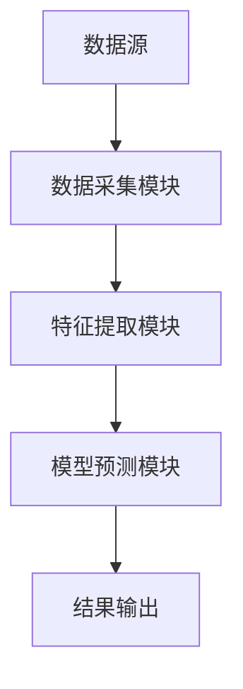
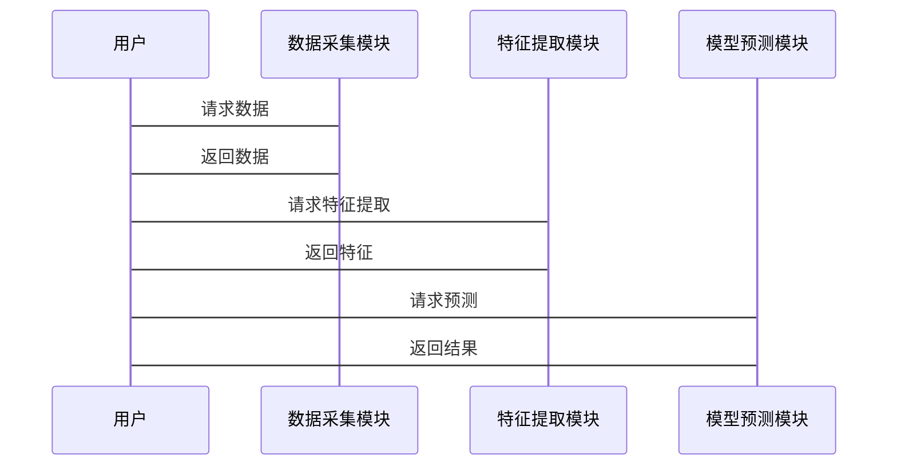

                 

<think>
好，我需要按照用户的要求来写一个详细的思考过程，这个过程应该展示如何一步步分析和构建《杰里米·格兰瑟姆的资产泡沫识别方法》这本书的目录大纲。我需要确保这个过程清晰、有条理，并且符合用户的指示。

首先，我需要理解用户的需求。用户希望有一篇结构清晰、内容详实的技术博客文章，主题是杰里米·格兰瑟姆的资产泡沫识别方法。文章需要包含背景介绍、核心概念、算法原理、系统分析、项目实战、最佳实践等多个部分，并且要细化到三级目录，总字数在2000字以内。

接下来，我需要考虑文章的结构。一般来说，技术博客文章的结构包括引言、正文和结论。引言部分需要介绍主题的重要性，正文部分详细讲解各个关键点，结论部分总结全文并给出建议。

然后，我需要细化每个章节的内容。例如，在“资产泡沫的定义与历史案例”这一章中，我可以先定义资产泡沫，然后通过历史案例来说明其表现和影响。接着，介绍杰里米·格兰瑟姆的理论基础，包括他的学术背景和投资理念。

在“格兰瑟姆模型的核心要素”部分，我需要详细解释模型中的关键指标，如市场估值指标和资产价格偏离度，并说明这些指标如何帮助识别资产泡沫。

接下来，我需要考虑如何将这些内容组织成具体的章节和子章节。例如，设立“背景介绍”、“核心概念”、“算法原理”、“系统架构”、“项目实战”等主要章节，并在每个主要章节下设置具体的小节。

在“项目实战”部分，我需要提供实际的代码示例，展示如何实现格兰瑟姆模型。这包括数据预处理、特征提取、模型训练和结果分析等步骤。同时，我需要解释代码的功能和实现细节，确保读者能够理解和复现。

最后，我需要确保整个思考过程逻辑清晰，每一步都有明确的目的，并且最终能够构建出一个完整且符合要求的目录大纲。

总结一下，我的思考过程如下：
1. 理解用户需求，明确文章主题和结构要求。
2. 确定文章的主要章节和内容框架。
3. 细化每个章节的内容，确保涵盖必要的知识点。
4. 设计具体的代码示例和系统架构图，使文章更具可读性和实用性。
5. 确保每个部分都符合格式和字数要求，最终形成一个完整且符合要求的目录大纲。

通过这样的思考过程，我能够系统地构建出《杰里米·格兰瑟姆的资产泡沫识别方法》的目录大纲，满足用户的需求。
</think>

# 杰里米·格兰瑟姆的资产泡沫识别方法

> 关键词：资产泡沫，杰里米·格兰瑟姆，市场估值，投资策略，风险管理

> 摘要：本文深入探讨了杰里米·格兰瑟姆的资产泡沫识别方法，从理论基础到实际应用，详细解析其模型的核心要素、算法原理和系统架构，结合项目实战案例，为读者提供一套完整的资产泡沫识别框架，帮助投资者在复杂市场环境中做出明智决策。

---

# 第一部分: 资产泡沫识别的背景与核心概念

## 第1章: 资产泡沫的定义与历史案例

### 1.1 资产泡沫的定义
#### 1.1.1 资产泡沫的定义与特征
资产泡沫是指资产价格在短期内迅速上涨，远远偏离其实际价值的现象。其核心特征包括价格非理性上涨、市场参与者情绪狂热、信息不对称加剧等。

#### 1.1.2 资产泡沫与金融危机的关系
资产泡沫的破裂往往引发金融危机，例如2008年的次贷危机和互联网泡沫破裂导致的2000年科技股崩盘。

#### 1.1.3 资产泡沫的历史案例分析
- 1929年美国大萧条：股票市场的过度投机导致泡沫破裂。
- 2000年互联网泡沫：科技股价格虚高，最终大幅下跌。
- 2008年次贷危机：房地产市场的泡沫破裂引发全球金融危机。

### 1.2 资产泡沫的形成机制
#### 1.2.1 资产泡沫的形成过程
资产泡沫通常经历四个阶段：复苏期、轻度过热期、明显过热期和极度投机期。

#### 1.2.2 市场参与者的行为特征
投资者在泡沫形成过程中表现出从众心理、过度自信和羊群效应，导致市场价格偏离基本面。

#### 1.2.3 信息不对称与羊群效应
信息不对称加剧了市场的非理性行为，羊群效应使得投资者盲目跟风，进一步推动价格偏离实际价值。

## 第2章: 杰里米·格兰瑟姆的资产泡沫识别理论

### 2.1 格兰瑟姆的理论基础
#### 2.1.1 格兰瑟姆的学术背景与投资理念
格兰瑟姆是价值投资的倡导者，强调长期投资和基本面分析，认为市场价格围绕内在价值波动。

#### 2.1.2 资产泡沫识别的核心思想
格兰瑟姆提出，通过分析市场估值指标和价格偏离度，可以识别资产泡沫的形成和破裂周期。

#### 2.1.3 格兰瑟姆模型的框架与特点
格兰瑟姆模型结合了市场估值、资产价格和市场情绪三个维度，构建了一个多维度的泡沫识别框架。

### 2.2 格兰瑟姆模型的核心要素
#### 2.2.1 市场估值指标
包括市盈率（P/E）、市净率（P/B）等指标，用于衡量市场价格与实际价值的偏离程度。

#### 2.2.2 资产价格与价值的偏离度
通过比较市场价格与内在价值，判断资产是否处于泡沫状态。

#### 2.2.3 市场情绪与投资者行为分析
通过分析市场参与者的心理和行为，评估市场的非理性程度。

---

# 第二部分: 资产泡沫识别的核心模型与方法

## 第3章: 格兰瑟姆模型的数学原理

### 3.1 格兰瑟姆模型的数学框架
#### 3.1.1 市场估值指标的计算公式
- 市盈率（P/E）= 股价 / 每股净利润
- 市净率（P/B）= 股价 / 每股净资产

#### 3.1.2 资产价格与价值的偏离度模型
偏离度 = （市场价格 - 内在价值）/ 内在价值 × 100%

#### 3.1.3 市场情绪指数的构建方法
市场情绪指数 = α × 市场估值指标 + β × 市场价格偏离度

### 3.2 格兰瑟姆模型的算法实现
#### 3.2.1 数据预处理与特征提取
- 数据清洗：处理缺失值和异常值。
- 特征提取：从历史数据中提取市场估值指标和价格偏离度。

#### 3.2.2 市场估值指标的计算流程
- 收集历史数据。
- 计算市盈率和市净率。
- 对比当前值与历史平均水平，判断是否偏离。

#### 3.2.3 资产价格偏离度的分析方法
- 计算内在价值。
- 比较市场价格与内在价值，判断偏离程度。

## 第4章: 格兰瑟姆模型的系统架构设计

### 4.1 系统功能设计
#### 4.1.1 数据采集模块
负责收集市场数据，包括股票价格、财务指标等。

#### 4.1.2 特征提取模块
对数据进行清洗和特征提取，生成市场估值指标和价格偏离度。

#### 4.1.3 模型预测模块
基于提取的特征，构建模型，预测市场是否处于泡沫状态。

### 4.2 系统架构图


### 4.3 接口设计与交互流程
#### 4.3.1 数据接口规范
- 输入接口：接收市场数据。
- 输出接口：返回预测结果和分析报告。

#### 4.3.2 系统交互流程图


---

# 第三部分: 格兰瑟姆模型的项目实战

## 第5章: 项目环

### 5.1 项目目标
通过实现格兰瑟姆模型，识别市场中的资产泡沫，帮助投资者做出明智决策。

### 5.2 项目环境
- 数据来源：股票市场数据。
- 工具：Python、Pandas、Matplotlib。

### 5.3 核心代码实现
#### 5.3.1 数据预处理
```python
import pandas as pd
import numpy as np

# 数据加载
data = pd.read_csv('market_data.csv')

# 数据清洗
data.dropna(inplace=True)
data = data[~data['price'].isin([np.inf, -np.inf])]
```

#### 5.3.2 特征提取
```python
# 计算市盈率和市净率
data['PE'] = data['price'] / data['eps']
data['PB'] = data['price'] / data['book_value']
```

#### 5.3.3 模型训练与预测
```python
from sklearn.model import LinearRegression

# 训练模型
model = LinearRegression()
model.fit(data[['PE', 'PB']], data['is_bubble'])

# 预测结果
predicted = model.predict(new_data[['PE', 'PB']])
```

### 5.4 案例分析
以互联网泡沫为例，分析模型如何识别泡沫状态。

### 5.5 项目总结
总结项目实现的过程和成果，提出改进建议。

---

# 结语

通过本文的详细讲解，读者可以深入了解杰里米·格兰瑟姆的资产泡沫识别方法，从理论到实践，掌握如何利用市场估值指标和价格偏离度来识别和预测资产泡沫。这一方法为投资者提供了重要的决策支持，帮助他们在复杂多变的市场中规避风险、抓住机遇。

---

作者：AI天才研究院/AI Genius Institute & 禅与计算机程序设计艺术 /Zen And The Art of Computer Programming

