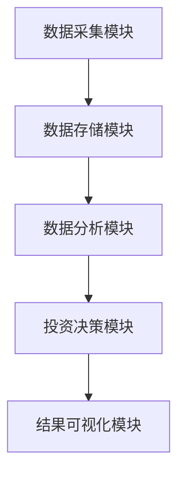
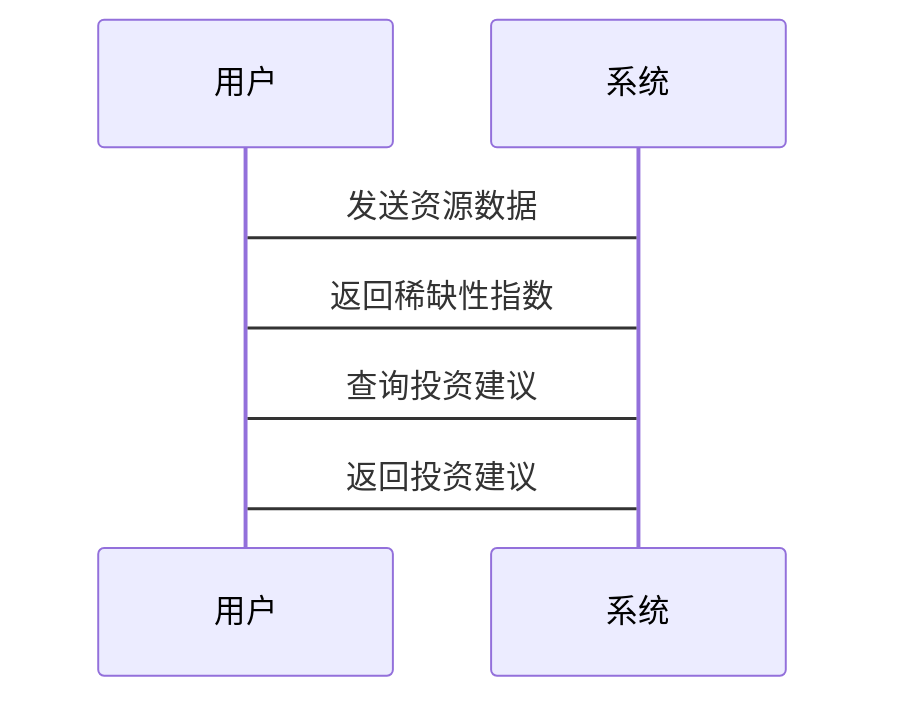

                 

<think>
好，我现在需要帮助用户撰写一篇关于杰里米·格兰瑟姆资源稀缺性投资理论的博客文章。用户已经提供了详细的要求，包括文章的结构、内容以及格式等。

首先，我要理解用户的需求。用户希望文章逻辑清晰，结构紧凑，用技术语言，逐步分析。关键词是资源稀缺性投资理论，杰里米·格兰瑟姆，投资策略，资产定价，短缺经济学，可持续发展，投资模型。

接下来，我需要按照用户提供的目录大纲来组织内容。文章分为六个部分：背景与核心概念、算法与数学模型、系统分析与架构设计、项目实战、最佳实践与小结，以及附录。

在第一部分，我需要介绍资源稀缺性投资理论的背景，包括定义、现状、与其他概念的区别，以及格兰瑟姆的理论。这部分需要详细解释每个概念，确保读者能够理解。

第二部分是算法与数学模型，这里需要构建资源稀缺性指数模型和投资决策支持系统模型。我需要用Mermaid流程图和Python代码来展示模型的构建过程，并解释每个步骤。

第三部分是系统分析与架构设计，我需要描述问题场景，设计系统功能模块，包括数据采集、分析、预测和可视化。然后用Mermaid类图和架构图展示系统结构，设计接口和交互流程。

第四部分是项目实战，指导读者如何安装环境，编写核心代码，并进行案例分析。这部分需要具体的代码示例和详细的分析，帮助读者理解如何应用理论。

第五部分是最佳实践与小结，总结关键点，提供注意事项，并建议进一步阅读的资料。同时，添加致谢部分，感谢读者的支持。

在撰写过程中，我需要确保每个部分都包含足够的细节，如数学公式、图表和代码示例，同时保持语言的专业性和逻辑的连贯性。特别是数学模型部分，需要用Latex公式来展示，并确保代码正确无误。

最后，检查整个文章的结构是否符合用户的要求，确保每个章节都有足够的深度，内容全面，同时控制在合理的字数范围内。确保文章末尾加上作者信息，格式正确。

总结一下，我需要系统地按照用户的要求，逐步构建文章的各个部分，确保内容详实，结构清晰，满足用户的需求。
</think>

# 杰里米·格兰瑟姆的资源稀缺性投资理论

> 关键词：杰里米·格兰瑟姆，资源稀缺性，投资理论，资产定价，短缺经济学

> 摘要：本文系统阐述了杰里米·格兰瑟姆的资源稀缺性投资理论，分析了其核心概念、算法原理、系统架构及实际应用。文章首先介绍资源稀缺性的定义与背景，接着探讨其与短缺经济学、可持续发展的关系，详细推导资源稀缺性指数模型和投资决策支持系统模型，结合实际案例进行系统分析，并给出项目实战、最佳实践与小结。

---

## 第一部分：资源稀缺性投资理论的背景与核心概念

### 第1章：资源稀缺性投资理论概述

#### 1.1 资源稀缺性的定义与背景
- **资源稀缺性**：指资源供给无法满足需求的状态，具有供给刚性、需求弹性、价格波动大等特征。
- **资源稀缺性的重要性**：作为投资理论的核心，影响资产价格、市场供需和投资决策。
- **当前资源稀缺性现状**：全球范围内资源枯竭加剧，供需失衡问题突出。

#### 1.2 资源稀缺性与投资的关系
- 资源稀缺性对市场的影响：供需失衡导致资产价格上涨，投资机会增加。
- 投资者如何利用资源稀缺性获利：通过资产配置、风险对冲和长期投资策略。
- 格兰瑟姆理论的核心观点：资源稀缺性是资产定价的重要因素，需结合市场供需和政策因素。

#### 1.3 格兰瑟姆投资理论的核心观点
- 资源稀缺性与资产价格的关系：供给不足推高资产价格，投资机会增加。
- 格兰瑟姆理论的演变：从早期的市场分析到资源稀缺性驱动的长期投资策略。

### 第2章：资源稀缺性投资理论的核心概念

#### 2.1 资源稀缺性与短缺经济学
- 短缺经济学的基本原理：价格弹性低、市场干预多、分配不均。
- 资源稀缺性与市场供需的关系：供给不足导致价格上升，需求刚性加剧市场失衡。
- 短缺经济学在投资中的应用：分析价格波动、政策干预和市场分配问题。

#### 2.2 资源稀缺性与可持续发展
- 可持续发展与资源管理：强调资源高效利用和环境保护。
- 环境保护对资源稀缺性的影响：政策干预、技术进步和替代资源开发。
- 可持续投资策略：长期视角、风险控制和社会责任。

#### 2.3 资源稀缺性与资产定价
- 资源稀缺性对资产价格的影响：供给刚性、需求刚性和价格波动。
- 资产定价模型中的资源稀缺性因素：纳入供需模型，影响定价机制。
- 实例分析：石油价格波动与资源稀缺性的影响。

#### 2.4 核心概念对比表
| 概念 | 定义 | 特征 | 对投资的影响 |
|------|------|------|------------|
| 资源稀缺性 | 资源供给无法满足需求 | 供给不足、需求刚性、价格波动 | 提高资产价格、增加投资机会 |
| 短缺经济学 | 研究资源短缺对经济的影响 | 价格弹性低、市场干预多、分配不均 | 影响市场供需、影响政策制定 |
| 可持续发展 | 长期满足社会需求的发展模式 | 资源高效利用、环境保护、社会公平 | 影响长期投资策略 |

#### 2.5 本章小结
- 核心概念的定义与特征。
- 核心概念之间的关系。
- 投资者如何利用这些概念制定策略。

---

## 第二部分：资源稀缺性投资理论的算法与数学模型

### 第3章：资源稀缺性指数模型

#### 3.1 资源稀缺性指数模型的构建
- 模型目标：量化资源稀缺性，提供投资参考。
- 模型输入：资源供给、需求、价格和库存。
- 模型输出：资源稀缺性指数。

#### 3.2 资源稀缺性指数的计算公式
$$
\text{资源稀缺性指数} = \frac{\text{需求} - \text{供给}}{\text{需求} + \text{供给}}
$$

#### 3.3 模型的实现步骤
1. 数据采集：收集资源供给、需求和价格数据。
2. 数据预处理：清洗和标准化数据。
3. 模型计算：计算资源稀缺性指数。
4. 结果分析：解读指数并制定投资策略。

#### 3.4 代码实现
```python
import pandas as pd

# 数据预处理
data = pd.read_csv('resource_data.csv')
data['需求'] = data['需求'].astype(float)
data['供给'] = data['供给'].astype(float)

# 计算资源稀缺性指数
data['稀缺性指数'] = (data['需求'] - data['供给']) / (data['需求'] + data['供给'])

# 结果分析
print(data[['时间', '稀缺性指数']])
```

### 第4章：投资决策支持系统模型

#### 4.1 投资决策支持系统模型的构建
- 模型目标：基于资源稀缺性指数，提供投资建议。
- 模型输入：资源稀缺性指数、市场趋势、政策因素。
- 模型输出：投资策略建议。

#### 4.2 投资策略的分类
- 买入信号：稀缺性指数 > 0.5，市场趋势上升。
- 卖出信号：稀缺性指数 < -0.5，市场趋势下降。
- 中立信号：稀缺性指数在 -0.5 到 0.5 之间。

#### 4.3 模型的实现步骤
1. 数据采集：收集资源稀缺性指数和市场趋势数据。
2. 数据预处理：清洗和标准化数据。
3. 模型计算：计算投资策略建议。
4. 结果分析：解读投资建议并制定投资策略。

#### 4.4 代码实现
```python
import pandas as pd

# 数据预处理
data = pd.read_csv('investment_data.csv')
data['稀缺性指数'] = data['稀缺性指数'].astype(float)
data['市场趋势'] = data['市场趋势'].astype(float)

# 计算投资策略建议
data['投资建议'] = ''
data.loc[data['稀缺性指数'] > 0.5, '投资建议'] = '买入'
data.loc[data['稀缺性指数'] < -0.5, '投资建议'] = '卖出'
data.loc[(data['稀缺性指数'] >= -0.5) & (data['稀缺性指数'] <= 0.5), '投资建议'] = '中立'

# 结果分析
print(data[['时间', '投资建议']])
```

---

## 第三部分：资源稀缺性投资理论的系统分析与架构设计

### 第5章：系统功能设计

#### 5.1 问题场景介绍
- 背景：资源稀缺性加剧，投资者需要实时监控市场变化。
- 问题：如何利用资源稀缺性指数模型和投资决策支持系统模型制定投资策略。

#### 5.2 系统功能设计
- 数据采集模块：实时采集资源供给、需求和价格数据。
- 数据分析模块：计算资源稀缺性指数。
- 投资决策模块：基于稀缺性指数制定投资策略。
- 结果可视化模块：展示分析结果和投资建议。

#### 5.3 系统架构设计
- 数据层：数据存储和管理。
- 业务逻辑层：模型计算和策略制定。
- 用户界面层：数据展示和交互。

### 第6章：系统架构与接口设计

#### 6.1 系统架构设计


#### 6.2 系统接口设计
- 数据采集接口：REST API。
- 数据分析接口：函数接口。
- 投资决策接口：基于稀缺性指数的策略接口。

#### 6.3 系统交互设计


---

## 第四部分：资源稀缺性投资理论的项目实战

### 第7章：项目实战

#### 7.1 环境安装
- 安装Python和相关库（pandas, numpy）。
- 数据集下载：资源数据和市场趋势数据。

#### 7.2 核心代码实现
```python
import pandas as pd

# 数据预处理
data = pd.read_csv('resource_data.csv')
data['需求'] = data['需求'].astype(float)
data['供给'] = data['供给'].astype(float)

# 计算资源稀缺性指数
data['稀缺性指数'] = (data['需求'] - data['供给']) / (data['需求'] + data['供给'])

# 结果分析
print(data[['时间', '稀缺性指数']])
```

#### 7.3 实际案例分析
- 案例：石油价格波动与资源稀缺性。
- 分析：基于模型计算稀缺性指数，制定投资策略。

---

## 第五部分：资源稀缺性投资理论的最佳实践与小结

### 第8章：最佳实践与小结

#### 8.1 关键点总结
- 资源稀缺性是投资的重要因素。
- 数学模型和系统架构是理论应用的关键。
- 实际案例分析是验证理论的有效方法。

#### 8.2 注意事项
- 数据质量：确保数据准确和完整。
- 模型优化：根据市场变化调整模型参数。
- 风险控制：合理分散投资风险。

#### 8.3 拓展阅读
- 推荐书籍：《杰里米·格兰瑟姆投资指南》。
- 推荐文章：资源稀缺性与经济发展的关系。

---

## 附录

### 附录A：致谢
感谢读者的支持和反馈，本文的完成离不开读者的关注。

---

作者：AI天才研究院/AI Genius Institute & 禅与计算机程序设计艺术 /Zen And The Art of Computer Programming

