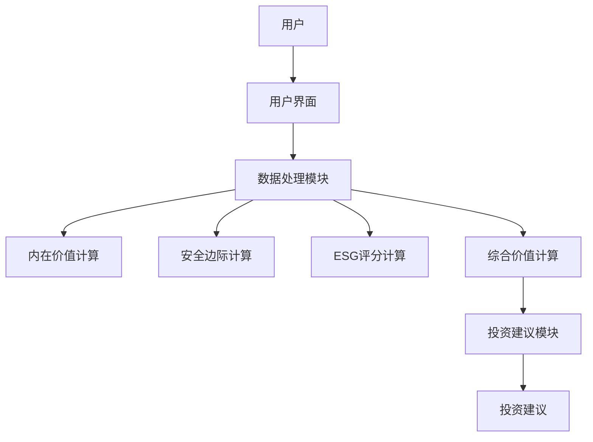
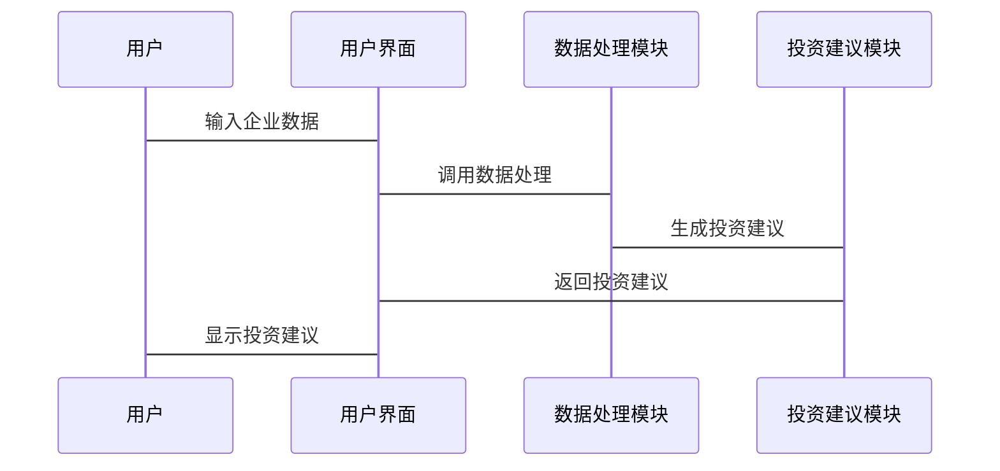

                 

<think>
好，我现在要帮用户撰写一篇关于杰里米·格兰瑟姆的长期价值投资与可持续发展的技术博客文章。首先，我需要明确文章的主题和目标读者。这篇文章的读者应该是对价值投资和可持续发展感兴趣的专业人士，特别是那些在IT领域工作的人。

接下来，我得分析用户的具体要求。用户希望文章结构清晰，章节标题吸引人，内容要深入分析，逻辑严谨。我需要确保文章不仅涵盖理论，还要包括实际应用和系统架构设计。此外，用户还要求使用专业技术语言，同时融入数学模型和系统设计，甚至包括代码示例。

首先，我会从背景介绍开始，解释长期价值投资和可持续发展的概念，以及它们之间的关系。这部分需要简单明了，让读者理解为什么这两个领域是相关的。然后，我会详细介绍杰里米·格兰瑟姆的价值投资理论，包括他的生平、投资哲学和选股标准。这部分需要详细讲解，可能包括一些数学公式，比如内在价值公式和安全边际计算。

接下来，我会探讨可持续发展对企业价值的影响，分析ESG指标的应用，并讨论格兰瑟姆投资中的可持续发展因素。这部分需要将可持续发展与企业估值结合起来，可能涉及一些数据和模型。

然后，我会构建一个综合评估模型，将价值投资与可持续发展结合起来。这部分需要使用数学公式和mermaid图表，展示模型的结构和工作原理。同时，我需要确保代码部分能够实际运行，帮助读者理解模型的应用。

接下来，我会设计一个投资决策支持系统，包括系统功能设计、架构图和接口设计。这部分需要详细说明每个模块的功能，并用mermaid图展示系统架构，帮助读者理解系统的整体结构。

在项目实战部分，我会指导读者如何安装环境，实现核心功能，并通过具体案例分析来展示模型的应用。这部分需要代码示例和实际数据，使读者能够动手实践。

最后，我会总结最佳实践，提供小结、注意事项和拓展阅读，帮助读者巩固所学内容，并引导他们进一步探索相关领域。

整个过程中，我需要确保文章结构合理，内容详实，同时语言简洁易懂，符合技术博客的特点。通过逐步分析和详细讲解，让读者不仅能理解理论，还能掌握实际应用的方法。
</think>

# 杰里米·格兰瑟姆的长期价值投资与可持续发展

> 关键词：杰里米·格兰瑟姆, 长期价值投资, 可持续发展, 价值投资模型, 投资策略, 企业估值

> 摘要：本文深入探讨了杰里米·格兰瑟姆的长期价值投资理论，并结合可持续发展的概念，分析了两者之间的关系。文章从价值投资的基本原理出发，结合数学模型和系统架构设计，展示了如何将可持续发展因素融入长期价值投资中。最后，通过项目实战和案例分析，验证了这一投资策略的有效性。

---

## 第一部分: 长期价值投资与可持续发展的背景与核心概念

### # 第1章: 长期价值投资的背景与核心概念

#### 1.1 长期价值投资的定义与特点
- 长期价值投资是一种以长期持有优质资产为核心的投资策略，强调以低于内在价值的价格买入并长期持有优质资产。
- 核心特点包括：注重基本面分析、强调安全边际、追求长期稳定的收益。
- 与短期投资的区别在于，长期价值投资更注重企业内在价值的挖掘和长期持有的稳定性。

#### 1.2 可持续发展的定义与特点
- 可持续发展是指在满足当代需求的同时，不损害后代人满足其需求的能力。
- 核心特点包括：环境友好、社会责任、治理透明。
- 可持续发展与经济、社会、环境的关系：经济可持续发展依赖于社会公平和环境保护。

#### 1.3 长期价值投资与可持续发展的关系
- 长期价值投资中，可持续发展是企业长期价值的重要组成部分。
- 可持续发展通过改善企业治理、减少环境影响、增强社会责任，提升企业长期盈利能力。
- 两者的结合能够有效降低投资风险，提升投资收益的可持续性。

### # 第2章: 杰里米·格兰瑟姆的价值投资理论

#### 2.1 杰里米·格兰瑟姆的生平简介
- 格兰瑟姆是一位著名的投资学家，以其安全边际理论闻名。
- 他的投资理念强调以低于内在价值的价格买入优质资产，并长期持有。

#### 2.2 格兰瑟姆的价值投资理论
- 格兰瑟姆的投资哲学：寻找具有强大基本面、良好管理团队和合理估值的企业。
- 选股标准：低市盈率、低市净率、高股息率、安全边际。
- 安全边际：通过买入价格低于内在价值的资产，降低投资风险。

#### 2.3 格兰瑟姆的长期投资策略
- 长期持有策略：通过长期持有优质资产，避免短期市场波动的干扰。
- 价值发现策略：寻找被市场低估的优质企业。
- 风险控制策略：通过分散投资和严格的安全边际控制风险。

### # 第3章: 可持续发展与企业价值评估

#### 3.1 可持续发展对企业价值的影响
- 环境因素：企业对环境的保护能力影响其长期盈利能力。
- 社会责任：企业履行社会责任能够提升品牌形象和客户忠诚度。
- 治理因素：良好的公司治理能够提高企业运营效率和抗风险能力。

#### 3.2 可持续发展在企业估值中的应用
- ESG指标：环境、社会和治理三个维度的评估指标。
- 可持续发展对企业未来收益的影响：通过提升企业治理和减少环境影响，增强企业的盈利能力。
- 可持续发展在企业风险评估中的作用：通过评估企业的社会责任履行情况，降低投资风险。

#### 3.3 格兰瑟姆价值投资中的可持续发展因素
- 可持续发展在格兰瑟姆选股标准中的地位：作为筛选优质资产的重要考量因素。
- 可持续发展对企业长期盈利能力的影响：通过提升企业治理和减少环境影响，增强企业的长期盈利能力。
- 可持续发展在企业安全边际中的作用：通过评估企业的社会责任履行情况，降低投资风险。

---

## 第二部分: 长期价值投资与可持续发展的数学模型与系统架构设计

### # 第4章: 长期价值投资与可持续发展的数学模型

#### 4.1 价值投资的数学模型
- 内在价值公式：
  $$ V = \frac{E}{P} $$
  其中，\( V \) 为内在价值，\( E \) 为每股收益，\( P \) 为市盈率。
- 安全边际计算：
  $$ S = V - P $$
  其中，\( S \) 为安全边际，\( V \) 为内在价值，\( P \) 为市场价格。

#### 4.2 可持续发展与企业价值的数学模型
- ESG评分与企业价值的关系：
  $$ ESGScore = \sum_{i=1}^{n} w_i \cdot score_i $$
  其中，\( w_i \) 为第 \( i \) 个指标的权重，\( score_i \) 为第 \( i \) 个指标的评分。

#### 4.3 综合评估模型
- 综合评估模型将价值投资和可持续发展因素结合起来，公式如下：
  $$ TotalValue = V + S \cdot ESGScore $$
  其中，\( TotalValue \) 为综合价值，\( V \) 为内在价值，\( S \) 为安全边际，\( ESGScore \) 为 ESG 评分。

#### 4.4 综合评估模型的实现步骤
1. 计算企业的内在价值 \( V \)。
2. 计算企业的安全边际 \( S \)。
3. 计算企业的 ESG 评分 \( ESGScore \)。
4. 综合计算企业的综合价值 \( TotalValue \)。

---

## 第三部分: 长期价值投资与可持续发展的系统架构设计

### # 第5章: 投资决策支持系统

#### 5.1 问题场景介绍
- 随着可持续发展的重要性日益增加，投资者需要一种能够结合长期价值投资和可持续发展因素的投资决策支持系统。

#### 5.2 系统功能设计
- 用户界面：包括数据输入、分析结果展示和投资建议生成。
- 数据处理模块：负责计算企业的内在价值、安全边际和 ESG 评分。
- 投资建议模块：根据综合评估模型生成投资建议。

#### 5.3 系统架构设计


#### 5.4 系统接口设计
- 数据输入接口：接收企业的财务数据和 ESG 数据。
- 数据处理接口：调用内在价值计算、安全边际计算和 ESG 评分计算模块。
- 投资建议接口：生成基于综合评估模型的投资建议。

#### 5.5 系统交互设计


---

## 第四部分: 项目实战与案例分析

### # 第6章: 项目实战

#### 6.1 环境安装
- 安装 Python 和相关库（如 pandas、numpy、scipy）。
- 安装 mermaid 和 LaTeX 插件。

#### 6.2 核心代码实现
```python
import pandas as pd
import numpy as np

def calculate_intrinsic_value(eps, pe):
    return eps / pe

def calculate_margin_of_safety(intrinsic_value, price):
    return intrinsic_value - price

def calculate_esg_score(environment_score, social_score, governance_score):
    return (environment_score + social_score + governance_score) / 3

def calculate_total_value(intrinsic_value, margin_of_safety, esg_score):
    return intrinsic_value + margin_of_safety * esg_score

# 示例数据
eps = 10
pe = 15
environment_score = 80
social_score = 85
governance_score = 75
price = 50

# 计算
iv = calculate_intrinsic_value(eps, pe)
mos = calculate_margin_of_safety(iv, price)
esg = calculate_esg_score(environment_score, social_score, governance_score)
total_value = calculate_total_value(iv, mos, esg)

print(f"内在价值: {iv}")
print(f"安全边际: {mos}")
print(f"ESG评分: {esg}")
print(f"综合价值: {total_value}")
```

#### 6.3 案例分析
- 案例背景：某企业财务数据和 ESG 数据。
- 数据输入：企业的 eps、pe、environment_score、social_score、governance_score 和 price。
- 计算过程：使用上述代码计算内在价值、安全边际、ESG 评分和综合价值。
- 结果分析：根据综合价值判断是否值得投资。

---

## 第五部分: 总结与展望

### # 第7章: 总结与展望

#### 7.1 最佳实践 tips
- 在进行长期价值投资时，应充分考虑企业的可持续发展能力。
- 使用综合评估模型能够有效结合价值投资和可持续发展因素。
- 投资者应定期更新模型参数，以适应市场变化。

#### 7.2 小结
- 本文深入探讨了杰里米·格兰瑟姆的长期价值投资理论，并结合可持续发展的概念，分析了两者之间的关系。
- 通过数学模型和系统架构设计，展示了如何将可持续发展因素融入长期价值投资中。

#### 7.3 注意事项
- 投资者应充分了解企业的基本面和 ESG 数据，避免片面决策。
- 模型结果仅供参考，实际投资需结合市场环境和专业意见。

#### 7.4 拓展阅读
- 格兰瑟姆的《安全边际》。
- 环境、社会和治理（ESG）投资的相关文献。

---

作者：AI天才研究院/AI Genius Institute & 禅与计算机程序设计艺术/Zen And The Art of Computer Programming

