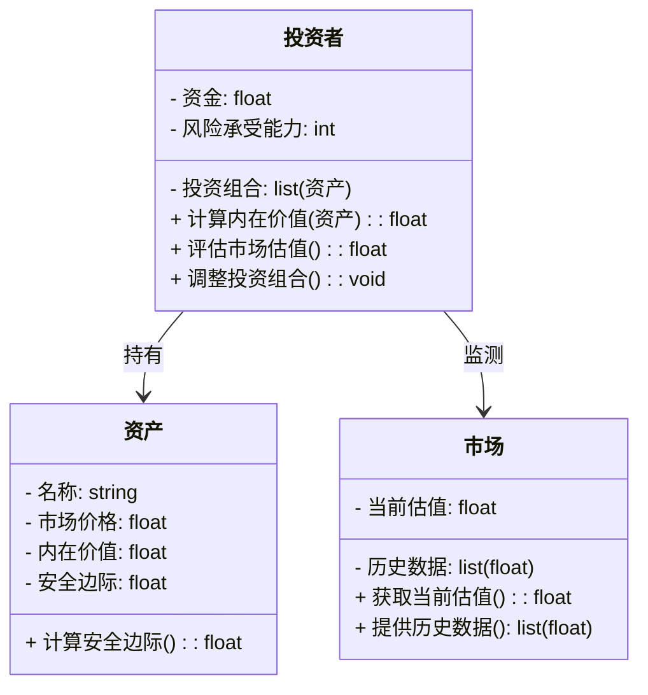
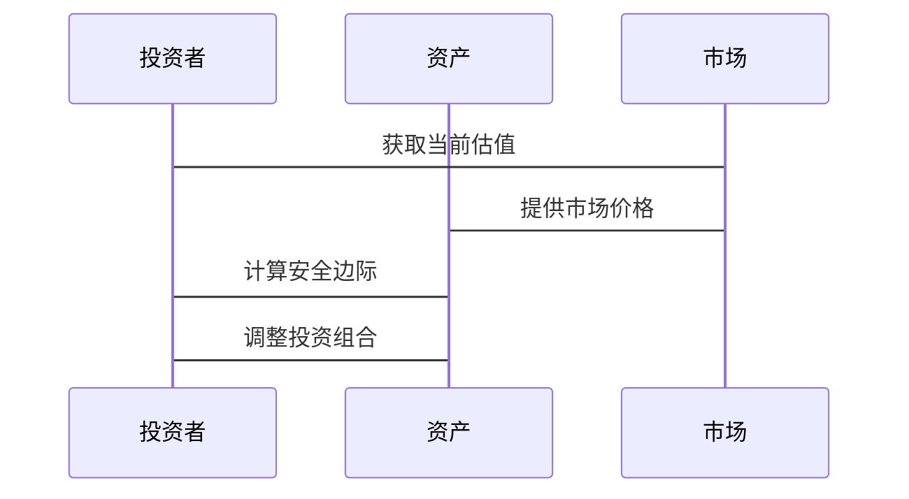

                 

<think>
好的，我现在需要帮用户撰写一篇关于杰里米·格兰瑟姆长期价值投资哲学的技术博客文章。用户希望文章结构清晰，内容详实，符合技术博客的风格。同时，用户还提供了一个详细的目录大纲，包括关键词、摘要和正文部分。

首先，我需要明确文章的核心主题：杰里米·格兰瑟姆的价值投资哲学。我需要围绕这一主题，分析他的投资理念、策略和方法，并结合实际案例进行阐述。

接下来，我要按照用户提供的目录结构来组织内容。文章分为七个部分，每个部分都有具体的章节和小节。我需要确保每个部分都涵盖关键点，比如引言、基础理论、投资策略、系统分析、项目实战等。

在撰写过程中，我需要使用技术性的语言，同时保持逻辑清晰和结构紧凑。每个部分都要详细展开，比如在基础理论部分，我需要解释价值投资的定义、特点，并与其它投资策略进行对比。在策略和方法部分，我需要深入探讨基本面分析、安全边际、风险管理等关键点。

此外，用户要求在文章中包含图表和代码示例，比如使用Mermaid图展示系统架构，以及Python代码来实现投资策略。这将帮助读者更好地理解和应用相关知识。

我还需要注意文章的字数控制在10000到12000字之间，确保每个部分内容丰富但不过于冗长。最后，文章末尾需要添加作者信息，符合格式要求。

在写作过程中，我可能会遇到一些挑战，比如如何将复杂的投资理论转化为易于理解的技术内容，或者如何将代码与投资策略有效结合。为了解决这些问题，我需要查阅相关资料，确保内容的准确性和实用性。

总之，我需要系统地按照用户提供的大纲，逐步展开每个部分的内容，确保文章结构合理，内容详实，满足用户的需求。
</think>

# 杰里米·格兰瑟姆的长期价值投资哲学

> 关键词：价值投资，长期投资，杰里米·格兰瑟姆，投资哲学，安全边际，基本面分析，投资策略

> 摘要：本文深入探讨杰里米·格兰瑟姆的长期价值投资哲学，从其核心理念、策略到实际应用，结合技术语言和专业分析，为读者提供全面的视角。通过系统分析和案例解读，揭示价值投资的深层逻辑。

---

## 第一部分: 长期价值投资的哲学基础

### 第1章: 长期价值投资的背景与核心概念

#### 1.1 投资哲学的背景

##### 1.1.1 传统投资理论的局限性

传统投资理论，如有效市场假说和现代投资组合理论，虽然在学术上有所贡献，但在实际应用中存在明显缺陷。有效市场假说认为价格已经反映所有信息，但现实中市场的非理性波动和信息不对称现象频繁出现。现代投资组合理论强调分散投资和风险控制，但在实际操作中难以有效预测资产价格波动，尤其是在市场恐慌或狂热时，投资者情绪往往主导市场走势。

##### 1.1.2 价值投资的兴起与发展

价值投资起源于20世纪初，由本杰明·格雷厄姆和戴维·多德共同提出。该理论强调以低于内在价值的价格购买优质股票，长期持有，等待市场重新认识其价值。杰里米·格兰瑟姆继承并发展了这一理念，尤其是在市场估值分析和安全边际方面做出了重要贡献。

##### 1.1.3 格兰瑟姆在投资哲学中的地位

杰里米·格兰瑟姆是价值投资领域的权威，他的投资哲学以严谨的分析和长期视角著称。他提出的“价格-价值”框架和市场周期理论为投资者提供了独特的分析工具。他的理念影响了无数投资者，并在学术界和实务界产生了深远影响。

#### 1.2 长期价值投资的定义与特点

##### 1.2.1 价值投资的定义

价值投资是一种投资策略，强调以低于公允价值的价格买入优质资产，并长期持有。其核心在于识别市场定价错误，并通过持有优质资产获得超额收益。

##### 1.2.2 长期投资的特征与优势

长期投资注重时间复利效应，避免了短期波动的干扰。通过长期持有优质资产，投资者能够获得企业成长的收益，同时分散短期市场波动的风险。

##### 1.2.3 价值投资与短期投机的对比分析

价值投资强调基本面分析和长期持有，而短期投机则依赖市场情绪和技术分析。两者在风险承担、收益来源和投资策略上存在显著差异。价值投资注重内在价值，而短期投机关注价格波动。

#### 1.3 格兰瑟姆的价值投资理论体系

##### 1.3.1 格兰瑟姆的投资理念

格兰瑟姆的投资理念以“价格-价值”框架为核心，强调通过分析市场价格与内在价值的偏离程度来寻找投资机会。他认为，市场的非理性波动为长期投资者提供了以合理价格买入优质资产的机会。

##### 1.3.2 格兰瑟姆的市场观

格兰瑟姆认为市场具有周期性，长期来看，市场价格围绕内在价值波动。他提出了市场估值指标，如市盈率、市净率等，用于判断市场是否处于高估或低估状态。

##### 1.3.3 格兰瑟姆的选股原则

格兰瑟姆的选股原则包括：低市盈率、低市净率、高股息率、稳定的收益和健康的财务状况。他强调选择具有强大竞争优势和良好治理的企业。

---

## 第二部分: 长期价值投资的核心策略

### 第2章: 基本面分析与安全边际

#### 2.1 基本面分析的原理

##### 2.1.1 基本面分析的定义与方法

基本面分析是通过研究企业的财务状况、行业地位和经营战略来评估其内在价值。常用方法包括财务报表分析、行业分析和竞争优势评估。

##### 2.1.2 财务报表分析的关键指标

重要的财务指标包括净利润率、ROE（净资产收益率）、负债率和现金流等。这些指标帮助投资者评估企业的盈利能力和财务健康状况。

##### 2.1.3 行业分析与竞争优势评估

行业分析涉及市场规模、竞争结构和行业周期等因素。竞争优势评估关注企业的市场地位、成本优势和创新能力。

#### 2.2 安全边际的概念与应用

##### 2.2.1 安全边际的定义

安全边际是指买入价格与内在价值之间的差距。它提供了缓冲空间，以应对市场价格波动和基本面变化的风险。

##### 2.2.2 安全边际的计算

安全边际 = 内在价值 - 市场价格。投资者应选择安全边际较高的资产，以降低投资风险。

##### 2.2.3 安全边际的策略应用

通过计算安全边际，投资者可以识别低估资产，并在市场恐慌时买入。安全边际为价值投资提供了风险控制的工具。

---

## 第三部分: 长期价值投资的系统分析

### 第3章: 价值投资的系统架构

#### 3.1 系统功能设计

##### 3.1.1 领域模型类图



##### 3.1.2 系统架构图


##### 3.1.3 系统交互序列图



---

## 第四部分: 价值投资的项目实战

### 第4章: 价值投资策略的实现

#### 4.1 环境安装

##### 4.1.1 安装Python环境

使用Anaconda安装Python 3.9及以上版本，并安装必要的库，如pandas、numpy、scipy等。

#### 4.2 核心代码实现

##### 4.2.1 资产分析代码

```python
import pandas as pd
import numpy as np

def calculate_intrinsic_value(financials, growth_rate=5%, discount_rate=10%):
    # 计算自由现金流的永续价值
    terminal_value = financials['free_cash_flow'] / (discount_rate - growth_rate)
    # 计算内在价值
    intrinsic_value = terminal_value / (1 + discount_rate)
    return intrinsic_value

# 示例数据
financials = {
    'revenue': 100,
    'net_income': 20,
    'free_cash_flow': 15
}

iv = calculate_intrinsic_value(financials)
print(f"内在价值: {iv}")
```

##### 4.2.2 安全边际计算代码

```python
def calculate_margin_of_safety(current_price, intrinsic_value):
    mos = intrinsic_value - current_price
    return mos

current_price = 50
intrinsic_value = 60
mos = calculate_margin_of_safety(current_price, intrinsic_value)
print(f"安全边际: {mos}")
```

#### 4.3 案例分析

##### 4.3.1 案例一：苹果公司

分析苹果公司的财务报表，计算其内在价值和安全边际。假设苹果的自由现金流为100亿美元，增长率为5%，贴现率为10%。

##### 4.3.2 案例二：亚马逊公司

评估亚马逊的市场估值，判断其是否被低估。通过历史市盈率和行业对比，分析其投资价值。

---

## 第五部分: 总结与扩展阅读

### 第5章: 长期价值投资的总结与展望

#### 5.1 最佳实践 tips

- 定期复盘投资组合，评估安全边际。
- 保持学习，更新投资理念。
- 避免情绪化投资，坚持长期视角。

#### 5.2 小结

杰里米·格兰瑟姆的价值投资哲学强调基本面分析和安全边际，为投资者提供了有效的投资工具。通过长期持有优质资产，投资者能够获得稳定收益。

#### 5.3 注意事项

- 投资者需结合市场环境和个人风险承受能力调整策略。
- 避免过度依赖单一指标，综合分析企业基本面。

#### 5.4 拓展阅读

推荐阅读格兰瑟姆的《价值投资：杰里米·格兰瑟姆的投资策略》和《投资的艺术》等书籍，深入理解价值投资的精髓。

---

作者：AI天才研究院/AI Genius Institute & 禅与计算机程序设计艺术/Zen And The Art of Computer Programming

