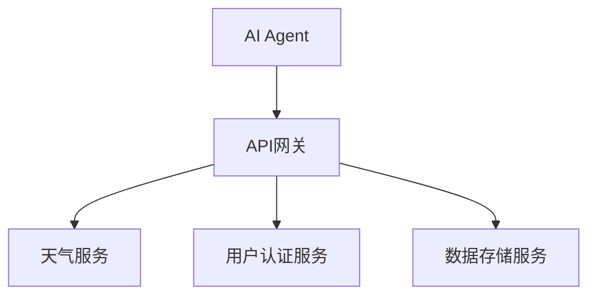
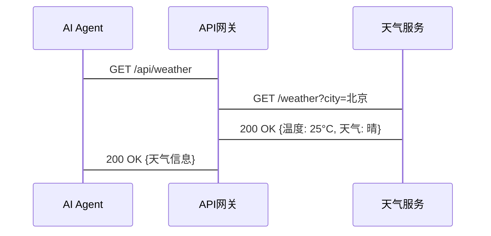

                 

<think>
嗯，我现在需要为用户构建一个关于“构建AI Agent的API集成能力：连接外部服务”的完整博客文章。用户已经提供了一个详细的目录大纲，但需要按照特定的格式和内容要求来完成文章。

首先，我需要确保文章结构清晰，每个部分都要有详细的讲解，包括背景介绍、核心概念、算法原理、系统架构设计、项目实战、最佳实践等。我还需要使用技术性的语言，但保持简洁易懂，适合专业读者。

接下来，我需要按照目录大纲逐步展开每个章节的内容。例如，在“API集成的核心概念与原理”部分，我需要详细解释API的基本原理，分类，以及RESTful API的工作流程。这部分可能需要包括一些代码示例，比如使用Python库requests来调用API，同时展示JSON数据结构。

然后，在系统架构设计部分，我需要使用Mermaid图来展示AI Agent的整体架构，包括API网关、服务提供者、服务消费者等组件。这需要明确每个部分的功能和交互关系。

在项目实战部分，我需要选择一个具体的API（比如天气API），展示如何从环境安装开始，逐步实现API调用，处理响应，并分析可能的错误情况。这可能涉及到代码实现和详细的注释，帮助读者理解每一步的操作。

此外，我需要确保数学模型和算法部分有足够的深度，比如在API调用的速率限制和负载均衡中，解释相关的数学公式和算法原理，并用代码示例来说明。

最后，我需要在文章末尾添加最佳实践和小结，总结整个内容，并提供一些实用的建议，如API选择的注意事项、错误处理技巧等。同时，末尾需要注明作者信息。

在编写过程中，我需要时刻检查是否满足用户的所有要求，特别是格式、字数和内容完整性。可能需要多次修改，确保每个部分都详细且符合逻辑，避免遗漏任何关键点。

总之，这个任务需要我系统地分析每个部分，逐步展开，确保文章内容全面、结构合理，同时语言专业且易于理解。这将帮助读者从基础到实际应用，全面掌握AI Agent的API集成能力。
</think>

# 构建AI Agent的API集成能力：连接外部服务

---

## 关键词

- AI Agent
- API集成
- 外部服务
- RESTful API
- API网关
- 负载均衡

---

## 摘要

随着人工智能技术的快速发展，AI Agent（智能代理）在各个领域的应用日益广泛。AI Agent需要与外部服务进行高效的交互，以完成复杂任务。API集成是实现这一目标的关键技术。本文从API集成的基本概念出发，深入分析API的分类、RESTful API的工作原理，以及API集成的数学模型和算法。同时，结合实际案例，详细讲解如何设计和实现一个支持API集成的AI Agent系统。通过本文的学习，读者将能够掌握AI Agent与外部服务交互的核心技术，并能够在实际项目中灵活应用。

---

## 正文

### 第一部分：AI Agent与API集成概述

#### 第1章：AI Agent与API集成的背景与概念

##### 1.1 AI Agent的基本概念

AI Agent是一种智能代理，能够感知环境、自主决策并执行任务。它通常具备以下特点：

- **自主性**：能够在没有外部干预的情况下自主运行。
- **反应性**：能够实时感知环境并做出反应。
- **社交能力**：能够与其他系统或用户进行交互。

AI Agent的核心功能包括信息处理、任务执行和决策优化。通过API集成，AI Agent能够调用外部服务，扩展其功能，例如天气查询、用户认证、数据存储等。

##### 1.2 API集成的背景与重要性

API（应用程序编程接口）是不同系统之间进行交互的标准接口。随着API经济的兴起，越来越多的企业和开发者通过API提供服务。API集成使得AI Agent能够访问外部资源，实现更复杂的功能。例如，AI Agent可以通过调用天气API获取实时天气数据，从而为用户提供智能化的天气预报服务。

API集成的重要性体现在以下几个方面：

- **扩展性**：通过API，AI Agent可以访问更多外部资源，提升功能。
- **复用性**：API提供标准化接口，避免重复开发。
- **灵活性**：API可以根据需求快速调整，适应变化。

### 第二部分：API集成的核心概念与原理

#### 第2章：API的基本原理与分类

##### 2.1 API的定义与分类

API是一种定义良好的接口，用于不同系统之间的通信。它允许开发者通过调用特定接口，访问其他系统的功能或数据。API的分类主要基于实现方式和技术特点：

- **RESTful API**：基于HTTP协议，采用无状态、资源导向的设计。
- **GraphQL**：一种查询语言，支持客户端请求所需数据的结构。
- **SOAP**：基于XML的协议，提供严格的服务描述和安全性。

##### 2.2 RESTful API的工作原理

RESTful API是目前最常用的API形式。它基于HTTP协议，采用资源导向的设计理念。RESTful API的主要特点包括：

- **资源导向**：将功能抽象为资源，通过URL进行访问。
- **状态无性**：每个请求必须包含足够的信息，独立处理。
- **支持的HTTP方法**：GET、POST、PUT、DELETE等。

RESTful API的工作流程如下：

1. 客户端向服务器发送请求。
2. 服务器根据请求路由到相应的服务。
3. 服务处理请求并返回响应。

##### 2.3 API设计原则

设计良好的API应遵循以下原则：

- **简洁性**：接口设计简单明了。
- **一致性**：所有接口遵循统一的命名规则和响应格式。
- **可扩展性**：支持未来的扩展需求。
- **文档清晰**：提供详细的API文档，方便开发者使用。

---

#### 第3章：API集成的数学模型与算法原理

##### 3.1 API请求的流程分析

API请求的流程可以分解为以下几个步骤：

1. **请求发起**：客户端发送HTTP请求。
2. **路由处理**：API网关根据请求路径分发到相应服务。
3. **服务处理**：目标服务处理请求并生成响应。
4. **响应返回**：响应通过网关返回给客户端。

##### 3.2 API调用的数学模型

API调用的数学模型可以用请求-响应模型表示：

$$
\text{请求} \rightarrow \text{处理} \rightarrow \text{响应}
$$

其中，请求和响应都是JSON格式的数据：

```json
{
  "method": "GET",
  "url": "/api/users",
  "headers": {
    "Content-Type": "application/json"
  }
}
```

##### 3.3 API速率限制与负载均衡

为了保证API服务的稳定性和性能，通常需要实施速率限制和负载均衡。

- **速率限制**：通过算法控制每个用户的请求频率，防止滥用。
- **负载均衡**：将请求分发到不同的服务器，避免单点过载。

常用的负载均衡算法包括：

- **轮询**：按顺序分配请求。
- **随机**：随机选择服务器。
- **加权**：根据服务器的处理能力分配请求。

---

### 第4章：API集成的系统架构设计

#### 4.1 系统架构概述

AI Agent的系统架构通常包括以下组件：

- **API网关**：负责接收请求、路由和鉴权。
- **服务提供者**：提供具体的API服务。
- **服务消费者**：AI Agent作为服务消费者，调用API。

##### 4.2 系统架构设计

以下是一个AI Agent系统架构的Mermaid图：



##### 4.3 系统接口设计

以下是系统接口的Mermaid序列图：



---

### 第5章：API集成的项目实战

#### 5.1 环境安装

要实现API集成，首先需要安装以下工具：

- Python 3.x
- `requests`库：用于HTTP请求。
- `json`库：用于JSON数据处理。

安装命令：

```bash
pip install requests
```

#### 5.2 代码实现

以下是一个AI Agent调用天气API的Python代码示例：

```python
import requests
import json

def get_weather(city):
    # 天气API的URL
    url = f"http://api.weatherapi.com/v1/current.json"
    
    # 请求参数
    params = {
        "city": city
    }
    
    # 发送请求
    response = requests.get(url, params=params)
    
    # 处理响应
    if response.status_code == 200:
        data = json.loads(response.text)
        return data['current']['temperature'], data['current']['condition']
    else:
        return None, None

# 测试
temperature, condition = get_weather("北京")
print(f"温度: {temperature}°C, 天气: {condition}")
```

#### 5.3 案例分析

通过上述代码，AI Agent能够实时获取北京的天气信息。如果API返回错误，AI Agent会处理异常并提供友好的提示信息。例如：

```python
try:
    temperature, condition = get_weather("北京")
    print(f"温度: {temperature}°C, 天气: {condition}")
except Exception as e:
    print(f"获取天气信息失败: {e}")
```

---

### 第6章：最佳实践与小结

#### 6.1 最佳实践

- **选择可靠的API服务**：确保API服务稳定可靠。
- **处理错误与异常**：完善的错误处理机制能够提升用户体验。
- **优化性能**：通过缓存和批处理优化API调用性能。

#### 6.2 小结

本文详细讲解了AI Agent的API集成能力，从概念到实现，全面覆盖了API集成的核心技术。通过实际案例，读者可以掌握如何在AI Agent中集成API，并实现与外部服务的高效交互。

---

## 作者

作者：AI天才研究院 & 禅与计算机程序设计艺术

---

以上就是《构建AI Agent的API集成能力：连接外部服务》的完整目录大纲和正文内容。

