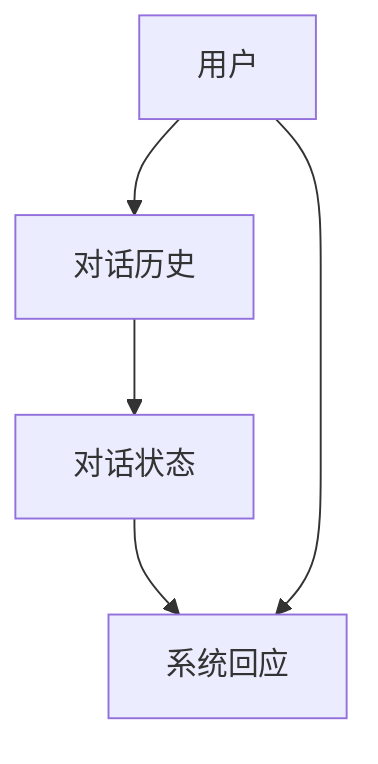
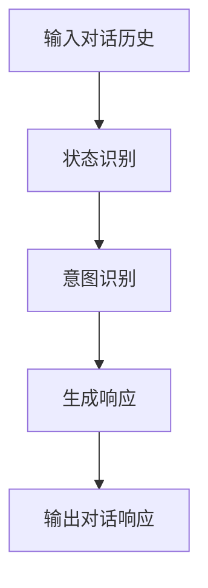
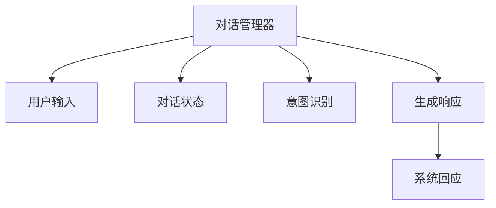
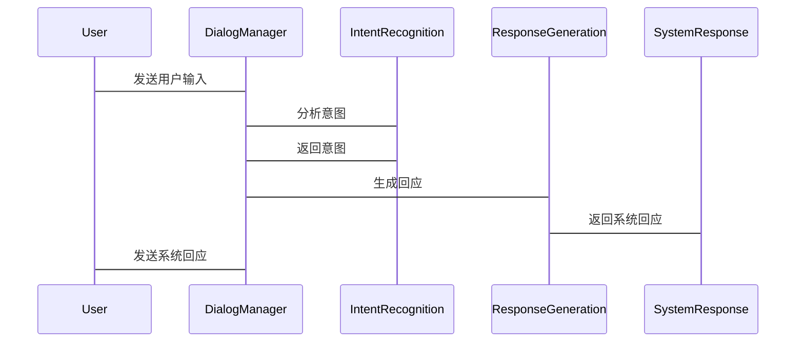

                 


# 构建AI Agent的对话管理系统

> 关键词：AI Agent，对话管理，自然语言处理，系统架构，算法原理

> 摘要：本文详细探讨了构建AI Agent对话管理系统的各个方面，从基本概念到算法原理，再到系统架构和项目实战。通过系统的分析和详细的讲解，帮助读者理解对话管理的核心概念、实现方式及其在实际项目中的应用。

---

# 第1章: AI Agent与对话管理概述

## 1.1 AI Agent的基本概念

### 1.1.1 AI Agent的定义
AI Agent（人工智能代理）是指能够感知环境、自主决策并执行任务的智能实体。AI Agent可以是软件程序、机器人或其他智能设备，其核心目标是通过与环境交互来实现特定任务。

### 1.1.2 AI Agent的核心特征
AI Agent具有以下核心特征：
- **自主性**：能够自主决策，无需外部干预。
- **反应性**：能够实时感知环境并做出反应。
- **目标导向**：具有明确的目标，并通过行为来实现目标。
- **学习能力**：能够通过经验改进性能。

### 1.1.3 对话管理的定义与作用
对话管理是对对话过程的规划和控制，旨在确保对话流畅、符合目标。其作用包括：
- 理解用户意图。
- 维护对话上下文。
- 生成合适的系统回应。

## 1.2 对话管理的背景与问题背景

### 1.2.1 当前对话管理技术的发展现状
对话管理技术经历了从基于规则到深度学习的演变，当前主要技术包括：
- **规则驱动**：通过预定义规则处理简单对话。
- **数据驱动**：利用机器学习模型处理复杂对话。

### 1.2.2 对话管理在AI Agent中的重要性
对话管理是AI Agent与用户交互的核心模块，直接影响用户体验和任务成功率。

### 1.2.3 对话管理的核心问题与挑战
对话管理面临以下挑战：
- **上下文理解**：对话历史和当前意图的关联。
- **多轮对话**：保持对话连贯性。
- **用户多样性**：不同用户的表达习惯差异。

## 1.3 对话管理的目标与实现方式

### 1.3.1 对话管理的目标
对话管理的目标包括：
- **理解用户意图**：准确识别用户的意图。
- **保持对话流畅**：确保对话自然连贯。
- **实现任务目标**：完成特定任务。

### 1.3.2 对话管理的主要实现方式
对话管理的主要实现方式包括：
- **规则驱动**：通过预定义规则处理简单场景。
- **数据驱动**：利用机器学习模型处理复杂场景。
- **混合驱动**：结合规则和机器学习的优势。

### 1.3.3 对话管理的边界与外延
对话管理的边界包括：
- **输入范围**：仅处理对话内容，不涉及其他输入。
- **输出范围**：生成系统回应，不处理后续交互。

## 1.4 对话管理的核心要素与概念结构

### 1.4.1 对话管理的核心要素
对话管理的核心要素包括：
- **对话历史**：记录之前的对话内容。
- **对话状态**：当前对话的上下文信息。
- **系统目标**：AI Agent的对话目标。

### 1.4.2 对话管理的概念结构
对话管理的概念结构包括：
- **输入**：用户输入的文本。
- **处理**：解析意图并生成回应。
- **输出**：系统的回应文本。

### 1.4.3 对话管理的实现架构
对话管理的实现架构包括：
- **输入层**：接收用户输入。
- **处理层**：解析意图并生成回应。
- **输出层**：生成系统回应。

---

# 第2章: 对话管理的核心概念与联系

## 2.1 对话管理的核心概念原理

### 2.1.1 对话管理的基本原理
对话管理的基本原理包括：
- **意图识别**：识别用户的意图。
- **上下文管理**：维护对话上下文。
- **回应生成**：生成符合意图的回应。

### 2.1.2 对话管理的关键技术
对话管理的关键技术包括：
- **自然语言处理**：处理对话文本。
- **任务规划**：规划对话流程。
- **知识图谱**：提供背景知识。

### 2.1.3 对话管理的核心算法
对话管理的核心算法包括：
- **基于规则的对话管理**：通过预定义规则处理对话。
- **基于状态机的对话管理**：通过状态机模型处理对话。
- **基于深度学习的对话管理**：利用深度学习模型处理对话。

## 2.2 对话管理的核心概念对比

### 2.2.1 对话管理与自然语言处理的对比
对话管理与自然语言处理的对比：
- **目标**：对话管理关注对话流程，NLP关注文本处理。
- **输入**：对话管理的输入是对话文本，NLP的输入是文本数据。
- **输出**：对话管理的输出是对话回应，NLP的输出是文本分析结果。

### 2.2.2 对话管理与任务规划的对比
对话管理与任务规划的对比：
- **目标**：对话管理关注对话流程，任务规划关注任务执行。
- **输入**：对话管理的输入是对话文本，任务规划的输入是任务目标。
- **输出**：对话管理的输出是对话回应，任务规划的输出是行动步骤。

### 2.2.3 对话管理与知识图谱的对比
对话管理与知识图谱的对比：
- **目标**：对话管理关注对话流程，知识图谱关注知识表示。
- **输入**：对话管理的输入是对话文本，知识图谱的输入是知识数据。
- **输出**：对话管理的输出是对话回应，知识图谱的输出是知识查询结果。

## 2.3 对话管理的ER实体关系图



---

# 第3章: 对话管理的算法原理

## 3.1 对话管理的算法概述

### 3.1.1 基于规则的对话管理
基于规则的对话管理通过预定义规则处理对话，适用于简单场景。

### 3.1.2 基于状态机的对话管理
基于状态机的对话管理通过状态机模型处理对话，适用于复杂场景。

### 3.1.3 基于深度学习的对话管理
基于深度学习的对话管理利用深度学习模型处理对话，适用于复杂场景。

## 3.2 对话管理算法的实现流程



## 3.3 对话管理算法的数学模型

### 3.3.1 基于规则的对话管理模型
基于规则的对话管理模型通过预定义规则处理对话，例如：
$$ \text{如果用户输入“你好”，则系统回应“你好！有什么可以帮助你的吗？”} $$

### 3.3.2 基于状态机的对话管理模型
基于状态机的对话管理模型通过状态机模型处理对话，例如：
$$ \text{状态1} \rightarrow \text{状态2} \rightarrow \text{状态3} $$

### 3.3.3 基于深度学习的对话管理模型
基于深度学习的对话管理模型利用深度学习模型处理对话，例如：
$$ P(y|x) = \text{softmax}(Wx + b) $$

---

# 第4章: 对话管理的系统分析与架构设计

## 4.1 问题场景介绍
对话管理的系统需要处理用户输入，生成系统回应。

## 4.2 项目介绍
项目目标是构建一个AI Agent的对话管理系统，实现对话管理功能。

## 4.3 系统功能设计

### 4.3.1 领域模型类图
```mermaid
classDiagram
    class DialogManager {
        +dialogHistory: string
        +dialogState: string
        +intent: string
        -generateResponse()
    }
    class UserInput {
        +text: string
    }
    class SystemResponse {
        +text: string
    }
    DialogManager o UserInput
    DialogManager --> SystemResponse
```

### 4.3.2 系统架构图


### 4.3.3 系统接口设计
- **输入接口**：接收用户输入。
- **输出接口**：生成系统回应。

### 4.3.4 系统交互序列图


---

# 第5章: 对话管理的项目实战

## 5.1 环境安装
需要安装以下工具：
- Python 3.x
- Numpy
- Scikit-learn

## 5.2 系统核心实现源代码

### 5.2.1 对话管理器类
```python
class DialogManager:
    def __init__(self):
        self.dialogHistory = []
        self.dialogState = None
        self.intent = None

    def generateResponse(self):
        # 实现生成回应的逻辑
        pass
```

### 5.2.2 意图识别函数
```python
def recognizeIntent(userInput):
    # 实现意图识别的逻辑
    pass
```

### 5.2.3 响应生成函数
```python
def generateResponse(intent, dialogHistory):
    # 实现生成回应的逻辑
    pass
```

## 5.3 代码应用解读与分析
解释代码实现的逻辑和功能。

## 5.4 实际案例分析
分析一个实际案例，展示对话管理系统的运行过程。

## 5.5 项目小结
总结项目的实现过程和成果。

---

# 第6章: 对话管理的最佳实践

## 6.1 小结
总结对话管理的核心概念和实现方式。

## 6.2 注意事项
提醒读者在实际应用中需要注意的事项。

## 6.3 拓展阅读
推荐进一步学习的资料和资源。

---

# 附录: 工具安装与术语表

## 附录A: 工具安装
提供安装Python和相关库的步骤。

## 附录B: 术语表
列出文章中的核心术语及其定义。

---

# 参考文献

（此处列出参考文献）

---

# 作者信息

作者：AI天才研究院 & 禅与计算机程序设计艺术

---

以上内容可以根据具体需求进行调整和扩展。

