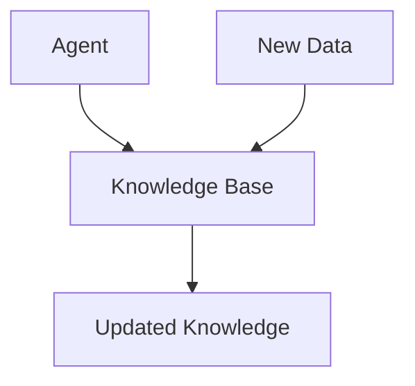
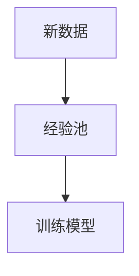
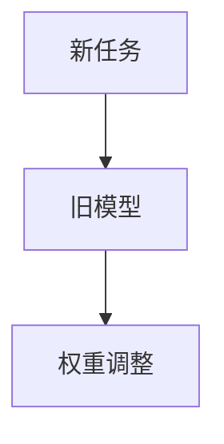
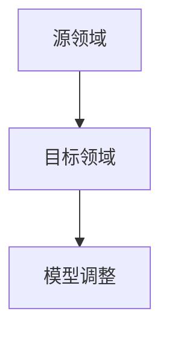
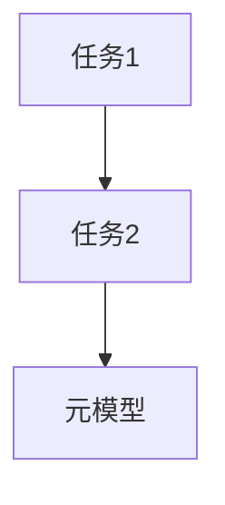
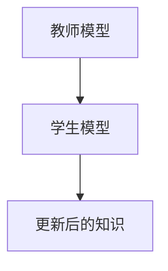
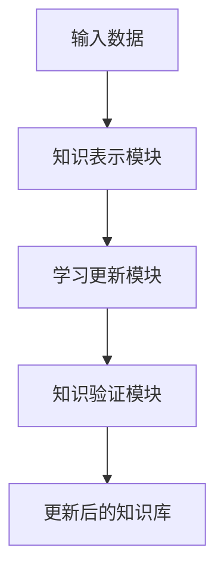

                 


# 构建AI Agent的持续学习与知识更新机制

> 关键词：AI Agent，持续学习，知识更新，增量学习，任务迁移，知识蒸馏

> 摘要：本文深入探讨AI Agent的持续学习与知识更新机制，从背景、核心概念、算法原理、系统架构到项目实战，全面解析如何构建高效的AI Agent知识更新系统。

---

# 第1章: 问题背景与定义

## 1.1 问题背景

### 1.1.1 AI Agent的基本概念
AI Agent（人工智能代理）是指能够感知环境、自主决策并执行任务的智能实体。它可以是一个软件程序、机器人或其他智能系统，旨在通过与环境交互来实现特定目标。

### 1.1.2 持续学习的必要性
AI Agent在动态环境中运行时，会面临不断变化的新任务和新数据。传统的静态模型无法适应这些变化，因此需要通过持续学习来保持性能。

### 1.1.3 知识更新机制的重要性
知识更新机制是AI Agent持续学习的核心，它确保代理能够不断优化其知识库，以应对新任务和新挑战。

---

## 1.2 持续学习的定义与特点

### 1.2.1 持续学习的定义
持续学习是指AI Agent在处理新任务时，能够利用之前学到的知识，同时更新和扩展其知识库，以适应新的数据和任务。

### 1.2.2 持续学习的核心特点
- **增量性**：模型在新数据上逐步更新，而不是重新训练。
- **动态性**：能够处理实时更新的任务和数据。
- **适应性**：能够根据新知识调整行为和决策。

### 1.2.3 与传统机器学习的区别
| 特性       | 持续学习          | 传统机器学习       |
|------------|-------------------|-------------------|
| 数据输入方式 | 增量式输入         | 批式输入           |
| 模型更新方式 | 在线更新           | 离线更新           |
| 适应性     | 高                | 低                |

---

## 1.3 知识更新机制的挑战

### 1.3.1 数据异构性问题
新数据可能与旧数据在分布、格式或特征上存在差异，导致模型难以直接应用。

### 1.3.2 模型遗忘问题
随着时间推移，模型可能会遗忘旧任务的知识，导致性能下降。

### 1.3.3 知识表示的复杂性
知识的表示方式（如符号、向量、图结构）会影响更新的效率和效果。

---

## 1.4 持续学习的方法论

### 1.4.1 增量学习
通过逐步处理新数据来更新模型，避免重新训练整个模型。

### 1.4.2 任务迁移
将新任务与旧任务相关联，利用旧任务的知识来加速新任务的学习。

### 1.4.3 知识蒸馏
通过教师模型将知识传递给学生模型，减少知识的冗余和复杂性。

---

## 1.5 当前研究现状

### 1.5.1 知识图谱的应用
知识图谱为AI Agent提供了结构化的知识表示，支持高效的查询和推理。

### 1.5.2 大模型的持续学习进展
大语言模型（如GPT）通过持续学习技术，能够处理多样化的任务和数据。

### 1.5.3 行业应用案例
- **智能助手**：如Siri、Alexa，通过持续学习优化用户体验。
- **推荐系统**：通过实时更新用户偏好，提供更精准的推荐。

---

# 第2章: 知识表示与更新的核心概念

## 2.1 知识表示方法

### 2.1.1 符号表示
使用符号逻辑表示知识，如“如果天气晴朗，建议穿轻便衣物”。

### 2.1.2 向量表示
通过向量空间模型（如Word2Vec）将知识转化为低维向量表示。

### 2.1.3 图结构表示
使用图结构（如知识图谱）表示实体及其关系，支持复杂的推理任务。

---

## 2.2 知识更新机制的原理

### 2.2.1 知识融合
将新知识与旧知识结合，避免信息冲突。例如，合并两个知识图谱时，需要解决实体对齐问题。

### 2.2.2 知识演化
根据新数据动态调整知识表示，例如，随着时间推移，用户的偏好发生变化。

### 2.2.3 知识验证
通过验证新知识的合理性，确保更新后的知识库是正确的。

---

## 2.3 核心概念对比表

| 概念       | 描述                                   |
|------------|--------------------------------------|
| 知识表示    | 数据结构化的方式                       |
| 知识更新    | 动态调整知识库的过程                   |
| 持续学习    | 在新数据上不断优化模型的过程           |

---

## 2.4 ER实体关系图



---

# 第3章: 持续学习的算法原理

## 3.1 增量学习算法

### 3.1.1 Experience Replay



**代码实现：**

```python
class ExperienceReplay:
    def __init__(self, capacity):
        self.capacity = capacity
        self.memory = []
    
    def remember(self, state, action, reward, next_state):
        self.memory.append((state, action, reward, next_state))
    
    def replay(self, model, batch_size):
        if len(self.memory) < batch_size:
            return
        minibatch = random.sample(self.memory, batch_size)
        # 训练模型
        for state, action, reward, next_state in minibatch:
            target = reward + model.predict(next_state)[0]
            model.train(state, target)
```

### 3.1.2 Elastic Weight Consolidation (EWC)



**数学模型：**

$$ L = \sum_{i=1}^{n} (y_i - f_i)^2 + \lambda \sum_{j=1}^{m} (w_j - \tilde{w}_j)^2 $$

---

## 3.2 任务迁移算法

### 3.2.1 Domain Adaptation



**代码实现：**

```python
def domain_adaptation(source_data, target_data):
    # 训练源领域模型
    model = train_model(source_data)
    # 迁移到目标领域
    adapted_model = adapt_model(model, target_data)
    return adapted_model
```

### 3.2.2 Meta-Learning



**数学模型：**

$$ \theta = \theta - \eta \nabla_{\theta} \mathcal{L}_{task} $$

---

## 3.3 知识蒸馏算法

### 3.3.1 知识蒸馏流程



**代码实现：**

```python
def knowledge_distillation(teacher, student, data):
    # 提取教师模型的知识
    teacher_logits = teacher.predict(data)
    # 训练学生模型
    student.train(data, teacher_logits)
```

---

# 第4章: 系统架构与设计

## 4.1 系统功能设计

### 4.1.1 知识表示模块
负责将数据转化为结构化的知识表示，支持符号、向量和图结构。

### 4.1.2 学习更新模块
实现持续学习算法（如EWC、Replay），动态更新模型参数。

### 4.1.3 知识验证模块
验证新知识的合理性，确保知识库的准确性。

---

## 4.2 系统架构设计



---

## 4.3 系统接口设计

- **输入接口**：接收新数据和任务。
- **输出接口**：输出更新后的知识库和模型参数。
- **通信接口**：与其他模块（如传感器、执行器）交互。

---

## 4.4 系统交互流程

```mermaid
sequenceDiagram
A[用户] -> B[输入数据]
B -> C[知识表示模块]
C -> D[学习更新模块]
D -> E[知识验证模块]
E -> F[更新后的知识库]
F -> G[输出结果]
```

---

# 第5章: 项目实战

## 5.1 环境配置

- **编程语言**：Python
- **框架**：TensorFlow/PyTorch
- **依赖库**：numpy, pandas, matplotlib

---

## 5.2 核心代码实现

### 5.2.1 知识表示模块

```python
class KnowledgeBase:
    def __init__(self):
        self.knowledge = {}
    
    def add Knowledge(self, key, value):
        self.knowledge[key] = value
```

### 5.2.2 学习更新模块

```python
class Learner:
    def __init__(self, model):
        self.model = model
    
    def update(self, data):
        self.model.train(data)
```

### 5.2.3 知识验证模块

```python
class Validator:
    def __init__(self, knowledge_base):
        self.knowledge_base = knowledge_base
    
    def validate(self):
        # 验证逻辑
        pass
```

---

## 5.3 案例分析与实现

### 5.3.1 实际案例分析
假设一个AI Agent需要在电商平台上更新产品推荐策略，通过持续学习新的用户行为数据，优化推荐算法。

### 5.3.2 代码实现

```python
# 初始化知识库
kb = KnowledgeBase()
kb.addKnowledge("user偏好", "电子产品")

# 训练模型
learner = Learner(model)
learner.update(new_data)

# 验证知识
validator = Validator(kb)
validator.validate()
```

---

## 5.4 项目小结

通过实际案例，我们展示了如何构建一个基于持续学习的AI Agent系统。关键在于选择合适的算法和架构，确保系统的灵活性和可扩展性。

---

# 第6章: 最佳实践与注意事项

## 6.1 小结

- 持续学习是构建智能AI Agent的核心能力。
- 知识表示和更新机制是实现持续学习的关键。
- 选择合适的算法和架构能够显著提升系统性能。

## 6.2 注意事项

- **数据质量**：确保新数据的准确性和代表性。
- **模型鲁棒性**：防止模型遗忘旧知识。
- **计算资源**：持续学习需要较高的计算资源。

## 6.3 拓展阅读

- 《Neural Networks and Deep Learning》
- 《Hands-On Machine Learning with Scikit-Learn, Keras, and TensorFlow》
- 《Deep Learning》

---

# 作者：AI天才研究院/AI Genius Institute & 禅与计算机程序设计艺术 /Zen And The Art of Computer Programming

---

通过本文，我们系统地探讨了构建AI Agent的持续学习与知识更新机制，从理论到实践，为读者提供了全面的指导。希望这些内容能够帮助您更好地理解和实现AI Agent的持续学习能力。

