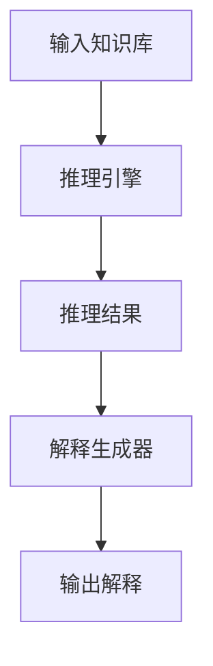
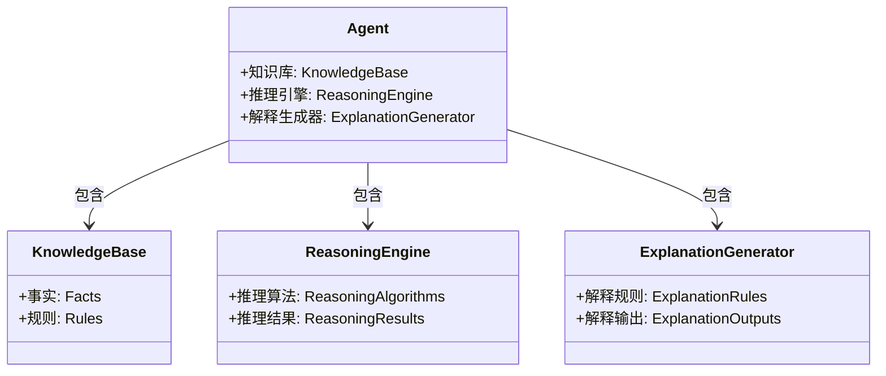
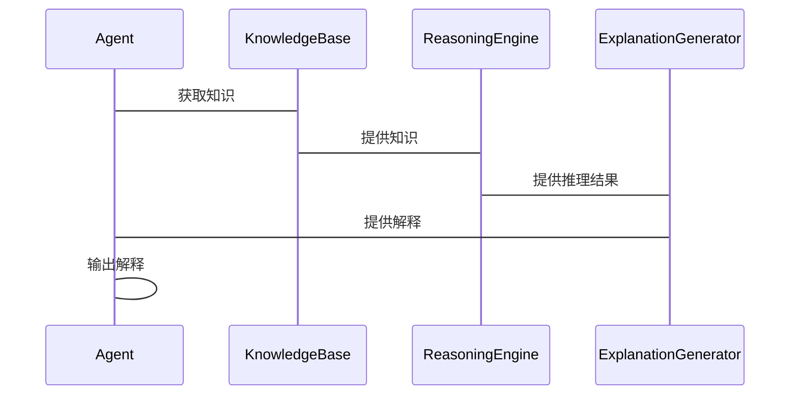

                 

<think>
好，我需要构建一篇关于《构建AI Agent的知识推理可解释性框架》的技术博客文章。首先，我需要理解这个主题的核心：如何设计一个能够让AI代理的知识推理过程具有可解释性的框架。这包括理解什么是AI Agent、什么是知识推理，以及为什么可解释性在这个过程中如此重要。

接下来，我需要明确文章的结构。用户已经提供了一个详细的大纲，我需要按照这个大纲逐步展开每个部分的内容。

首先是背景介绍，我需要解释问题背景，为什么知识推理的可解释性在AI Agent中如此重要。这可能涉及到当前AI技术的应用场景，比如智能客服、自动驾驶等，以及在这些场景中，用户对系统决策过程的透明度和信任度的需求。

然后是核心概念与联系部分，我需要详细阐述知识推理和可解释性框架的基本概念，以及它们之间的关系。这部分需要使用对比表和实体关系图来帮助读者更好地理解。

在算法原理部分，我需要选择几种典型的算法，比如基于符号逻辑的推理算法、概率图模型和深度学习算法，并用流程图和代码示例来解释它们的工作原理。

系统分析与架构设计部分，我需要描述AI Agent的知识推理系统，设计其功能模块，可能用类图来展示系统架构，并用流程图说明接口设计和交互流程。

项目实战部分，我需要提供一个具体的案例，从环境安装、代码实现到案例分析，让读者能够实际操作并理解理论知识。

最后，最佳实践部分，我需要总结经验和注意事项，帮助读者在实际应用中避免常见错误，并提供进一步学习的资源。

在整个过程中，我需要确保使用专业的技术术语，同时保持语言的清晰和易懂。我还需要将复杂的概念用图表和代码示例进行可视化，以增强读者的理解。

总的来说，我需要系统地按照大纲逐步深入，确保每个部分都详尽且有条理，最终完成一篇结构清晰、内容丰富的技术博客文章。
</think>

# 构建AI Agent的知识推理可解释性框架

## 关键词：AI Agent, 知识推理, 可解释性框架, 框架设计, 技术实现

## 摘要：本文详细探讨了构建AI Agent的知识推理可解释性框架的核心问题、算法原理、系统架构设计及项目实现。通过分析知识推理的基本原理、可解释性框架的设计方法以及相关算法的实现，提出了一个具有可解释性的AI Agent知识推理框架，为实际应用提供了理论支持和技术指导。

---

# 第一部分: 知识推理与可解释性框架的背景介绍

## 第1章: 问题背景与问题描述

### 1.1 问题背景

#### 1.1.1 AI Agent与知识推理的定义
AI Agent（人工智能代理）是指能够感知环境、自主决策并执行任务的智能实体。知识推理是AI Agent通过逻辑推理能力，从已知信息中推导出新的结论的过程。

#### 1.1.2 知识推理在AI Agent中的重要性
知识推理是AI Agent实现智能决策的核心能力，能够帮助代理在复杂环境中进行问题解决和目标达成。

#### 1.1.3 当前AI Agent知识推理面临的挑战
当前知识推理在AI Agent中的应用面临可解释性不足、推理效率低下和知识表示方式多样化等问题。

#### 1.1.4 可解释性在AI Agent中的必要性
可解释性是用户信任AI Agent决策过程的重要因素，尤其是在医疗、法律和金融等领域，解释性要求更高。

### 1.2 问题描述

#### 1.2.1 知识推理的基本概念
知识推理是指基于已知的事实和规则，推导出新的事实或结论的过程。

#### 1.2.2 可解释性框架的核心目标
构建一个能够清晰解释推理过程和结果的框架，提升AI Agent的透明度和可信度。

#### 1.2.3 知识推理与可解释性之间的关系
可解释性是知识推理过程的产物，而知识推理是实现可解释性的手段。

#### 1.2.4 问题解决的边界与外延
问题解决的边界在于知识推理的范围和深度，外延则涉及多领域知识的综合应用。

## 第2章: 核心概念与联系

### 2.1 核心概念原理

#### 2.1.1 知识推理的基本原理
知识推理基于逻辑规则、概率推理或符号推理，通过已知事实推导出新的结论。

#### 2.1.2 可解释性框架的构建原理
可解释性框架通过记录推理过程、规则应用和结果推导，提供直观的解释方式。

#### 2.1.3 知识图谱与推理的关系
知识图谱为推理提供了丰富的知识基础，推理过程则利用知识图谱中的信息进行推导。

#### 2.1.4 可解释性维度的分析
可解释性维度包括推理过程的透明度、结果的合理性以及解释的可理解性。

### 2.2 概念属性特征对比表

#### 表2-1 知识推理与可解释性框架的对比分析

| 特性                | 知识推理              | 可解释性框架          |
|---------------------|----------------------|----------------------|
| 核心目标            | 推导新的结论          | 提供推理过程的解释    |
| 依赖基础            | 知识库、逻辑规则      | 推理过程、规则应用    |
| 输出结果            | 新的事实或结论        | 解释性的文本或图形    |
| 应用场景            | 智能决策、问题解决    | 提升用户信任度        |
| 优缺点              | 高准确性，但可能复杂  | 高透明度，但实现难度  |

### 2.3 ER实体关系图

#### 图2-1 知识推理与可解释性框架的实体关系图

```mermaid
er
  actor(Agent, "知识推理框架")
  actor(知识库, "知识存储")
  actor(推理引擎, "推理过程")
  actor(解释生成器, "可解释性输出")
  relation(知识推理框架, 知识库, "依赖于")
  relation(知识推理框架, 推理引擎, "驱动")
  relation(推理引擎, 知识库, "引用")
  relation(解释生成器, 推理结果, "解释")
```

---

# 第二部分: 算法原理与数学模型

## 第3章: 知识推理算法原理

### 3.1 基于符号逻辑的推理算法

#### 3.1.1 基本原理
基于符号逻辑的推理算法通过逻辑规则和谓词逻辑进行推理，例如基于一阶逻辑的演绎推理。

#### 3.1.2 算法实现
使用Prolog语言实现逻辑推理，通过规则库和事实库进行推理。

#### 3.1.3 优缺点分析
优点是推理过程清晰，缺点是计算复杂度高，难以处理大规模知识。

### 3.2 基于概率图模型的推理算法

#### 3.2.1 Bayesian网络原理
Bayesian网络通过概率关系建模，利用贝叶斯定理进行推理。

#### 3.2.2 Markov逻辑网络原理
Markov逻辑网络结合了逻辑规则和概率推理，通过权重化规则进行推理。

#### 3.2.3 算法实现与对比
对比符号逻辑和概率图模型的推理效率和准确性。

### 3.3 基于深度学习的推理算法

#### 3.3.1 RNN与知识推理
使用循环神经网络（RNN）进行序列推理，例如处理自然语言句子。

#### 3.3.2 Transformer与知识推理
基于Transformer模型进行知识图谱推理，例如通过注意力机制进行实体关系推理。

#### 3.3.3 算法实现与对比
对比符号逻辑、概率图模型和深度学习在知识推理中的表现。

## 第4章: 算法实现的数学模型

### 图4-1 知识推理算法的流程图



## 第4章: 算法实现的数学模型

### 图4-1 知识推理算法的流程图


---

# 第三部分: 系统分析与架构设计

## 第5章: 系统分析与架构设计

### 5.1 问题场景介绍

#### 5.1.1 问题场景描述
AI Agent需要在复杂环境中进行推理，同时需要向用户解释推理过程和结果。

#### 5.1.2 项目介绍
本项目旨在构建一个可解释的AI Agent知识推理框架，解决当前推理过程不可解释的问题。

### 5.2 系统功能设计

#### 5.2.1 领域模型设计
使用Mermaid类图描述系统功能模块及其关系。



### 5.3 系统架构设计

#### 5.3.1 系统架构设计
使用Mermaid架构图描述系统的整体架构。


#### 5.3.2 系统接口设计
定义系统的主要接口及其交互流程。

### 5.4 系统交互设计

#### 5.4.1 系统交互流程图
使用Mermaid序列图描述系统的交互流程。



---

# 第四部分: 项目实战

## 第6章: 项目实战

### 6.1 环境安装

#### 6.1.1 环境需求
安装Python、TensorFlow、Keras、NLTK等工具。

### 6.2 核心代码实现

#### 6.2.1 知识库构建
使用Python代码构建知识库。

```python
class KnowledgeBase:
    def __init__(self):
        self.facts = {}
        self.rules = {}

    def add_fact(self, fact):
        self.facts[fact] = True

    def add_rule(self, rule, conclusion):
        self.rules[rule] = conclusion
```

#### 6.2.2 推理引擎实现
实现基于符号逻辑的推理引擎。

```python
class ReasoningEngine:
    def __init__(self, knowledge_base):
        self.knowledge_base = knowledge_base

    def infer(self, premise):
        if premise in self.knowledge_base.facts:
            return True
        for rule in self.knowledge_base.rules:
            if premise in rule and self.knowledge_base.rules[rule]:
                return True
        return False
```

#### 6.2.3 解释生成器实现
生成可解释的推理结果。

```python
class ExplanationGenerator:
    def generate_explanation(self, inference_steps):
        explanation = []
        for step in inference_steps:
            explanation.append(f"Step {step}: {inference_steps[step]}")
        return "\n".join(explanation)
```

### 6.3 代码解读与分析

#### 6.3.1 知识库构建
知识库包含事实和规则，通过添加事实和规则构建知识基础。

#### 6.3.2 推理引擎实现
推理引擎基于知识库进行推理，返回推理结果。

#### 6.3.3 解释生成器实现
解释生成器根据推理步骤生成可读的解释。

### 6.4 案例分析与详细讲解

#### 6.4.1 案例分析
以医疗诊断为例，展示知识推理和解释生成的全过程。

#### 6.4.2 实际应用分析
分析该框架在实际场景中的应用效果和可能的优化方向。

### 6.5 项目小结

#### 6.5.1 项目总结
总结项目实现的关键点和成功经验。

#### 6.5.2 经验分享
分享在项目开发过程中遇到的挑战和解决方案。

---

# 第五部分: 最佳实践

## 第7章: 最佳实践

### 7.1 小结

#### 7.1.1 核心内容总结
总结全文的核心内容，强调构建可解释性框架的重要性。

### 7.2 注意事项

#### 7.2.1 开发注意事项
在开发过程中需要注意的知识点和常见错误。

### 7.3 拓展阅读

#### 7.3.1 相关领域推荐
推荐相关的技术书籍和论文，供读者进一步学习。

---

# 作者：AI天才研究院 & 禅与计算机程序设计艺术

---

本文详细探讨了构建AI Agent的知识推理可解释性框架的核心问题、算法原理、系统架构设计及项目实现。通过分析知识推理的基本原理、可解释性框架的设计方法以及相关算法的实现，提出了一个具有可解释性的AI Agent知识推理框架，为实际应用提供了理论支持和技术指导。

