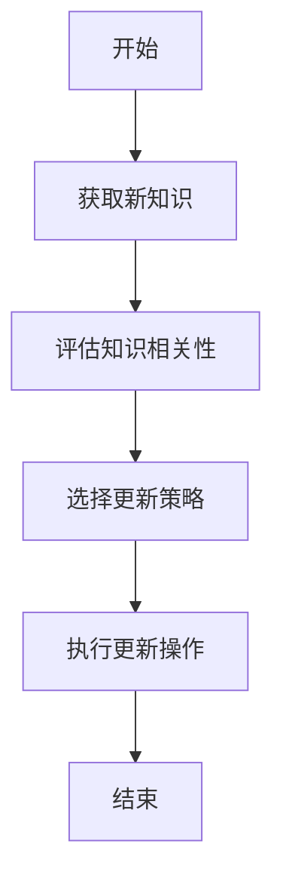
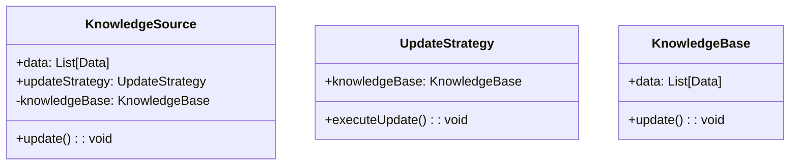
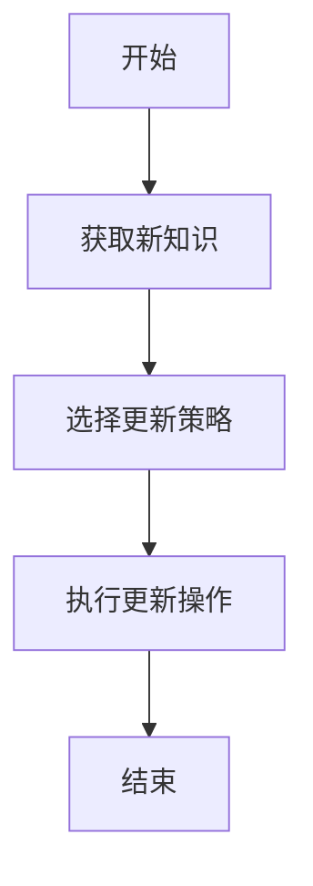
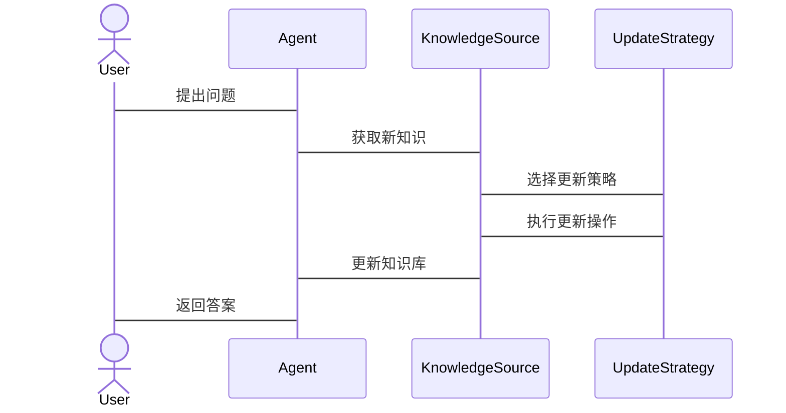

                 


# 构建AI Agent的知识更新机制：保持信息时效性

---

## 关键词：AI Agent，知识更新，信息时效性，持续学习，知识蒸馏，机器学习，系统架构

---

## 摘要

在人工智能（AI）领域，知识更新机制是保持AI Agent性能和适应性的关键。随着环境的变化和新信息的不断涌现，AI Agent需要能够快速、准确地更新其知识库，以应对新的挑战。本文从背景、核心概念、算法原理、系统架构、项目实战等多角度深入探讨知识更新机制的设计与实现，重点分析如何保持信息的时效性，确保AI Agent在动态环境中持续高效运行。

---

## 第1章: 背景与问题概述

### 1.1 问题背景

#### 1.1.1 AI Agent的基本概念

AI Agent（人工智能代理）是一种能够感知环境、自主决策并执行任务的智能实体。它可以是一个软件程序，也可以是一个物理设备，通过传感器和执行器与环境交互。AI Agent的核心目标是根据当前状态和历史经验，做出最优决策，完成特定任务。

#### 1.1.2 知识更新机制的重要性

AI Agent的知识来源于数据、模型和经验。然而，随着时间的推移，环境会发生变化，新的数据和信息会不断出现。如果AI Agent的知识无法及时更新，其决策能力和性能会显著下降。例如，在自然语言处理（NLP）任务中，AI Agent需要不断更新语言模型，以适应新的词汇、语义和语境的变化。

#### 1.1.3 信息时效性问题的提出

信息的时效性是指信息的有效性和相关性。在动态环境中，信息的价值会随着时间的推移而变化。例如，在金融领域，市场数据和新闻每天都在变化，AI Agent需要快速更新其知识库，以做出准确的预测和决策。如果知识过时，AI Agent可能会做出错误的决策，导致损失。

### 1.2 问题描述

#### 1.2.1 AI Agent的知识来源与更新需求

AI Agent的知识来源包括：

1. **数据源**：如传感器数据、数据库、API接口等。
2. **模型更新**：如机器学习模型的再训练。
3. **经验积累**：通过与环境的交互，积累经验并优化策略。

为了保持知识的准确性，AI Agent需要定期更新其知识库，包括数据、模型和经验。

#### 1.2.2 信息过时对AI Agent性能的影响

信息过时会导致AI Agent的决策能力下降，甚至可能引发错误。例如，自动驾驶汽车需要实时更新地图数据和交通规则，如果使用过时的地图数据，可能导致导航错误或交通事故。

#### 1.2.3 知识更新机制的目标与边界

知识更新机制的目标是：

1. **保持知识的准确性**：确保知识库中的信息是最新且准确的。
2. **提高决策效率**：通过快速更新知识，提升AI Agent的决策速度和准确性。
3. **适应环境变化**：使AI Agent能够适应动态环境，应对新的挑战。

知识更新机制的边界包括：

1. **更新频率**：根据任务需求确定知识更新的频率，如实时更新或周期性更新。
2. **更新范围**：根据环境变化的幅度，确定更新的知识范围，如局部更新或全局更新。
3. **资源限制**：在有限的计算资源下，优化知识更新的效率。

### 1.3 问题解决与核心目标

#### 1.3.1 知识更新机制的核心目标

知识更新机制的核心目标是：

1. **保持知识的时效性**：确保知识库中的信息是最新的。
2. **提高决策的准确性**：通过及时更新知识，提升AI Agent的决策能力。
3. **降低信息过时的风险**：通过定期更新和验证，减少知识过时的可能性。

#### 1.3.2 解决方案的框架与思路

知识更新机制的解决方案包括以下几个步骤：

1. **知识获取**：从数据源获取新的信息。
2. **知识验证**：验证新知识的准确性和相关性。
3. **知识存储**：将新知识存储到知识库中。
4. **知识应用**：将新知识应用到AI Agent的决策过程中。

#### 1.3.3 边界与外延

知识更新机制的边界包括：

1. **知识的表示形式**：知识可以是结构化的数据、非结构化的文本或模型参数。
2. **更新的触发条件**：根据环境变化或任务需求触发知识更新。
3. **更新的优先级**：根据知识的重要性和紧急性确定更新的优先级。

---

## 第2章: 知识更新机制的核心概念与联系

### 2.1 核心概念原理

#### 2.1.1 知识表示与存储

知识表示是知识更新的基础。常用的表示方法包括：

1. **符号表示**：如逻辑规则、语义网络等。
2. **向量表示**：如Word2Vec、GloVe等词向量表示。
3. **模型表示**：如神经网络模型的参数。

知识存储需要考虑存储结构和存储效率。常用的存储方式包括数据库、文件系统和分布式存储。

#### 2.1.2 知识更新的触发条件

知识更新的触发条件包括：

1. **时间触发**：如定期更新。
2. **事件触发**：如检测到环境变化或任务需求。
3. **性能触发**：如AI Agent的性能下降到一定程度时触发更新。

#### 2.1.3 更新算法与策略

更新算法包括：

1. **增量更新**：只更新变化的部分，节省计算资源。
2. **全量更新**：重新训练整个模型，确保准确性。
3. **混合更新**：结合增量和全量更新的方法。

### 2.2 核心概念属性特征对比

以下是知识更新机制与学习机制的对比表：

| **特性**       | **知识更新机制**       | **学习机制**         |
|----------------|-----------------------|----------------------|
| 目标           | 维护知识的时效性       | 提高模型的性能       |
| 输入           | 新知识、环境变化       | 新数据、经验         |
| 输出           | 更新后的知识库         | 更新后的模型参数     |
| 触发条件       | 时间、事件、性能下降   | 数据量、任务需求     |
| 更新频率       | 可变                   | 可变                 |
| 资源消耗       | 较低（增量更新）       | 较高（全量训练）     |

### 2.3 ER实体关系图

以下是知识更新机制的ER实体关系图：

```mermaid
er
actor(Agent, KnowledgeSource, UpdateStrategy)
```

---

## 第3章: 知识更新机制的算法原理

### 3.1 算法原理概述

#### 3.1.1 持续学习的基本原理

持续学习是一种机器学习方法，旨在通过不断接收新的数据样本，逐步更新模型参数，以保持模型的性能。持续学习的核心思想是：

1. **在线学习**：模型在接收到新数据时，立即更新参数。
2. **增量学习**：模型只更新与新数据相关的参数，节省计算资源。

#### 3.1.2 知识蒸馏的核心思想

知识蒸馏是一种模型压缩技术，通过将大模型的知识迁移到小模型中，提升小模型的性能。知识蒸馏的核心思想是：

1. **教师模型**：大模型作为教师，输出概率分布。
2. **学生模型**：小模型通过模仿教师模型的输出，学习知识。
3. **蒸馏过程**：通过损失函数，将教师模型的知识迁移到学生模型中。

#### 3.1.3 对比学习的原理

对比学习是一种通过比较不同样本的相似性，学习数据表示的方法。对比学习的核心思想是：

1. **正样本对**：同一类别的样本对。
2. **负样本对**：不同类别的样本对。
3. **对比损失**：通过最大化正样本对的相似性，最小化负样本对的相似性，学习数据表示。

### 3.2 算法流程图

以下是知识更新机制的算法流程图：



### 3.3 算法实现与数学模型

#### 3.3.1 持续学习的数学模型

持续学习的损失函数可以表示为：

$$
L = \alpha L_{\text{new}} + (1-\alpha) L_{\text{old}}
$$

其中，$L_{\text{new}}$是新数据的损失，$L_{\text{old}}$是旧数据的损失，$\alpha$是新数据的权重。

#### 3.3.2 知识蒸馏的数学模型

知识蒸馏的损失函数可以表示为：

$$
L = \lambda L_{\text{CE}} + (1-\lambda) L_{\text{KD}}
$$

其中，$L_{\text{CE}}$是交叉熵损失，$L_{\text{KD}}$是知识蒸馏损失，$\lambda$是知识蒸馏的权重。

---

## 第4章: 系统分析与架构设计方案

### 4.1 问题场景介绍

假设我们正在开发一个智能问答系统，需要实时更新问答对的知识库，以应对用户提出的各种问题。

### 4.2 系统功能设计

#### 4.2.1 领域模型设计

以下是领域模型的类图：



#### 4.2.2 系统架构设计

以下是系统架构的流程图：



#### 4.2.3 接口设计与交互

以下是系统交互的序列图：



---

## 第5章: 项目实战

### 5.1 项目介绍

我们以一个智能问答系统为例，展示如何实现知识更新机制。

### 5.2 环境安装与配置

1. **安装Python环境**：使用Python 3.8及以上版本。
2. **安装依赖库**：`pip install numpy pandas scikit-learn transformers`。

### 5.3 核心代码实现

以下是知识更新机制的Python代码实现：

```python
# 知识源类
class KnowledgeSource:
    def __init__(self, data):
        self.data = data
        self.update_strategy = None

    def set_update_strategy(self, update_strategy):
        self.update_strategy = update_strategy

    def update(self):
        if self.update_strategy:
            self.update_strategy.execute_update(self.data)

# 更新策略类
class UpdateStrategy:
    def __init__(self, knowledge_base):
        self.knowledge_base = knowledge_base

    def execute_update(self, data):
        # 更新知识库的具体实现
        pass

# 知识库类
class KnowledgeBase:
    def __init__(self):
        self.data = []

    def update(self, new_data):
        self.data.extend(new_data)
```

### 5.4 代码解读与分析

1. **KnowledgeSource类**：表示知识源，包含数据和更新策略。
2. **UpdateStrategy类**：表示更新策略，包含知识库和更新方法。
3. **KnowledgeBase类**：表示知识库，包含数据和更新方法。

### 5.5 案例分析与详细讲解

通过上述代码，我们可以实现知识更新机制。例如，当用户提出一个问题时，智能问答系统会从知识源获取新知识，并通过更新策略更新知识库。

---

## 第6章: 优化与挑战

### 6.1 优化策略

1. **增量更新**：只更新变化的部分，节省计算资源。
2. **分布式更新**：在分布式系统中，通过并行计算提高更新效率。
3. **自适应更新**：根据环境变化自动调整更新频率和范围。

### 6.2 挑战与解决方案

1. **计算资源限制**：在资源受限的环境中，可以通过增量更新和分布式计算优化性能。
2. **知识过载**：通过知识蒸馏和对比学习，优化知识表示，减少知识过载的影响。

---

## 第7章: 总结与展望

### 7.1 总结

知识更新机制是保持AI Agent性能和适应性的关键。通过持续学习、知识蒸馏和对比学习等方法，我们可以实现高效的知识更新，确保信息的时效性。

### 7.2 展望

未来的研究方向包括：

1. **自适应更新策略**：根据环境变化自动调整更新策略。
2. **多模态知识更新**：结合文本、图像等多种模态的信息，提高知识更新的准确性。
3. **强化学习应用**：通过强化学习优化知识更新策略，提升AI Agent的决策能力。

---

## 作者：AI天才研究院/AI Genius Institute & 禅与计算机程序设计艺术/Zen And The Art of Computer Programming

---

通过以上内容，我们可以看到，构建AI Agent的知识更新机制是一个复杂但重要的任务。通过持续学习、知识蒸馏和对比学习等方法，我们可以实现高效的知识更新，确保信息的时效性，提升AI Agent的性能和适应性。

