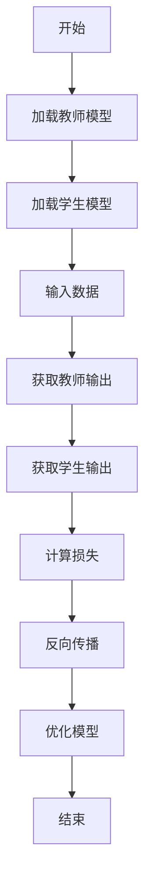
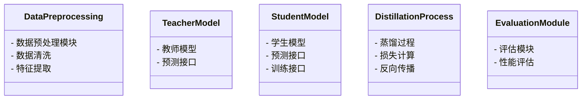
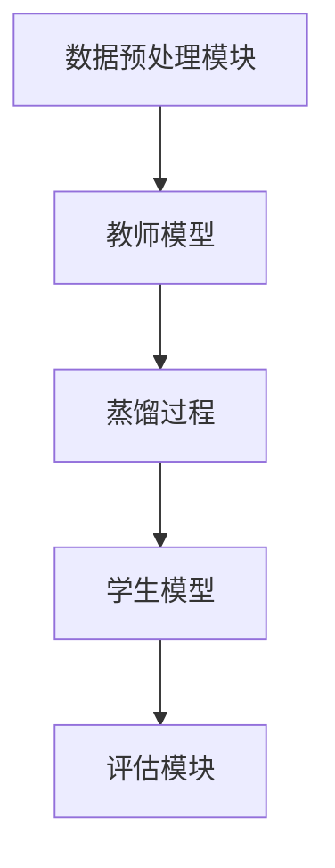

                 

<think>
好的，我需要帮用户撰写一篇关于《构建AI Agent的知识蒸馏pipeline》的技术博客文章。用户已经提供了一个详细的目录大纲，并希望文章内容能够覆盖所有必要的部分，包括背景介绍、核心概念、算法原理、系统架构、项目实战以及最佳实践等。

首先，我需要理解知识蒸馏在AI Agent中的作用。知识蒸馏是一种将复杂的大模型知识提取出来，用于训练更小、更高效的模型的技术。这对于AI Agent来说非常重要，尤其是在资源受限的环境中，蒸馏后的模型可以在保证性能的同时减少计算资源的消耗。

接下来，我需要详细讲解知识蒸馏的核心概念。这部分包括蒸馏的基本原理、教师模型和学生模型的关系，以及不同的蒸馏方法，如软蒸馏和硬蒸馏。我应该用表格对比这些方法，帮助读者更好地理解。

然后，我需要深入分析蒸馏算法的数学原理。这部分需要展示KL散度的计算公式，并解释如何将其应用于蒸馏过程。同时，使用Mermaid画出算法流程图，直观地展示整个蒸馏过程。

接下来是系统分析与架构设计。我需要设计一个完整的蒸馏系统，包括数据预处理、蒸馏过程、评估模块等，并用Mermaid画出类图和架构图，展示各个模块之间的关系。

在项目实战部分，我将选择一个具体的案例，比如构建一个文本分类的蒸馏系统。我需要详细说明环境配置、代码实现、测试优化等步骤，并提供完整的代码示例。

最后，我需要总结整个过程中的经验和注意事项，并展望未来的发展方向。这部分可以加入一些最佳实践，帮助读者更好地理解和应用知识蒸馏技术。

为了确保文章的高质量，我需要使用清晰简洁的技术语言，逻辑紧凑，同时提供丰富的图表和代码示例。整个思考过程需要一步步展开，确保每一部分都详尽且易于理解。

现在，我开始按照目录大纲撰写文章，确保每个章节内容详实，结构合理，语言专业但易于理解。
</think>

# 构建AI Agent的知识蒸馏Pipeline

> 关键词：知识蒸馏、AI Agent、模型压缩、大语言模型、机器学习

> 摘要：本文系统阐述了构建AI Agent的知识蒸馏Pipeline的核心概念、算法原理、系统架构及项目实战。通过详细讲解知识蒸馏的基本原理、实现方法以及在AI Agent中的具体应用，结合实际案例，全面解析了如何设计和优化一个高效的蒸馏Pipeline。从理论到实践，为读者提供一份完整的知识蒸馏解决方案。

---

## 第一部分：知识蒸馏与AI Agent的背景介绍

### 第1章：知识蒸馏的基本概念

#### 1.1 知识蒸馏的背景与意义

知识蒸馏是一种将大型复杂模型的知识迁移到更小、更高效模型的技术，其核心目标是降低模型的计算成本和存储需求，同时保持或提升模型性能。近年来，随着大模型（如GPT系列）的广泛应用，知识蒸馏在AI Agent中的重要性日益凸显。

#### 1.2 知识蒸馏的核心概念

知识蒸馏的核心概念包括以下几点：
- **教师模型（Teacher Model）**：通常是一个性能优异但参数量大的模型。
- **学生模型（Student Model）**：一个轻量级模型，通过蒸馏教师模型的知识进行优化。
- **蒸馏过程（Distillation Process）**：通过损失函数引导学生模型模仿教师模型的输出。

#### 1.3 知识蒸馏的应用场景

知识蒸馏在AI Agent中的应用场景广泛，例如：
- **边缘计算**：在资源受限的设备上部署高效模型。
- **实时推理**：降低延迟，提升响应速度。
- **多模态任务**：将视觉、文本等多种模态的知识迁移到单一模态模型中。

### 第2章：AI Agent与知识蒸馏的关系

#### 2.1 AI Agent的基本概念

AI Agent是一种能够感知环境、执行任务的智能体，通常具备以下特征：
- **自主性**：能够在没有外部干预的情况下执行任务。
- **反应性**：能够根据环境变化调整行为。
- **社交能力**：能够与其他Agent或人类进行交互。

#### 2.2 知识蒸馏在AI Agent中的作用

知识蒸馏在AI Agent中的作用体现在以下几个方面：
- **模型压缩**：将大模型压缩为更轻量级的模型，适合边缘部署。
- **知识迁移**：将大模型的知识迁移到资源受限的设备上。
- **多任务学习**：通过蒸馏多个任务的知识，提升模型的通用性。

### 第3章：知识蒸馏的背景与问题描述

#### 3.1 知识蒸馏的背景与问题背景

随着深度学习模型的不断进步，大模型的参数量急剧增加，导致计算成本和存储需求急剧上升。为了解决这一问题，知识蒸馏应运而生，成为模型压缩和知识迁移的重要技术。

#### 3.2 知识蒸馏的核心原理与机制

知识蒸馏的核心机制包括以下几个步骤：
1. **教师模型输出**：教师模型对输入数据进行预测，生成概率分布。
2. **知识蒸馏**：通过损失函数引导学生模型模仿教师模型的输出。
3. **优化与训练**：通过反向传播优化学生模型的参数。

---

## 第二部分：知识蒸馏的核心概念与联系

### 第4章：知识蒸馏的核心原理与机制

#### 4.1 知识蒸馏的基本原理

知识蒸馏的基本原理是通过损失函数引导学生模型模仿教师模型的输出。具体的损失函数可以表示为：

$$
L = \lambda_1 L_{CE} + \lambda_2 L_{KL}
$$

其中：
- $L_{CE}$是交叉熵损失，用于监督学习。
- $L_{KL}$是KL散度，用于衡量学生模型和教师模型输出之间的差异。
- $\lambda_1$和$\lambda_2$是超参数，用于平衡两种损失的影响。

#### 4.2 知识蒸馏的核心属性与特征对比

以下是几种常见的蒸馏方法对比：

| 方法       | 描述                                                                 |
|------------|----------------------------------------------------------------------|
| 软蒸馏（Soft Distillation） | 使用概率分布进行蒸馏，损失函数包含KL散度项。                     |
| 硬蒸馏（Hard Distillation） | 使用类别标签进行蒸馏，损失函数仅包含交叉熵损失项。               |
| 知识蒸馏（Knowledge Distillation） | 综合使用概率分布和类别标签进行蒸馏。                            |

#### 4.3 知识蒸馏的ER实体关系图架构

以下是知识蒸馏的ER实体关系图架构：

```mermaid
er
actor: User
agent: AI Agent
model: Teacher Model
student: Student Model
knowledge: Knowledge to be distilled
process: Distillation Process
```

---

## 第三部分：知识蒸馏的算法原理与实现

### 第5章：蒸馏算法的数学模型

#### 5.1 蒸馏算法的数学模型

蒸馏算法的数学模型如下：

$$
L_{KL} = \sum_{i=1}^{n} \text{KL}(P_i || Q_i)
$$

其中：
- $P_i$是教师模型的输出概率分布。
- $Q_i$是学生模型的输出概率分布。
- KL散度衡量了两个概率分布之间的差异。

#### 5.2 蒸馏算法的流程图

以下是蒸馏算法的流程图：



---

## 第四部分：系统分析与架构设计

### 第6章：系统架构设计

#### 6.1 系统功能设计

以下是系统功能设计的类图：



#### 6.2 系统架构设计

以下是系统架构设计的架构图：



---

## 第五部分：项目实战

### 第7章：构建知识蒸馏Pipeline

#### 7.1 环境配置

以下是一个简单的环境配置示例：

```bash
python --version
# 输出：Python 3.8.5
pip install torch
pip install transformers
```

#### 7.2 核心实现代码

以下是知识蒸馏的核心实现代码：

```python
import torch
import torch.nn as nn
import torch.optim as optim

class TeacherModel(nn.Module):
    def __init__(self):
        super(TeacherModel, self).__init__()
        self.fc = nn.Linear(10, 5)

    def forward(self, x):
        return self.fc(x)

class StudentModel(nn.Module):
    def __init__(self):
        super(StudentModel, self).__init__()
        self.fc = nn.Linear(10, 5)

    def forward(self, x):
        return self.fc(x)

def distillation_loss(output, teacher_output, alpha=0.5):
    criterion = nn.KLDivLoss()
    loss_kl = criterion(torch.log(F.softmax(output, dim=1)), F.softmax(teacher_output, dim=1))
    loss_ce = nn.CrossEntropyLoss()(output, target)
    return alpha * loss_kl + (1 - alpha) * loss_ce

teacher_model = TeacherModel()
student_model = StudentModel()
optimizer = optim.Adam(student_model.parameters(), lr=0.001)

for epoch in range(num_epochs):
    for inputs, targets in dataloader:
        teacher_output = teacher_model(inputs)
        student_output = student_model(inputs)
        loss = distillation_loss(student_output, teacher_output)
        optimizer.zero_grad()
        loss.backward()
        optimizer.step()
```

---

## 第六部分：总结与展望

### 第8章：最佳实践与注意事项

#### 8.1 最佳实践

- **选择合适的蒸馏方法**：根据具体任务选择软蒸馏或硬蒸馏。
- **调整超参数**：合理设置$\lambda_1$和$\lambda_2$，平衡交叉熵损失和KL散度的影响。
- **优化训练策略**：采用渐进式蒸馏策略，逐步降低教师模型的温度。

#### 8.2 小结与未来展望

知识蒸馏是一种高效的知识迁移技术，能够显著降低模型的计算成本。未来，随着大模型的不断进化，知识蒸馏将在更多场景中得到应用，例如多模态任务和实时推理任务。

---

## 作者

作者：AI天才研究院/AI Genius Institute & 禅与计算机程序设计艺术 /Zen And The Art of Computer Programming

---

通过本文的系统阐述，读者可以全面理解知识蒸馏的核心原理、实现方法及其在AI Agent中的具体应用。从理论到实践，从算法到系统，为构建高效的AI Agent提供了完整的解决方案。

