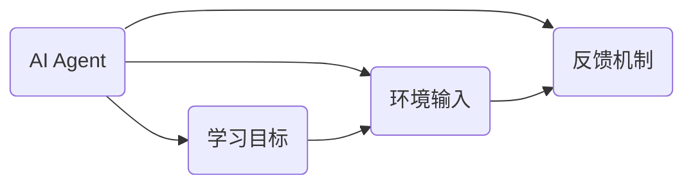
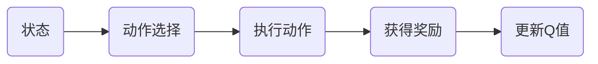
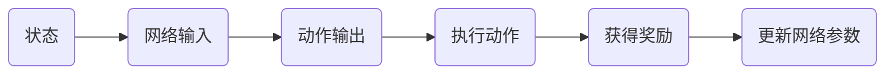
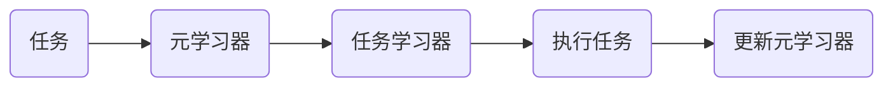
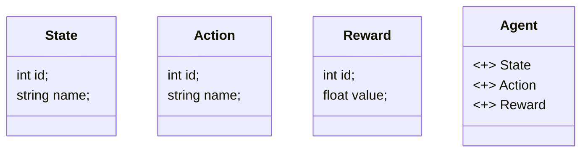
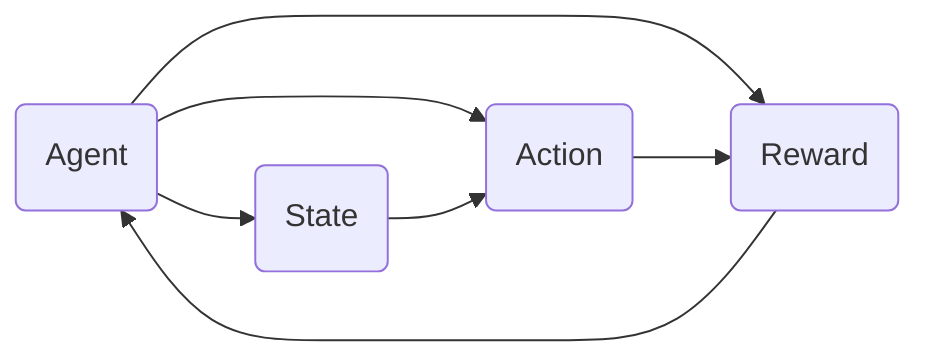
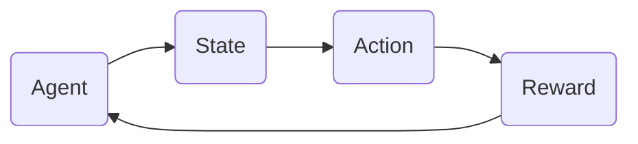

                 


# 构建AI Agent的自适应学习系统

---

## 关键词：
- AI Agent
- 自适应学习系统
- 强化学习
- 元学习
- 系统架构设计
- 项目实战

---

## 摘要：
本文详细探讨了构建AI Agent的自适应学习系统的原理、算法、设计和实现。首先介绍了自适应学习系统的背景与核心概念，分析了其与传统学习方法的区别。接着深入讲解了强化学习和元学习算法的原理，并通过mermaid流程图和Python代码示例进行了详细阐述。随后，从系统架构设计、功能模块划分、接口设计等方面进行了全面分析，并通过实际案例展示了如何将理论应用于实践。最后，总结了最佳实践、注意事项和未来的研究方向，为读者提供了完整的构建指南。

---

# 第一部分: 背景介绍

## 第1章: 问题背景与描述

### 1.1 问题背景

#### 1.1.1 当前AI Agent的发展现状
人工智能（AI）代理（Agent）近年来得到了快速发展，广泛应用于自动驾驶、智能助手、推荐系统等领域。然而，现有的AI Agent在动态变化的环境中往往缺乏灵活性和适应性，难以应对复杂多变的任务需求。

#### 1.1.2 自适应学习系统的需求背景
自适应学习系统是AI Agent的核心能力之一，它使得代理能够根据环境反馈和任务需求动态调整自身行为策略。随着应用场景的扩展，对自适应学习系统的需求日益增长。

#### 1.1.3 问题解决的必要性与目标
构建一个高效的自适应学习系统，能够帮助AI Agent在复杂环境中快速学习和优化，提升其任务执行效率和准确性。本文的目标是通过系统化的方法，构建一个可扩展、可定制的自适应学习系统。

---

### 1.2 问题描述

#### 1.2.1 AI Agent的定义与核心功能
AI Agent是一个能够感知环境、执行任务并做出决策的智能实体。其核心功能包括感知、推理、规划和执行。

#### 1.2.2 自适应学习系统的定义
自适应学习系统是AI Agent的一种学习机制，能够在动态环境中通过与环境的交互，不断优化自身的行为策略。

#### 1.2.3 系统边界与外延
自适应学习系统的边界包括与环境的交互、学习算法的选择与实现、任务目标的定义等。其外延则涉及强化学习、元学习等技术。

---

### 1.3 核心概念与组成

#### 1.3.1 AI Agent的基本组成要素
- 感知模块：负责收集环境信息。
- 决策模块：基于感知信息做出决策。
- 执行模块：根据决策执行具体操作。
- 学习模块：通过经验优化行为策略。

#### 1.3.2 自适应学习系统的组成模块
- 状态感知模块：识别环境状态。
- 行动选择模块：基于当前状态选择最优动作。
- 反馈处理模块：处理环境反馈并更新策略。
- 策略优化模块：通过学习算法优化行为策略。

#### 1.3.3 核心概念的结构与关系
自适应学习系统通过感知环境、选择动作、接收反馈并优化策略，形成一个闭环的动态学习过程。

---

# 第二部分: 核心概念与联系

## 第2章: 自适应学习系统的原理与机制

### 2.1 核心概念原理

#### 2.1.1 强化学习与自适应机制
强化学习是一种通过试错方法优化决策策略的机器学习方法，是实现自适应学习的核心技术之一。

#### 2.1.2 知识表示与更新策略
知识表示是自适应学习系统的关键，通过状态、动作和奖励的表示，系统能够不断更新其知识库。

#### 2.1.3 动态环境下的学习策略
在动态环境中，自适应学习系统需要实时调整其策略，以应对环境的变化。

---

### 2.2 核心概念对比

#### 2.2.1 自适应学习与其他学习方式的对比
| 学习方式 | 特点 | 适用场景 |
|----------|------|----------|
| 监督学习 | 需要标签数据 | 分类、回归 |
| 无监督学习 | 无需标签数据 | 聚类、降维 |
| 强化学习 | 基于奖励反馈 | 控制、游戏 |

#### 2.2.2 AI Agent与传统机器学习模型的差异
AI Agent具有主动性、自主性和社会性，而传统机器学习模型通常是被动的、静态的。

#### 2.2.3 系统功能与性能的对比分析
自适应学习系统通过动态调整策略，能够在复杂环境中实现更高的性能。

---

### 2.3 实体关系图



---

# 第三部分: 算法原理与数学模型

## 第3章: 算法原理

### 3.1 强化学习算法

#### 3.1.1 Q-Learning算法

##### 算法流程图


##### 算法代码实现
```python
import numpy as np

class QLearning:
    def __init__(self, state_space, action_space, alpha=0.1, gamma=0.9):
        self.state_space = state_space
        self.action_space = action_space
        self.alpha = alpha
        self.gamma = gamma
        self.q_table = np.zeros((state_space, action_space))

    def choose_action(self, state, epsilon=0.1):
        if np.random.random() < epsilon:
            return np.random.randint(self.action_space)
        else:
            return np.argmax(self.q_table[state])

    def update_q_table(self, state, action, reward, next_state):
        self.q_table[state][action] = self.q_table[state][action] * (1 - self.alpha) + self.alpha * (reward + self.gamma * np.max(self.q_table[next_state]))
```

##### 数学模型与公式
$$ Q(s, a) = Q(s, a) + \alpha (r + \gamma \max Q(s', a') - Q(s, a)) $$

---

#### 3.1.2 Deep Q-Networks(DQN)算法

##### 算法流程图


##### 算法代码实现
```python
import tensorflow as tf

class DQN:
    def __init__(self, state_dim, action_dim, learning_rate=0.001):
        self.state_dim = state_dim
        self.action_dim = action_dim
        self.learning_rate = learning_rate
        self.model = self.build_model()

    def build_model(self):
        model = tf.keras.Sequential([
            tf.keras.layers.Dense(64, activation='relu', input_dim=self.state_dim),
            tf.keras.layers.Dense(64, activation='relu'),
            tf.keras.layers.Dense(self.action_dim, activation='linear')
        ])
        model.compile(optimizer=tf.keras.optimizers.Adam(self.learning_rate), loss='mean_squared_error')
        return model

    def get_action(self, state, epsilon=0.1):
        if np.random.random() < epsilon:
            return np.random.randint(self.action_dim)
        else:
            predictions = self.model.predict(state)
            return np.argmax(predictions[0])

    def update_model(self, states, actions, rewards, next_states):
        targets = self.model.predict(states)
        next_preds = self.model.predict(next_states)
        targets[0][actions] = rewards + self.gamma * np.max(next_preds[0])
        self.model.fit(states, targets, epochs=1, verbose=0)
```

##### 数学模型与公式
$$ Q(s, a) = Q(s, a) + \alpha (r + \gamma \max Q(s', a') - Q(s, a)) $$

---

### 3.2 元学习算法

#### 3.2.1 Meta-Learning的基本原理

##### 算法流程图


##### 算法代码实现
```python
class MetaLearning:
    def __init__(self, model, optimizer, inner_steps=5):
        self.model = model
        self.optimizer = optimizer
        self.inner_steps = inner_steps

    def inner_loop(self, data):
        for _ in range(self.inner_steps):
            loss = self.model.compute_loss(data)
            grad = self.model.compute_gradients(loss)
            self.optimizer.apply_gradients(grad)
        return self.model.get_weights()

    def meta_loop(self, tasks):
        for task in tasks:
            weights_before = self.model.get_weights()
            new_weights = self.inner_loop(task.data)
            self.model.set_weights(new_weights)
            # Update meta-optimizer
            meta_loss = self.model.compute_meta_loss(tasks)
            meta_grad = self.model.compute_meta_gradients(meta_loss)
            self.optimizer.apply_meta_gradients(meta_grad)
```

##### 数学模型与公式
$$ \theta_{t+1} = \theta_t + \alpha (\nabla_{\theta} L_{meta}) $$

---

## 第4章: 数学模型与公式

### 4.1 强化学习数学模型

#### 4.1.1 状态空间与动作空间
- 状态空间：$$ S = \{s_1, s_2, ..., s_n\} $$
- 动作空间：$$ A = \{a_1, a_2, ..., a_m\} $$

#### 4.1.2 Q值更新公式
$$ Q(s, a) = Q(s, a) + \alpha (r + \gamma \max Q(s', a') - Q(s, a)) $$

---

## 第5章: 系统分析与架构设计

### 5.1 系统功能设计

#### 5.1.1 领域模型类图


---

### 5.2 系统架构设计

#### 5.2.1 系统架构图


---

### 5.3 接口设计与交互流程图

#### 5.3.1 系统接口设计
- 接收状态输入
- 输出动作选择
- 更新学习策略

#### 5.3.2 交互流程图


---

## 第6章: 项目实战

### 6.1 环境安装

#### 6.1.1 安装依赖
```bash
pip install numpy
pip install tensorflow
pip install mermaid
```

---

### 6.2 系统核心实现

#### 6.2.1 核心代码实现
```python
import numpy as np
import tensorflow as tf

class Agent:
    def __init__(self, state_space, action_space, alpha=0.1, gamma=0.9):
        self.state_space = state_space
        self.action_space = action_space
        self.alpha = alpha
        self.gamma = gamma
        self.q_table = np.zeros((state_space, action_space))

    def get_action(self, state, epsilon=0.1):
        if np.random.random() < epsilon:
            return np.random.randint(self.action_space)
        else:
            return np.argmax(self.q_table[state])

    def update_q_table(self, state, action, reward, next_state):
        self.q_table[state][action] = self.q_table[state][action] * (1 - self.alpha) + self.alpha * (reward + self.gamma * np.max(self.q_table[next_state]))
```

---

### 6.3 代码解读与分析

#### 6.3.1 代码解读
- `get_action`方法：基于epsilon-greedy策略选择动作。
- `update_q_table`方法：更新Q值表。

---

### 6.4 实际案例分析

#### 6.4.1 案例描述
假设我们有一个简单的迷宫问题，AI Agent需要通过学习找到出口。

#### 6.4.2 代码实现
```python
agent = Agent(state_space=5, action_space=4)
# 初始化环境
state = 0
for _ in range(100):
    action = agent.get_action(state)
    next_state, reward = environment.step(action)
    agent.update_q_table(state, action, reward, next_state)
    state = next_state
```

---

## 第7章: 最佳实践与总结

### 7.1 最佳实践

#### 7.1.1 系统设计
- 确保系统的可扩展性和可维护性。
- 使用模块化设计，便于后续优化。

#### 7.1.2 算法选择
- 根据具体场景选择合适的算法，如强化学习或元学习。

---

### 7.2 小结

构建AI Agent的自适应学习系统需要从理论到实践的系统性思考，通过本文的介绍，读者可以掌握从背景分析、算法实现到系统设计的完整流程。

---

### 7.3 注意事项

- 确保系统的安全性与稳定性。
- 定期监控和更新学习策略。

---

### 7.4 拓展阅读

- 《Deep Reinforcement Learning》
- 《Meta-Learning: A Survey》

---

## 作者：AI天才研究院/AI Genius Institute & 禅与计算机程序设计艺术 /Zen And The Art of Computer Programming

