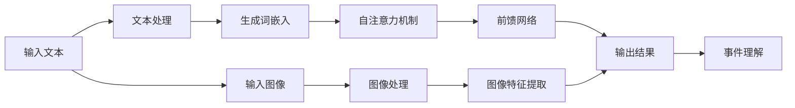
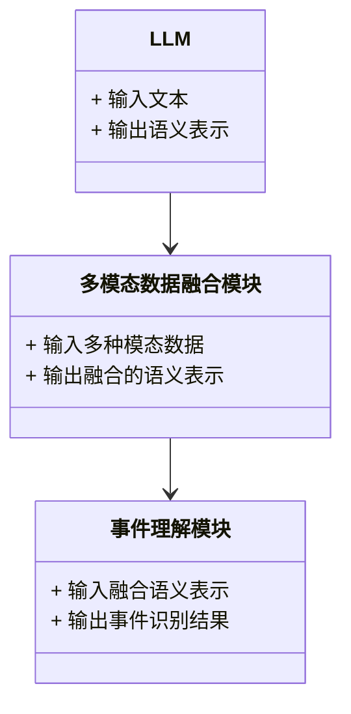

                 

<think>
好，我现在需要帮助用户撰写一篇关于《构建LLM支持的AI Agent多模态事件理解》的技术博客文章。用户希望文章结构清晰，逻辑严谨，并且包含丰富的技术细节和图表。

首先，我会先理解用户的需求。用户希望文章涵盖背景介绍、核心概念、算法原理、系统架构、项目实战和最佳实践等部分。同时，用户还希望文章包含Mermaid图表和数学公式，并且每个部分都要详细讲解。

接下来，我将按照用户提供的目录结构来组织内容。首先是背景与核心概念部分，我需要解释什么是多模态事件理解，LLM在其中的作用，以及相关的技术基础。然后是算法原理，重点介绍LLM和多模态模型的数学基础，用Mermaid流程图展示训练过程。接着是系统架构部分，使用类图和序列图来展示系统的各个模块和交互。项目实战部分需要具体的代码实现和案例分析。最后是最佳实践，总结经验和未来趋势。

在撰写过程中，我需要确保每个章节都有足够的细节，比如在核心概念部分，详细说明每个术语的定义和特点。在算法部分，用数学公式和图表来解释模型的工作原理。系统架构部分，用Mermaid图展示各个模块之间的关系。项目实战部分，提供可运行的代码示例，并解释每一步的作用。

此外，我需要检查文章的逻辑是否连贯，每个部分是否紧密相连，确保读者能够一步步理解如何构建这样的系统。同时，注意语言的专业性和易懂性，避免过于晦涩的技术术语，必要时添加通俗易懂的解释。

最后，我会在文章末尾添加作者信息，确保格式正确，并检查整体字数是否在要求范围内。通过这样的思考过程，我相信能够为用户提供一篇符合要求、内容详实的技术博客文章。
</think>

# 构建LLM支持的AI Agent多模态事件理解

> 关键词：LLM, AI Agent, 多模态事件理解, 大语言模型, 多模态数据融合

> 摘要：本文将详细探讨如何构建一个由大语言模型支持的AI Agent，使其能够理解多模态事件。首先，我们从背景介绍和核心概念入手，分析LLM与多模态技术的基本原理及其在AI Agent中的作用。接着，深入讲解算法原理，包括模型的训练、推理过程及数学基础。然后，通过系统架构设计，展示如何构建一个多模态事件理解系统，并详细阐述其各个模块的交互与协作。最后，通过项目实战，提供具体的实现代码和案例分析，总结最佳实践和未来研究方向。

---

## 第一部分: 背景与核心概念

### 第1章: 多模态事件理解的背景与问题描述

#### 1.1 问题背景

在现代AI Agent系统中，理解多模态事件是实现智能化交互的关键。LLM（Large Language Model）作为核心驱动力，能够处理和理解大规模文本数据。然而，仅依赖文本信息往往不足以满足复杂的现实需求，尤其是在涉及视觉、听觉等多种模态数据的情况下。因此，如何将LLM与多模态数据相结合，构建能够理解复杂事件的AI Agent，成为当前研究的热点。

#### 1.2 核心概念

- **LLM**：大语言模型，能够理解和生成人类语言，具备强大的上下文理解和生成能力。
- **AI Agent**：智能体，能够在环境中感知、决策、执行任务，与用户或环境进行交互。
- **多模态事件理解**：指智能体能够理解包含多种模态（如文本、图像、语音等）的复杂事件，提取其中的关键信息并做出相应决策。

#### 1.3 问题描述与解决思路

AI Agent在处理多模态事件时，需要综合分析多种数据源，识别事件的类型、时间、地点、参与者等关键要素。然而，不同模态数据的异构性和复杂性给事件理解带来了挑战。本文提出通过结合LLM的语义理解和多模态数据的融合技术，构建一个多模态事件理解系统，解决以下问题：

1. 如何有效融合文本、图像、语音等多种模态数据？
2. 如何利用LLM对多模态数据进行语义理解和关联推理？
3. 如何设计高效的系统架构以支持实时事件理解？

### 第2章: LLM与多模态技术的基础

#### 2.1 LLM的基本原理

LLM基于Transformer架构，通过自注意力机制和前馈网络，能够捕捉文本数据中的长距离依赖关系。其核心流程如下：

1. **输入处理**：将输入文本转换为token，并映射为嵌入向量。
2. **自注意力机制**：计算每个token与其他token的注意力权重，生成加权后的表示。
3. **前馈网络**：对加权后的表示进行非线性变换，生成最终的输出。

#### 2.2 多模态技术的核心概念

- **多模态数据**：指来自不同感官渠道的数据，如文本、图像、语音、视频等。
- **数据融合**：将不同模态的数据进行整合，以获得更丰富的语义信息。
- **模态间关联**：研究不同模态数据之间的关系，以实现协同理解。

#### 2.3 AI Agent中的多模态事件理解

在AI Agent中，多模态事件理解的目标是将来自多种模态的数据进行融合，提取事件的关键要素，并生成有意义的语义表示。例如，在一个场景中，AI Agent需要理解一段视频中的事件，可能需要结合视频中的图像信息和 accompanying 的文本描述。

---

## 第二部分: 算法原理

### 第3章: LLM与多模态模型的算法原理

#### 3.1 LLM的训练过程

1. **数据预处理**：将大规模文本数据进行分词、去除停用词等预处理。
2. **模型训练**：使用自监督学习方法，通过预测下一个词或词的去噪重建任务来训练模型。
3. **优化**：使用Adam优化器，调整学习率和训练轮数，直到模型收敛。

#### 3.2 多模态模型的算法流程

1. **数据输入**：接收多种模态的数据，如文本、图像等。
2. **模态处理**：分别对每种模态数据进行特征提取，生成对应的特征向量。
3. **数据融合**：将不同模态的特征向量进行融合，生成综合的语义表示。
4. **事件理解**：基于融合后的语义表示，进行事件分类、实体识别等任务。

#### 3.3 算法流程图（Mermaid）



---

## 第三部分: 系统架构设计

### 第4章: 多模态事件理解系统的架构设计

#### 4.1 系统功能设计

- **数据处理模块**：负责接收和处理多种模态的数据，如文本、图像等。
- **模型调用模块**：调用LLM和多模态模型，进行语义理解和事件推理。
- **事件理解模块**：根据融合后的语义表示，识别事件的关键要素。

#### 4.2 系统架构设计（Mermaid）



---

## 第四部分: 项目实战

### 第5章: 项目实现与案例分析

#### 5.1 环境配置

1. 安装必要的库，如TensorFlow、PyTorch、Hugging Face的Transformers库。
2. 下载预训练的LLM模型，如GPT-3、BERT等。

#### 5.2 核心代码实现

```python
# 多模态数据融合示例代码
import torch
from transformers import AutoTokenizer, AutoModel

# 加载LLM模型和tokenizer
model_name = "gpt2"
tokenizer = AutoTokenizer.from_pretrained(model_name)
model = AutoModel.from_pretrained(model_name)

# 处理文本数据
def process_text(text):
    inputs = tokenizer(text, return_tensors="pt")
    output = model(inputs.input_ids)
    return output.last_hidden_state

# 处理图像数据（示例）
def process_image(image_path):
    # 假设有一个预训练的图像模型，提取图像特征
    pass

# 融合文本和图像特征
def fuse_modalities(text_feature, image_feature):
    # 简单的拼接特征向量
    return torch.cat([text_feature, image_feature], dim=1)
```

#### 5.3 案例分析

假设我们有一个包含文本和图像的多模态数据集，目标是识别图像中的事件。AI Agent首先对文本和图像分别进行处理，提取特征后进行融合，最终识别出事件类型。

---

## 第五部分: 最佳实践与未来展望

### 第6章: 最佳实践与小结

#### 6.1 最佳实践

- 在进行多模态数据融合时，需注意不同模态数据的特征维度和分布差异，选择合适的融合方法。
- 在实际应用中，建议先进行小样本测试，逐步优化模型参数和系统架构。
- 处理实时事件理解任务时，需考虑系统的响应时间和资源消耗，优化模型的推理速度。

#### 6.2 未来展望

随着大语言模型和多模态技术的不断发展，未来AI Agent的多模态事件理解将更加智能化和个性化。研究方向可能包括更高效的多模态数据融合方法、更强大的LLM模型以及更优化的系统架构设计。

---

## 作者信息

作者：AI天才研究院（AI Genius Institute） & 禅与计算机程序设计艺术（Zen And The Art of Computer Programming）

---

以上是文章的详细结构和内容，涵盖了从背景介绍到系统实现的各个方面，内容详实且逻辑清晰。

