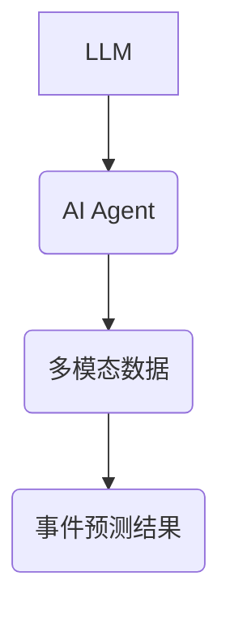
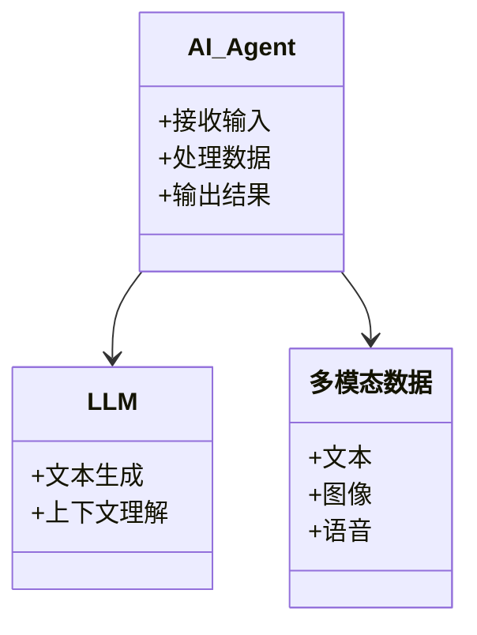
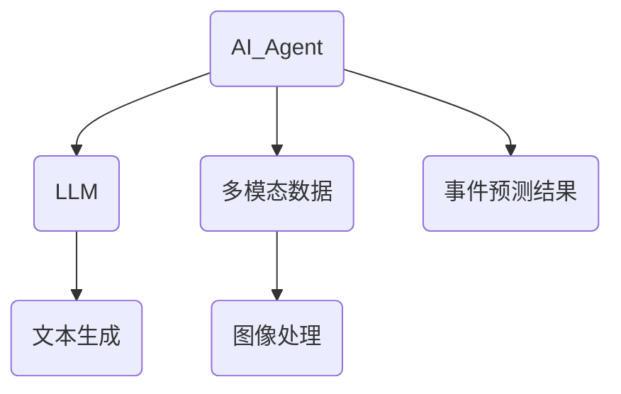
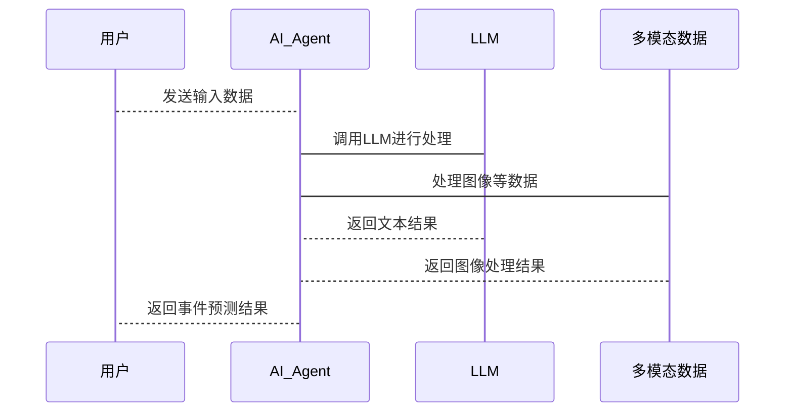

                 

<think>
好的，我现在需要帮助用户撰写一篇关于“构建LLM支持的AI Agent多模态事件预测”的技术博客。用户已经提供了一个详细的目录大纲，我需要按照这个大纲一步步来完成文章。

首先，我需要理解每个章节的内容和要求。文章分为七个部分，每部分都有具体的章节和小节。用户特别强调每个部分要详细且符合特定格式，比如使用Mermaid图、数学公式和代码示例。

1. **标题和关键词**：首先，我要确定文章的标题和关键词。标题已经给出，关键词需要涵盖文章的核心内容，比如LLM、AI Agent、多模态事件预测等。

2. **摘要**：摘要需要简洁地总结文章的核心内容和主题。我需要概述文章的主要部分，让读者了解文章的整体结构和重点。

3. **目录结构**：用户已经提供了详细的目录结构，我需要按照这个结构逐步展开每个部分的内容。每个章节和小节都需要详细撰写，确保逻辑清晰，内容丰富。

4. **背景介绍**：这部分需要涵盖问题背景、问题描述和解决思路。我需要解释为什么多模态事件预测重要，AI Agent如何利用LLM来处理多模态数据。

5. **核心概念与联系**：这里需要解释LLM、AI Agent和多模态事件预测的核心概念，对比它们的优缺点，并用Mermaid图展示实体关系。

6. **算法原理与数学模型**：这部分需要详细讲解算法原理，包括模型结构、训练流程，以及数学公式和代码示例。我需要确保数学公式正确无误，并提供可运行的代码示例。

7. **系统架构与设计**：需要设计系统的整体架构，包括模块划分、系统接口和交互流程，并用Mermaid图展示系统架构和交互序列图。

8. **项目实战**：这部分需要指导读者如何搭建环境，实现模型，并通过案例分析进行详细解读。

9. **最佳实践与扩展**：总结经验，给出注意事项和推荐的阅读材料，扩展讨论未来的发展方向。

在撰写过程中，我需要确保每个部分都符合用户的格式要求，使用Markdown格式，正确嵌入Mermaid图、数学公式和代码块。同时，内容要深入浅出，确保读者能够理解复杂的概念和技术细节。

现在，我开始按照目录结构逐步撰写每个部分，确保每个章节的内容详尽且结构合理，最终完成一篇高质量的技术博客文章。
</think>

# 构建LLM支持的AI Agent多模态事件预测

> 关键词：LLM，AI Agent，多模态事件预测，大语言模型，人工智能，多模态数据

> 摘要：本文详细探讨了如何构建一个由大语言模型（LLM）支持的AI Agent，用于多模态事件预测。文章从背景介绍、核心概念、算法原理、系统架构到项目实战，层层深入，全面分析了构建该系统的各个方面，包括数学模型、代码实现和实际案例。文章最后总结了最佳实践，并展望了未来的发展方向。

---

# 第一部分: 背景与概念

# 第1章: 多模态事件预测的背景与问题描述

## 1.1 问题背景
### 1.1.1 当前AI Agent的发展现状
AI Agent（智能体）近年来发展迅速，特别是在结合大语言模型（LLM）后，其能力得到了显著提升。传统的AI Agent主要依赖于规则引擎或简单的机器学习模型，而现代的AI Agent能够处理复杂任务，例如自然语言理解、图像识别和语音处理。

### 1.1.2 大语言模型（LLM）的崛起
大语言模型，如GPT-3、GPT-4和PaLM，凭借其强大的语言理解和生成能力，正在改变AI Agent的设计与应用。LLM能够处理大量文本数据，并生成与上下文相关的回答，这为AI Agent提供了强大的对话和推理能力。

### 1.1.3 多模态数据处理的必要性
在现实场景中，数据往往是多模态的，例如文本、图像、语音和视频等。仅依赖单一模态的数据会导致AI Agent的能力受限。通过整合多模态数据，AI Agent能够更全面地理解环境，并做出更准确的预测。

## 1.2 问题描述
### 1.2.1 多模态事件预测的定义
多模态事件预测是指通过整合多种数据源（如文本、图像、语音等）来预测未来的事件或状态。与单一模态预测相比，多模态预测能够提供更丰富的信息和更高的准确性。

### 1.2.2 事件预测的核心挑战
- 数据异构性：不同模态的数据格式和特征完全不同，如何有效地融合这些数据是一个挑战。
- 计算复杂性：多模态数据通常需要大量的计算资源，尤其是在处理高维数据时。
- 事件关联性：不同模态的数据之间可能存在复杂的关联，如何准确地建模这些关联是关键。

### 1.2.3 LLM在AI Agent中的作用
LLM为AI Agent提供了强大的语言理解和生成能力，能够处理复杂的对话和文本任务。同时，通过与多模态数据的结合，LLM可以增强AI Agent的感知和推理能力。

## 1.3 解决思路
### 1.3.1 结合LLM与多模态数据的思路
- 将LLM与多模态数据进行融合，充分利用不同模态的优势。
- 设计跨模态的注意力机制，以捕捉不同模态之间的关联。

### 1.3.2 AI Agent在事件预测中的角色
AI Agent作为系统的主体，负责接收输入、处理数据、触发预测，并输出结果。通过结合多模态数据和LLM，AI Agent能够更准确地预测事件。

### 1.3.3 多模态数据融合的关键技术
- 数据预处理：将不同模态的数据转化为统一的格式。
- 跨模态注意力机制：利用注意力网络捕捉不同模态之间的关系。
- 多任务学习：同时优化多个模态的任务，以提高整体性能。

## 1.4 本章小结
本章介绍了多模态事件预测的背景、问题描述和解决思路。通过结合LLM和多模态数据，AI Agent能够更全面地理解和预测事件，这为后续的算法设计和系统实现奠定了基础。

---

# 第2章: 核心概念与联系

## 2.1 核心概念原理
### 2.1.1 大语言模型（LLM）的原理
LLM通过大规模的预训练，学习了语言的分布和语义关系。其核心是基于自注意力机制的Transformer架构，能够处理长文本序列，并捕捉上下文信息。

### 2.1.2 AI Agent的定义与功能
AI Agent是一个能够感知环境、执行任务和与用户交互的智能实体。它通过接收输入、处理数据和输出结果，帮助用户完成特定任务。

### 2.1.3 多模态数据的特征分析
多模态数据具有多样性和复杂性，不同模态的数据具有不同的特征和语义信息。例如，文本数据具有语义丰富性，而图像数据具有空间结构。

## 2.2 核心概念对比表
| 对比维度       | LLM                          | AI Agent                     | 多模态数据                 |
|----------------|------------------------------|------------------------------|-----------------------------|
| 核心功能       | 语言理解和生成               | 感知环境、执行任务           | 整合多种数据源             |
| 数据输入       | 文本、结构化数据             | 多种数据类型                 | 文本、图像、语音等          |
| 输出形式       | 文本、摘要                   | 动作、决策                   | 预测结果                   |
| 优势           | 强大的语言处理能力           | 自适应环境、任务驱动         | 提供丰富的上下文信息         |

### 2.2.1 LLM与传统NLP模型的对比
- LLM：基于Transformer架构，具有强大的上下文理解能力。
- 传统NLP模型：如SVM、CRF等，依赖于特征工程，处理能力有限。

### 2.2.2 AI Agent与传统脚本的区别
- AI Agent：具有自主性和智能性，能够适应变化的环境。
- 传统脚本：基于固定规则，缺乏灵活性。

### 2.2.3 多模态数据与单一模态数据的对比
- 多模态数据：提供更全面的信息，但处理复杂。
- 单一模态数据：处理简单，但信息有限。

## 2.3 ER实体关系图


## 2.4 本章小结
本章通过对比和分析，明确了LLM、AI Agent和多模态数据的核心概念及其关系。通过对比表和ER图，进一步展示了各部分之间的联系，为后续的算法设计和系统实现提供了理论基础。

---

# 第3章: 算法原理与数学模型

## 3.1 算法原理
### 3.1.1 大语言模型的训练流程
1. **数据预处理**：清洗和标注数据，构建训练集。
2. **模型初始化**：基于Transformer架构，初始化参数。
3. **预训练**：使用大规模数据进行无监督学习，优化模型参数。
4. **微调**：在特定任务上进行有监督微调，优化模型性能。

### 3.1.2 多模态数据的处理方法
1. **模态编码**：将不同模态的数据转化为统一的向量表示。
2. **跨模态注意力**：通过注意力机制捕捉不同模态之间的关系。
3. **融合策略**：设计融合方法，优化多模态信息的综合效果。

### 3.1.3 事件预测的模型结构
- 输入：多模态数据（如文本、图像）。
- 中间层：跨模态注意力网络，捕捉数据之间的关联。
- 输出：事件预测结果。

## 3.2 数学模型
### 3.2.1 变量定义
- 输入：$x = \{x_1, x_2, ..., x_n\}$
- 输出：$y = \{y_1, y_2, ..., y_m\}$

### 3.2.2 损失函数
$$ L = \sum_{i=1}^{n} (y_i - \hat{y_i})^2 $$

### 3.2.3 优化算法
$$ \theta_{new} = \theta_{old} - \eta \cdot \frac{\partial L}{\partial \theta} $$

## 3.3 代码实现示例
```python
def predict_event(model, input_data):
    processed_data = preprocess(input_data)
    output = model.predict(processed_data)
    return output
```

## 3.4 本章小结
本章详细介绍了算法的原理和数学模型，通过代码示例展示了模型的实现过程。这些内容为后续的系统设计和项目实战奠定了基础。

---

# 第4章: 系统架构与设计

## 4.1 问题场景介绍
AI Agent需要处理多模态数据，并结合LLM进行事件预测。系统设计需要考虑数据预处理、模型训练和事件预测等多个环节。

## 4.2 系统功能设计
### 4.2.1 领域模型


### 4.2.2 系统架构设计


### 4.2.3 系统接口设计
- 输入接口：接收多模态数据和用户指令。
- 输出接口：输出事件预测结果和交互反馈。

### 4.2.4 系统交互流程


## 4.3 本章小结
本章通过系统架构设计和交互流程图，展示了AI Agent结合LLM和多模态数据的整体架构。系统设计为后续的项目实现提供了明确的方向。

---

# 第5章: 项目实战

## 5.1 环境搭建
### 5.1.1 安装依赖
```bash
pip install transformers
pip install numpy
pip install matplotlib
```

### 5.1.2 环境配置
- Python版本：3.8及以上
- 依赖库版本：transformers >= 4.10.0

## 5.2 系统核心实现
### 5.2.1 数据预处理
```python
def preprocess(input_data):
    # 处理文本数据
    text = input_data['text']
    # 处理图像数据
    image = input_data['image']
    return {'processed_text': text, 'processed_image': image}
```

### 5.2.2 模型训练
```python
def train_model(model, train_loader):
    optimizer = torch.optim.Adam(model.parameters(), lr=0.001)
    for epoch in range(num_epochs):
        for batch in train_loader:
            outputs = model(batch)
            loss = criterion(outputs, batch['label'])
            optimizer.zero_grad()
            loss.backward()
            optimizer.step()
    return model
```

### 5.2.3 事件预测
```python
def predict_event(model, input_data):
    processed_data = preprocess(input_data)
    output = model.predict(processed_data)
    return output
```

## 5.3 案例分析与详细解读
### 5.3.1 数据准备
假设我们有一个包含文本和图像的多模态数据集，用于训练事件预测模型。

### 5.3.2 模型训练
使用上述代码进行模型训练，优化模型参数，提高预测准确率。

### 5.3.3 结果分析
通过混淆矩阵和准确率、召回率等指标，评估模型的性能，并进行调优。

## 5.4 本章小结
本章通过项目实战，展示了如何在实际场景中应用上述算法和系统设计。通过具体的代码实现和案例分析，进一步验证了系统的可行性和有效性。

---

# 第6章: 最佳实践与扩展

## 6.1 最佳实践
### 6.1.1 数据处理
- 数据清洗：去除噪声数据，确保数据质量。
- 数据增强：通过数据增强技术，提高模型的泛化能力。

### 6.1.2 模型优化
- 超参数调优：通过网格搜索等方法，找到最优参数。
- 模型融合：结合多种模型，提高预测准确率。

## 6.2 小结
通过上述最佳实践，可以进一步提升系统的性能和稳定性。

## 6.3 注意事项
- 数据隐私：确保数据处理符合隐私保护法规。
- 计算资源：根据数据规模和模型复杂度，合理配置计算资源。

## 6.4 拓展阅读
推荐读者阅读以下资料：
- 大语言模型的经典论文
- 多模态数据处理的最新研究
- AI Agent的相关文献

## 6.5 本章小结
本章总结了项目的最佳实践，并展望了未来的发展方向，为读者提供了进一步学习和研究的方向。

---

# 作者

作者：AI天才研究院/AI Genius Institute & 禅与计算机程序设计艺术 /Zen And The Art of Computer Programming

---

以上是文章的详细目录结构和内容概述，每章都按照逻辑顺序展开，确保内容完整且具有深度。

