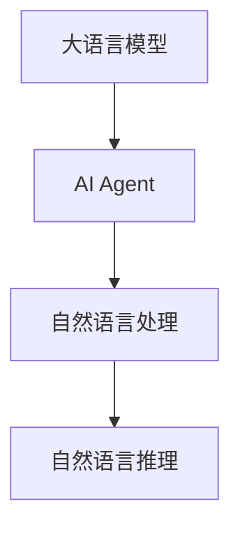
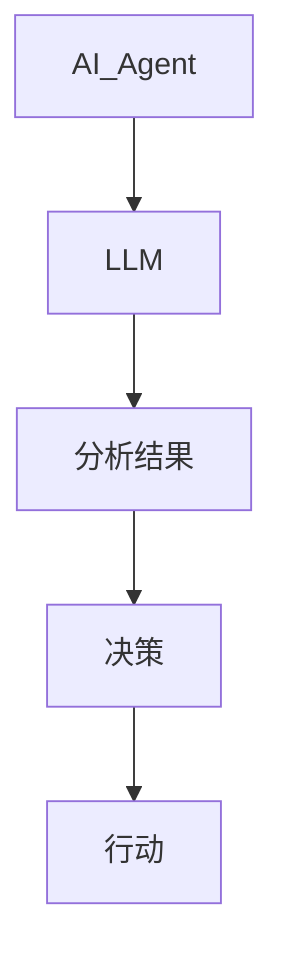
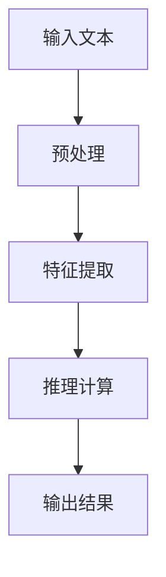
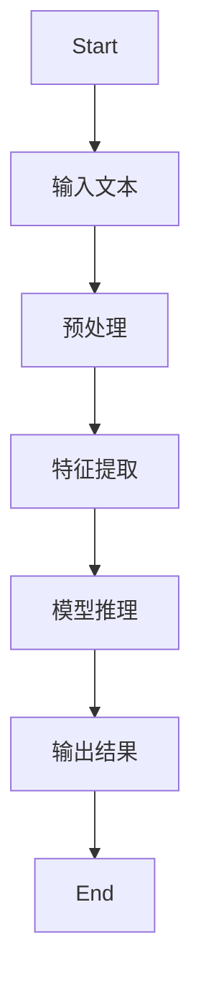
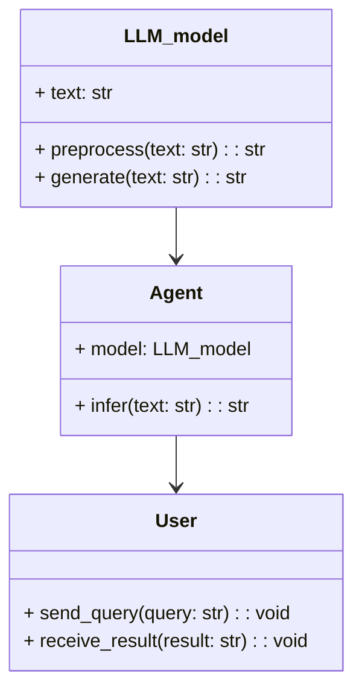
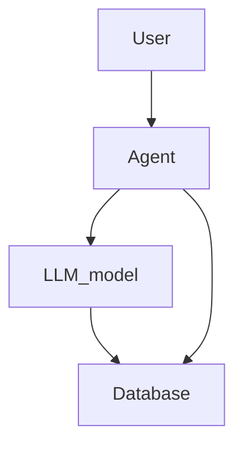
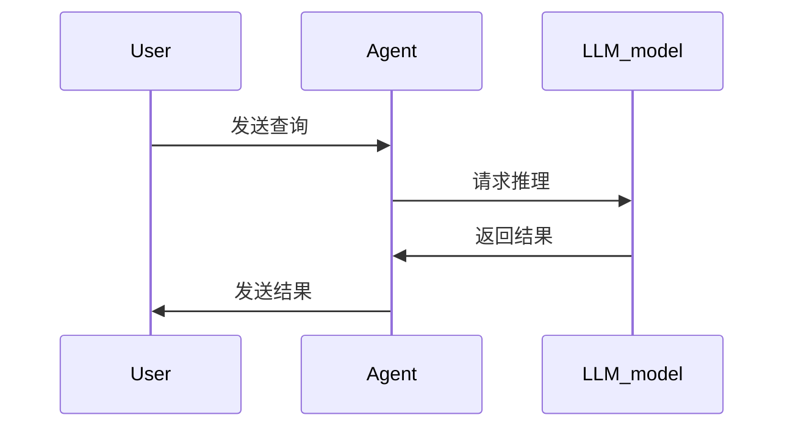

                 


# 构建LLM支持的AI Agent自然语言推理

> 关键词：LLM、AI Agent、自然语言推理、大语言模型、人工智能

> 摘要：本文详细探讨了如何构建支持大语言模型的AI Agent，重点分析了自然语言推理的核心算法、系统架构和实际应用。通过理论与实践相结合的方式，帮助读者深入理解并掌握相关技术。

---

# 第一部分: 背景介绍与核心概念

## 第1章: 问题背景与核心概念

### 1.1 问题背景

#### 1.1.1 自然语言处理的发展历程
自然语言处理（NLP）是人工智能领域的重要分支，经历了从规则驱动到数据驱动的转变。近年来，随着深度学习的兴起，大语言模型（LLM）如GPT-3、GPT-4等的出现，为自然语言处理带来了革命性的变化。

#### 1.1.2 大语言模型（LLM）的崛起
大语言模型通过海量数据训练，具备了强大的文本生成和理解能力。LLM的核心优势在于其预训练能力，能够在各种任务中进行微调，适应不同的应用场景。

#### 1.1.3 AI Agent的概念与作用
AI Agent（智能代理）是指能够感知环境并采取行动以实现目标的智能体。AI Agent可以通过与用户的自然语言交互，理解需求并执行任务，从而提高用户体验。

### 1.2 问题描述

#### 1.2.1 自然语言推理的核心问题
自然语言推理是指从一段文本中推断出隐含的信息或结论。例如，给定“如果下雨，我会带伞”，推理“今天下雨，所以我带了伞”。

#### 1.2.2 LLM支持的AI Agent的必要性
AI Agent需要具备理解用户意图和环境信息的能力，而LLM提供了强大的文本理解和生成能力，使其能够更好地完成任务。

#### 1.2.3 当前技术的局限性与挑战
尽管LLM在文本处理方面表现出色，但在复杂推理和上下文理解方面仍存在局限性。AI Agent需要结合其他技术（如知识图谱）来弥补这些不足。

### 1.3 问题解决与边界

#### 1.3.1 LLM支持的AI Agent解决方案
通过将LLM集成到AI Agent中，使其能够进行自然语言推理和生成，从而实现更智能的交互和任务执行。

#### 1.3.2 解决方案的边界与适用场景
LLM支持的AI Agent适用于需要自然语言交互的任务，如客服、智能助手等。但在需要实时推理和复杂决策的任务中，仍需结合其他技术。

#### 1.3.3 解决方案的外延与扩展性
通过与其他技术（如知识图谱、规则引擎）的结合，可以进一步提升AI Agent的能力。

### 1.4 核心概念与结构

#### 1.4.1 LLM支持的AI Agent组成要素
- LLM模型：负责文本理解和生成。
- 推理引擎：负责逻辑推理和决策。
- 交互接口：负责与用户进行自然语言交互。

#### 1.4.2 自然语言推理的逻辑结构
- 输入：一段文本或上下文。
- 处理：通过推理引擎进行逻辑推理。
- 输出：推断出的结论或下一步行动。

#### 1.4.3 核心概念之间的关系
通过Mermaid图展示LLM、AI Agent和自然语言推理之间的关系。



---

## 第2章: 核心概念与联系

### 2.1 LLM与AI Agent的关系

#### 2.1.1 LLM作为AI Agent的核心模块
LLM为AI Agent提供文本理解和生成能力，使其能够与用户进行自然语言交互。

#### 2.1.2 AI Agent如何利用LLM进行推理
AI Agent通过调用LLM进行文本分析，提取有用信息并进行推理，从而做出决策。

#### 2.1.3 LLM与AI Agent的协同工作原理
通过Mermaid图展示LLM与AI Agent的协同工作流程。



### 2.2 核心概念的原理分析

#### 2.2.1 LLM的工作原理简述
LLM通过预训练和微调，能够理解和生成人类语言。其核心是基于Transformer的架构，通过自注意力机制捕捉文本中的语义信息。

#### 2.2.2 自然语言推理的算法流程
自然语言推理的算法流程包括文本预处理、特征提取、推理计算和结果输出。通过Mermaid图展示流程。



### 2.3 核心概念的对比分析

#### 2.3.1 核心概念属性特征对比表格
下表展示了LLM和AI Agent在核心概念上的对比。

| 属性 | LLM | AI Agent |
|------|------|----------|
| 核心能力 | 文本理解和生成 | 多任务执行和决策 |
| 输入 | 文本数据 | 多模态数据 |
| 输出 | 文本结果 | 动作或决策 |

---

# 第三部分: 算法原理讲解

## 第3章: 算法原理与实现

### 3.1 自然语言推理的算法流程

#### 3.1.1 算法流程图
通过Mermaid图展示自然语言推理的算法流程。



### 3.2 算法实现

#### 3.2.1 Python代码实现
以下代码实现了一个简单的自然语言推理模型。

```python
def preprocess(text):
    # 文本预处理函数
    return text.lower()

def feature_extract(text):
    # 特征提取函数
    return text.split()

def model_reasoning(features):
    # 模型推理函数
    return " ".join(features)

def main():
    text = "如果下雨，我会带伞。今天下雨了。"
    preprocessed = preprocess(text)
    features = feature_extract(preprocessed)
    result = model_reasoning(features)
    print(result)

if __name__ == "__main__":
    main()
```

### 3.3 数学模型与公式

#### 3.3.1 条件概率公式
条件概率公式用于计算在给定条件下某事件发生的概率。

$$P(A|B) = \frac{P(A \cap B)}{P(B)}$$

---

# 第四部分: 系统分析与架构设计

## 第4章: 系统架构设计

### 4.1 项目背景

#### 4.1.1 项目背景介绍
本项目旨在构建一个支持LLM的AI Agent，用于自然语言推理任务。

### 4.2 系统功能设计

#### 4.2.1 领域模型
通过Mermaid类图展示系统的主要类和它们之间的关系。



### 4.3 系统架构设计

#### 4.3.1 系统架构图
通过Mermaid图展示系统的整体架构。



### 4.4 接口与交互设计

#### 4.4.1 接口设计
系统主要接口包括用户输入接口、模型调用接口和结果输出接口。

#### 4.4.2 交互流程
通过Mermaid序列图展示用户与系统之间的交互流程。



---

# 第五部分: 项目实战

## 第5章: 项目实战与案例分析

### 5.1 环境安装与配置

#### 5.1.1 安装依赖
安装必要的Python库，如`transformers`和`mermaid`。

```bash
pip install transformers mermaid
```

### 5.2 核心实现

#### 5.2.1 加载模型
使用`transformers`库加载预训练的LLM模型。

```python
from transformers import AutoTokenizer, AutoModelForCausalLM

tokenizer = AutoTokenizer.from_pretrained("gpt2")
model = AutoModelForCausalLM.from_pretrained("gpt2")
```

#### 5.2.2 数据预处理
对输入文本进行预处理。

```python
def preprocess(text):
    return text.lower()
```

#### 5.2.3 模型推理
使用模型进行推理并生成结果。

```python
def model_reasoning(model, tokenizer, text):
    inputs = tokenizer.encode(text, return_tensors="pt")
    outputs = model.generate(inputs, max_length=50)
    return tokenizer.decode(outputs[0], skip_special_tokens=True)
```

### 5.3 项目实战案例分析

#### 5.3.1 案例一：简单推理
输入文本：“如果下雨，我会带伞。今天下雨了。” 推理结果：“我会带伞。”

#### 5.3.2 案例二：复杂推理
输入文本：“如果A和B都大于C，那么A大于C且B大于C。已知A=5，B=6，C=3。” 推理结果：“A大于C，B大于C。”

### 5.4 项目总结

#### 5.4.1 代码实现总结
通过代码实现展示了如何将LLM集成到AI Agent中，实现自然语言推理。

#### 5.4.2 案例分析总结
通过实际案例分析，验证了系统的推理能力，并展示了其在实际应用中的潜力。

---

# 第六部分: 总结与展望

## 第6章: 总结与展望

### 6.1 总结

#### 6.1.1 核心内容回顾
本文详细探讨了如何构建支持LLM的AI Agent，重点分析了自然语言推理的核心算法、系统架构和实际应用。

### 6.2 未来展望

#### 6.2.1 当前技术的局限性
尽管LLM在文本处理方面表现出色，但在复杂推理和上下文理解方面仍存在局限性。

#### 6.2.2 未来发展方向
未来的研究方向包括改进推理算法、结合多模态数据和增强实时推理能力。

### 6.3 最佳实践

#### 6.3.1 数据质量的重要性
数据质量直接影响模型的推理能力，需要确保数据的多样性和相关性。

#### 6.3.2 模型调优的注意事项
在模型调优过程中，需要关注模型的可解释性和泛化能力。

#### 6.3.3 持续学习资源推荐
建议读者持续关注NLP领域的最新研究，学习先进的算法和技术。

---

# 作者信息

作者：AI天才研究院/AI Genius Institute & 禅与计算机程序设计艺术 /Zen And The Art of Computer Programming

