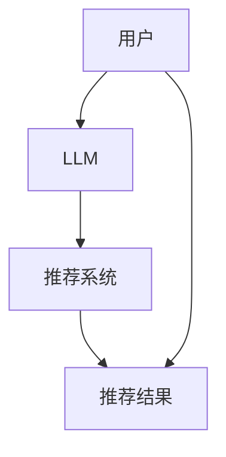

                 


# 构建LLM驱动的AI Agent可解释推荐系统

> 关键词：大语言模型，AI Agent，可解释推荐系统，推荐算法，LLM应用

> 摘要：本文详细探讨了如何利用大语言模型（LLM）构建可解释的AI Agent推荐系统。通过分析推荐系统的核心问题，介绍LLM在推荐系统中的应用潜力，并结合实际案例，展示如何通过系统架构设计和算法实现，构建一个高效、透明且可解释的推荐系统。

---

## 第一部分：背景介绍

### 第1章：问题背景与描述

#### 1.1 问题背景
- **1.1.1 当前推荐系统的发展现状**  
  推荐系统在电子商务、社交媒体和流媒体等领域发挥着重要作用。然而，现有推荐系统存在可解释性差、黑箱化操作等问题，导致用户信任度不足。

- **1.1.2 LLM在推荐系统中的应用潜力**  
  大语言模型（LLM）具有强大的自然语言处理能力，能够理解用户需求并生成个性化推荐，为推荐系统带来了新的可能性。

- **1.1.3 可解释性推荐系统的重要性**  
  可解释性推荐系统能够帮助用户理解推荐的原因，增强用户信任，同时也有助于调试和优化推荐算法。

#### 1.2 问题描述
- **1.2.1 LLM驱动的AI Agent推荐系统的核心问题**  
  如何利用LLM生成个性化推荐，并确保推荐过程的可解释性。

- **1.2.2 现有推荐系统的局限性**  
  现有推荐系统通常基于协同过滤或基于内容的推荐，但难以兼顾多样性和可解释性。

- **1.2.3 可解**  
  通过结合LLM和AI Agent，构建一个既能提供个性化推荐，又能解释推荐理由的系统。

---

## 第二部分：核心概念与联系

### 第2章：核心概念与联系

#### 2.1 核心概念原理
- **2.1.1 LLM的核心原理**  
  LLM通过大规模预训练，能够理解和生成自然语言文本，具备语义理解能力。

- **2.1.2 AI Agent的基本概念**  
  AI Agent是一种智能体，能够感知环境、执行任务并做出决策。

#### 2.2 概念属性特征对比
| 概念       | 属性特征                       |
|------------|----------------------------|
| LLM        | 大规模预训练，自然语言理解能力强 |
| AI Agent   | 具备感知和执行能力，能够与用户交互 |

#### 2.3 实体关系图


---

## 第三部分：算法原理

### 第3章：推荐算法原理

#### 3.1 协同过滤算法
- **3.1.1 基于用户的协同过滤**  
  基于用户相似性进行推荐，如余弦相似度。

- **3.1.2 基于物品的协同过滤**  
  基于物品相似性进行推荐，如基于商品的协同过滤。

#### 3.2 生成式推荐算法
- **3.2.1 使用LLM生成推荐理由**  
  通过LLM生成个性化推荐理由，增强推荐的可解释性。

- **3.2.2 LLM驱动的推荐流程**  
  ```mermaid
  graph TD
      A[用户输入] --> B[LLM]
      B --> C[推荐结果]
      C --> D[推荐理由]
      D --> E[用户]
  ```

#### 3.3 算法实现代码
```python
import numpy as np

def cosine_similarity(user_vector, item_vector):
    return np.dot(user_vector, item_vector) / (np.linalg.norm(user_vector) * np.linalg.norm(item_vector))

# 示例数据
user_vector = np.array([1, 2, 3])
item_vector = np.array([4, 5, 6])

similarity = cosine_similarity(user_vector, item_vector)
print(similarity)
```

---

## 第四部分：数学模型与公式

### 第4章：数学模型与公式

#### 4.1 矩阵分解模型
- **交替最小二乘法**  
  使用矩阵分解模型进行推荐，公式如下：
  $$\min_{u_i, v_j} \sum_{i,j} (r_{ij} - u_i^T v_j)^2$$

#### 4.2 LLM的损失函数
- **LLM的损失函数**  
  使用交叉熵损失函数：
  $$\text{Loss} = -\sum_{i=1}^{n} y_i \log p(y_i)$$

---

## 第五部分：系统分析与架构设计

### 第5章：系统分析与架构设计

#### 5.1 系统场景介绍
- **用户与系统交互**  
  用户输入需求，系统生成推荐并解释推荐理由。

#### 5.2 系统功能设计
- **领域模型设计**  
  ```mermaid
  classDiagram
      class 用户 {
          用户ID
          偏好
      }
      class LLM {
          接收输入
          生成输出
      }
      用户 --> LLM
      LLM --> 推荐系统
  ```

#### 5.3 系统架构图


---

## 第六部分：项目实战

### 第6章：项目实战

#### 6.1 环境安装
```bash
pip install numpy
pip install tensorflow
pip install keras
```

#### 6.2 核心代码实现
```python
def generate_recommendation(user_input):
    # 使用LLM生成推荐理由
    recommendation = LLM.generate(user_input)
    return recommendation

# 示例
user_input = "推荐一些科幻小说"
recommendation = generate_recommendation(user_input)
print(recommendation)
```

#### 6.3 实际案例分析
- **案例1**：用户输入“推荐一些科幻小说”，系统生成推荐列表并解释推荐理由。

---

## 第七部分：总结与展望

### 第7章：总结与展望

#### 7.1 最佳实践
- **数据质量的重要性**  
  数据质量和多样性直接影响推荐效果。

- **模型解释性的重要性**  
  通过可视化和解释技术增强模型的可解释性。

#### 7.2 小结
本文详细探讨了构建LLM驱动的AI Agent可解释推荐系统的核心问题，介绍了系统的实现方法和实际案例，为后续研究提供了参考。

#### 7.3 注意事项
- 确保数据安全和用户隐私。
- 定期更新模型以适应用户需求的变化。

#### 7.4 拓展阅读
- 《Deep Learning》
- 《Natural Language Processing with PyTorch》

---

作者：AI天才研究院 & 禅与计算机程序设计艺术

