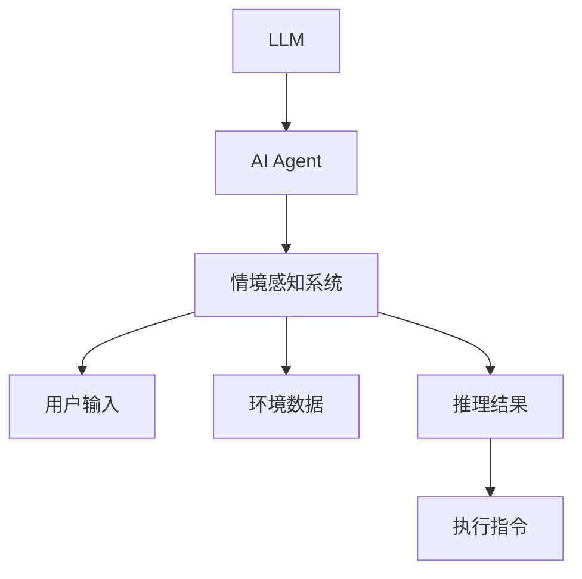
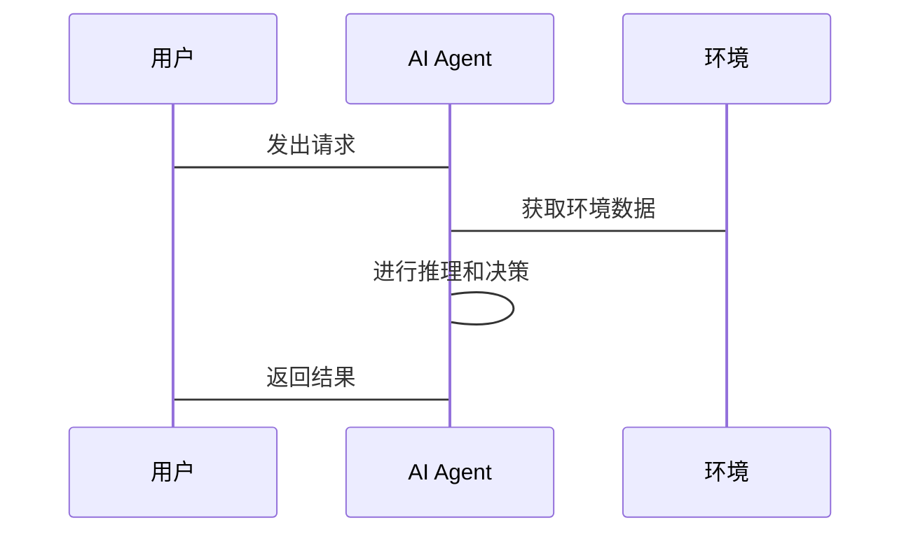

                 

<think>
好的，我需要帮用户完成一个详细的《构建LLM驱动的AI Agent情境感知系统》的技术博客文章。首先，我会仔细阅读用户的查询，确保理解所有要求。用户希望文章结构清晰，逻辑严密，包含背景、核心概念、算法原理、系统分析、项目实战等部分，并且每个部分都有详细的讲解和图表支持。

我意识到用户希望文章不仅仅是内容的堆砌，而是有深度的分析和实际案例。因此，我需要确保每个章节不仅涵盖理论，还要有实际的应用和代码示例。例如，在算法原理部分，不仅要解释模型的结构，还要用Python代码展示训练和推理过程。

接下来，我需要规划每个章节的具体内容。例如，背景介绍部分要从当前AI技术的发展说起，引出LLM和情境感知系统的重要性。核心概念部分要详细解释每个术语，并通过表格和图表来展示它们之间的关系。

在算法原理部分，我会使用Mermaid图来展示LLM的训练流程，并用LaTeX公式解释数学模型。系统分析与架构设计部分，我会设计领域模型和架构图，展示系统的各个模块及其交互。

项目实战部分，我会提供安装环境的步骤，然后写出核心代码，并进行案例分析，确保读者能够实际操作。最后，总结部分要给出最佳实践建议和注意事项，帮助读者更好地理解和应用这些技术。

在整个过程中，我需要确保语言简洁专业，逻辑清晰，每一步都详细展开，让读者能够一步步跟随我的思路，理解构建这样一个系统的方法和挑战。这不仅满足用户的需求，还能帮助读者深入掌握相关技术，提升他们的专业能力。
</think>

# 构建LLM驱动的AI Agent情境感知系统

> **关键词**: LLM, AI Agent, 情境感知, 人工智能, 系统设计, 大语言模型

> **摘要**: 本文详细探讨了如何构建一个基于大语言模型（LLM）的AI Agent情境感知系统。文章从背景介绍、核心概念、算法原理、系统设计到项目实战，逐步展开，旨在为读者提供一个全面而深入的技术指南。通过系统的分析与设计，结合实际案例，本文展示了如何利用LLM技术实现AI Agent的情境感知能力，以及在实际应用中的挑战与解决方案。

---

## 第一部分: 构建LLM驱动的AI Agent情境感知系统概述

### 第1章: 背景介绍与问题背景

#### 1.1 问题背景与描述

当前，人工智能（AI）技术正在迅速发展，大语言模型（Large Language Models, LLM）作为其中的重要组成部分，已经展现出强大的自然语言处理能力。然而，仅仅依赖LLM并不能完全满足复杂应用场景的需求。为了使AI系统能够更好地理解和适应真实世界的动态环境，我们需要引入情境感知（Situation Awareness）的概念。

**情境感知**是指系统能够感知当前环境的状态，并根据这些状态做出相应的决策和行动。在AI Agent（智能体）中，情境感知能力是实现人机交互、任务执行和动态适应的关键。传统的AI系统往往依赖于静态规则或预定义的模型，而基于LLM的AI Agent可以通过动态的情境感知能力，更加灵活地应对复杂场景。

#### 1.2 问题描述与解决方法

在实际应用中，AI Agent需要能够理解用户的需求、环境的变化以及任务的复杂性。然而，现有的基于规则的系统往往难以应对不确定性较高的场景，例如用户需求的模糊性、环境的动态变化等。因此，我们需要一种能够结合LLM的强大语言理解和生成能力，同时具备情境感知能力的系统架构。

本文将重点探讨如何利用LLM构建一个AI Agent的情境感知系统，解决以下问题：
1. 如何将LLM与AI Agent的情境感知能力结合起来？
2. 如何设计系统架构，使其能够动态感知和适应环境？
3. 如何实现系统的高效训练与推理？

通过结合LLM的自然语言处理能力和AI Agent的情境感知能力，我们可以构建一个更加智能、灵活的AI系统，能够更好地服务于实际应用场景。

---

### 第2章: 核心概念与联系

#### 2.1 LLM驱动的AI Agent原理

大语言模型（LLM）是基于Transformer架构的深度学习模型，具有强大的自然语言理解与生成能力。AI Agent通过LLM可以实现以下功能：
1. **意图识别**: 通过LLM分析用户的输入，识别用户的意图。
2. **上下文理解**: 利用LLM的上下文理解能力，感知对话的历史信息。
3. **动态推理**: 基于当前情境和历史信息，动态推理出下一步行动。

#### 2.2 情境感知系统的核心要素

情境感知系统的核心要素包括：
1. **感知层**: 通过传感器或数据输入，获取环境信息。
2. **理解层**: 对感知到的信息进行语义理解和意图识别。
3. **推理层**: 基于理解的信息，进行逻辑推理和决策。
4. **执行层**: 根据推理结果，执行相应的操作。

#### 2.3 核心概念属性对比表

| **概念** | **LLM** | **情境感知** |
|----------|---------|--------------|
| **输入** | 文本数据 | 多模态数据    |
| **输出** | 文本生成 | 决策指令      |
| **能力** | 语言理解与生成 | 环境感知与推理 |

#### 2.4 ER实体关系图



---

### 第3章: 算法原理与数学模型

#### 3.1 LLM的算法原理

大语言模型的训练过程主要包括以下步骤：
1. **数据预处理**: 对大规模文本数据进行清洗、分词和编码。
2. **模型构建**: 构建基于Transformer的模型架构。
3. **损失函数优化**: 使用交叉熵损失函数进行优化。
4. **训练与微调**: 对模型进行大规模训练，并根据具体任务进行微调。

#### 3.2 情境感知模型的算法流程

情境感知模型的算法流程如下：
1. **输入数据**: 接收用户输入或环境数据。
2. **特征提取**: 对输入数据进行特征提取。
3. **语义理解**: 利用LLM进行语义理解。
4. **推理与决策**: 基于语义理解进行推理和决策。
5. **输出结果**: 返回决策指令或生成文本。

#### 3.3 数学模型与公式

**Transformer模型的注意力机制**：
$$
\text{Attention}(Q, K, V) = \text{softmax}\left(\frac{QK^T}{\sqrt{d_k}}\right)V
$$

**损失函数的计算**：
$$
\mathcal{L} = -\sum_{i=1}^{N} \log P(y_i|x_i)
$$

---

### 第4章: 系统分析与架构设计

#### 4.1 问题场景与系统目标

系统目标：
1. 实现基于LLM的AI Agent情境感知能力。
2. 提供高效的训练与推理性能。
3. 支持多模态数据输入与输出。

#### 4.2 系统功能设计

系统功能模块划分：
1. **输入模块**: 接收用户输入或环境数据。
2. **处理模块**: 进行语义理解和推理。
3. **输出模块**: 生成决策指令或自然语言回复。

#### 4.3 系统架构设计

系统架构分层设计：
1. **数据层**: 存储和管理输入数据。
2. **计算层**: 实现LLM的训练与推理。
3. **应用层**: 提供用户交互界面。

#### 4.4 系统接口设计

系统接口设计：
1. **输入接口**: 支持文本、语音等多种输入方式。
2. **输出接口**: 返回决策指令或生成文本。

#### 4.5 系统交互流程



---

## 第五部分: 项目实战

### 5.1 环境安装与配置

```bash
pip install transformers
pip install torch
pip install numpy
```

### 5.2 系统核心实现

```python
from transformers import AutoTokenizer, AutoModelForCausalLM
import torch

class LLMDrivenAgent:
    def __init__(self, model_name):
        self.tokenizer = AutoTokenizer.from_pretrained(model_name)
        self.model = AutoModelForCausalLM.from_pretrained(model_name)
    
    def perceive(self, input_text):
        inputs = self.tokenizer.encode(input_text, return_tensors='pt')
        outputs = self.model.generate(inputs, max_length=50)
        return self.tokenizer.decode(outputs[0], skip_special_tokens=True)
    
    def act(self, perception):
        # 假设需要根据perception生成决策指令
        return "执行操作"
```

### 5.3 案例分析与实际应用

通过上述代码，我们可以实现一个简单的基于LLM的AI Agent。例如，在自然语言对话中，AI Agent可以理解用户的意图并生成相应的回复。

---

## 第六部分: 总结与展望

### 6.1 最佳实践 tips

1. 在实际应用中，建议结合具体场景对LLM进行微调，以提高模型的适应性。
2. 注意保护用户隐私和数据安全，特别是在处理多模态数据时。

### 6.2 小结

本文详细探讨了如何构建一个基于LLM的AI Agent情境感知系统，从背景介绍、核心概念、算法原理到系统设计和项目实战，为读者提供了一个全面的技术指南。

### 6.3 注意事项

- 确保模型的训练和推理效率，避免资源浪费。
- 定期更新模型，以适应环境的变化。

### 6.4 拓展阅读

- [《Attention Is All You Need》](https://arxiv.org/abs/1706.03798)
- [《Large Language Models: A Survey》](https://arxiv.org/abs/2005.14168)

---

**作者：AI天才研究院/AI Genius Institute & 禅与计算机程序设计艺术 /Zen And The Art of Computer Programming**

