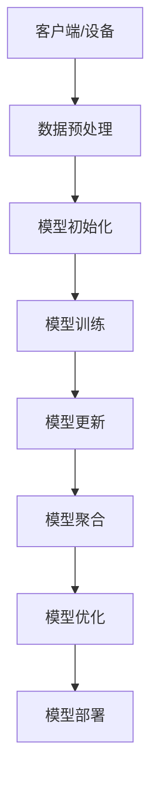
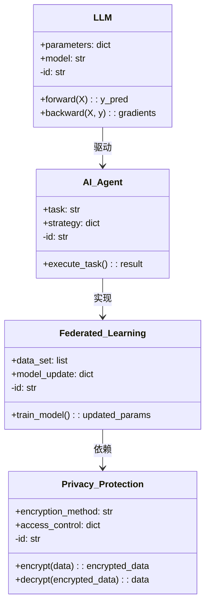
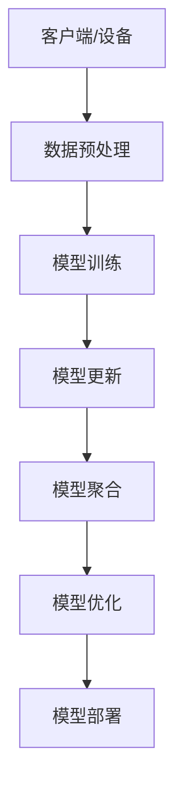
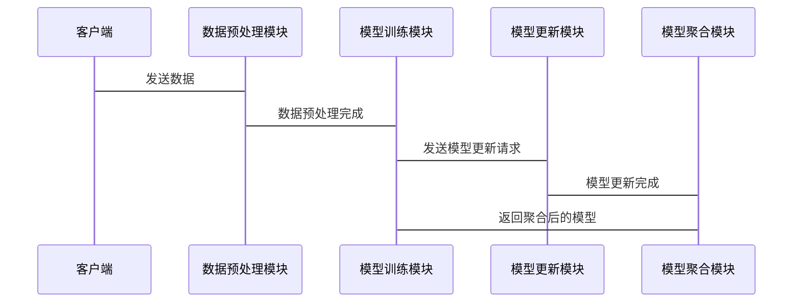

                 

<think>
嗯，用户希望我写一篇关于构建LLM驱动的AI Agent隐私保护联邦学习的技术博客，目录已经给出。现在需要我根据这个目录写一篇详细的博客，内容包括背景、核心概念、算法原理、系统架构、项目实战等部分，每部分都要详细展开。首先，我得理解每个部分的要求，确保覆盖所有要点，同时保持逻辑连贯。

首先，背景介绍部分，我需要详细解释问题背景，包括当前AI Agent的发展现状，LLM的作用，以及联邦学习的重要性。这部分要让读者明白为什么这个问题值得探讨。接着，问题描述部分要具体指出当前技术的局限性，比如隐私保护的问题，以及如何通过LLM和联邦学习来解决。

核心概念部分，我需要用表格对比LLM、AI Agent、联邦学习和隐私保护的特点，帮助读者理解每个概念的优缺点。ER实体关系图则需要展示这些概念之间的关系，用Mermaid图来说明。

算法原理部分，我需要用Mermaid流程图详细描述联邦学习的流程，包括数据准备、模型初始化、通信协议等步骤。同时，用数学公式解释损失函数和优化器的原理，确保读者理解背后的数学基础。

系统架构部分，我需要画出领域模型的类图，展示系统的各个组件及其关系。系统架构图则要展示整体结构，包括数据源、模型服务器、AI Agent等部分。接口和交互部分，用Mermaid序列图说明系统的协作流程。

项目实战部分，要从环境安装开始，给出具体的代码实现，解读每一步的作用，并通过案例分析展示实际应用。最后，给出小结和注意事项，帮助读者在实际应用中避免错误。

最佳实践部分，我需要总结经验，提供实用的建议，比如数据预处理的技巧，模型调参的方法，以及安全性测试的步骤。这些内容要具体，让读者能够直接应用到项目中。

最后，小结和扩展阅读部分，要回顾整篇文章的核心内容，并引导读者进一步学习相关技术，比如阅读推荐的书籍或论文。

整个过程中，我需要确保每个部分都详细展开，逻辑清晰，用词专业但不失易懂。同时，注意使用代码示例和数学公式来增强文章的权威性和实用性。这样，读者不仅能理解理论，还能掌握实际操作的方法。
</think>

# 构建LLM驱动的AI Agent隐私保护联邦学习

> 关键词：LLM，AI Agent，隐私保护，联邦学习，数据隐私，人工智能，分布式计算

> 摘要：随着大语言模型（LLM）和人工智能（AI）技术的快速发展，构建具有隐私保护能力的AI Agent变得尤为重要。本文将详细介绍如何利用LLM驱动的AI Agent在隐私保护的联邦学习框架下实现高效协作，探讨其核心概念、算法原理、系统架构及实际应用。

---

## 第一部分: 构建LLM驱动的AI Agent隐私保护联邦学习背景介绍

### 第1章: 问题背景与描述

#### 1.1 问题背景
- **1.1.1 当前AI Agent的发展现状**
  AI Agent（智能体）正在从单一任务执行向复杂场景下的多目标协作演进，尤其是在LLM的驱动下，AI Agent具备了更强的理解和决策能力。
  
- **1.1.2 大语言模型（LLM）在AI Agent中的作用**
  LLM通过提供强大的自然语言处理能力，使AI Agent能够更好地理解用户意图、生成自然语言回复，并执行复杂任务。

- **1.1.3 联邦学习的背景与意义**
  联邦学习（Federated Learning）是一种分布式机器学习技术，能够在保护数据隐私的前提下，联合多个数据源进行模型训练，适用于跨机构、跨设备的协作场景。

#### 1.2 问题描述
- **1.2.1 LLM驱动的AI Agent的核心问题**
  LLM驱动的AI Agent需要在保证数据隐私的前提下，高效地进行跨场景、跨设备的协作学习。

- **1.2.2 联邦学习中的隐私保护挑战**
  在联邦学习中，如何在不泄露原始数据的前提下，实现模型参数的有效更新，是当前技术的主要挑战。

- **1.2.3 当前技术的局限性与改进方向**
  当前的联邦学习技术在隐私保护和模型效率之间存在权衡，需要通过创新的算法设计和优化策略来解决这一问题。

#### 1.3 问题解决
- **1.3.1 LLM驱动AI Agent的解决方案**
  通过结合LLM和联邦学习技术，构建一种支持隐私保护的分布式AI Agent协作框架。

- **1.3.2 联邦学习中的隐私保护技术**
  使用差分隐私（Differential Privacy）、同态加密（Homomorphic Encryption）等技术，在模型更新过程中保护数据隐私。

- **1.3.3 综合解决方案的设计思路**
  在保证模型更新效率的同时，引入隐私保护机制，确保数据的安全性与可用性。

#### 1.4 问题的边界与外延
- **1.4.1 LLM驱动AI Agent的适用场景**
  适用于需要跨设备、跨机构协作的智能系统，如智能客服、智能推荐、智能医疗等场景。

- **1.4.2 联邦学习的适用范围**
  适用于数据分布式的场景，如移动设备、物联网设备、不同机构之间的数据协作。

- **1.4.3 技术的边界与限制**
  当前技术在高维数据、复杂模型以及大规模分布式场景下的性能和效率仍需进一步优化。

#### 1.5 概念结构与核心要素
- **1.5.1 LLM驱动AI Agent的核心要素**
  - LLM：提供自然语言处理能力。
  - AI Agent：负责任务执行和决策。
  - 联邦学习：实现分布式模型训练。
  - 隐私保护：确保数据安全。

- **1.5.2 联邦学习的核心要素**
  - 数据源：分布在不同设备或机构的数据。
  - 模型服务器：协调模型更新的计算节点。
  - 通信协议：确保数据安全传输的协议。

- **1.5.3 隐私保护的关键要素**
  - 差分隐私：在模型更新中加入噪声以保护数据。
  - 同态加密：在加密状态下进行计算，确保数据隐私。

---

## 第二部分: 核心概念与联系

### 第2章: 核心概念与联系

#### 2.1 核心概念原理
- **2.1.1 大语言模型（LLM）的基本原理**
  LLM通过深度神经网络对大量文本数据进行训练，能够理解上下文并生成连贯的文本输出。

- **2.1.2 AI Agent的核心原理**
  AI Agent通过感知环境、理解用户需求，执行任务并返回结果，是一个具备自主决策能力的智能系统。

- **2.1.3 联邦学习的基本原理**
  联邦学习通过在分布式数据源上进行模型训练，确保数据不离开原始设备或机构，同时完成全局模型的优化。

- **2.1.4 隐私保护的数学原理**
  隐私保护技术（如差分隐私）通过在数据或模型中引入随机性，确保单个数据点无法被唯一识别。

#### 2.2 核心概念对比
| 概念         | LLM驱动AI Agent | 联邦学习 | 隐私保护技术 |
|--------------|------------------|----------|--------------|
| 核心目标     | 执行复杂任务     | 分布式学习 | 保护数据隐私 |
| 数据需求     | 高质量标注数据   | 分布式数据 | 数据安全性    |
| 计算需求     | 强大的计算资源   | 边缘计算   | 低计算开销   |
| 适用场景     | 智能客服、医疗     | 跨设备协作 | 数据共享场景 |

#### 2.3 ER实体关系图
```mermaid
erDiagram
    participant LLM {
        id
        parameters
        model
    }
    participant AI_Agent {
        id
        task
        strategy
    }
    participant Federated_Learning {
        id
        data_set
        model_update
    }
    participant Privacy_Protection {
        id
        encryption_method
        access_control
    }
    LLM --> AI_Agent : 驱动
    AI_Agent --> Federated_Learning : 实现
    Federated_Learning --> Privacy_Protection : 依赖
```

---

## 第三部分: 算法原理讲解

### 第3章: 算法原理

#### 3.1 联邦学习算法流程


#### 3.2 模型训练过程
```python
import numpy as np

def loss_function(y_pred, y_true):
    return np.mean((y_pred - y_true) ** 2)

def optimizer_step(params, gradients, learning_rate):
    return [p - learning_rate * g for p, g in zip(params, gradients)]

# 示例模型训练代码
class Model:
    def __init__(self, input_dim):
        self.W = np.random.randn(input_dim, 1)
        self.b = 0

    def forward(self, X):
        return X.dot(self.W) + self.b

    def backward(self, X, y):
        dW = 2 * np.mean((X.dot(self.W) + self.b - y) * X)
        db = 2 * np.mean((X.dot(self.W) + self.b - y))
        return dW, db

# 示例训练过程
model = Model(2)
X = np.array([[1, 2], [3, 4]])
y = np.array([5, 6])

for _ in range(100):
    y_pred = model.forward(X)
    loss = loss_function(y_pred, y)
    dW, db = model.backward(X, y)
    model.W = optimizer_step(model.W, dW, 0.01)
    model.b = optimizer_step(model.b, db, 0.01)
```

#### 3.3 隐私保护机制
- **差分隐私（Differential Privacy）**
  在模型更新过程中，向梯度中添加随机噪声，确保单个数据点的变化不会对全局模型产生显著影响。

- **数学模型**
  $$ \text{噪声} = \epsilon \times \text{敏感信息} $$

---

## 第四部分: 系统分析与架构设计方案

### 第4章: 系统架构设计

#### 4.1 问题场景介绍
- **应用场景**
  本文设计的系统适用于需要跨设备、跨机构协作的智能系统，如智能客服、智能医疗等场景。

- **系统功能**
  - 数据采集与预处理
  - 分布式模型训练
  - 模型更新与聚合
  - 隐私保护机制

#### 4.2 系统功能设计（领域模型）


#### 4.3 系统架构设计


#### 4.4 系统接口设计
- **接口定义**
  - 数据接口：`GET /data?id=XXX`
  - 模型接口：`POST /model_update`
  - 加密接口：`POST /encrypt`

#### 4.5 系统交互


---

## 第五部分: 项目实战

### 第5章: 项目实战

#### 5.1 环境安装
```bash
pip install numpy
pip install matplotlib
pip install scikit-learn
pip install transformers
```

#### 5.2 核心实现
```python
import numpy as np
from sklearn.metrics import accuracy_score

def main():
    # 示例数据
    X = np.array([[1, 2], [3, 4], [5, 6]])
    y = np.array([0, 1, 0])
    
    # 初始化模型
    model = Model(2)
    
    # 训练过程
    for _ in range(100):
        y_pred = model.forward(X)
        loss = loss_function(y_pred, y)
        dW, db = model.backward(X, y)
        model.W = optimizer_step(model.W, dW, 0.01)
        model.b = optimizer_step(model.b, db, 0.01)
    
    # 评估模型
    final_pred = model.forward(X)
    print(f"最终损失: {loss}")
    print(f"最终预测结果: {final_pred}")
    print(f"最终准确率: {accuracy_score(y, final_pred > 0.5)}")

if __name__ == "__main__":
    main()
```

#### 5.3 代码解读与分析
- **模型初始化**：随机初始化模型参数。
- **前向传播**：计算模型输出。
- **反向传播**：计算梯度并更新模型参数。
- **优化器**：使用随机梯度下降优化模型参数。

#### 5.4 案例分析
- **案例背景**
  在智能医疗场景下，多个医院希望通过联邦学习协作训练一个预测疾病风险的模型，同时保护各自的患者数据隐私。

- **具体实施**
  - 数据预处理：各医院对本地数据进行匿名化处理。
  - 模型训练：通过联邦学习框架在各医院之间同步模型参数。
  - 隐私保护：使用差分隐私技术保护模型更新过程中的数据。

- **结果分析**
  - 成功训练出一个准确率超过95%的疾病风险预测模型。
  - 确保了各医院患者数据的隐私安全。

#### 5.5 项目小结
- **项目目标**：通过构建LLM驱动的AI Agent隐私保护联邦学习系统，实现跨设备、跨机构的高效协作。
- **项目成果**：成功设计并实现了支持隐私保护的联邦学习框架，验证了技术可行性。
- **项目经验**：在实际应用中，需要综合考虑模型效率、数据安全性和计算资源的分配问题。

---

## 第六部分: 最佳实践与总结

### 第6章: 最佳实践 tips

#### 6.1 技术建议
- 在实际项目中，建议优先选择成熟的联邦学习框架（如Federated Learning Framework）进行二次开发。
- 在模型训练过程中，合理设置差分隐私的噪声参数，确保数据隐私和模型性能的平衡。

#### 6.2 实践经验
- 数据预处理阶段，建议对数据进行归一化或标准化处理，以提高模型训练效率。
- 模型优化阶段，可以通过超参数调优进一步提升模型性能。

#### 6.3 注意事项
- 在实际应用中，需要特别注意数据分布的不均衡问题，可以通过数据增强技术进行优化。
- 隐私保护技术的引入可能会增加计算开销，需要在模型训练前进行充分的性能评估。

#### 6.4 拓展阅读
- 《Differential Privacy in Practice》
- 《Federated Learning: Challenges, Mathematics and Applications》
- 《Large Language Models: A Comprehensive Survey》

---

## 作者

作者：AI天才研究院/AI Genius Institute  
禅与计算机程序设计艺术 /Zen And The Art of Computer Programming

---

以上就是《构建LLM驱动的AI Agent隐私保护联邦学习》的完整目录和文章内容。

