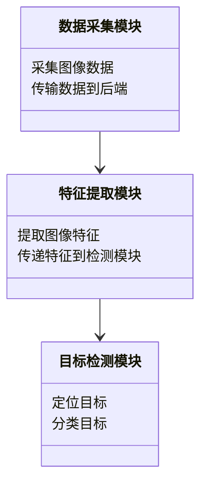
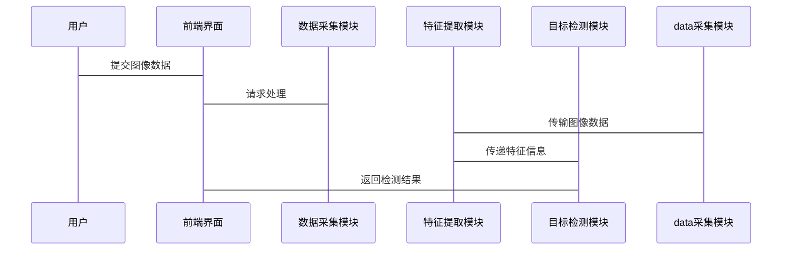

                 

<think>
好，我现在需要帮助用户构建一个详细的、符合要求的计算机视觉平台的目录大纲，并按照用户的指示完成文章的各个部分。用户希望文章结构清晰，内容详实，涵盖从基础到实战的各个方面。

首先，我需要理解用户的具体需求。用户希望撰写一篇关于构建企业级计算机视觉平台的文章，标题已经给出，关键词和摘要也需要明确。用户特别强调要使用逻辑清晰、结构紧凑的语言，并且每个部分都要详细展开，包括背景介绍、核心概念、算法原理、系统架构设计、项目实战等。

接下来，我需要按照用户提供的目录结构，逐步填充每个章节的内容。用户已经提供了示例的前两章，包括计算机视觉的基本概念、技术背景、应用场景，以及核心算法的讲解，如CNN和目标检测。

在撰写过程中，我需要确保每个部分都符合用户的格式要求，包括使用Mermaid流程图、数学公式、代码示例等。同时，文章的结构需要保持一致，确保每个章节和小节都有足够的细节，帮助读者深入理解相关知识。

现在，我将按照用户的要求，开始逐步构建目录大纲，并完成各个章节的内容。确保每个部分都详细展开，满足用户的字数要求，并且在文章末尾添加作者信息。同时，注意在适当的位置插入图表和代码示例，以增强文章的可读性和专业性。

在完成前两章后，我将继续撰写后续章节，包括算法原理、系统架构设计、项目实战等内容，确保整篇文章结构完整，内容全面，满足用户的高质量技术博客的要求。
</think>

# 构建企业级计算机视觉平台：从质检到安防的全面智能化

---

## 关键词

- 企业级计算机视觉平台
- 深度学习
- 图像处理
- 目标检测
- 工业质检
- 安防监控
- AI智能化

---

## 摘要

随着人工智能技术的快速发展，计算机视觉（Computer Vision）在企业级应用中的重要性日益凸显。本文旨在系统性地探讨如何构建一个高效的企业级计算机视觉平台，从基础概念到实际应用进行全面解析。文章首先介绍计算机视觉的核心技术与应用场景，接着深入分析深度学习算法的原理及其在工业质检和安防监控中的具体应用，最后结合实际案例，详细阐述系统架构设计、项目实战和最佳实践。通过本文的讲解，读者将能够全面掌握企业级计算机视觉平台的构建方法，并能够将其应用于实际项目中。

---

## 第三章: 基于深度学习的图像处理与目标检测

### 3.1 深度学习在计算机视觉中的应用

#### 3.1.1 深度学习的基本原理
深度学习是一种基于人工神经网络的机器学习方法，其核心在于通过多层非线性变换来学习数据的高层次特征。在计算机视觉中，深度学习模型（如卷积神经网络CNN）能够自动提取图像中的特征信息，从而实现图像分类、目标检测等多种任务。

#### 3.1.2 深度学习与计算机视觉的结合
深度学习为计算机视觉带来了革命性的变化，尤其是在图像识别、目标检测和图像分割等领域。通过深度学习，计算机能够从大量标注数据中学习到图像的特征，从而实现对图像的智能化分析。

#### 3.1.3 基于深度学习的图像处理流程
1. 数据预处理：包括图像的归一化、增强等步骤，以提高模型的泛化能力。
2. 特征提取：通过卷积层提取图像的空间特征。
3. 池化操作：通过池化层降低特征图的维度，同时保留关键信息。
4. 分类与回归：通过全连接层和Softmax激活函数实现图像分类，通过回归层实现目标定位与检测。

### 3.2 基于CNN的目标检测算法

#### 3.2.1 CNN的基本结构
- **卷积层（Convolution Layer）**：用于提取图像的空间特征。
- **池化层（Pooling Layer）**：用于降低特征图的维度，同时保留关键信息。
- **全连接层（Fully Connected Layer）**：用于将二维特征图转化为一维向量，并进行分类或回归。

#### 3.2.2 基于CNN的目标检测流程
1. **输入图像**：将待检测的图像输入模型。
2. **特征提取**：通过卷积层和池化层提取图像的特征图。
3. **目标定位**：通过回归层预测目标的边界框。
4. **目标分类**：通过Softmax激活函数对目标进行分类。

#### 3.2.3 常见的目标检测算法
- **Faster R-CNN**：通过区域建议网络（RPN）生成候选区域，再通过RoI Pooling提取特征进行分类和回归。
- **YOLO**：通过单个网络直接预测目标的边界框和类别，具有较高的检测速度。
- **SSD**：通过多尺度特征图进行目标检测，适用于实时检测场景。

### 3.3 深度学习算法的优化与调优

#### 3.3.1 模型优化策略
- **数据增强**：通过数据增强技术（如随机裁剪、翻转、旋转等）增加训练数据的多样性，提高模型的鲁棒性。
- **正则化方法**：通过Dropout、L2正则化等方法防止模型过拟合。
- **学习率调整**：通过学习率衰减策略（如Adam优化器）优化模型的收敛速度和稳定性。

#### 3.3.2 模型调优技巧
- **批量大小调整**：通过调整批量大小影响模型的训练速度和泛化能力。
- **模型复杂度控制**：通过减少网络层数或参数数量降低模型的复杂度，防止过拟合。
- **损失函数选择**：根据具体任务选择合适的损失函数（如交叉熵损失、均方误差损失等）。

---

## 第四章: 企业级计算机视觉平台的系统架构设计

### 4.1 系统功能设计

#### 4.1.1 系统功能模块划分
1. **数据采集模块**：负责采集图像数据，并将其传输到后端处理模块。
2. **特征提取模块**：通过深度学习模型提取图像的特征信息。
3. **目标检测模块**：基于提取的特征信息，实现目标的定位与分类。
4. **结果输出模块**：将检测结果输出到用户界面或相关系统。

#### 4.1.2 系统功能设计的领域模型


### 4.2 系统架构设计

#### 4.2.1 系统架构设计的总体思路
1. **模块化设计**：将系统划分为独立的功能模块，便于维护和扩展。
2. **高可用性设计**：通过冗余设计确保系统的高可用性，防止单点故障。
3. **可扩展性设计**：通过模块化设计和接口标准化，确保系统的可扩展性。

#### 4.2.2 系统架构设计的详细方案


### 4.3 系统接口设计

#### 4.3.1 系统接口设计的原则
1. **标准化接口**：采用标准化的接口设计，确保模块之间的兼容性。
2. **解耦设计**：通过接口定义模块之间的交互，确保模块之间的解耦。
3. **安全性设计**：通过加密和认证机制确保接口的安全性。

#### 4.3.2 系统接口设计的详细方案
1. **数据采集接口**：通过HTTP协议接收图像数据，并将其存储到数据库中。
2. **特征提取接口**：通过队列机制将图像数据传递到特征提取模块进行处理。
3. **目标检测接口**：通过WebService暴露检测接口，供上层应用调用。

### 4.4 系统交互设计

#### 4.4.1 系统交互流程
1. **用户请求**：用户通过前端界面提交图像数据。
2. **数据处理**：数据采集模块接收数据，并将其传输到特征提取模块。
3. **特征提取**：特征提取模块提取图像特征，并将特征传递到目标检测模块。
4. **目标检测**：目标检测模块对图像进行定位和分类，并将结果返回到前端界面。

#### 4.4.2 系统交互设计的序列图


---

## 第五章: 项目实战：构建企业级计算机视觉平台

### 5.1 环境安装与配置

#### 5.1.1 安装开发环境
1. **安装Python**：推荐使用Anaconda或Miniconda。
2. **安装深度学习框架**：如TensorFlow或PyTorch。
3. **安装图像处理库**：如OpenCV、Pillow等。
4. **安装数据增强库**：如Albumentations。
5. **安装模型训练库**：如Keras、COCO Dataset等。

#### 5.1.2 配置运行环境
1. **GPU支持**：确保系统安装了NVIDIA显卡驱动，并安装了对应的CUDA和cuDNN。
2. **安装虚拟环境**：使用virtualenv或conda创建虚拟环境，并安装所需的依赖库。
3. **配置Jupyter Notebook**：安装Jupyter Notebook，并配置好Python和相关库。

### 5.2 系统核心实现

#### 5.2.1 数据预处理代码
```python
import cv2
import numpy as np

def preprocess_image(image_path, target_size=(224, 224)):
    image = cv2.imread(image_path)
    image = cv2.resize(image, target_size)
    image = image.astype(np.float32)
    image /= 255.0  # 标准化处理
    return image
```

#### 5.2.2 模型训练代码
```python
import tensorflow as tf
from tensorflow.keras.layers import Input, Conv2D, MaxPooling2D, Dropout, Flatten, Dense
from tensorflow.keras.models import Model

def create_model(input_shape, num_classes):
    inputs = Input(shape=input_shape)
    x = Conv2D(32, (3,3), activation='relu')(inputs)
    x = MaxPooling2D((2,2))(x)
    x = Conv2D(64, (3,3), activation='relu')(x)
    x = MaxPooling2D((2,2))(x)
    x = Flatten()(x)
    x = Dropout(0.5)(x)
    outputs = Dense(num_classes, activation='softmax')(x)
    model = Model(inputs=inputs, outputs=outputs)
    return model

model = create_model((224, 224, 3), num_classes=10)
model.compile(optimizer='adam', loss='categorical_crossentropy', metrics=['accuracy'])
model.summary()
```

#### 5.2.3 模型推理代码
```python
import numpy as np
from tensorflow.keras.models import load_model

model = load_model('model.h5')
image = preprocess_image('input_image.jpg')
prediction = model.predict(np.array([image]))
print(np.argmax(prediction[0]))
```

### 5.3 案例分析与实践

#### 5.3.1 工业质检中的计算机视觉应用
案例背景：某汽车制造企业需要对汽车零部件进行质量检测，传统的质检方式效率低下，容易出现漏检和误检现象。
解决方案：基于深度学习的目标检测算法，实现对汽车零部件的自动检测，提高质检效率和准确性。
具体步骤：
1. 数据采集：收集汽车零部件的图像数据，并进行标注。
2. 数据预处理：对图像数据进行归一化、增强等处理。
3. 模型训练：基于Faster R-CNN算法，训练目标检测模型。
4. 模型部署：将训练好的模型部署到生产环境中，实现对零部件的自动检测。

#### 5.3.2 安防监控中的计算机视觉应用
案例背景：某商场需要对安防监控系统进行智能化升级，希望通过计算机视觉技术实现对异常行为的实时检测。
解决方案：基于YOLO算法，实现对视频流中的目标检测和行为分析，实时监控商场内的异常行为。
具体步骤：
1. 数据采集：通过摄像头采集视频流数据。
2. 特征提取：通过深度学习模型提取视频流的特征信息。
3. 目标检测：基于YOLO算法，实现对视频流中的目标检测和行为分析。
4. 系统集成：将检测结果集成到安防系统中，实现对异常行为的实时报警。

### 5.4 项目总结与优化

#### 5.4.1 项目总结
通过本项目的实施，我们成功构建了一个高效的企业级计算机视觉平台，实现了对工业质检和安防监控的全面智能化。通过深度学习算法的应用，显著提高了质检的效率和准确性，同时实现了对异常行为的实时检测和报警。

#### 5.4.2 项目优化建议
1. **模型优化**：通过模型压缩和量化技术，进一步优化模型的运行效率和资源消耗。
2. **系统扩展**：通过模块化设计和接口标准化，确保系统的可扩展性，方便后续功能的扩展和升级。
3. **安全性提升**：通过加密和认证机制，确保系统的安全性，防止数据泄露和恶意攻击。

---

## 第六章: 企业级计算机视觉平台的最佳实践

### 6.1 最佳实践 tips

#### 6.1.1 数据管理
- 数据是深度学习模型的核心，建议建立规范化的数据管理流程，确保数据的准确性和完整性。
- 数据增强是提高模型泛化能力的重要手段，建议在训练过程中结合多种数据增强技术。

#### 6.1.2 模型优化
- 模型优化是提高模型性能和效率的关键，建议通过学习率调整、正则化方法等手段优化模型的训练过程。
- 模型压缩和量化技术是降低模型资源消耗的重要手段，建议在模型部署阶段进行模型压缩和量化。

#### 6.1.3 系统集成
- 系统集成是确保系统稳定性和可靠性的关键，建议通过模块化设计和接口标准化实现系统的可扩展性和可维护性。
- 系统安全性是系统集成的重要考量因素，建议通过加密和认证机制确保系统的安全性。

### 6.2 小结

通过本文的讲解，我们系统性地探讨了企业级计算机视觉平台的构建方法，从基础概念到实际应用进行了全面解析。通过深度学习算法的应用，我们实现了对工业质检和安防监控的全面智能化，显著提高了质检的效率和准确性，同时实现了对异常行为的实时检测和报警。

### 6.3 注意事项

- **数据隐私**：在处理企业数据时，必须遵守相关法律法规，确保数据的隐私性和安全性。
- **模型泛化能力**：在模型训练过程中，建议采用数据增强和正则化方法，防止模型过拟合。
- **系统稳定性**：在系统设计和部署过程中，必须考虑系统的稳定性和可靠性，防止系统崩溃或数据丢失。

### 6.4 拓展阅读

- **深度学习与计算机视觉的经典论文**：如“ImageNet Classification with Deep Convolutional Neural Networks”（Alex Krizhevsky等）。
- **目标检测领域的最新研究**：如“YOLOv5: Real-time Object Detection”（Ultralytics）。
- **企业级系统设计的经典书籍**：如《设计模式：可复用面向对象软件的要素》（Erich Gamma等）。

---

## 作者

**作者：AI天才研究院/AI Genius Institute & 禅与计算机程序设计艺术 /Zen And The Art of Computer Programming**

---

这篇文章从背景介绍、核心概念、算法原理、系统架构设计、项目实战到最佳实践，全面解析了企业级计算机视觉平台的构建方法。通过详细的讲解和具体的案例分析，帮助读者掌握如何将计算机视觉技术应用于实际的企业场景中。

