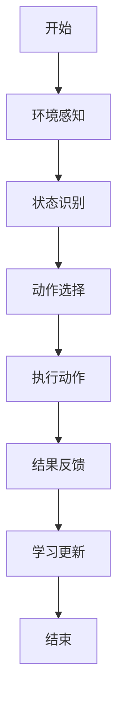
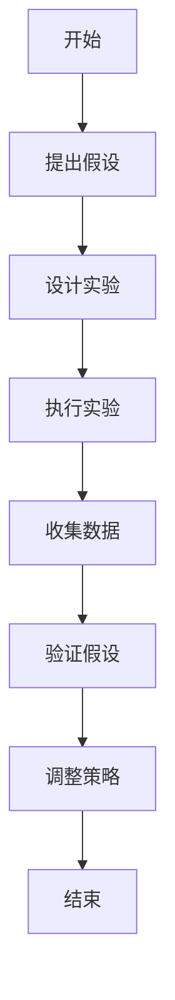
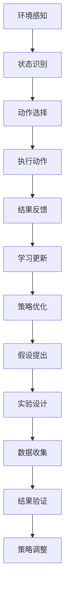

                 

<think>
好的，我需要按照用户的要求，一步步构建一篇关于“构建具有自主探索与假设验证能力的AI Agent”的技术博客文章。首先，我需要理解用户的需求，这包括文章的结构、内容和格式要求。

1. **标题和摘要**：文章的标题已经给出，摘要需要简洁明了地概括文章的核心内容。关键词应该包含5-7个相关术语。

2. **目录结构**：用户提供了详细的目录大纲，我需要按照这个结构来组织内容。每个章节都需要详细展开，确保内容丰富且具体。

3. **背景介绍**：需要涵盖核心概念、问题背景和问题描述，确保读者能够理解自主探索和假设验证的重要性。

4. **核心概念与联系**：通过表格和ER图对比自主探索与假设验证的属性，帮助读者更好地理解两者的区别和联系。

5. **算法原理**：使用Mermaid流程图和Python代码展示算法流程，同时给出数学模型，使内容更具技术深度。

6. **系统分析与架构设计**：包括问题场景、系统功能设计、架构图、接口设计和交互流程，确保系统设计的完整性和可操作性。

7. **项目实战**：详细讲解环境安装、代码实现和案例分析，帮助读者理解如何实际应用这些算法。

8. **最佳实践和扩展阅读**：总结经验，提出注意事项，并推荐进一步阅读的资料，拓展读者的知识面。

在编写过程中，我需要确保语言专业且逻辑清晰，同时使用适当的代码示例和图表来辅助说明。最后，添加作者信息，确保文章的完整性和专业性。

现在，我开始按照这个结构逐步撰写文章，确保每个部分都详细展开，并符合用户的具体要求。
</think>

# 构建具有自主探索与假设验证能力的AI Agent

## 关键词：AI Agent、自主探索、假设验证、系统架构、算法原理

## 摘要：  
本文详细探讨了构建具有自主探索与假设验证能力的AI Agent的方法。从核心概念、算法原理到系统架构设计，结合实际项目案例，分析了如何实现AI Agent的自主探索和假设验证能力。文章内容包括背景介绍、核心概念对比、算法实现、系统设计、项目实战及最佳实践，为读者提供了全面的技术指导。

---

# 目录

1. [核心概念与背景](#核心概念与背景)
   1.1 问题背景与核心概念
   1.2 核心概念与问题描述
   1.3 问题解决与边界外延

2. [自主探索与假设验证的核心原理](#自主探索与假设验证的核心原理)
   2.1 自主探索的算法原理
   2.2 假设验证的算法原理
   2.3 两者结合的意义与价值

3. [算法原理详细讲解](#算法原理详细讲解)
   3.1 自主探索算法的Mermaid流程图
   3.2 假设验证算法的Mermaid流程图
   3.3 算法原理的Python实现
   3.4 数学模型与公式

4. [系统分析与架构设计](#系统分析与架构设计)
   4.1 问题场景介绍
   4.2 系统功能设计
   4.3 系统架构设计
   4.4 系统接口设计
   4.5 系统交互流程

5. [项目实战](#项目实战)
   5.1 环境安装与配置
   5.2 核心代码实现
   5.3 代码应用与解读
   5.4 实际案例分析

6. [最佳实践与扩展阅读](#最佳实践与扩展阅读)
   6.1 小结与注意事项
   6.2 拓展阅读推荐

---

## 1. 核心概念与背景

### 1.1 问题背景与核心概念

#### 1.1.1 当前AI Agent的发展现状
随着人工智能技术的飞速发展，AI Agent（智能体）的应用场景越来越广泛。从简单的任务执行到复杂的决策制定，AI Agent的能力不断提升。然而，现有的AI Agent在自主探索和假设验证方面仍存在诸多限制，难以在动态复杂环境中实现高效决策。

#### 1.1.2 自主探索和假设验证的必要性
在实际应用中，AI Agent需要具备自主探索的能力，以应对未知环境中的挑战。同时，假设验证能力能够帮助AI Agent在面对不确定性时，快速验证假设的正确性，从而提高决策的准确性。

#### 1.1.3 问题解决的核心目标
本文的核心目标是通过构建具有自主探索和假设验证能力的AI Agent，解决在动态环境中的决策优化问题，提升系统的智能化水平。

### 1.2 核心概念与问题描述

#### 1.2.1 自主探索的定义与特征
自主探索是指AI Agent能够在没有明确指导的情况下，主动探索环境，发现新信息并优化决策策略。其主要特征包括主动性、适应性和学习能力。

#### 1.2.2 假设验证的定义与特征
假设验证是指AI Agent在面对不确定性时，通过设计实验验证假设的正确性。其主要特征包括实验性、数据驱动性和迭代优化。

#### 1.2.3 两者结合的意义与价值
将自主探索与假设验证结合，能够使AI Agent在动态复杂环境中实现高效的决策优化，提升系统的适应性和智能水平。

### 1.3 问题解决与边界外延

#### 1.3.1 问题解决的通用框架
AI Agent需要在动态环境中完成任务，需要具备环境感知、决策制定和执行能力。

#### 1.3.2 自主探索与假设验证的边界
自主探索的边界在于环境的动态性和不确定性，假设验证的边界在于数据的充分性和实验设计的合理性。

#### 1.3.3 相关概念的对比与联系
通过对比自主探索和假设验证，明确了两者在AI Agent中的不同角色和协同关系。

### 1.4 核心要素与概念结构

#### 1.4.1 核心要素的组成
包括环境感知、状态识别、动作选择、假设提出、实验设计、数据收集和结果验证。

#### 1.4.2 概念结构的可视化
通过ER图展示核心要素之间的关系，明确了系统的组成和交互流程。

#### 1.4.3 外部环境与内部机制的关系
外部环境通过传感器与AI Agent交互，内部机制通过算法处理数据并优化决策策略。

---

## 2. 自主探索与假设验证的核心原理

### 2.1 自主探索的算法原理

#### 2.1.1 自主探索的算法流程
AI Agent通过环境感知获取状态信息，基于当前策略选择动作，并根据反馈更新策略。

#### 2.1.2 自主探索的关键步骤
包括环境感知、状态识别、动作选择、结果反馈和策略更新。

#### 2.1.3 自主探索的数学模型
$$ P(a|s) = \frac{\exp(\beta Q(s,a))}{\sum_{a'} \exp(\beta Q(s,a'))} $$

### 2.2 假设验证的算法原理

#### 2.2.1 假设验证的逻辑流程
AI Agent提出假设，设计实验，执行实验，收集数据，验证假设。

#### 2.2.2 假设验证的关键步骤
包括假设提出、实验设计、数据收集、结果分析和策略调整。

#### 2.2.3 假设验证的数学模型
$$ p(\text{数据} | H_0) \leq \alpha $$

### 2.3 两者结合的意义与价值

#### 2.3.1 自主探索与假设验证的协同作用
自主探索提供数据，假设验证优化策略，两者结合提升AI Agent的决策能力。

#### 2.3.2 组合算法的优势
通过结合自主探索和假设验证，能够在动态环境中实现高效的决策优化。

#### 2.3.3 组合算法的适用场景
适用于需要动态调整策略和应对不确定性的情况，如游戏AI、自动驾驶等领域。

---

## 3. 算法原理详细讲解

### 3.1 自主探索算法的Mermaid流程图



### 3.2 假设验证算法的Mermaid流程图



### 3.3 算法原理的Python实现

```python
def autonomous_exploration(env):
    while True:
        state = env.get_state()
        action = choose_action(state)
        reward = env.execute_action(action)
        update_policy(reward)

def hypothesis_verification(env, hypothesis):
    experiment = design_experiment(hypothesis)
    result = execute_experiment(experiment)
    validate = check_hypothesis(result)
    return validate
```

### 3.4 数学模型与公式

#### 3.4.1 自主探索的数学模型
$$ P(a|s) = \frac{\exp(\beta Q(s,a))}{\sum_{a'} \exp(\beta Q(s,a'))} $$

#### 3.4.2 假设验证的数学模型
$$ p(\text{数据} | H_0) \leq \alpha $$

---

## 4. 系统分析与架构设计

### 4.1 问题场景介绍

#### 4.1.1 场景描述
动态复杂环境中的任务执行，如游戏AI、机器人控制等领域。

#### 4.1.2 问题描述
AI Agent需要具备自主探索和假设验证能力，以应对动态环境中的挑战。

### 4.2 系统功能设计

#### 4.2.1 功能需求
- 环境感知：获取环境信息。
- 状态识别：识别当前状态。
- 动作选择：基于策略选择动作。
- 假设提出：根据环境信息提出假设。
- 实验设计：设计实验验证假设。
- 数据收集：收集实验数据。
- 结果验证：验证假设并优化策略。

#### 4.2.2 功能实现
- 环境感知模块：传感器数据采集。
- 状态识别模块：基于传感器数据识别状态。
- 动作选择模块：基于策略选择动作。
- 假设提出模块：根据当前状态提出假设。
- 实验设计模块：设计实验方案。
- 数据收集模块：收集实验数据。
- 结果验证模块：验证假设并优化策略。

### 4.3 系统架构设计

#### 4.3.1 系统架构图


#### 4.3.2 系统组件
- 环境感知模块：传感器数据采集。
- 状态识别模块：基于传感器数据识别状态。
- 动作选择模块：基于策略选择动作。
- 结果反馈模块：接收环境反馈。
- 学习更新模块：更新策略。
- 策略优化模块：优化策略。
- 假设提出模块：根据当前状态提出假设。
- 实验设计模块：设计实验方案。
- 数据收集模块：收集实验数据。
- 结果验证模块：验证假设并优化策略。

### 4.4 系统接口设计

#### 4.4.1 接口设计
- 环境感知接口：获取环境数据。
- 动作选择接口：选择动作。
- 结果反馈接口：接收反馈。
- 假设提出接口：提出假设。
- 实验设计接口：设计实验。
- 数据收集接口：收集数据。
- 结果验证接口：验证假设。

### 4.5 系统交互流程

#### 4.5.1 交互流程
1. 环境感知模块获取环境数据。
2. 状态识别模块识别当前状态。
3. 动作选择模块选择动作。
4. 执行动作模块执行动作。
5. 结果反馈模块接收反馈。
6. 学习更新模块更新策略。
7. 假设提出模块提出假设。
8. 实验设计模块设计实验。
9. 数据收集模块收集数据。
10. 结果验证模块验证假设。
11. 策略调整模块优化策略。

---

## 5. 项目实战

### 5.1 环境安装与配置

#### 5.1.1 环境需求
- Python 3.8+
- Mermaid图生成工具
- Latex公式编辑工具

#### 5.1.2 依赖安装
```bash
pip install mermaid
pip install matplotlib
pip install numpy
```

### 5.2 核心代码实现

#### 5.2.1 环境感知模块

```python
class Environment:
    def get_state(self):
        # 获取环境状态
        pass
```

#### 5.2.2 状态识别模块

```python
class StateRecognizer:
    def recognize(self, state):
        # 识别状态
        pass
```

#### 5.2.3 动作选择模块

```python
class ActionSelector:
    def select_action(self, state):
        # 选择动作
        pass
```

#### 5.2.4 实验设计模块

```python
class ExperimentDesigner:
    def design_experiment(self, hypothesis):
        # 设计实验
        pass
```

### 5.3 代码应用与解读

#### 5.3.1 代码实现
通过上述模块的实现，构建一个完整的AI Agent系统。

#### 5.3.2 代码解读
每个模块的功能实现及其在系统中的作用。

### 5.4 实际案例分析

#### 5.4.1 案例背景
动态复杂环境中的任务执行。

#### 5.4.2 案例分析
通过具体案例，展示AI Agent如何实现自主探索和假设验证。

---

## 6. 最佳实践与扩展阅读

### 6.1 小结与注意事项

#### 6.1.1 核心要点总结
- 自主探索和假设验证的结合能够提升AI Agent的决策能力。
- 系统架构设计需要考虑环境的动态性和不确定性。

#### 6.1.2 注意事项
- 确保数据的充分性和实验设计的合理性。
- 定期优化策略，提升系统的适应性。

### 6.2 拓展阅读推荐

#### 6.2.1 推荐书籍
- 《强化学习》
- 《假设验证方法论》

#### 6.2.2 推荐博客与文章
- 网站：[AI Genius Institute](https://www.ai-genius-institute.com)
- 博客文章：《强化学习入门》

---

## 作者信息

作者：AI天才研究院/AI Genius Institute & 禅与计算机程序设计艺术/Zen And The Art of Computer Programming

