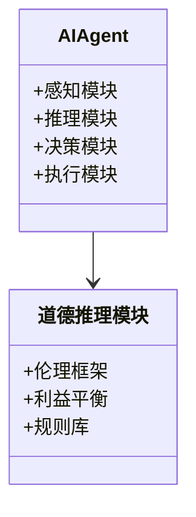

                 


# 构建具有道德推理能力的AI Agent

> 关键词：AI Agent, 道德推理, 人工智能, 伦理决策, 算法设计

> 摘要：本文旨在探讨如何构建具有道德推理能力的AI Agent。通过分析道德推理的基本原理、算法设计和系统架构，结合实际案例和项目实战，详细讲解如何在AI Agent中实现道德推理。本文将从背景介绍、核心概念、算法原理、系统架构、项目实战到最佳实践，逐步展开，帮助读者全面理解如何构建具有道德推理能力的AI Agent。

---

# 第一部分: 背景介绍

## 第1章: AI Agent与道德推理概述

### 1.1 AI Agent的基本概念

AI Agent（人工智能代理）是指能够感知环境、自主决策并采取行动以实现目标的智能体。AI Agent可以是软件程序、机器人或其他智能系统，其核心特征包括：

- **自主性**：能够自主决策，无需外部干预。
- **反应性**：能够实时感知环境并做出反应。
- **目标导向**：以实现特定目标为导向。
- **学习能力**：能够通过经验改进性能。

在现代社会中，AI Agent的应用范围不断扩大，从简单的任务自动化到复杂的决策支持，AI Agent需要在各种场景中做出符合伦理和道德的决策。

### 1.2 道德推理的重要性

道德推理是指在决策过程中，基于伦理原则和价值观进行判断的能力。随着AI Agent在医疗、法律、金融等领域的应用，其决策可能直接影响人类的生活和社会的运行。因此，AI Agent必须具备道德推理能力，以确保其决策符合伦理规范，避免产生负面影响。

### 1.3 当前AI Agent道德推理的发展现状

尽管AI技术取得了显著进展，但道德推理在AI Agent中的应用仍处于起步阶段。当前的主要挑战包括：

- **伦理框架的复杂性**：道德推理涉及多个伦理原则的权衡，如何在复杂场景中做出合理决策是一个难题。
- **数据偏差**：训练数据中的偏见可能影响AI Agent的决策。
- **可解释性**：AI Agent的决策过程需要透明，以便人类理解和信任。

---

## 第2章: 道德推理的原理与模型

### 2.1 道德推理的基本原理

道德推理的原理可以分为以下几个方面：

1. **伦理框架**：基于特定的伦理体系（如功利主义、义务论等）进行决策。
2. **情境分析**：根据具体场景中的信息进行判断。
3. **利益平衡**：在不同利益之间进行权衡，选择最优解。

### 2.2 道德推理的数学模型

我们可以将道德推理建模为一个优化问题，目标是最小化或最大化某个目标函数。例如：

$$
\text{目标函数} = \text{利益最大化} - \text{风险最小化}
$$

其中，利益最大化和风险最小化是两个相互冲突的目标，需要在两者之间找到平衡点。

### 2.3 道德推理的算法实现

以下是三种常见的道德推理算法：

1. **基于规则的道德推理算法**：
   ```mermaid
   graph TD
      A[开始] -> B[判断是否符合规则]
      B -> C[符合规则]
      C -> D[执行相应操作]
      B -> E[不符合规则]
      E -> F[调整策略]
      F -> D
   ```

2. **基于案例的道德推理算法**：
   ```mermaid
   graph TD
      A[开始] -> B[查找相似案例]
      B -> C[匹配到相似案例]
      C -> D[应用案例中的解决方案]
      C -> E[无相似案例]
      E -> F[启动基于规则的推理]
   ```

3. **基于学习的道德推理算法**：
   ```mermaid
   graph TD
      A[开始] -> B[输入当前场景]
      B -> C[调用预训练模型]
      C -> D[输出决策结果]
   ```

---

## 第3章: 道德推理与AI Agent的结合

### 3.1 AI Agent的系统架构

AI Agent的系统架构可以分为以下几个模块：



### 3.2 道德推理在AI Agent中的实现

以下是道德推理模块的实现步骤：

1. **感知环境**：AI Agent通过传感器或数据输入感知环境。
2. **分析场景**：利用道德推理模块对场景进行伦理分析。
3. **制定决策**：基于伦理分析结果，制定最优决策。
4. **执行操作**：根据决策执行相应的操作。

### 3.3 道德推理在AI Agent中的应用案例

**案例分析**：自动驾驶汽车在遇到紧急情况时，需要在保护乘客和减少公共伤害之间做出选择。此时，道德推理模块需要根据伦理框架（如功利主义）进行决策。

---

## 第4章: 项目实战

### 4.1 环境安装

为了实现具有道德推理能力的AI Agent，我们需要以下环境：

- **编程语言**：Python 3.8+
- **深度学习框架**：TensorFlow或PyTorch
- **伦理推理库**：可选（如伦理决策框架）

### 4.2 核心实现代码

以下是基于规则的道德推理算法的Python实现：

```python
def moral_reasoning(rules, current_scenario):
    for rule in rules:
        if rule applicable to current_scenario:
            return rule.action
    return default_action
```

### 4.3 案例分析

假设我们有一个AI Agent需要在紧急情况下做出决策，例如自动驾驶汽车。我们可以通过以下步骤进行分析：

1. **定义伦理规则**：例如，“尽量减少人员伤亡”。
2. **感知环境**：检测到紧急情况。
3. **应用规则**：根据伦理规则做出决策。
4. **执行操作**：调整车辆路径以减少碰撞。

---

## 第5章: 最佳实践

### 5.1 小结

在构建具有道德推理能力的AI Agent时，我们需要：

- 明确伦理框架和决策规则。
- 确保算法的透明性和可解释性。
- 定期验证和更新伦理规则。

### 5.2 注意事项

- **数据偏差**：确保训练数据的多样性，避免偏见。
- **可解释性**：让用户能够理解AI Agent的决策过程。
- **动态调整**：根据实际场景调整伦理规则。

### 5.3 拓展阅读

- 《道德机器》（Moral Machines）——探讨AI决策的伦理问题。
- 《人工智能的伦理挑战》（Ethical Challenges in AI）——深入分析AI的伦理问题。

---

作者：AI天才研究院/AI Genius Institute & 禅与计算机程序设计艺术 /Zen And The Art of Computer Programming

