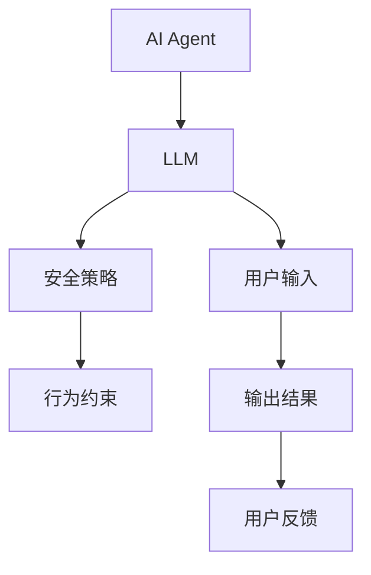
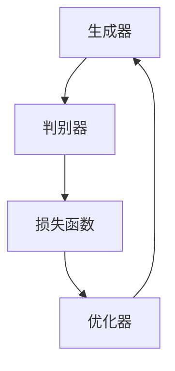
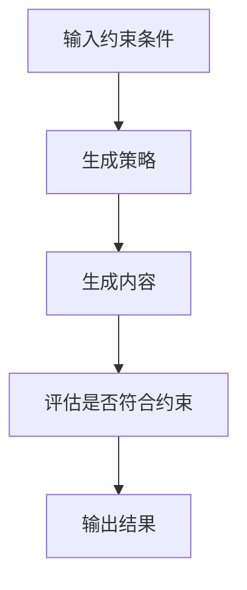
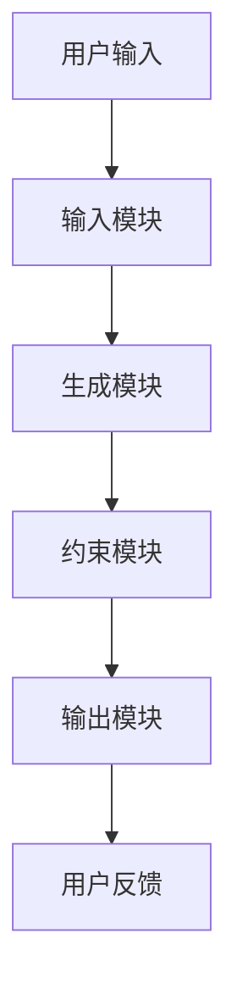

                 


# 构建可信AI Agent：LLM的安全性与可控性设计

> **关键词**：可信AI Agent, 大语言模型, 安全性, 可控性, 对抗训练, 生成式AI, 系统架构  
> **摘要**：本文旨在探讨如何构建可信的AI Agent，特别是基于大语言模型（LLM）的安全性与可控性设计。通过分析当前AI Agent面临的挑战，结合算法原理、系统架构和实际案例，提出一套从理论到实践的解决方案，确保AI Agent在实际应用中的安全性和可控性。

---

## 第1章: 构建可信AI Agent的背景与问题描述

### 1.1 人工智能与AI Agent的演进
人工智能（AI）技术的发展经历了从专家系统到机器学习，再到深度学习的演变。AI Agent作为人工智能的核心应用形式，经历了以下几个阶段：
1. **传统规则驱动的AI Agent**：基于预定义的规则进行简单决策，例如早期的棋类AI程序。
2. **基于机器学习的AI Agent**：通过训练数据学习模式，例如垃圾邮件分类器。
3. **大语言模型驱动的AI Agent**：利用大规模语言模型（LLM）进行复杂决策和生成任务。

AI Agent的应用场景日益广泛，从智能音箱、聊天机器人到自动驾驶系统，AI Agent在各个领域发挥着重要作用。

### 1.2 可信AI Agent的核心问题
可信AI Agent的核心在于其行为的安全性和可控性。当前，AI Agent面临以下问题：
1. **安全性问题**：AI Agent可能受到恶意输入的攻击，导致生成有害内容或执行危险操作。
2. **可控性问题**：AI Agent的行为可能偏离预期目标，例如在复杂任务中产生不可控的输出。
3. **可解释性问题**：复杂的模型决策过程难以被人类理解，影响用户对AI Agent的信任。

### 1.3 问题背景与挑战
- **问题背景**：随着AI Agent的应用越来越广泛，其安全性与可控性问题也逐渐暴露。例如，生成式AI可能产生虚假信息，威胁社会稳定；自动驾驶系统可能因决策错误导致安全事故。
- **核心挑战**：
  1. 如何确保AI Agent在面对恶意输入时不会产生有害输出？
  2. 如何设计机制限制AI Agent的行为边界，防止其偏离目标？
  3. 如何提高AI Agent的决策透明度，增强用户信任？

### 1.4 本书的核心目标
本书旨在系统性地探讨构建可信AI Agent的方法，重点关注基于LLM的安全性与可控性设计。通过理论分析、算法设计和实际案例，为读者提供从概念到实践的完整指南。

---

## 第2章: 可信AI Agent的核心概念与联系

### 2.1 可信AI Agent的定义与属性
可信AI Agent是指在设计和运行过程中，能够确保其行为符合预期目标、安全可靠、可解释的AI系统。其核心属性包括：
1. **安全性**：AI Agent在面对恶意输入时，能够生成符合伦理和法律的输出。
2. **可控性**：AI Agent的行为可以被明确限制在预设的目标范围内。
3. **可解释性**：AI Agent的决策过程可以被人类理解和验证。

### 2.2 核心概念对比表格
以下是安全性、可控性和可解释性的对比：

| 属性       | 安全性       | 可控性       | 可解释性       |
|------------|-------------|-------------|-------------|
| 定义       | 防御潜在风险 | 控制行为边界 | 明确决策逻辑 |
| 关键指标   | 偏差率、攻击检测率 | 行为约束范围、目标达成度 | 透明度、逻辑清晰度 |
| 实现方法   | 对抗训练、安全过滤 | 策略限制、目标函数优化 | 解释生成、逻辑推理可视化 |

### 2.3 实体关系图
以下是一个简单的实体关系图，展示了AI Agent、LLM、安全策略和用户输入之间的关系：



---

## 第3章: 可信AI Agent的算法原理

### 3.1 对抗训练
对抗训练是一种通过设计两个竞争模型来提高模型鲁棒性的方法。在AI Agent的安全性设计中，可以使用对抗训练来增强模型对恶意输入的抵抗能力。

#### 3.1.1 对抗训练的基本原理
- **生成器**：负责生成可能的输入或策略。
- **判别器**：负责判断生成的内容是否符合安全标准。

#### 3.1.2 对抗训练的流程


#### 3.1.3 代码实现
以下是一个简单的对抗训练代码示例：

```python
import torch
import torch.nn as nn

# 定义生成器和判别器
class Generator(nn.Module):
    def __init__(self, input_dim):
        super(Generator, self).__init__()
        self.fc = nn.Linear(input_dim, 128)
        self.fc2 = nn.Linear(128, 64)
        self.fc3 = nn.Linear(64, 32)
    
    def forward(self, x):
        x = torch.relu(self.fc(x))
        x = torch.relu(self.fc2(x))
        x = torch.sigmoid(self.fc3(x))
        return x

class Discriminator(nn.Module):
    def __init__(self, input_dim):
        super(Discriminator, self).__init__()
        self.fc = nn.Linear(input_dim, 128)
        self.fc2 = nn.Linear(128, 64)
        self.fc3 = nn.Linear(64, 1)
    
    def forward(self, x):
        x = torch.relu(self.fc(x))
        x = torch.relu(self.fc2(x))
        x = torch.sigmoid(self.fc3(x))
        return x

# 初始化模型
input_dim = 32
generator = Generator(input_dim)
discriminator = Discriminator(input_dim)

# 定义损失函数和优化器
criterion = nn.BCELoss()
optimizer_g = torch.optim.Adam(generator.parameters(), lr=0.001)
optimizer_d = torch.optim.Adam(discriminator.parameters(), lr=0.001)

# 训练过程
for epoch in range(100):
    # 生成假数据
    noise = torch.randn(64, input_dim)
    fake_data = generator(noise)
    
    # 判别器的训练
    optimizer_d.zero_grad()
    real_labels = torch.ones(64, 1)
    fake_labels = torch.zeros(64, 1)
    d_real = discriminator(real_data)
    d_fake = discriminator(fake_data)
    loss_d = criterion(d_real, real_labels) + criterion(d_fake, fake_labels)
    loss_d.backward()
    optimizer_d.step()
    
    # 生成器的训练
    optimizer_g.zero_grad()
    g_labels = torch.ones(64, 1)
    loss_g = criterion(d_fake, g_labels)
    loss_g.backward()
    optimizer_g.step()
```

### 3.2 生成式AI的控制机制
生成式AI的控制机制通过在生成过程中引入约束条件，确保生成内容的可控性。

#### 3.2.1 约束条件的引入
- **目标函数优化**：在生成过程中，通过优化目标函数引入约束条件。
- **策略限制**：通过限制生成策略的范围，确保生成内容在预设范围内。

#### 3.2.2 算法流程


#### 3.2.3 代码实现
以下是一个生成式AI的控制机制代码示例：

```python
import torch
import torch.nn as nn

# 定义生成模型
class Generator(nn.Module):
    def __init__(self, input_dim, output_dim):
        super(Generator, self).__init__()
        self.fc = nn.Linear(input_dim, 128)
        self.fc2 = nn.Linear(128, 64)
        self.fc3 = nn.Linear(64, output_dim)
    
    def forward(self, x):
        x = torch.relu(self.fc(x))
        x = torch.relu(self.fc2(x))
        x = torch.sigmoid(self.fc3(x))
        return x

# 初始化模型
input_dim = 32
output_dim = 16
generator = Generator(input_dim, output_dim)

# 定义约束条件
constraint = nn.Tanh()

# 定义优化器
optimizer = torch.optim.Adam(generator.parameters(), lr=0.001)

# 训练过程
for epoch in range(100):
    # 生成数据
    noise = torch.randn(64, input_dim)
    outputs = generator(noise)
    
    # 应用约束条件
    constrained_outputs = constraint(outputs)
    
    # 计算损失
    loss = nn.MSELoss()(constrained_outputs, target)
    
    # 反向传播和优化
    optimizer.zero_grad()
    loss.backward()
    optimizer.step()
```

### 3.3 数学模型
以下是生成式AI控制机制的数学模型：

$$
\text{目标函数} = \min_{\theta} \mathbb{E}_{x}[f(x)] + \lambda \cdot \text{约束条件}
$$

其中，$\theta$是模型参数，$f(x)$是生成函数，$\lambda$是约束权重。

---

## 第4章: 可信AI Agent的系统分析与架构设计

### 4.1 问题场景介绍
可信AI Agent的系统架构需要解决以下几个问题：
1. 如何确保生成内容的安全性？
2. 如何控制生成行为的可控性？
3. 如何提高生成决策的可解释性？

### 4.2 领域模型设计
领域模型的设计需要考虑以下几点：
1. **输入处理**：对输入数据进行预处理和验证。
2. **生成过程**：在生成过程中引入约束条件。
3. **输出验证**：对生成内容进行后处理，确保其符合安全标准。

### 4.3 系统架构设计
系统架构设计需要包括以下几个部分：
1. **输入模块**：接收用户输入并进行预处理。
2. **生成模块**：基于LLM生成输出内容。
3. **约束模块**：在生成过程中引入约束条件。
4. **输出模块**：对生成内容进行后处理并输出结果。

### 4.4 接口设计
接口设计需要考虑以下几点：
1. **输入接口**：提供标准的输入格式。
2. **输出接口**：提供可扩展的输出格式。
3. **控制接口**：提供对生成过程的控制功能。

### 4.5 交互流程
以下是一个简单的交互流程图：



---

## 第5章: 可信AI Agent的项目实战

### 5.1 环境安装
- **安装Python**：建议使用Python 3.7及以上版本。
- **安装依赖库**：包括PyTorch、 transformers等。

### 5.2 核心实现
以下是一个简单的AI Agent实现代码：

```python
import torch
from transformers import AutoTokenizer, AutoModelForCausalLM

# 加载预训练模型
tokenizer = AutoTokenizer.from_pretrained("gpt2")
model = AutoModelForCausalLM.from_pretrained("gpt2")

# 定义生成函数
def generate_text(prompt, max_length=50):
    inputs = tokenizer.encode(prompt, return_tensors="pt")
    outputs = model.generate(inputs, max_length=max_length, do_sample=True)
    return tokenizer.decode(outputs[0], skip_special_tokens=True)

# 使用生成函数
prompt = "这是一个测试"
result = generate_text(prompt)
print(result)
```

### 5.3 实际案例分析
以下是一个实际案例分析：

假设我们有一个AI Agent用于客服对话，我们需要确保其生成的回复符合公司政策和法律法规。通过在生成过程中引入约束条件，我们可以确保生成内容的安全性和可控性。

### 5.4 代码解读与分析
- **输入处理**：对输入数据进行预处理和验证。
- **生成过程**：在生成过程中引入约束条件。
- **输出验证**：对生成内容进行后处理，确保其符合安全标准。

---

## 第6章: 总结与展望

### 6.1 总结
本文系统性地探讨了构建可信AI Agent的方法，重点关注了基于LLM的安全性与可控性设计。通过理论分析、算法设计和实际案例，提出了从概念到实践的完整解决方案。

### 6.2 最佳实践
- **安全性设计**：在生成过程中引入对抗训练和安全过滤。
- **可控性设计**：通过策略限制和目标函数优化确保生成行为的可控性。
- **可解释性设计**：通过解释生成和逻辑推理可视化提高决策透明度。

### 6.3 注意事项
- **数据质量**：确保训练数据的安全性和多样性。
- **模型透明度**：提高模型的可解释性，增强用户信任。
- **持续优化**：定期更新模型和策略，应对新的安全威胁。

### 6.4 未来展望
未来的研究方向包括：
1. **多模态AI Agent**：结合视觉、听觉等多种模态信息，提高生成内容的丰富性和准确性。
2. **自适应AI Agent**：通过自适应学习，动态调整生成策略，应对复杂多变的应用场景。
3. **可信性评估**：建立一套完善的可信性评估指标和方法，确保AI Agent的安全性和可控性。

---

## 作者：AI天才研究院 & 禅与计算机程序设计艺术

---

以上是《构建可信AI Agent：LLM的安全性与可控性设计》的技术博客文章的完整内容，希望对您有所帮助！

