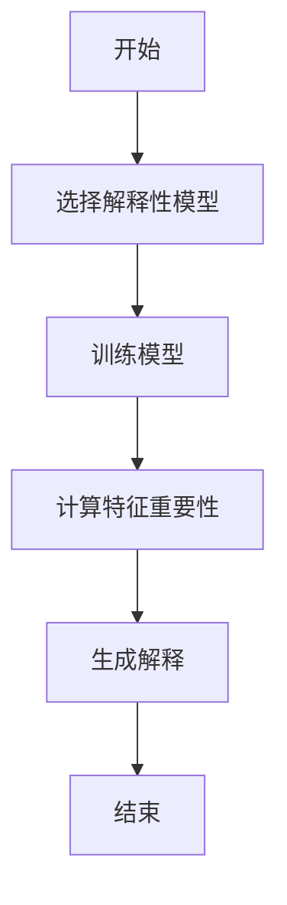

                 

<think>
嗯，用户想要我写一个构建可解释AI代理的博客，重点放在透明度和可信度。我先看看用户提供的目录，里面已经分为背景、算法、系统分析、项目实战等部分。我需要按照这个结构来组织内容，确保每部分都有足够的细节和例子。

首先，背景部分要介绍AI代理的基本概念，解释为什么可解释性很重要。然后，核心概念部分需要深入讨论可解释性AI的原理和不同模型的对比。接下来是算法原理，这里可能需要详细讲解一些具体的算法，比如线性模型和树模型，以及如何计算特征重要性或SHAP值。

系统分析部分要展示如何在实际项目中应用这些概念，可能包括系统架构图和接口设计。项目实战部分则需要具体的代码和案例分析，这样读者可以实际操作。最后，总结一下最佳实践和未来的发展方向。

在写作过程中，我需要确保每一部分都有足够的技术细节，同时用通俗易懂的语言解释复杂的概念。使用mermaid图和代码示例会帮助读者更好地理解。此外，要注意格式，使用markdown并正确嵌入数学公式和图表。

可能遇到的困难是如何平衡理论和实践，以及如何将复杂的理论简化成易于理解的内容。我会通过多次修改和举例来确保内容清晰。最终目标是让读者不仅能理解可解释AI的原理，还能掌握实际应用的方法。
</think>

# 构建可解释的AI Agent：透明度和可信度

> 关键词：可解释性AI，AI Agent，透明度，可信度，模型解释性，算法原理，系统架构，项目实战

## 摘要

在人工智能迅速发展的今天，AI Agent（智能体）的应用越来越广泛。然而，随着AI系统的复杂性增加，其决策过程的不透明性也成为了用户和开发者面临的重大挑战。构建可解释的AI Agent不仅是提升系统可信度的关键，也是确保AI技术能够被广泛接受和实际应用的重要前提。本文将从可解释性AI的核心概念、算法原理、系统架构设计、项目实战等多个方面展开讨论，深入剖析如何在AI Agent中实现透明度和可信度，从而构建出既智能又可解释的AI系统。

---

## 第一部分：可解释性AI的背景与核心概念

### 第1章：可解释性AI的背景与问题背景

#### 1.1 人工智能与AI Agent概述

##### 1.1.1 人工智能的发展历程

人工智能（Artificial Intelligence，AI）的发展可以追溯到20世纪50年代。从最初的专家系统到现代的深度学习模型，AI技术经历了多次起伏，但其应用范围不断扩大，尤其是在自然语言处理、计算机视觉和机器人等领域取得了显著进展。AI Agent作为AI技术的重要应用形式，能够根据环境信息自主决策并执行任务，是当前研究的热点。

##### 1.1.2 AI Agent的基本概念与特点

AI Agent是指在环境中能够感知并自主行动以实现目标的实体。它具有以下特点：
- **自主性**：能够在没有外部干预的情况下独立运行。
- **反应性**：能够根据环境变化动态调整行为。
- **目标导向**：所有行动都以实现特定目标为导向。
- **可解释性**：决策过程能够被人类理解和验证。

##### 1.1.3 可解释性AI的定义与重要性

可解释性AI是指AI系统能够以人类可理解的方式解释其决策过程和结果。其重要性体现在以下几个方面：
- **增强可信度**：用户只有在理解AI决策逻辑的情况下，才能完全信任AI系统。
- **提升透明度**：可解释性AI能够帮助开发者和用户了解系统的运行机制，发现潜在问题。
- **合规性需求**：在金融、医疗等领域，可解释性是合规性的重要要求。

#### 1.2 可解释性AI的背景与问题背景

##### 1.2.1 当前AI技术的局限性

尽管AI技术取得了显著进步，但其决策过程的不透明性仍然存在以下问题：
- **黑箱问题**：许多深度学习模型的决策逻辑难以被人类理解。
- **结果不可解释**：复杂的模型可能导致决策缺乏透明性，难以验证其正确性。
- **责任追究困难**：当AI系统出现问题时，缺乏可解释性使得责任追究变得复杂。

##### 1.2.2 可解释性AI的需求与挑战

随着AI系统的广泛应用，可解释性AI的需求日益迫切。然而，实现可解释性AI面临以下挑战：
- **技术复杂性**：复杂的模型往往难以解释。
- **性能与解释性的平衡**：高精度模型可能缺乏可解释性，而可解释性强的模型可能性能较低。
- **领域差异**：不同应用场景对可解释性的需求不同，增加了实现难度。

##### 1.2.3 可解释性AI的边界与外延

可解释性AI的边界在于其解释范围和深度。虽然无法完全消除AI的“黑箱”特性，但可以通过多种技术手段提升决策过程的透明度。其外延包括但不限于：
- **模型解释**：揭示AI决策的逻辑和依据。
- **用户友好性**：通过可视化等方式帮助用户理解AI决策。
- **伦理与法律合规**：确保AI系统的决策符合伦理和法律要求。

#### 1.3 可解释性AI的核心要素与概念结构

##### 1.3.1 可解释性AI的核心要素

构建可解释性AI需要关注以下几个核心要素：
- **解释性模型**：选择适合的解释性算法，如线性回归、决策树等。
- **解释度量**：量化解释的质量，例如特征重要性、SHAP值等。
- **解释可视化**：通过图表等方式直观展示解释结果。
- **用户交互**：提供与用户交互的接口，便于用户理解解释信息。

##### 1.3.2 概念结构与核心要素组成

可解释性AI的概念结构可以分为以下几个层次：
1. **目标层**：构建可解释的AI Agent。
2. **策略层**：选择合适的解释性算法和方法。
3. **实施层**：实现解释性模型并进行可视化。
4. **评估层**：验证解释的准确性和可理解性。

核心要素包括：
- **模型选择**：选择可解释性强的算法。
- **解释生成**：通过算法生成解释信息。
- **解释呈现**：以用户友好的方式展示解释。

##### 1.3.3 可解释性AI的分类与应用场景

可解释性AI可以分为以下几类：
1. **基于模型的可解释性**：直接从模型本身提取解释信息。
2. **基于案例的可解释性**：通过具体案例展示模型决策过程。
3. **基于规则的可解释性**：通过规则系统解释模型行为。

应用场景包括：
- **医疗诊断**：解释AI诊断的依据，确保医生信任。
- **金融风控**：解释信用评分的决策逻辑，确保合规性。
- **自动驾驶**：解释自动驾驶系统的决策过程，确保安全性和可靠性。

---

### 第2章：可解释性AI的核心概念与联系

#### 2.1 可解释性AI的核心原理

##### 2.1.1 可解释性AI的原理概述

可解释性AI的核心原理在于通过特定算法和技术，揭示AI决策过程中的关键因素和逻辑关系。常见的解释方法包括：
- **特征重要性分析**：通过特征权重评估各个特征对模型预测结果的影响程度。
- **SHAP值（Shapley Additive exPlanations）**：一种基于博弈论的解释方法，用于衡量每个特征对预测结果的贡献。
- **LIME（Local Interpretable Model-agnostic Explanations）**：通过局部可解释模型来解释复杂模型的预测结果。

##### 2.1.2 可解释性AI的核心算法与技术

- **线性模型**：如线性回归和逻辑回归，其权重可以直接解释特征对结果的影响。
- **树模型**：如决策树和随机森林，可以通过节点分裂和特征选择来解释模型决策过程。
- **可解释性增强方法**：如使用可解释性基模型（如线性回归）替代复杂模型，或者通过特征变换提升模型的可解释性。

##### 2.1.3 可解释性AI的实现方法

实现可解释性AI的方法包括：
- **选择可解释性强的模型**：如线性回归、决策树等。
- **使用解释性工具**：如SHAP、LIME等工具，对复杂模型的预测结果进行解释。
- **可视化解释**：通过热力图、依赖图等方式直观展示特征与预测结果的关系。

#### 2.2 可解释性AI的核心概念对比

##### 2.2.1 不同模型的可解释性对比

| 模型类型       | 可解释性       | 优点                           | 缺点                           |
|----------------|----------------|--------------------------------|--------------------------------|
| 线性回归       | 高             | 解释性强，易于实现             | 模型简单，可能无法捕捉复杂关系 |
| 决策树         | 中等           | 可视化能力强，易于理解         | 易受数据分布影响，可能过拟合   |
| 随机森林       | 中等           | 鲁棒性高，解释性较好           | 解释性较弱，依赖特征重要性     |
| 神经网络       | 低             | 表现能力强，适合复杂任务       | 黑箱问题严重，解释性差         |

##### 2.2.2 模型复杂度与可解释性的关系

模型复杂度与可解释性呈负相关关系。复杂度越高，模型的预测能力越强，但其可解释性越差。因此，在实际应用中需要在模型性能与可解释性之间找到平衡点。

##### 2.2.3 可解释性与模型性能的平衡

为了平衡可解释性和模型性能，可以采取以下策略：
- **选择适当的模型**：根据具体需求选择模型复杂度和可解释性的最佳平衡点。
- **使用解释性工具**：通过SHAP、LIME等工具对复杂模型的预测结果进行解释。
- **结合领域知识**：利用领域知识对模型的决策过程进行验证和优化。

#### 2.3 可解释性AI的实体关系图

##### 2.3.1 实体关系图的定义与作用

实体关系图（Entity-Relationship Diagram，ER图）用于描述系统中各实体及其关系。在可解释性AI中，实体关系图可以帮助我们理解系统中各个组件及其交互关系。

##### 2.3.2 可解释性AI的ER实体关系图

```mermaid
erDiagram
    actor User {
        string userId
        string username
    }
    system AI_Agent {
        string agentId
        string modelName
        function makeDecision(input) {
            // AI Agent决策逻辑
        }
    }
    model Explanation_Model {
        string modelId
        function explain(prediction) {
            // 解释模型解释逻辑
        }
    }
    actor User --> system AI_Agent : 请求决策
    system AI_Agent --> model Explanation_Model : 获取解释
    system AI_Agent --> actor User : 返回决策及解释
```

##### 2.3.3 实体关系图的分析与应用

通过上述实体关系图，我们可以清晰地看到：
- **用户**向AI Agent请求决策。
- **AI Agent**通过调用解释模型获取决策的解释信息。
- **AI Agent**将决策结果及其解释返回给用户。

这种设计确保了AI Agent的决策过程具有透明度和可信度，同时也为系统的优化提供了依据。

---

## 第三部分：可解释性AI的算法原理

### 第3章：可解释性AI的算法原理

#### 3.1 可解释性AI的核心算法

##### 3.1.1 线性模型与可解释性

线性回归是一种简单且可解释性很强的算法。其模型形式为：
$$ y = \beta_0 + \beta_1x_1 + \beta_2x_2 + \dots + \beta_nx_n $$

其中，$\beta_i$表示特征$x_i$的权重，权重越大表示该特征对预测结果的影响越大。

##### 3.1.2 树模型与可解释性

决策树是一种直观且易于解释的算法。通过树状结构展示特征的分裂过程，可以直观地看到每个特征对决策的贡献。

##### 3.1.3 解释性模型的对比与选择

在选择解释性模型时，需要综合考虑模型的性能和可解释性。例如，线性回归模型虽然解释性强，但可能无法捕捉复杂的非线性关系；而决策树模型虽然解释性稍差，但可以处理非线性关系。

#### 3.2 可解释性AI的数学模型与公式

##### 3.2.1 线性回归模型

线性回归的损失函数通常采用均方误差（Mean Squared Error，MSE）：
$$ MSE = \frac{1}{n}\sum_{i=1}^{n}(y_i - \hat{y}_i)^2 $$

其中，$y_i$是真实值，$\hat{y}_i$是预测值。

##### 3.2.2 树模型的解释性

决策树的解释性可以通过特征重要性来衡量。特征重要性通常基于特征在树中的分裂次数计算。

##### 3.2.3 SHAP值与特征重要性

SHAP值是一种基于博弈论的解释方法，用于衡量每个特征对预测结果的贡献。其核心公式为：
$$ \phi_i = \sum_{j=1}^{n} \phi_{ij} $$

其中，$\phi_{ij}$表示特征$j$对实例$i$的预测值的贡献。

#### 3.3 可解释性AI的算法流程图

##### 3.3.1 算法流程图的定义

算法流程图用于展示算法的执行步骤和逻辑关系。在可解释性AI中，流程图可以帮助我们理解解释性模型的实现过程。

##### 3.3.2 可解释性AI的算法流程图



##### 3.3.3 算法流程图的分析与优化

通过上述流程图，我们可以清晰地看到可解释性AI的实现步骤：
1. **选择解释性模型**：根据具体需求选择适合的解释性算法。
2. **训练模型**：使用训练数据训练解释性模型。
3. **计算特征重要性**：通过模型权重或特征分裂次数计算特征重要性。
4. **生成解释**：将特征重要性转化为可理解的解释信息。

---

### 第4章：可解释性AI的系统分析

#### 4.1 可解释性AI的系统分析

##### 4.1.1 问题场景介绍

在实际应用中，可解释性AI的系统分析需要考虑以下几个方面：
- **系统目标**：明确系统的功能需求和目标。
- **系统输入**：系统的输入数据和特征。
- **系统输出**：系统的预测结果和解释信息。
- **系统约束**：系统的性能和资源限制。

##### 4.1.2 系统功能设计

系统功能设计包括以下几个部分：
- **数据输入**：接收输入数据并进行预处理。
- **模型训练**：训练可解释性AI模型。
- **解释生成**：根据模型生成解释信息。
- **结果输出**：将预测结果和解释信息返回给用户。

##### 4.1.3 系统架构设计


##### 4.1.4 系统接口设计

系统接口设计需要考虑以下几个方面：
- **输入接口**：接收用户请求和数据输入。
- **输出接口**：返回预测结果和解释信息。
- **日志接口**：记录系统运行日志和异常信息。

##### 4.1.5 系统交互流程

```mermaid
sequenceDiagram
    actor User
    system AI_Agent
    system Explanation_Model
    User -> AI_Agent: 请求决策
    AI_Agent -> Explanation_Model: 获取解释
    Explanation_Model --> AI_Agent: 返回解释信息
    AI_Agent --> User: 返回决策结果及解释
```

---

## 第四部分：可解释性AI的项目实战

### 第4章：可解释性AI的项目实战

#### 4.1 项目环境与安装

##### 4.1.1 环境要求

- **操作系统**：Windows/Mac/Linux
- **Python版本**：Python 3.6+
- **依赖库**：scikit-learn, SHAP, LIME, matplotlib

##### 4.1.2 安装依赖

```bash
pip install scikit-learn shap lime matplotlib
```

#### 4.2 项目核心代码实现

##### 4.2.1 数据预处理

```python
import pandas as pd
from sklearn.model_selection import train_test_split
from sklearn.preprocessing import StandardScaler

# 加载数据
data = pd.read_csv('data.csv')
X = data.drop('target', axis=1)
y = data['target']

# 数据分割
X_train, X_test, y_train, y_test = train_test_split(X, y, test_size=0.2, random_state=42)

# 特征缩放
scaler = StandardScaler()
X_train_scaled = scaler.fit_transform(X_train)
X_test_scaled = scaler.transform(X_test)
```

##### 4.2.2 训练解释性模型

```python
from sklearn.linear_model import LinearRegression
from sklearn.metrics import r2_score

# 训练线性回归模型
model = LinearRegression()
model.fit(X_train_scaled, y_train)

# 预测结果
y_pred = model.predict(X_test_scaled)
print(f'R² Score: {r2_score(y_test, y_pred)}')
```

##### 4.2.3 计算特征重要性

```python
importances = model.coef_
feature_names = X.columns
feature_importances = dict(zip(feature_names, importances))

print(feature_importances)
```

##### 4.2.4 使用SHAP进行解释

```python
import shap

# 初始化SHAP解释器
explainer = shap.LinearExplainer(model, X_test_scaled)

# 生成解释
shap_values = explainer.shap_values(X_test_scaled)

# 可视化解释
shap.summary_plot(shap_values, X_test_scaled, feature_names=feature_names)
```

#### 4.3 项目实战分析与解读

##### 4.3.1 案例分析

假设我们有一个用于预测房屋价格的AI Agent，我们可以使用线性回归模型进行训练，并通过SHAP值解释每个特征对房价的影响。

##### 4.3.2 代码实现与解读

通过上述代码，我们可以看到：
- **数据预处理**：包括数据分割和特征缩放。
- **模型训练**：使用线性回归模型进行训练。
- **特征重要性计算**：通过模型系数计算特征重要性。
- **SHAP解释**：通过SHAP值解释模型的预测结果。

##### 4.3.3 系统优化与改进

根据解释结果，我们可以对模型进行优化：
- **特征选择**：去除对预测结果影响较小的特征。
- **模型优化**：尝试使用其他解释性更强的算法（如决策树）进行对比。

---

## 第五部分：可解释性AI的最佳实践与总结

### 第5章：可解释性AI的最佳实践

#### 5.1 最佳实践

##### 5.1.1 模型选择

在选择模型时，需要综合考虑模型性能和可解释性。对于需要高透明度的应用场景，可以优先选择线性回归等可解释性强的模型。

##### 5.1.2 解释性工具

使用SHAP、LIME等解释性工具，可以有效地对复杂模型的预测结果进行解释。

##### 5.1.3 用户交互设计

通过可视化等方式，帮助用户更好地理解和信任AI系统的决策过程。

#### 5.2 小结

可解释性AI是提升AI系统透明度和可信度的关键。通过选择适当的模型、使用解释性工具和优化系统设计，我们可以构建出既智能又可解释的AI Agent。

#### 5.3 注意事项

- **数据隐私**：在解释过程中需要注意数据隐私问题，避免泄露敏感信息。
- **模型局限性**：可解释性AI并不能完全消除AI系统的“黑箱”特性，需要在不同应用场景中进行权衡。
- **持续优化**：根据解释结果和用户反馈，持续优化AI系统的性能和可解释性。

#### 5.4 拓展阅读

- **《可解释的人工智能：模型、方法与应用》**：深入探讨可解释性AI的理论与实践。
- **《SHAP值的计算与应用》**：详细讲解SHAP值的计算方法及其在实际中的应用。
- **《可解释性机器学习：一个实践指南》**：提供丰富的案例和代码实现，帮助读者更好地理解和应用可解释性AI。

---

## 作者：AI天才研究院/AI Genius Institute & 禅与计算机程序设计艺术/Zen And The Art of Computer Programming

---

**摘要**：构建可解释的AI Agent需要综合考虑模型选择、算法实现和系统设计等多个方面。本文通过理论分析和实际案例，深入探讨了可解释性AI的核心概念、算法原理和系统架构设计，为读者提供了一个全面的视角，帮助其更好地理解和应用可解释性AI技术。

