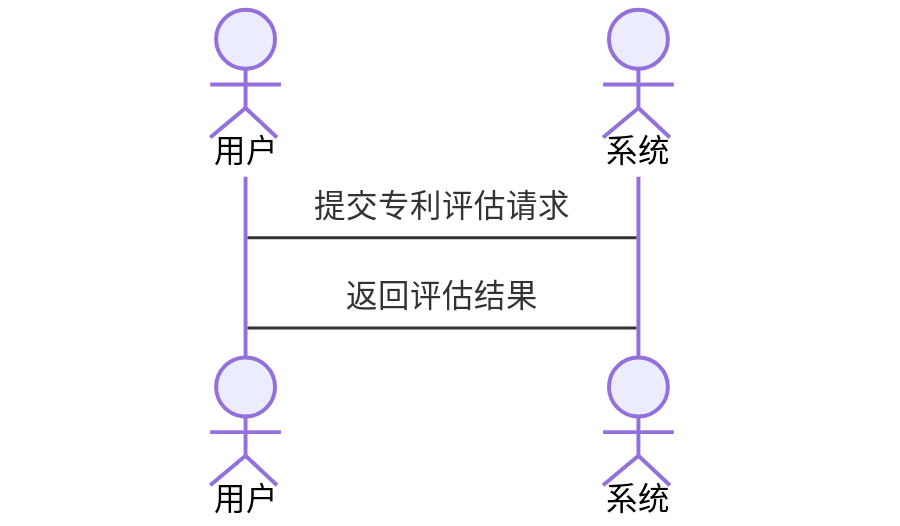

                 

<think>
好的，我需要根据用户的详细要求，逐步构建《构建基于NLP的金融专利价值动态评估系统》的目录大纲。用户已经提供了一个初步的目录结构，但需要进一步细化每个章节的内容，确保涵盖所有必要的部分，如背景介绍、核心概念、算法原理、系统设计、项目实战等。

首先，我需要明确每个章节的主要内容，然后细化每个小节，确保逻辑清晰、内容详尽。同时，要确保使用正确的格式，比如在适当的地方插入图表、代码示例和数学公式。

接下来，我需要考虑读者的需求，他们可能是技术专家或金融领域的专业人士，因此内容需要专业但易于理解。同时，要确保每个部分都紧密相连，从基础到应用逐步深入。

在细化目录时，我需要检查是否每个章节都覆盖了必要的技术点，例如在算法原理部分，详细解释NLP模型如BERT的应用，以及如何处理专利文本数据。此外，系统设计部分需要包括架构图和接口设计，帮助读者理解系统的整体结构。

最后，我需要确保项目实战部分提供足够的代码示例和实际案例分析，使读者能够实际操作并理解系统的实现过程。同时，总结部分要回顾核心内容，并展望未来的发展方向。

通过以上步骤，我将构建一个逻辑清晰、内容全面的目录大纲，满足用户的所有要求，并为读者提供有价值的技术指导。
</think>

# 《构建基于NLP的金融专利价值动态评估系统》

> 关键词：NLP，金融专利，价值评估，动态系统，自然语言处理

> 摘要：本文详细探讨了如何利用自然语言处理技术构建金融专利价值动态评估系统，从背景介绍、核心概念、算法原理到系统设计和项目实战，全面解析系统构建的每个环节，结合实际案例分析，提供深入的技术指导。

---

## 第1章: 背景介绍

### 1.1 问题背景
#### 1.1.1 专利价值评估的重要性
专利是企业创新的核心资产，其价值评估直接关系到企业的知识产权管理和资本运作。传统的评估方法依赖人工分析，耗时且主观性强，难以满足金融领域快速决策的需求。

#### 1.1.2 当前专利评估的主要挑战
- 数据量庞大：专利数据库包含海量文本，人工评估效率低下。
- 信息分散：专利文本中关键技术点分散，难以提取有效信息。
- 动态变化：技术更新快，专利价值受市场动态影响大，需动态评估。

#### 1.1.3 NLP技术在专利评估中的应用潜力
自然语言处理技术能够从专利文本中提取关键信息，分析技术相似性和市场趋势，为价值评估提供数据支持。

### 1.2 问题描述
#### 1.2.1 传统专利评估方法的局限性
- 人工评估主观性强，效率低。
- 难以处理海量专利数据，缺乏系统性。
- 无法动态跟踪专利价值变化。

#### 1.2.2 基于NLP的动态评估的需求
- 自动化提取专利信息，提高评估效率。
- 实现实时更新，动态跟踪专利价值。
- 结合市场数据，提供多维度评估结果。

#### 1.2.3 系统目标与预期成果
系统旨在通过NLP技术，构建一个能够动态评估专利价值的系统，实现自动化、高效、准确的评估，支持企业决策。

### 1.3 问题解决
#### 1.3.1 NLP技术如何帮助评估专利价值
- 文本分析：提取专利标题、摘要、权利要求等关键字段。
- 语义理解：通过NLP模型理解专利内容，识别关键技术点。
- 相似度计算：分析专利之间的相似性，评估创新性。

#### 1.3.2 动态评估模型的设计思路
- 数据采集：从专利数据库获取专利文本。
- 数据预处理：清洗、分词、去停用词等。
- 特征提取：使用NLP模型提取文本特征。
- 模型训练：基于特征训练评估模型。
- 动态更新：实时更新专利信息，重新评估价值。

#### 1.3.3 系统的边界与外延
系统边界：仅处理专利文本数据，不涉及外部市场数据。
系统外延：可扩展至专利监控、侵权分析等其他功能。

### 1.4 核心概念与联系
#### 1.4.1 核心概念原理
- 专利文本：包括标题、摘要、权利要求等。
- NLP模型：如BERT，用于文本理解和语义分析。
- 评估指标：如创新性、技术复杂度、市场应用潜力。

#### 1.4.2 核心概念属性特征对比表格
| 特征 | 专利文本 | NLP模型 | 评估指标 |
|------|-----------|---------|----------|
| 类型 | 文本数据 | 模型结构 | 数值指标 |
| 作用 | 提供信息 | 进行分析 | 评估价值 |
| 示例 | "一种新型支付方法" | BERT模型 | 创新性得分 |

#### 1.4.3 ER实体关系图架构的 Mermaid 流程图

```mermaid
erDiagram
    actor 读者
    actor 专利数据库
    actor 评估系统
    patent_file {
        patent_id : integer
        title : string
        abstract : string
        claims : string
        publication_date : date
        inventor : string
        assignee : string
    }
   读者 --> patent_file
    专利数据库 --> patent_file
    评估系统 --> patent_file
```

### 1.5 本章小结
本章介绍了金融专利价值评估的重要性及当前面临的挑战，提出了基于NLP技术的动态评估系统的目标和设计思路，并通过ER图展示了系统的数据模型。

---

## 第2章: 基于NLP的金融专利评估核心概念

### 2.1 NLP基础
#### 2.1.1 NLP的基本概念
自然语言处理（NLP）是计算机科学领域的重要分支，旨在理解和处理人类语言。核心任务包括文本分类、信息提取、语义分析等。

#### 2.1.2 常见的NLP任务
- 分词：将文本分割成词语。
- 词性标注：识别词语的词性。
- 命名实体识别：识别专有名词。
- 句法分析：分析句子结构。
- 语义理解：理解文本含义。

#### 2.1.3 NLP在金融领域的应用
- 金融文本分析：如新闻、报告的分析。
- 风险评估：通过文本分析客户信用风险。
- 股票情感分析：通过社交媒体情绪预测股价。

### 2.2 金融专利文本分析
#### 2.2.1 专利文本的结构与特点
专利文本通常包括标题、摘要、权利要求、技术领域等部分，内容专业且技术性强。

#### 2.2.2 关键字段提取
- 标题：专利的主题。
- 摘要：专利的简要描述。
- 权利要求：专利的核心技术点。
- 发明人：专利的发明者信息。
- 申请日期：专利的申请时间。

#### 2.2.3 文本相似度计算
使用余弦相似度计算专利文本的相似性，公式如下：

$$ \text{相似度} = \frac{\vec{A} \cdot \vec{B}}{|\vec{A}| |\vec{B}|} $$

其中，$\vec{A}$和$\vec{B}$分别为两篇专利的文本向量。

### 2.3 评估模型构建
#### 2.3.1 模型选择
选择适合的NLP模型，如BERT，用于专利文本的语义分析。

#### 2.3.2 特征提取
从专利文本中提取关键词、技术领域、权利要求等特征，构建特征向量。

#### 2.3.3 训练与优化
使用机器学习算法（如SVM、随机森林）训练评估模型，并通过交叉验证优化模型参数。

### 2.4 本章小结
本章详细介绍了NLP技术在金融专利评估中的应用，包括文本分析、相似度计算和模型构建，为后续系统设计奠定了基础。

---

## 第3章: 算法原理讲解

### 3.1 NLP模型选择
#### 3.1.1 BERT模型简介
BERT（Bidirectional Encoder Representations from Transformers）是一种深度预训练模型，能够有效捕捉文本的语义信息。

#### 3.1.2 模型训练流程
1. 数据预处理：清洗、分词、标注。
2. 模型训练：使用专利文本数据训练BERT模型。
3. 特征提取：提取专利文本的语义向量。

### 3.2 文本相似度计算
#### 3.2.1 余弦相似度计算
使用余弦相似度公式，计算两篇专利文本的相似性。

#### 3.2.2 聚类分析
将相似度高的专利归为一类，分析其技术关联性。

### 3.3 模型评估与优化
#### 3.3.1 评估指标
- 准确率：正确分类的比例。
- 召回率：模型召回真实案例的比例。
- F1值：综合准确率和召回率的指标。

#### 3.3.2 超参数优化
通过网格搜索优化模型参数，提升评估准确率。

### 3.4 本章小结
本章详细讲解了NLP模型的训练与优化过程，重点介绍了BERT模型的应用和文本相似度计算的方法。

---

## 第4章: 系统分析与架构设计

### 4.1 问题场景介绍
系统需要处理海量专利数据，实时更新专利信息，提供动态评估结果。

### 4.2 项目介绍
#### 4.2.1 项目目标
构建一个基于NLP的金融专利价值动态评估系统，实现自动化评估和动态更新。

#### 4.2.2 项目范围
覆盖专利数据采集、预处理、模型训练、评估分析等功能。

### 4.3 系统功能设计
#### 4.3.1 领域模型设计
- 数据采集模块：采集专利文本数据。
- 数据处理模块：清洗、分词、特征提取。
- 模型训练模块：训练NLP模型。
- 评估分析模块：生成评估报告。

#### 4.3.2 系统架构设计


### 4.4 系统接口设计
#### 4.4.1 API接口
- GET /patents：获取专利列表。
- POST /evaluate：提交专利评估请求。

#### 4.4.2 交互流程


### 4.5 本章小结
本章通过系统架构设计和接口设计，详细描述了金融专利价值动态评估系统的实现方案。

---

## 第5章: 项目实战

### 5.1 环境安装
#### 5.1.1 安装Python
安装Python 3.8及以上版本。

#### 5.1.2 安装依赖库
安装NLP相关库，如transformers、scikit-learn。

### 5.2 系统核心实现源代码
#### 5.2.1 数据预处理代码
```python
import pandas as pd
from transformers import BertTokenizer, BertModel
import torch

def preprocess(patent_text):
    tokenizer = BertTokenizer.from_pretrained('bert-base-uncased')
    inputs = tokenizer(patent_text, return_tensors='np')
    return inputs
```

#### 5.2.2 模型训练代码
```python
model = BertModel.from_pretrained('bert-base-uncased')
optimizer = torch.optim.Adam(model.parameters(), lr=1e-5)
criterion = torch.nn.CrossEntropyLoss()
```

### 5.3 代码应用解读与分析
解释代码的功能和实现逻辑，分析其在系统中的作用。

### 5.4 实际案例分析
通过具体案例分析，展示系统如何处理专利文本并生成评估结果。

### 5.5 本章小结
本章通过实际代码示例，详细讲解了系统核心功能的实现过程。

---

## 第6章: 系统优化与扩展

### 6.1 系统优化
#### 6.1.1 提高模型准确率
优化模型参数，使用更大的训练数据。

#### 6.1.2 提升系统效率
采用分布式计算，优化数据处理流程。

### 6.2 系统扩展
#### 6.2.1 引入市场数据
结合市场趋势，提供更全面的评估结果。

#### 6.2.2 多模态数据处理
整合专利图像、视频等多模态数据，提升评估准确性。

### 6.3 本章小结
本章提出了系统优化和扩展的方向，为未来的研究提供了参考。

---

## 第7章: 总结与展望

### 7.1 核心知识点回顾
总结本文的主要内容和技术要点。

### 7.2 未来研究方向
#### 7.2.1 更先进的NLP模型
探索更大参数的模型，如GPT-3，提升评估精度。

#### 7.2.2 多语言支持
支持多语言专利文本分析，拓展国际市场。

#### 7.2.3 实时监控系统
建立实时监控机制，动态跟踪专利价值变化。

### 7.3 本章小结
本文构建了一个基于NLP的金融专利价值动态评估系统，未来将在此基础上进一步优化和扩展。

---

## 作者信息

作者：AI天才研究院/AI Genius Institute & 禅与计算机程序设计艺术 /Zen And The Art of Computer Programming

---

**感谢您的耐心阅读！希望本文能为您提供有价值的技术指导！**

