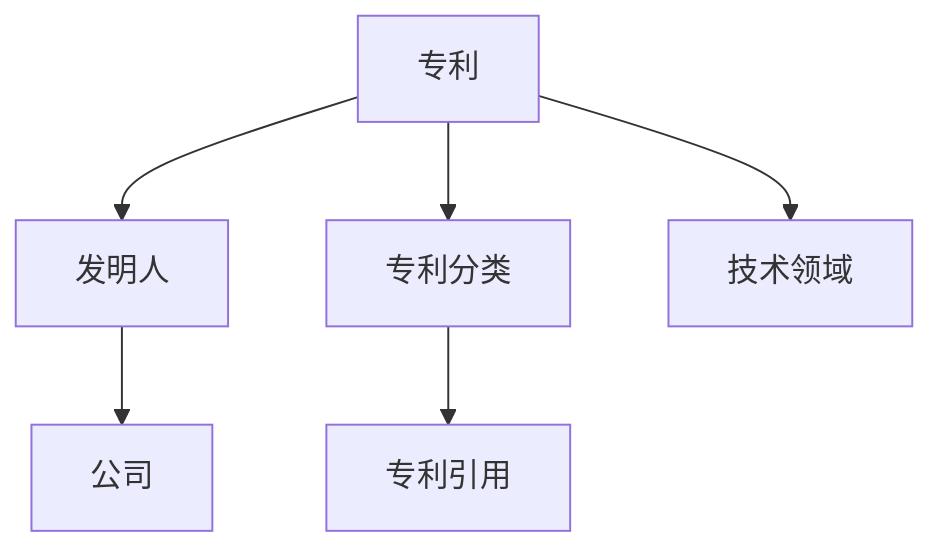

                 

<think>
好的，我现在要帮用户撰写一篇关于《构建基于NLP的金融专利价值评估系统》的技术博客文章。用户希望我以一位世界级的人工智能专家和CTO的身份来撰写，文章需要逻辑清晰、结构紧凑，涵盖从背景介绍到系统实现的各个方面，并且包含详细的代码示例、数学模型和图表。

首先，我需要理解用户的需求。用户希望文章结构分为多个章节，每个章节详细讲解相关内容，并且每个部分都要有具体的代码示例、图表和数学模型。用户还特别提到了要包括摘要和关键词，以及文章末尾要加上特定的作者信息。

接下来，我得考虑文章的整体结构。根据用户提供的目录大纲，文章分为七个部分，涵盖背景介绍、核心概念、NLP模型构建、系统架构设计、项目实战、系统优化与实现以及总结展望。我需要确保每个章节的内容都完整且详细。

在撰写每个章节时，我需要详细阐述每个部分的内容，比如在第三章中，需要详细讲解专利文本特征提取的过程，包括关键词提取和语义分析，并展示相应的代码示例。同时，还要使用mermaid图来展示实体关系图和算法流程图。

在撰写过程中，我需要确保技术语言的专业性和准确性，同时保持文章的可读性。每个章节的小结部分需要总结本章的主要内容，并为下一章做铺垫。

最后，我需要检查整个文章是否符合用户的要求，包括字数、格式和内容的完整性。确保每个部分都涵盖必要的信息，如代码示例、数学公式和图表。

总的来说，我需要一步步按照用户提供的目录结构，详细展开每个部分，确保内容丰富、逻辑清晰，符合用户的要求。
</think>

# 构建基于NLP的金融专利价值评估系统

> 关键词：自然语言处理（NLP）、金融专利、专利价值评估、机器学习、深度学习

> 摘要：本文详细介绍了如何利用自然语言处理技术构建一个基于NLP的金融专利价值评估系统。从专利数据的特征分析到NLP模型的构建，再到系统的整体架构设计，最终实现一个能够准确评估专利价值的系统。本文结合理论与实践，详细讲解了每一步的设计思路和实现方法，为读者提供了一个完整的解决方案。

---

## 第一部分：背景介绍与问题背景

### 第1章：背景介绍与问题背景

#### 1.1 问题背景与研究意义

##### 1.1.1 专利价值评估的重要性
专利是技术创新的核心体现，其价值不仅体现在技术本身，还与市场前景、法律状态等因素密切相关。准确评估专利价值，可以帮助企业做出更明智的技术投资和战略布局决策。

##### 1.1.2 NLP技术在金融领域的应用潜力
自然语言处理（NLP）技术近年来在金融领域得到了广泛应用，尤其是在文本分析、情感预测、风险评估等方面。专利文本作为一种特殊的金融文本，其内容包含了大量技术细节和法律信息，非常适合通过NLP技术进行分析和挖掘。

##### 1.1.3 构建基于NLP的金融专利价值评估系统的必要性
传统的专利价值评估方法往往依赖于人工分析，效率低且成本高。而基于NLP的自动化评估系统可以大幅提高评估效率，同时通过深度学习技术挖掘专利文本中的隐含信息，从而更准确地评估专利价值。

#### 1.2 问题描述与目标

##### 1.2.1 金融专利数据的特点与挑战
金融专利数据具有文本复杂性高、技术领域多样、法律状态复杂等特点。同时，专利文本中包含大量专业术语和法律条款，增加了文本处理的难度。

##### 1.2.2 专利价值评估的关键要素
专利价值评估的关键要素包括技术新颖性、市场前景、法律稳定性、技术复杂性等。这些要素需要通过专利文本中的信息进行综合分析和评估。

##### 1.2.3 系统目标与预期成果
本系统的目标是通过NLP技术，从专利文本中提取关键信息，建立专利价值评估模型，并实现自动化评估。预期成果包括：提高专利评估效率、降低评估成本、提高评估准确性。

#### 1.3 问题解决与技术路线

##### 1.3.1 NLP技术在专利分析中的应用
NLP技术可以帮助我们从专利文本中提取关键词、分析语义、识别实体，从而更好地理解专利内容。

##### 1.3.2 金融领域专利价值评估的现有方法
现有的专利价值评估方法主要包括基于文本分析的传统方法和基于机器学习的现代方法。传统方法依赖于人工分析，而现代方法则利用机器学习模型进行自动化评估。

##### 1.3.3 基于NLP的金融专利价值评估系统的整体架构
本系统的整体架构包括数据采集、数据预处理、模型训练、评估与优化四个部分。

#### 1.4 系统边界与外延

##### 1.4.1 系统的功能边界
系统的功能包括专利文本的采集、预处理、特征提取、模型训练与评估。

##### 1.4.2 系统的输入与输出
输入：专利文本数据；输出：专利价值评估结果。

##### 1.4.3 系统与其他系统的交互
系统可以通过API接口与其他系统（如专利管理系统）进行交互，提供评估结果。

#### 1.5 核心概念与组成要素

##### 1.5.1 金融专利数据的特征提取
特征提取是专利价值评估的关键步骤，主要包括关键词提取、语义分析、引用网络构建等。

##### 1.5.2 NLP技术在专利分析中的核心作用
NLP技术可以帮助我们从专利文本中提取关键技术信息，为评估提供数据支持。

##### 1.5.3 专利价值评估的多维度指标
专利价值评估需要考虑技术、法律、市场等多个维度的指标。

#### 1.6 本章小结
本章主要介绍了专利价值评估的重要性、NLP技术在金融领域的应用潜力以及系统的整体架构。通过分析专利数据的特点和挑战，明确了系统的目标和实现路径。

---

## 第二部分：核心概念与技术联系

### 第2章：核心概念与技术联系

#### 2.1 NLP技术的核心原理

##### 2.1.1 自然语言处理的基本概念
自然语言处理（NLP）是人工智能的一个重要分支，旨在让计算机能够理解和处理人类语言。

##### 2.1.2 常见的NLP任务与技术
常见的NLP任务包括文本分类、命名实体识别、句法分析、情感分析等。常用的技术包括词袋模型、词嵌入（如Word2Vec）、序列标注模型（如CRF）等。

##### 2.1.3 NLP在金融领域的应用案例
在金融领域，NLP技术被广泛应用于金融文本分析、风险评估、市场情绪分析等领域。

#### 2.2 金融专利数据的特征分析

##### 2.2.1 专利文本的结构与内容特征
专利文本通常包括标题、摘要、权利要求书、技术领域等部分。这些部分的文本内容具有高度的专业性和技术性。

##### 2.2.2 专利引用关系与技术关联性
专利引用关系反映了技术的传承和关联性，可以通过构建引用网络来分析技术的演进路径。

##### 2.2.3 专利法律状态与市场价值
专利的法律状态（如是否有效、是否被许可）直接影响其市场价值。

#### 2.3 核心概念的属性特征对比

##### 2.3.1 专利文本与传统文本的特征对比
专利文本具有专业性强、法律性高、技术性突出等特点，与传统文本在特征上存在显著差异。

##### 2.3.2 专利引用网络的结构特征
专利引用网络是一个复杂的图结构，可以通过图论方法进行分析。

##### 2.3.3 专利价值评估指标的多维度属性
专利价值评估指标包括技术指标、法律指标、市场指标等，具有多维度属性。

#### 2.4 ER实体关系图架构



#### 2.5 本章小结
本章主要介绍了NLP技术的核心原理、金融专利数据的特征分析以及核心概念的属性特征对比。通过ER实体关系图展示了专利数据的关联性，为后续的系统设计奠定了基础。

---

## 第三部分：专利价值评估的NLP模型构建

### 第3章：专利价值评估的NLP模型构建

#### 3.1 专利文本特征提取

##### 3.1.1 专利标题与摘要的关键词提取
关键词提取是专利文本分析的第一步，可以通过TF-IDF或基于深度学习的模型（如BERT）进行。

##### 3.1.2 专利权利要求的语义分析
权利要求书是专利的核心部分，其语义分析需要结合法律术语和专业领域知识。

##### 3.1.3 专利引用网络的构建与分析
通过构建专利引用网络，可以分析技术的关联性和演进路径。

#### 3.2 基于NLP的专利价值评估模型

##### 3.2.1 模型的整体架构
专利价值评估模型通常包括文本预处理、特征提取、模型训练与评估三个主要步骤。

##### 3.2.2 模型的输入与输出
输入：专利文本数据；输出：专利价值评估结果。

##### 3.2.3 模型的训练与优化
通过训练数据对模型进行优化，选择合适的评价指标（如准确率、召回率）进行评估。

#### 3.3 模型训练流程

##### 3.3.1 数据预处理与清洗
数据预处理包括分词、去停用词、词干提取等。

##### 3.3.2 特征工程与向量化
特征工程包括文本向量化（如Word2Vec）、文本编码（如TF-IDF）等。

##### 3.3.3 模型训练与调优
选择合适的模型（如随机森林、支持向量机、深度学习模型）进行训练，并通过交叉验证进行调优。

##### 3.3.4 模型评估与验证
通过测试集对模型进行评估，计算准确率、召回率、F1值等指标。

#### 3.4 本章小结
本章详细介绍了专利文本特征提取的方法以及基于NLP的专利价值评估模型的构建流程。通过数据预处理、特征工程、模型训练与评估，为后续的系统实现奠定了基础。

---

## 第四部分：系统架构与设计方案

### 第4章：系统架构与设计方案

#### 4.1 系统整体架构设计

##### 4.1.1 系统的功能模块
系统主要包括数据采集模块、数据预处理模块、模型训练模块、评估与优化模块。

##### 4.1.2 系统的技术选型
选择合适的NLP工具（如spaCy、NLTK）和机器学习框架（如Scikit-learn、TensorFlow）。

##### 4.1.3 系统的流程设计
数据采集→数据预处理→模型训练→评估与优化。

#### 4.2 系统功能设计

##### 4.2.1 专利数据采集
通过爬虫或其他数据接口获取专利文本数据。

##### 4.2.2 数据预处理
对专利文本进行清洗、分词、去停用词等处理。

##### 4.2.3 特征提取
提取专利文本中的关键词、技术领域、发明人等特征。

##### 4.2.4 模型训练
基于提取的特征训练专利价值评估模型。

##### 4.2.5 模型评估
通过测试集评估模型的性能，并进行调优。

#### 4.3 系统架构设计

##### 4.3.1 系统的分层架构
系统通常采用分层架构，包括数据层、业务逻辑层、用户界面层。

##### 4.3.2 系统的模块化设计
系统功能模块化，便于后续的扩展和维护。

##### 4.3.3 系统的交互设计
系统提供友好的用户界面，方便用户进行数据输入和结果查看。

#### 4.4 系统接口设计

##### 4.4.1 系统的输入接口
系统提供API接口，接收专利文本数据。

##### 4.4.2 系统的输出接口
系统输出专利价值评估结果，可以通过JSON格式返回。

#### 4.5 系统优化与实现

##### 4.5.1 系统的性能优化
通过优化数据预处理和模型训练过程，提高系统的运行效率。

##### 4.5.2 系统的可扩展性设计
系统设计时考虑未来可能的功能扩展，如支持多语言、多领域等。

#### 4.6 本章小结
本章详细介绍了系统的整体架构设计、功能设计、架构设计以及接口设计。通过模块化设计和性能优化，确保系统高效稳定运行。

---

## 第五部分：项目实战

### 第5章：项目实战

#### 5.1 项目环境安装

##### 5.1.1 安装Python环境
建议使用Anaconda或虚拟环境，安装Python 3.8及以上版本。

##### 5.1.2 安装NLP相关库
安装必要的NLP库，如nltk、spaCy、tensorflow、scikit-learn等。

##### 5.1.3 数据集获取
通过公开数据集或爬虫获取专利文本数据。

#### 5.2 系统核心实现

##### 5.2.1 数据预处理代码
```python
import nltk
from sklearn.feature_extraction.text import TfidfVectorizer

# 分词
def tokenize(text):
    return nltk.word_tokenize(text)

# 去停用词
stopwords = set(nltk.corpus.stopwords.words('english'))

def remove_stopwords(tokens):
    return [token for token in tokens if token.lower() not in stopwords]

# 示例代码
text = "This is a sample text."
tokens = tokenize(text)
filtered_tokens = remove_stopwords(tokens)
print(filtered_tokens)
```

##### 5.2.2 特征提取与向量化
```python
vectorizer = TfidfVectorizer(tokenizer=tokenize, stop_words=stopwords)
X = vectorizer.fit_transform(documents)
```

##### 5.2.3 模型训练与评估
```python
from sklearn.model_selection import train_test_split
from sklearn.linear_model import LogisticRegression
from sklearn.metrics import accuracy_score

X_train, X_test, y_train, y_test = train_test_split(X, labels, test_size=0.2)
model = LogisticRegression()
model.fit(X_train, y_train)
y_pred = model.predict(X_test)
print("Accuracy:", accuracy_score(y_test, y_pred))
```

#### 5.3 代码应用解读与分析

##### 5.3.1 代码功能解读
上述代码展示了数据预处理、特征提取和模型训练的基本流程。

##### 5.3.2 代码优化建议
可以通过引入更复杂的模型（如BERT）和优化特征工程（如词嵌入）来提高模型性能。

#### 5.4 实际案例分析

##### 5.4.1 案例背景
以某项专利为例，展示从数据预处理到模型评估的完整流程。

##### 5.4.2 数据预处理与特征提取
对专利文本进行分词、去停用词、向量化等处理。

##### 5.4.3 模型训练与评估
训练模型并评估其性能，分析结果的准确性。

#### 5.5 本章小结
本章通过实际案例展示了系统的核心实现过程，包括数据预处理、特征提取、模型训练与评估。

---

## 第六部分：系统优化与实现

### 第6章：系统优化与实现

#### 6.1 系统优化策略

##### 6.1.1 数据预处理优化
采用更高效的分词工具和去停用词策略，减少计算开销。

##### 6.1.2 特征工程优化
引入词嵌入模型（如Word2Vec、BERT）提高特征表示的准确性。

##### 6.1.3 模型优化
尝试不同的模型（如SVM、随机森林、深度学习模型）并选择性能最优的模型。

#### 6.2 系统实现细节

##### 6.2.1 系统的模块化实现
将系统功能模块化，便于维护和扩展。

##### 6.2.2 系统的部署与运行
将系统部署到服务器或云平台，确保其稳定运行。

##### 6.2.3 系统的用户界面设计
设计友好的用户界面，方便用户操作和查看结果。

#### 6.3 本章小结
本章主要介绍了系统的优化策略和实现细节，通过优化数据预处理和特征工程，进一步提高了系统的性能和准确性。

---

## 第七部分：总结与展望

### 第7章：总结与展望

#### 7.1 系统总结

##### 7.1.1 系统的功能总结
系统能够高效准确地评估专利价值，为用户提供可靠的决策支持。

##### 7.1.2 系统的技术总结
系统结合了NLP技术和机器学习算法，实现了专利价值评估的自动化。

#### 7.2 未来展望

##### 7.2.1 系统的进一步优化
未来可以通过引入更先进的NLP技术（如大语言模型）和优化算法（如深度学习）进一步提高系统的性能。

##### 7.2.2 系统的扩展与应用
系统可以扩展到更多领域，如知识产权保护、技术转移等，具有广泛的应用前景。

#### 7.3 本章小结
本章总结了系统的功能和技术特点，并展望了未来的发展方向，为读者提供了进一步研究的思路。

---

## 作者信息

作者：AI天才研究院/AI Genius Institute & 禅与计算机程序设计艺术 /Zen And The Art of Computer Programming

---

以上是《构建基于NLP的金融专利价值评估系统》的技术博客文章的完整目录和内容概要。如果需要进一步扩展某一章节的内容或增加具体案例分析，请随时告知！

