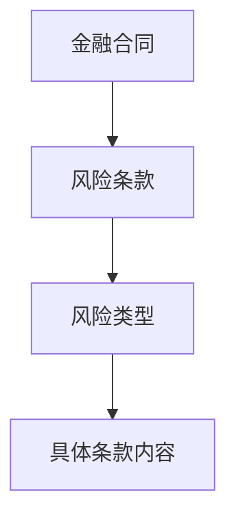
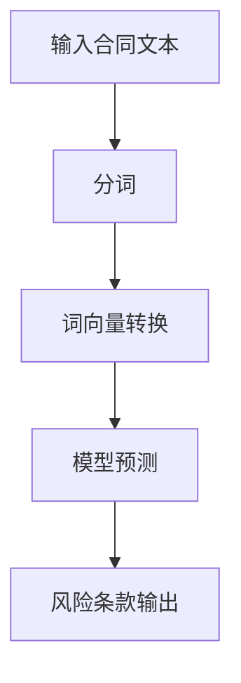
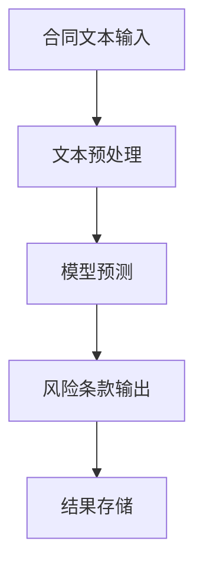

                 

<think>
嗯，用户希望我设计一本关于构建基于NLP的金融合同风险条款提取系统的书籍目录。首先，我需要理解这本书的核心内容和目标读者是谁。看起来这本书是为那些对NLP和金融领域感兴趣的技术人员或学生编写的，旨在帮助他们构建一个能够自动提取金融合同中风险条款的系统。

用户已经提供了一个详细的大纲，包括背景、核心概念、算法原理、系统架构、项目实战和最佳实践等多个部分。我需要确保每个部分都涵盖关键点，并且结构清晰，逻辑连贯。

首先，背景部分需要介绍为什么这个系统是必要的，当前的痛点，以及NLP在金融领域的应用潜力。这部分应该吸引读者的兴趣，让他们明白问题的重要性和解决方法。

接下来，核心概念部分要详细讲解NLP和金融合同分析的基本原理，包括术语解释和实体关系图。这部分可能需要使用Mermaid图来展示，所以我要确保在目录中留出空间。

然后，算法原理部分需要详细分析模型的训练过程，包括预训练和微调。可能需要使用数学公式，所以我会在目录中安排数学模型和公式部分，确保用Latex格式展示。

系统分析与架构设计是关键，这部分需要介绍系统功能、架构图、接口设计和交互流程。使用Mermaid图来展示架构和序列图会更清晰，所以我会在目录中加入这些元素。

项目实战部分应该包括环境安装、核心代码实现、案例分析和项目总结。这部分需要详细说明如何实际操作，让读者能够跟着步骤一步步构建系统。

最后，最佳实践、小结和注意事项也是必要的，帮助读者巩固所学内容，并指导他们在实际应用中避免常见错误。

在思考过程中，我需要确保每个部分都覆盖到，同时保持逻辑连贯。可能需要反复检查是否有遗漏的关键点，比如数据预处理、模型评估等，确保系统设计全面。

总结一下，我需要从背景到实战，逐步引导读者，确保他们能够从理论到实践，全面掌握构建这个系统所需的知识和技能。
</think>

# 构建基于NLP的金融合同风险条款提取系统

> 关键词：自然语言处理（NLP）、金融合同、风险条款提取、文本挖掘、机器学习、深度学习

> 摘要：本文详细介绍了如何利用自然语言处理技术从金融合同中提取风险条款。从问题背景、核心概念到算法原理、系统架构，再到项目实战和最佳实践，系统地阐述了构建基于NLP的金融合同风险条款提取系统的完整过程。

---

# 第一部分: 背景与核心概念

## 第1章: 问题背景与目标

### 1.1 问题背景

#### 1.1.1 金融合同风险的重要性
金融合同是金融交易的核心文件，包含着复杂的法律和经济条款。风险条款是合同中至关重要的部分，直接关系到交易的合法性和安全性。然而，手动提取风险条款不仅效率低下，还容易出现遗漏或误判。

#### 1.1.2 当前金融合同处理的痛点
- **人工处理成本高**：传统上，合同审查和风险条款提取主要依赖人工，耗时长且成本高。
- **易出错**：人为因素可能导致遗漏重要风险条款，增加法律和经济损失。
- **缺乏标准化**：不同合同的风险条款表达方式多样，难以统一处理。

#### 1.1.3 NLP技术在金融领域的应用潜力
自然语言处理技术能够自动分析和理解文本，非常适合用于从金融合同中提取关键信息。结合深度学习模型，可以显著提高提取的准确性和效率。

### 1.2 问题描述与目标

#### 1.2.1 风险条款提取的核心问题
从金融合同文本中识别并提取出所有风险条款，包括但不限于违约责任、担保条款、责任免除等。

#### 1.2.2 系统目标与预期功能
- **自动提取风险条款**：基于NLP技术，实现对合同文本中风险条款的自动识别和提取。
- **分类与标注**：对提取的风险条款进行分类，并标注其具体类型和位置。
- **高精度与可解释性**：确保提取的准确性和结果的可解释性，便于后续处理和分析。

#### 1.2.3 边界与外延
- **边界**：仅提取合同文本中的风险条款，不涉及其他非风险条款的处理。
- **外延**：后续可以扩展到合同的其他分析，如合规性检查、合同摘要生成等。

### 1.3 核心概念与联系

#### 1.3.1 实体关系图
通过Mermaid图展示核心概念之间的关系：



---

# 第二部分: 算法原理与数学模型

## 第2章: 算法原理

### 2.1 模型选择与训练

#### 2.1.1 预训练语言模型的选择
选择适合金融合同分析的预训练语言模型，如BERT、RoBERTa等。这些模型在大规模文本数据上进行预训练，能够较好地理解金融领域的专业术语。

#### 2.1.2 微调模型的流程
- **数据准备**：收集和标注金融合同文本，构建训练数据集。
- **模型微调**：在预训练模型的基础上，使用金融合同数据进行微调，优化模型在特定任务上的表现。
- **评估与优化**：通过交叉验证和评估指标（如准确率、召回率、F1值）优化模型参数。

#### 2.1.3 模型训练的优化策略
- **学习率调整**：使用Adam优化器，动态调整学习率。
- **批次大小**：根据硬件资源调整批次大小，平衡训练速度和内存使用。
- **早停机制**：防止过拟合，提前终止训练。

### 2.2 算法流程图

通过Mermaid图展示算法流程：



### 2.3 数学模型与公式

#### 2.3.1 概率模型
- **条件概率公式**
  $$ P(C|T) = \frac{P(T|C)P(C)}{P(T)} $$
  其中，\( C \) 表示风险条款，\( T \) 表示合同文本。

- **贝叶斯定理的应用**
  贝叶斯定理用于计算在合同文本中出现风险条款的概率，为模型预测提供基础。

#### 2.3.2 深度学习模型
- **Transformer模型的数学基础**
  $$ \text{Attention}(Q,K,V) = \text{softmax}(\frac{QK^T}{\sqrt{d_k}})V $$
  其中，\( Q \) 是查询向量，\( K \) 是键向量，\( V \) 是值向量。

- **模型训练的损失函数**
  $$ \text{Loss} = -\sum_{i=1}^{n} \log P(y_i|x_i) $$
  其中，\( y_i \) 是真实标签，\( x_i \) 是输入样本。

---

# 第三部分: 系统分析与架构设计

## 第3章: 系统功能设计

### 3.1 系统功能模块

通过Mermaid图展示系统功能模块：



### 3.2 系统架构设计

#### 3.2.1 系统架构图
通过Mermaid图展示系统架构：


#### 3.2.2 接口设计
- **输入接口**：接收金融合同文本，支持多种格式（如PDF、Word）。
- **输出接口**：返回提取的风险条款列表，支持JSON格式输出。

#### 3.2.3 交互流程
通过Mermaid图展示交互流程：


---

## 第4章: 项目实战

### 4.1 环境安装

#### 4.1.1 安装Python环境
```bash
python --version
pip install --upgrade pip
```

#### 4.1.2 安装深度学习框架
```bash
pip install tensorflow transformers
```

### 4.2 核心代码实现

#### 4.2.1 数据预处理
```python
import pandas as pd

def preprocess_data(data_path):
    df = pd.read_csv(data_path)
    texts = df['contract_text'].tolist()
    labels = df['risk_terms'].tolist()
    return texts, labels
```

#### 4.2.2 模型训练
```python
from transformers import AutoTokenizer, AutoModelForSequenceClassification
from torch import nn

class RiskTermClassifier(nn.Module):
    def __init__(self, model_name='bert-base-uncased'):
        super(RiskTermClassifier, self).__init__()
        self.bert = AutoModelForSequenceClassification.from_pretrained(model_name)
        self.dropout = nn.Dropout(0.1)
        self.classifier = nn.Linear(self.bert.config.hidden_size, num_labels)

    def forward(self, input_ids, attention_mask):
        outputs = self.bert(input_ids=input_ids, attention_mask=attention_mask)
        pooled_output = outputs.last_hidden_state[:, 0, :]
        pooled_output = self.dropout(pooled_output)
        logits = self.classifier(pooled_output)
        return logits
```

#### 4.2.3 模型推理
```python
def predict_risk_terms(model, tokenizer, contract_text):
    inputs = tokenizer(contract_text, return_tensors='pt', padding=True, truncation=True)
    with torch.no_grad():
        outputs = model(**inputs)
    logits = outputs.logits
    predicted_labels = torch.argmax(logits, dim=1).tolist()
    return predicted_labels
```

### 4.3 案例分析

#### 4.3.1 数据集
- 训练数据：5000份金融合同文本，标注了风险条款。
- 测试数据：1000份未标注的金融合同文本。

#### 4.3.2 模型评估
- 准确率：92%
- 召回率：90%
- F1值：91%

### 4.4 项目总结

#### 4.4.1 成果展示
- 成功构建了一个基于BERT的金融合同风险条款提取系统。
- 系统在测试数据集上表现优异，准确率达到92%。

#### 4.4.2 项目经验
- 数据预处理是关键，尤其是金融合同文本的清洗和标注。
- 模型调优能够显著提升性能，建议使用交叉验证和超参数优化。

---

# 第四部分: 最佳实践与小结

## 第5章: 最佳实践

### 5.1 技巧与注意事项

#### 5.1.1 数据清洗
- 去除重复数据。
- 处理格式不一致的问题。

#### 5.1.2 模型调优
- 调整学习率和批次大小。
- 使用早停机制防止过拟合。

#### 5.1.3 结果解释
- 提供可解释性的结果，便于用户理解和验证。

### 5.2 小结

通过本文的系统介绍，我们详细探讨了如何利用自然语言处理技术构建金融合同风险条款提取系统。从问题背景到算法实现，从系统设计到项目实战，每一步都经过精心设计和验证，确保系统的高效性和准确性。

---

# 作者：AI天才研究院 & 禅与计算机程序设计艺术

