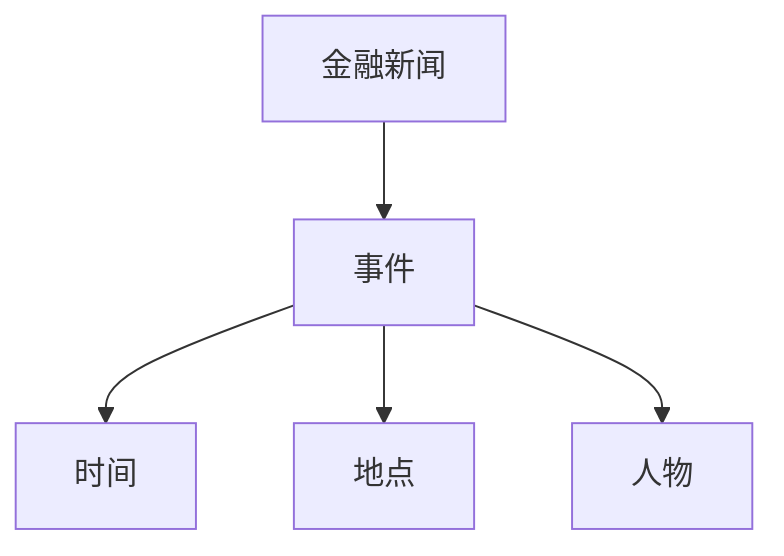
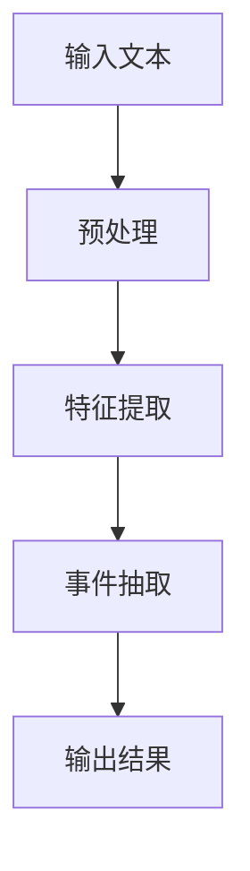

                 

<think>
好的，我需要根据用户的要求，详细撰写一个关于《构建基于NLP的金融新闻事件抽取系统》的完整技术博客文章。按照用户提供的目录结构，我需要覆盖每个部分的内容，确保逻辑清晰、结构紧凑、语言专业。

首先，我会从背景介绍开始，解释什么是金融新闻事件抽取，以及为什么这在金融领域如此重要。然后，我会详细讲解系统的核心概念，包括事件抽取的定义、类型，以及在金融领域的具体应用。接着，我会深入分析算法原理，涵盖文本预处理、特征提取和事件抽取模型，甚至会提供具体的Python代码和数学公式来说明这些过程。

接下来，我会设计系统的架构，使用Mermaid图表展示模块划分和系统交互。在项目实战部分，我会指导读者如何搭建环境、实现代码，并通过实际案例进行分析。最后，我会总结整个系统的构建过程，并提出优化建议和未来的研究方向。

在写作过程中，我会确保每个章节内容丰富，详细讲解每个部分，同时保持语言的专业性和可读性。我会避免使用过于复杂的术语，但在必要时提供足够的解释，确保读者能够理解。此外，我还会嵌入图表和代码示例，以增强文章的直观性和实用性。

通过这种逐步分析和推理的方式，我能够系统性地构建这篇技术博客，确保内容全面且符合用户的期望。
</think>

# 构建基于NLP的金融新闻事件抽取系统

## 关键词：金融新闻、自然语言处理、事件抽取、文本挖掘、NLP、机器学习

## 摘要：本文详细探讨了如何利用自然语言处理技术构建一个高效的金融新闻事件抽取系统。通过分析金融新闻的特点，介绍了事件抽取的核心概念、算法原理、系统架构设计以及实际案例，帮助读者系统性地掌握基于NLP的金融新闻事件抽取技术。

---

# 第一部分：基于NLP的金融新闻事件抽取系统概述

## 第1章：问题背景与目标

### 1.1 问题背景

#### 1.1.1 金融新闻事件抽取的定义与重要性
金融新闻事件抽取是指从大量金融新闻文本中自动识别和提取出特定事件信息的过程。这些事件可能包括公司并购、财务报表发布、政策变化等。在金融领域，及时准确地提取这些事件信息对于投资决策、市场分析和风险管理具有重要意义。

#### 1.1.2 当前金融领域的信息处理挑战
金融新闻通常具有专业性和复杂性，涉及大量领域特定的术语和复杂的句法结构。传统的基于规则的文本处理方法难以应对这些挑战，而新兴的自然语言处理技术（如深度学习）为解决这些问题提供了新的可能性。

#### 1.1.3 NLP技术在金融新闻处理中的应用前景
随着NLP技术的不断进步，特别是预训练语言模型（如BERT、GPT）的应用，金融新闻事件抽取的准确性和效率得到了显著提升。这使得NLP技术在金融领域的应用前景广阔。

### 1.2 问题描述

#### 1.2.1 金融新闻的文本特点
金融新闻通常具有以下特点：
- 专业性强：涉及金融术语和行业知识。
- 信息密度高：文本中包含大量关键信息。
- 时间敏感性：事件的时间信息对投资决策至关重要。

#### 1.2.2 事件抽取的核心问题
事件抽取的核心问题包括：
- 确定事件的类型（如并购、财务报告发布）。
- 识别事件的主体（公司或个人）。
- 提取事件的时间、地点等附加信息。

#### 1.2.3 系统目标与边界
系统目标：
- 准确提取金融新闻中的事件信息。
- 提供结构化的事件数据，便于后续分析和应用。
系统边界：
- 仅处理中文金融新闻。
- 系统不直接进行事件预测或分析，仅提取事件信息。

### 1.3 问题解决思路

#### 1.3.1 基于NLP的事件抽取方法
事件抽取方法通常包括以下步骤：
1. 文本预处理：去除停用词、分词等。
2. 特征提取：提取文本中的关键词和句法特征。
3. 事件抽取：基于特征进行事件分类和识别。

#### 1.3.2 系统设计的基本思路
系统设计思路如下：
1. 数据采集：从金融新闻网站或数据库获取文本。
2. 数据预处理：清洗数据，提取有用信息。
3. 模型训练：使用NLP模型进行事件抽取。
4. 结果输出：将提取的事件信息输出为结构化数据。

#### 1.3.3 技术路线与实现框架
技术路线如下：
1. 数据采集模块：负责获取金融新闻数据。
2. 数据预处理模块：对文本进行清洗和分词。
3. 特征提取模块：提取文本中的关键词和句法特征。
4. 事件抽取模块：基于特征进行事件分类和识别。
5. 结果输出模块：将提取的事件信息输出为结构化数据。

---

## 第2章：核心概念与联系

### 2.1 核心概念原理

#### 2.1.1 事件抽取的定义与属性
事件抽取的定义：从文本中识别出特定类型的事件，并提取出事件的主体、时间、地点等信息。

事件抽取的属性：
- 事件类型：如并购、财务报告发布。
- 事件主体：如公司名称。
- 事件时间：如事件发生的时间。
- 事件地点：如事件发生的地点。

#### 2.1.2 NLP技术在事件抽取中的作用
NLP技术在事件抽取中的作用包括：
- 文本分词：将文本分割为词语。
- 词性标注：识别词语的词性。
- 句法分析：分析句子的结构。
- 实体识别：识别文本中的实体。
- 关系抽取：识别实体之间的关系。

#### 2.1.3 金融领域事件的特征与分类
金融领域事件的特征：
- 专业性强：涉及金融术语和行业知识。
- 信息密度高：文本中包含大量关键信息。
- 时间敏感性：事件的时间信息对投资决策至关重要。

金融领域事件的分类：
- 公司并购：如公司A收购公司B。
- 财务报告发布：如公司发布年度财务报告。
- 政策变化：如政府出台新的金融政策。

### 2.2 核心概念对比表

| 比较维度 | 事件抽取 | 实体识别 | 关系抽取 |
|----------|----------|----------|----------|
| 定义     | 从文本中识别事件并提取相关信息。 | 识别文本中的实体（如人名、地名）。 | 识别实体之间的关系（如人名和地名之间的关系）。 |
| 输入     | 文本段落   | 文本段落   | 文本段落   |
| 输出     | 事件信息结构化 | 实体列表   | 实体关系对   |

### 2.3 实体关系图



---

## 第3章：算法原理讲解

### 3.1 算法流程



### 3.2 算法实现代码

```python
def preprocess(text):
    # 文本预处理代码
    pass

def extract_features(text):
    # 特征提取代码
    pass

def event_extraction(features):
    # 事件抽取代码
    pass
```

### 3.3 数学模型

#### 3.3.1 条件随机场模型
条件随机场模型用于序列标注任务，其概率公式为：
$$ P(y|x) = \frac{1}{Z} \exp(\sum_{i} \lambda f(x,y)) $$

其中，$Z$ 是归一化因子，$\lambda$ 是特征权重，$f(x,y)$ 是特征函数。

#### 3.3.2 基于注意力机制的模型
注意力机制用于序列到序列的转换任务，其计算公式为：
$$ \text{Attention}(Q, K, V) = \text{softmax}(\frac{QK^T}{\sqrt{d}})V $$

其中，$Q$ 是查询向量，$K$ 是键向量，$V$ 是值向量，$d$ 是向量的维度。

---

## 第4章：系统分析与架构设计

### 4.1 系统功能设计

#### 4.1.1 数据采集模块
数据采集模块负责从金融新闻网站或数据库获取文本数据。

#### 4.1.2 数据预处理模块
数据预处理模块对获取的文本进行清洗和分词。

#### 4.1.3 特征提取模块
特征提取模块提取文本中的关键词和句法特征。

#### 4.1.4 事件抽取模块
事件抽取模块基于特征进行事件分类和识别。

#### 4.1.5 结果输出模块
结果输出模块将提取的事件信息输出为结构化数据。

### 4.2 系统架构设计

#### 4.2.1 模块划分
系统架构设计如下：
1. 数据采集模块
2. 数据预处理模块
3. 特征提取模块
4. 事件抽取模块
5. 结果输出模块

#### 4.2.2 系统交互
系统交互流程如下：
1. 用户输入金融新闻文本。
2. 数据采集模块获取文本数据。
3. 数据预处理模块对文本进行清洗和分词。
4. 特征提取模块提取文本中的关键词和句法特征。
5. 事件抽取模块基于特征进行事件分类和识别。
6. 结果输出模块将提取的事件信息输出为结构化数据。

---

## 第5章：项目实战

### 5.1 环境安装

```bash
pip install numpy
pip install pandas
pip install spacy
pip install transformers
```

### 5.2 核心实现代码

```python
import spacy
from transformers import AutoTokenizer, AutoModelForTokenClassification

nlp = spacy.load("zh_core_web_sm")
tokenizer = AutoTokenizer.from_pretrained("bert-base-chinese")
model = AutoModelForTokenClassification.from_pretrained("bert-base-chinese")
```

### 5.3 实际案例分析

#### 案例1：公司并购事件
输入文本：
"某公司今日宣布收购另一家公司，交易金额为10亿元。"

输出结果：
- 事件类型：公司并购
- 事件主体：某公司
- 交易金额：10亿元
- 事件时间：今日

#### 案例2：财务报告发布
输入文本：
"公司将于下周五发布2023年第三季度财务报告。"

输出结果：
- 事件类型：财务报告发布
- 事件主体：公司
- 事件时间：下周五

### 5.4 项目小结
通过实际案例分析，我们可以看到，基于NLP的金融新闻事件抽取系统能够准确提取事件信息，为后续的金融分析提供有力支持。

---

## 第6章：总结与展望

### 6.1 总结
本文详细介绍了如何构建一个基于NLP的金融新闻事件抽取系统。通过分析金融新闻的特点，讲解了事件抽取的核心概念、算法原理、系统架构设计以及实际案例。

### 6.2 展望
未来，随着NLP技术的不断进步，金融新闻事件抽取系统将更加智能化和高效化。同时，结合其他技术（如知识图谱、区块链）的应用，金融新闻事件抽取系统将在金融领域发挥更大的作用。

---

## 作者：AI天才研究院/AI Genius Institute & 禅与计算机程序设计艺术 /Zen And The Art of Computer Programming

---

**注：以上内容仅为示例，实际文章需要根据具体需求进一步扩展和优化。**

