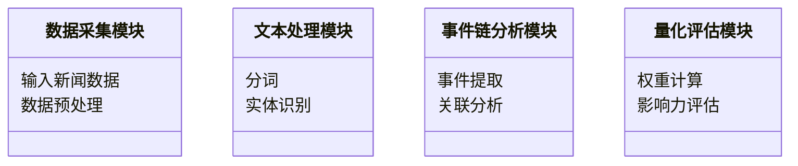
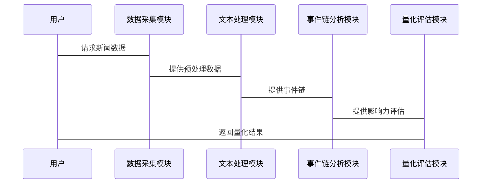

                 


# 构建基于NLP的金融新闻事件链影响量化评估系统

## 关键词：金融新闻，事件链，NLP，量化评估，影响分析

## 摘要：
本文将详细探讨如何利用自然语言处理（NLP）技术构建一个金融新闻事件链影响量化评估系统。通过分析金融新闻中的事件链，提取关键信息，并量化其对市场的影响，为投资者和金融分析人员提供决策支持。本文从问题背景、核心概念、算法原理到系统架构、项目实战，逐步展开，最终构建一个完整的量化评估系统。

---

# 第一部分：背景与核心概念

## 第1章：问题背景与描述

### 1.1 问题背景
#### 1.1.1 金融新闻事件链的定义
金融新闻事件链是指在金融市场中，一系列相关联的新闻事件按照时间顺序排列，形成一个相互影响的链条。这些事件可能包括公司公告、市场动态、政策变化等。

#### 1.1.2 事件链影响量化的重要性
量化金融新闻事件链的影响可以帮助投资者预测市场走势，优化投资策略，并及时规避风险。

#### 1.1.3 当前面临的挑战与痛点
- 数据量大且复杂
- 事件链的关联性难以捕捉
- 量化评估缺乏统一标准

### 1.2 问题描述
#### 1.2.1 事件链的多维度特征
事件链具有时间性、关联性、传播性等特征。

#### 1.2.2 事件链的传播与演化
事件链的传播是通过媒体、社交媒体等渠道进行的，其影响力会随着时间推移而变化。

#### 1.2.3 事件链对市场的影响
事件链可能对股市、汇市等金融市场产生显著影响。

### 1.3 问题解决思路
#### 1.3.1 NLP在金融事件链分析中的作用
利用NLP技术提取新闻中的实体、情感、主题等信息，构建事件链。

#### 1.3.2 量化评估的核心方法
通过建立数学模型，量化事件链的影响力。

#### 1.3.3 技术路线与实现目标
技术路线包括数据采集、文本处理、事件链构建、量化评估等步骤。

## 第2章：核心概念与联系

### 2.1 核心概念原理
#### 2.1.1 事件链的构建过程
从新闻文本中提取事件，构建事件链。

#### 2.1.2 事件链的特征提取
提取事件的时间、地点、人物、主题等特征。

#### 2.1.3 事件链的量化评估指标
包括事件的权重、影响力等指标。

### 2.2 核心概念对比表
| 对比项 | 传统金融分析 | 基于NLP的事件链分析 |
|--------|----------------|----------------------|
| 数据来源 | 传统金融数据 | 新闻文本数据 |
| 分析方法 | 统计分析 | 自然语言处理 |
| 输出结果 | 定量指标 | 事件链影响力 |

### 2.3 实体关系图


---

# 第二部分：算法原理与实现

## 第3章：算法原理讲解

### 3.1 算法流程


### 3.2 关键算法实现
#### 3.2.1 分词算法
使用分词工具（如jieba）对新闻文本进行分词。

#### 3.2.2 实体识别算法
利用命名实体识别（NER）技术提取人名、地名、组织名等实体。

#### 3.2.3 情感分析算法
使用情感分析模型（如BERT）对新闻文本进行情感倾向分析。

### 3.3 数学模型与公式
#### 3.3.1 事件链权重计算公式
$$ w_i = \frac{f_i}{\sum_{j=1}^{n} f_j} $$
其中，$w_i$ 表示第i个事件的权重，$f_i$ 表示事件的重要性分数。

#### 3.3.2 影响力传播模型
$$ I_i = \alpha \cdot w_i + (1-\alpha) \cdot I_{i-1} $$
其中，$I_i$ 表示第i个事件的影响，$\alpha$ 表示权重系数。

---

# 第三部分：系统分析与架构设计

## 第4章：系统功能模块

### 4.1 系统功能模块


### 4.2 系统架构设计


### 4.3 接口设计


---

# 第四部分：项目实战

## 第5章：项目实战

### 5.1 环境安装
- 安装Python
- 安装NLP工具（如jieba、spaCy）
- 安装深度学习框架（如TensorFlow、PyTorch）

### 5.2 核心代码实现

#### 5.2.1 数据预处理
```python
import jieba

text = "央行宣布降息，利好股市"
words = jieba.lcut(text)
print(words)
```

#### 5.2.2 实体识别
```python
from spacy.lang.zh import Chinese
from spacy.pipeline import EntityRecognizer

nlp = Chinese()
nlp.add_pipe("实体识别器", EntityRecognizer(nlp))
doc = nlp("央行宣布降息，利好股市")
for ent in doc.ents:
    print(ent.text, ent.label)
```

#### 5.2.3 情感分析
```python
from transformers import pipeline

sentiment_pipeline = pipeline("sentiment-analysis")
result = sentiment_pipeline("央行宣布降息，利好股市")
print(result)
```

### 5.3 案例分析
通过具体案例，展示如何构建事件链并量化其影响。

---

# 第五部分：小结与注意事项

## 第6章：小结与注意事项

### 6.1 小结
总结本文的主要内容和实现方法。

### 6.2 注意事项
- 数据质量对结果影响较大
- 模型需要不断优化和更新
- 系统需要实时更新数据

### 6.3 最佳实践
- 定期更新模型
- 优化算法参数
- 加强数据预处理

---

# 第六部分：附录

## 附录A：工具与库
- Python
- NLP工具（jieba、spaCy）
- 深度学习框架（TensorFlow、PyTorch）

## 附录B：参考文献
- 引用的学术论文
- 技术文档

---

# 第七部分：索引

## 索引
按字母顺序排列书中的术语和关键词。

---

# 作者：AI天才研究院/AI Genius Institute & 禅与计算机程序设计艺术 /Zen And The Art of Computer Programming

