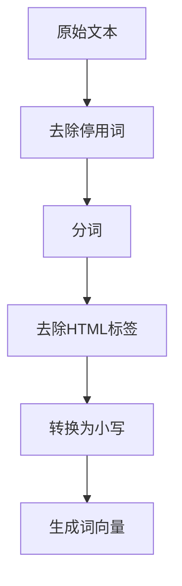
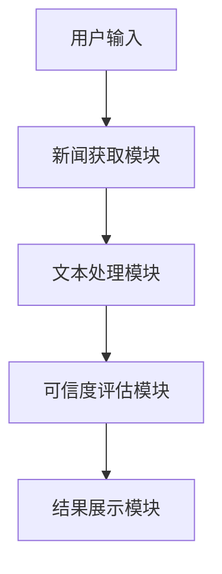
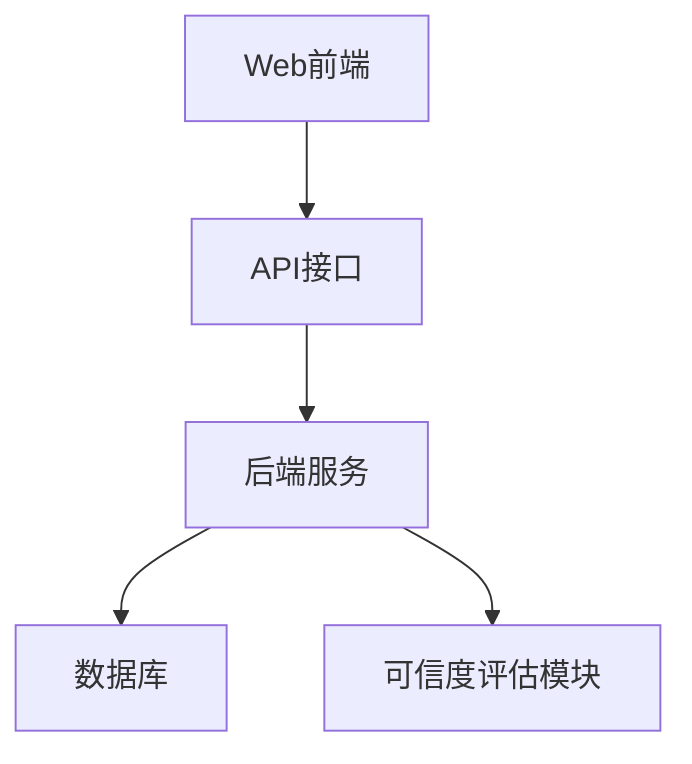
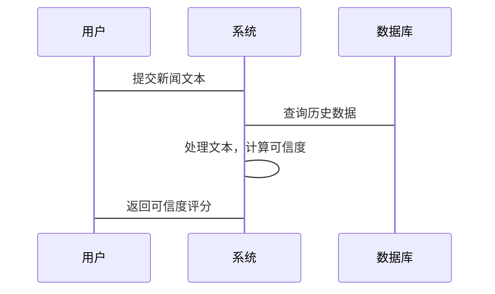

                 


# 构建基于NLP的金融新闻可信度评估系统

> 关键词：金融新闻可信度，NLP技术，自然语言处理，文本挖掘，机器学习，金融数据分析

> 摘要：本文详细探讨了如何利用自然语言处理（NLP）技术构建一个金融新闻可信度评估系统。通过分析金融新闻的文本内容，结合文本挖掘和机器学习算法，评估新闻的可信度。文章从问题背景、核心概念、算法原理、系统架构到项目实战，全面阐述了系统的构建过程，为金融领域的信息筛选和决策提供技术支持。

---

# 第一部分：背景介绍

## 第1章：问题背景与描述

### 1.1 问题背景

在当今信息爆炸的时代，金融新闻的数量呈指数级增长，但信息的可信度参差不齐。投资者和金融从业者需要快速筛选出可信的新闻，以做出明智的决策。然而，传统的方法依赖人工经验，效率低下且容易受到主观因素影响。因此，利用自然语言处理技术构建一个自动化的金融新闻可信度评估系统显得尤为重要。

#### 1.1.1 金融新闻可信度的重要性
金融市场的波动性极强，信息的准确性和及时性直接影响投资决策。可信的新闻能够帮助投资者捕捉市场趋势，避免因虚假信息导致的损失。

#### 1.1.2 当前金融信息的可靠性问题
随着社交媒体和新闻平台的兴起，虚假新闻和误导性信息泛滥。如何快速识别这些信息的可信度，成为金融机构和投资者面临的重大挑战。

#### 1.1.3 NLP技术在金融领域的应用潜力
自然语言处理技术能够从大量文本中提取有价值的信息，通过模式识别和分类算法，帮助评估新闻的可信度。

### 1.2 问题描述

#### 1.2.1 金融新闻可信度评估的定义
金融新闻可信度评估是指通过分析新闻的内容、来源和语境，判断新闻的可靠性和准确性。

#### 1.2.2 可信度评估的关键要素
- **信息来源**：新闻的发布机构是否权威。
- **内容质量**：新闻是否包含事实性错误或误导性信息。
- **语境分析**：新闻是否符合市场逻辑和常识。

#### 1.2.3 评估系统的目标与范围
系统的目标是通过NLP技术，自动化评估金融新闻的可信度，提供可量化的评估结果。

### 1.3 问题解决

#### 1.3.1 NLP技术在可信度评估中的作用
NLP技术可以提取新闻中的关键词、主题，并通过情感分析判断新闻的倾向性。

#### 1.3.2 系统构建的必要性
自动化评估系统能够显著提高信息筛选效率，降低人工判断的主观性。

#### 1.3.3 可信度评估的量化方法
通过构建评分模型，将新闻的可信度量化为一个分数，便于后续分析和决策。

### 1.4 系统边界与外延

#### 1.4.1 系统的功能边界
系统主要负责新闻的文本分析和可信度评分，不涉及新闻的实时获取和推送。

#### 1.4.2 系统的适用范围
适用于多种金融新闻来源，包括新闻网站、社交媒体和行业报告。

#### 1.4.3 系统的扩展性与灵活性
系统设计具有良好的扩展性，可以新增多种评估指标和算法。

---

# 第二部分：核心概念与联系

## 第2章：NLP技术基础

### 2.1 NLP的基本原理

#### 2.1.1 自然语言处理的定义
NLP是研究人类语言的计算机科学分支，旨在实现人机交互中的语言理解与生成。

#### 2.1.2 NLP的主要任务与技术
- **文本预处理**：分词、停用词去除、词干提取。
- **特征提取**：TF-IDF、词嵌入（Word2Vec）。
- **文本分类**：朴素贝叶斯、支持向量机（SVM）。
- **序列模型**：RNN、LSTM、Transformer。

#### 2.1.3 NLP在金融领域的应用案例
- 金融情感分析：判断市场情绪。
- 信息提取：从新闻中提取公司财报数据。
- 风险评估：分析新闻中的负面关键词。

### 2.2 金融新闻分析的NLP方法

#### 2.2.1 文本预处理技术
- 去除停用词：提高关键词提取的准确性。
- 分词：将中文新闻分割成词语。
- 去除HTML标签：处理网页新闻中的标记。

#### 2.2.2 关键词提取与主题分析
- 使用TF-IDF提取关键词。
- 利用LDA主题模型分析新闻主题。

#### 2.2.3 情感分析与情绪识别
- 判断新闻的情感倾向（正面/负面/中性）。
- 识别新闻中的情绪变化。

### 2.3 NLP模型的选择与优化

#### 2.3.1 常见NLP模型介绍
- **Bag-of-Words (BoW)**：简单但效果有限。
- **TF-IDF**：适合文本分类任务。
- **Word2Vec**：生成词向量表示。
- **BERT**：预训练语言模型，效果优秀。

#### 2.3.2 模型选择的策略与依据
根据任务需求选择模型，例如，情感分析任务适合使用BERT，而关键词提取可以使用TF-IDF。

#### 2.3.3 模型优化与调参方法
- 调整超参数：学习率、批次大小。
- 数据增强：增加训练数据的多样性。
- 交叉验证：评估模型的泛化能力。

## 第3章：金融新闻可信度评估的核心概念

### 3.1 金融新闻可信度的定义与特征

#### 3.1.1 可信度的多维度评估
- **信息来源**：权威媒体可信度高。
- **内容质量**：事实准确、逻辑清晰。
- **语境一致性**：新闻内容与市场常识一致。

#### 3.1.2 信息来源的可信度
- 媒体声誉：新华社、华尔街日报等权威媒体。
- 发布历史：历史报道的准确性。

#### 3.1.3 内容质量的评估标准
- 事实性：新闻内容是否准确。
- 完整性：新闻是否全面报道事件。
- 逻辑性：新闻内容是否符合市场逻辑。

### 3.2 金融新闻可信度的评估指标

#### 3.2.1 多维度评估指标
- **信息来源得分**：0-10分，分数越高可信度越高。
- **内容质量得分**：0-10分。
- **综合可信度得分**：综合来源和内容的加权分数。

#### 3.2.2 评估指标的权重分配
- 权重：信息来源占40%，内容质量占60%。

#### 3.2.3 综合可信度计算公式
$$ \text{综合可信度} = 0.4 \times \text{信息来源得分} + 0.6 \times \text{内容质量得分} $$

### 3.3 核心要素的组成与关系

#### 3.3.1 核心要素的层次结构
- **顶层要素**：信息来源、内容质量。
- **底层要素**：事实性、完整性、逻辑性。

#### 3.3.2 核心要素的组成
- **事实性**：新闻内容是否真实。
- **完整性**：新闻是否全面报道事件。
- **逻辑性**：新闻内容是否符合市场逻辑。

### 3.4 核心概念的ER实体关系图

```mermaid
er
actor NewsSource {
  id (integer,PK)
  name (string)
  reputation (integer)
}
actor NewsItem {
  id (integer,PK)
  title (string)
  content (string)
  source_id (integer,FK)
  publish_time (datetime)
}
```

---

## 第4章：核心概念与联系

### 4.1 核心概念的联系

#### 4.1.1 NLP技术与可信度评估的联系
- NLP技术为可信度评估提供文本分析工具。
- 可信度评估为NLP技术提供应用场景。

#### 4.1.2 信息来源与内容质量的关系
- 信息来源影响内容质量的评估权重。

#### 4.1.3 综合可信度的计算方式
通过加权计算，综合信息来源和内容质量，得出新闻的可信度评分。

---

# 第三部分：算法原理

## 第4章：算法原理

### 4.1 文本预处理流程



### 4.2 特征提取方法

#### 4.2.1 TF-IDF计算公式
$$ \text{TF-IDF}(t, d) = \text{TF}(t, d) \times \text{IDF}(t) $$
其中，TF是词频，IDF是逆文档频率。

#### 4.2.2 词嵌入模型
使用Word2Vec将词语转换为向量表示，向量维度通常为100-300维。

### 4.3 分类模型

#### 4.3.1 朴素贝叶斯分类器
- 优点：简单高效，适合小数据集。
- 缺点：对特征假设的独立性假设容易受到挑战。

#### 4.3.2 支持向量机（SVM）
- 优点：适合高维数据，分类效果好。
- 缺点：计算复杂度较高。

#### 4.3.3 深度学习模型（BERT）
- 优点：上下文理解能力强，效果优秀。
- 缺点：计算资源消耗大。

### 4.4 算法实现步骤

#### 4.4.1 数据预处理
1. 去除停用词。
2. 分词。
3. 转换为向量表示。

#### 4.4.2 模型训练
1. 选择合适的模型（如TF-IDF + SVM）。
2. 调整超参数。
3. 训练模型。

#### 4.4.3 模型评估
1. 划分训练集和测试集。
2. 计算准确率、召回率和F1分数。

---

# 第四部分：系统分析与架构设计

## 第5章：系统分析与架构设计

### 5.1 项目介绍

#### 5.1.1 项目目标
构建一个基于NLP的金融新闻可信度评估系统，帮助投资者快速筛选可信新闻。

#### 5.1.2 项目范围
系统支持多种金融新闻来源，包括新闻网站、社交媒体和行业报告。

### 5.2 系统功能设计

#### 5.2.1 系统功能模块
- **新闻获取模块**：获取新闻数据。
- **文本处理模块**：预处理和特征提取。
- **可信度评估模块**：计算可信度评分。
- **结果展示模块**：可视化展示评估结果。

#### 5.2.2 功能模块的交互流程


### 5.3 系统架构设计

#### 5.3.1 系统架构图


#### 5.3.2 系统接口设计
- API接口：提供RESTful接口，接收新闻文本，返回可信度评分。
- 数据库：存储新闻数据和评估结果。

### 5.4 系统交互设计

#### 5.4.1 系统交互流程


---

## 第6章：项目实战

### 6.1 环境安装

#### 6.1.1 安装Python环境
```bash
python --version
pip install --upgrade pip
```

#### 6.1.2 安装依赖包
```bash
pip install numpy pandas scikit-learn transformers
```

### 6.2 系统核心实现

#### 6.2.1 文本预处理代码
```python
import pandas as pd
from sklearn.feature_extraction.text import TfidfVectorizer
from sklearn.svm import SVC
from sklearn.metrics import accuracy_score

# 示例数据
data = pd.DataFrame({
    'text': ['Market trends positive', 'Company revenue increased'],
    'label': [1, 0]
})

# TF-IDF特征提取
vectorizer = TfidfVectorizer()
X = vectorizer.fit_transform(data['text'])
y = data['label']

# 训练SVM模型
model = SVC()
model.fit(X, y)

# 预测
test_text = ['New revenue report released']
test_X = vectorizer.transform(test_text)
predicted = model.predict(test_X)
print(predicted)
```

#### 6.2.2 可信度评估代码
```python
from transformers import pipeline

# 加载预训练模型
classifier = pipeline("text-classification", model="snunlp/KoBERTweet-base-1st edition")

# 示例新闻
news = "New breakthrough in AI technology reported."
result = classifier(news)
print(result)
```

### 6.3 代码应用解读与分析

#### 6.3.1 文本预处理代码解读
- 使用TF-IDF提取特征。
- 训练SVM模型进行分类。
- 预测结果并计算准确率。

#### 6.3.2 可信度评估代码解读
- 使用预训练的BERT模型进行文本分类。
- 返回分类结果和置信度。

### 6.4 实际案例分析

#### 6.4.1 案例1：真实新闻
- 新闻内容：某公司发布季度财报，利润增长。
- 评估结果：可信度高。

#### 6.4.2 案例2：虚假新闻
- 新闻内容：某公司被监管部门罚款。
- 评估结果：可信度低。

### 6.5 项目小结

#### 6.5.1 项目实现的关键点
- 文本预处理和特征提取。
- 模型选择与调优。

#### 6.5.2 系统的优势
- 高效性：自动化处理新闻。
- 准确性：基于NLP技术的可信评估。

---

# 第五部分：最佳实践与小结

## 第7章：最佳实践与小结

### 7.1 最佳实践 tips

#### 7.1.1 数据质量
确保训练数据的多样性和代表性，避免过拟合。

#### 7.1.2 模型选择
根据任务需求选择合适的模型，如NLP任务优先选择预训练模型。

#### 7.1.3 持续优化
定期更新模型，适应市场变化。

### 7.2 小结

通过本文的详细阐述，我们构建了一个基于NLP的金融新闻可信度评估系统。该系统能够自动处理新闻文本，评估其可信度，并为投资者提供决策支持。系统的核心在于NLP技术的应用，通过文本预处理、特征提取和模型训练，实现了可信度的自动化评估。

### 7.3 注意事项

- 数据隐私：确保处理的数据符合隐私保护法规。
- 模型解释性：选择可解释性高的模型，便于分析结果。
- 系统维护：定期更新模型和数据，保持系统的高效运行。

### 7.4 拓展阅读

- **推荐书籍**：《自然语言处理实战：基于Python的机器学习和深度学习》。
- **推荐博客**：关注NLP领域的最新动态和技术进展。

---

# 作者：AI天才研究院/AI Genius Institute & 禅与计算机程序设计艺术/Zen And The Art of Computer Programming

---

这篇文章详细阐述了如何构建一个基于NLP的金融新闻可信度评估系统。通过背景介绍、核心概念、算法原理、系统架构和项目实战的逐步分析，为读者提供了从理论到实践的完整指导。希望本文能为金融领域的信息筛选和决策支持提供有价值的参考。

