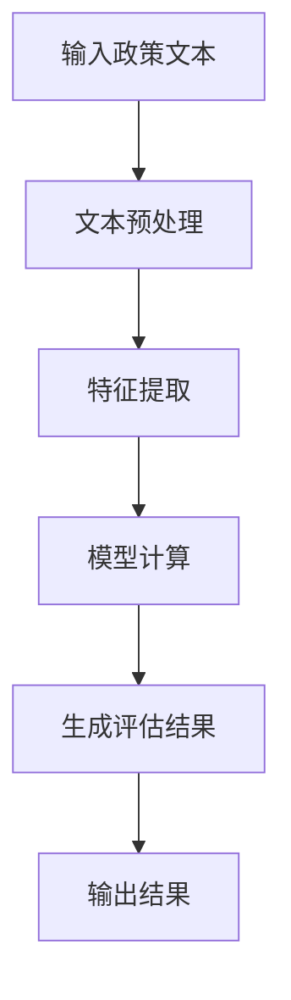

                 


# 《构建基于NLP的金融监管政策执行效果动态评估系统》

---

## 关键词：
- 自然语言处理 (NLP)
- 金融监管
- 政策执行效果
- 动态评估系统
- 深度学习
- 文本分析

---

## 摘要：
本文详细探讨了如何利用自然语言处理技术构建一个动态评估金融监管政策执行效果的系统。文章首先介绍了问题背景，分析了现有政策执行效果评估方法的局限性，提出了基于NLP的解决方案。接着，重点阐述了NLP技术在金融政策文本分析中的应用，包括文本预处理、特征提取和模型构建等关键步骤。随后，详细设计了动态评估模型的算法原理和系统架构，结合实际案例展示了系统的实现过程。最后，总结了系统的优势与不足，并提出了进一步优化的方向。

---

# 第一章: 问题背景与需求分析

## 1.1 问题背景
### 1.1.1 金融监管的重要性
金融监管是维护金融市场稳定、保护投资者利益的重要手段。然而，传统的政策执行效果评估方法通常依赖于定量分析，难以捕捉政策文本中的语义信息和主观意图。

### 1.1.2 政策执行效果评估的挑战
- 政策文本的复杂性和多样性。
- 现有评估方法缺乏对政策文本语义的理解。
- 评估过程的静态性和滞后性，难以实时动态调整。

### 1.1.3 NLP技术的应用潜力
自然语言处理技术能够从政策文本中提取语义信息，为政策执行效果的动态评估提供技术支持。

---

## 1.2 问题描述
### 1.2.1 金融政策执行效果的定义
政策执行效果指的是政策在实际执行过程中对市场行为、金融机构的影响程度。

### 1.2.2 现有评估方法的局限性
- 依赖主观评分，缺乏客观性。
- 无法实时捕捉政策变化对市场的影响。
- 忽略了政策文本中的语义信息。

### 1.2.3 基于NLP的动态评估需求
通过分析政策文本的语义信息，实现政策执行效果的动态、实时评估。

---

## 1.3 问题解决思路
### 1.3.1 利用NLP技术提取政策文本特征
通过文本预处理和特征提取，将政策文本转化为可计算的向量表示。

### 1.3.2 构建动态评估模型
基于时间序列分析和深度学习模型，构建动态评估模型，预测政策执行效果的变化趋势。

### 1.3.3 实现政策效果的实时监控
通过实时分析政策文本和市场数据，实现政策执行效果的动态监控和预警。

---

## 1.4 系统边界与外延
### 1.4.1 系统的功能边界
- 输入：政策文本、市场数据。
- 输出：政策执行效果的评估结果。
- 中间过程：文本分析、模型计算。

### 1.4.2 与相关系统的交互
- 与政策制定系统对接，获取最新政策文本。
- 与市场数据系统对接，获取实时市场数据。

### 1.4.3 系统的可扩展性与适应性
- 支持多种语言和多领域的政策文本分析。
- 支持动态调整模型参数，适应政策变化。

---

## 1.5 核心概念与组成要素
### 1.5.1 NLP技术的核心作用
- 文本预处理：分词、去停用词、词干提取。
- 语义表示：词嵌入、句子嵌入。
- 文本分类：主题分类、情感分析。

### 1.5.2 金融政策文本的特征提取
- 关键词提取：识别政策文本中的核心术语。
- 主题建模：分析政策文本的主题分布。
- 文本相似度：计算不同政策文本之间的语义相似性。

### 1.5.3 动态评估模型的构建要素
- 时间序列数据：政策执行效果的历史数据。
- 模型输入：政策文本的语义特征和市场数据。
- 模型输出：政策执行效果的预测值和评估结果。

---

# 第二章: 基于NLP的金融政策文本分析

## 2.1 NLP技术在金融监管中的应用
### 2.1.1 文本预处理与特征提取
- 文本清洗：去除噪声、标点符号。
- 分词：将文本分割为词语或短语。
- 去停用词：去除无意义的词汇（如“的”、“是”）。

### 2.1.2 基于词嵌入的语义表示
- 词嵌入：使用Word2Vec、GloVe等模型生成词向量。
- 句子嵌入：使用BERT等模型生成句子向量。

### 2.1.3 自然语言理解模型的选择
- 预训练模型：选择适合金融领域的预训练模型（如BERT-FINANCE）。
- 微调模型：根据具体任务对模型进行微调。

---

## 2.2 金融政策文本的特征提取
### 2.2.1 政策文本的结构化处理
- 分类：将政策文本分为监管规则、市场行为规范等类别。
- 标签化：为政策文本添加主题标签。

### 2.2.2 关键词提取与主题分析
- 关键词提取：使用TF-IDF或主题模型提取关键词。
- 主题分析：使用LDA等主题模型分析政策文本的主题分布。

### 2.2.3 文本相似度计算
- 相似度计算：使用余弦相似度或欧氏距离计算政策文本之间的相似性。
- 应用场景：识别同一主题的政策文本，分析政策变化趋势。

---

## 2.3 基于预训练模型的政策文本分析
### 2.3.1 BERT模型在金融文本分析中的应用
- 预训练：使用金融领域的标注数据对BERT模型进行预训练。
- 微调：针对具体任务（如情感分析、文本分类）对BERT模型进行微调。

### 2.3.2 大语言模型的微调与优化
- 微调策略：调整学习率、训练数据比例等参数。
- 优化方向：提升模型在金融领域的表现，降低计算成本。

### 2.3.3 政策文本分类与主题建模
- 文本分类：将政策文本分为不同类别（如监管力度、市场影响）。
- 主题建模：使用LDA等模型分析政策文本的主题分布。

---

# 第三章: 金融监管政策执行效果的动态评估模型

## 3.1 动态评估模型的设计思路
### 3.1.1 基于NLP的特征表示
- 输入特征：政策文本的语义特征和市场数据。
- 输出特征：政策执行效果的预测值和评估结果。

### 3.1.2 时间序列分析与动态评估
- 时间序列数据：政策执行效果的历史数据。
- 动态评估：基于时间序列分析模型（如LSTM、GRU）预测未来政策执行效果。

### 3.1.3 多目标优化的评估框架
- 多目标优化：同时优化政策执行效果的多个评估维度（如监管力度、市场影响）。
- 评估框架：结合定量分析和定性分析，构建多维度评估框架。

---

## 3.2 模型核心算法与实现
### 3.2.1 基于LSTM的时间序列建模
- LSTM网络结构：输入层、隐藏层、输出层。
- 模型训练：使用历史数据训练LSTM模型，预测未来政策执行效果。

### 3.2.2 基于注意力机制的文本特征提取
- 注意力机制：在文本分析中引入注意力机制，提升模型对关键信息的关注。
- 应用场景：在政策文本分析中，识别影响政策执行效果的关键语句。

### 3.2.3 多任务学习的评估模型
- 多任务学习：同时学习多个相关任务（如政策文本分类、效果预测）。
- 模型设计：共享部分参数，独立部分参数，提升模型的泛化能力。

---

## 3.3 模型训练与优化
### 3.3.1 数据预处理与特征工程
- 数据清洗：去除噪声、补齐缺失值。
- 特征提取：提取政策文本的语义特征和市场数据。

### 3.3.2 模型训练策略与超参数优化
- 训练策略：批量训练、学习率衰减。
- 超参数优化：调整学习率、批量大小、 epochs。

### 3.3.3 模型评估与验证
- 评估指标：准确率、召回率、F1分数。
- 验证方法：使用验证集评估模型性能，调整模型参数。

---

## 3.4 模型的可解释性与优化方向
### 3.4.1 模型解释性分析
- 重要特征分析：识别影响政策执行效果的关键因素。
- 模型解释工具：使用SHAP值等工具解释模型预测结果。

### 3.4.2 模型的鲁棒性优化
- 鲁棒性测试：测试模型在不同数据分布下的表现。
- 优化方向：提升模型的泛化能力，降低过拟合风险。

### 3.4.3 模型的可扩展性设计
- 扩展性设计：支持多种政策文本格式和数据源。
- 优化方向：提升模型的计算效率，降低计算成本。

---

# 第四章: 系统架构与功能设计

## 4.1 系统整体架构
### 4.1.1 系统模块划分
- 输入模块：接收政策文本和市场数据。
- 处理模块：进行文本预处理和特征提取。
- 计算模块：运行动态评估模型，生成评估结果。
- 输出模块：将评估结果可视化并输出。

### 4.1.2 系统功能流程图


### 4.1.3 系统架构设计的优缺点
- 优点：模块化设计，便于维护和扩展。
- 缺点：可能需要较高的计算资源，尤其是在处理大规模数据时。

---

## 4.2 系统功能设计
### 4.2.1 政策文本的输入与预处理
- 输入方式：文件上传、API接口。
- 预处理步骤：分词、去停用词、词干提取。

### 4.2.2 NLP模型的调用与结果解析
- 模型调用：通过API调用NLP模型，获取政策文本的语义特征。
- 结果解析：将模型输出结果解析为可读的评估报告。

### 4.2.3 评估结果的可视化与输出
- 可视化方式：图表、仪表盘。
- 输出格式：文本报告、数据接口。

---

## 4.3 系统接口设计
### 4.3.1 输入接口设计
- 输入格式：JSON格式，包含政策文本和市场数据。
- 接口文档：详细说明接口参数和返回格式。

### 4.3.2 输出接口设计
- 输出格式：JSON格式，包含评估结果和解释。
- 接口文档：详细说明接口参数和返回格式。

### 4.3.3 API接口的设计与实现
- API设计：定义RESTful API接口，支持GET、POST请求。
- 实现步骤：编写接口代码，测试接口功能。

---

## 4.4 系统交互流程
### 4.4.1 用户输入与系统响应
- 用户输入：上传政策文本和市场数据。
- 系统响应：返回评估结果和解释。

### 4.4.2 系统内部的模块交互
- 文本预处理模块调用NLP模型，生成语义特征。
- 动态评估模型调用时间序列分析模块，生成预测结果。

### 4.4.3 系统输出与用户反馈
- 系统输出：生成评估报告，可视化展示评估结果。
- 用户反馈：用户查看报告，提出修改意见。

---

## 4.5 系统架构设计
### 4.5.1 系统架构图


### 4.5.2 系统功能模块
- 输入模块：接收政策文本和市场数据。
- 处理模块：进行文本预处理和特征提取。
- 计算模块：运行动态评估模型，生成评估结果。
- 输出模块：将评估结果可视化并输出。

---

# 第五章: 项目实战与实现

## 5.1 环境搭建与配置
### 5.1.1 开发环境的选择
- 操作系统：Windows、Linux。
- 开发工具：PyCharm、VS Code。
- 语言：Python 3.8+。

### 5.1.2 依赖库的安装与配置
- NLP库：transformers、spacy。
- 时间序列分析库：lstm、gru。
- 可视化库：matplotlib、seaborn。

### 5.1.3 开发工具的使用
- 安装依赖：pip install transformers spacy lstm等。
- 配置环境：设置虚拟环境，安装必要的包。

---

## 5.2 系统核心功能实现
### 5.2.1 政策文本的预处理代码
```python
import spacy

nlp = spacy.load("en_core_web_sm")

def preprocess(text):
    doc = nlp(text)
    tokens = [token.text for token in doc if not token.is_stop]
    return " ".join(tokens)
```

### 5.2.2 NLP模型的调用与结果解析
```python
from transformers import BertTokenizer, BertModel

tokenizer = BertTokenizer.from_pretrained("bert-base-uncased")
model = BertModel.from_pretrained("bert-base-uncased")

def get_embeddings(text):
    inputs = tokenizer(text, return_tensors="np")
    embeddings = model(**inputs)
    return embeddings.last_hidden_state[:, 0, :].numpy()
```

### 5.2.3 动态评估模型的实现
```python
import torch
import torch.nn as nn

class LSTMModel(nn.Module):
    def __init__(self, input_size, hidden_size, output_size):
        super(LSTMModel, self).__init__()
        self.lstm = nn.LSTM(input_size, hidden_size, batch_first=True)
        self.fc = nn.Linear(hidden_size, output_size)
    
    def forward(self, x):
        out, _ = self.lstm(x)
        out = self.fc(out[:, :, :])
        return out
```

---

## 5.3 项目实战与实现
### 5.3.1 数据集准备
- 数据来源：公开政策文本和市场数据。
- 数据清洗：去除噪声、补齐缺失值。
- 数据分组：训练集、验证集、测试集。

### 5.3.2 模型训练与验证
- 训练数据：使用训练集数据训练模型。
- 验证数据：使用验证集数据评估模型性能。
- 调参优化：调整学习率、批量大小等参数，优化模型性能。

### 5.3.3 模型部署与测试
- 模型部署：将模型部署到服务器，提供API接口。
- 模型测试：通过API接口测试模型功能，验证模型性能。

---

## 5.4 实际案例分析
### 5.4.1 案例背景
- 政策文本：某金融监管政策的文本内容。
- 市场数据：政策实施后的市场数据。

### 5.4.2 案例分析步骤
1. 文本预处理：对政策文本进行分词、去停用词。
2. 特征提取：使用BERT模型提取政策文本的语义特征。
3. 模型计算：运行动态评估模型，生成评估结果。
4. 结果解读：分析评估结果，提出改进建议。

### 5.4.3 案例分析结果
- 评估结果：政策执行效果的预测值和解释。
- 结果解读：识别政策文本中的关键影响因素。

---

## 5.5 项目小结
### 5.5.1 项目实现的关键点
- 文本预处理：准确提取政策文本的语义特征。
- 模型选择：选择适合任务的深度学习模型。
- 模型优化：通过调参和数据增强优化模型性能。

### 5.5.2 项目实现的难点
- 数据获取：获取高质量的政策文本和市场数据。
- 模型解释性：提升模型的可解释性，便于用户理解。

### 5.5.3 项目实现的价值
- 提高政策执行效果评估的效率和准确性。
- 为金融监管提供科学依据，支持政策优化。

---

# 第六章: 总结与展望

## 6.1 系统总结
### 6.1.1 系统优势
- 高效性：基于NLP技术，快速提取政策文本的语义特征。
- 动态性：实时监控政策执行效果，支持动态调整。
- 可扩展性：支持多种政策文本和数据源。

### 6.1.2 系统不足
- 计算成本高：深度学习模型需要较高的计算资源。
- 模型解释性差：部分模型的预测结果难以解释。

### 6.1.3 系统优化方向
- 提升模型解释性：引入可解释性模型（如SHAP、LIME）。
- 降低计算成本：优化模型结构，使用轻量级模型。
- 扩展功能：支持多语言、多领域政策文本分析。

---

## 6.2 未来展望
### 6.2.1 技术发展
- 更先进的NLP模型：如基于Transformer的模型（如GPT-3、PaLM）。
- 更高效的时间序列分析方法：如图神经网络、增强学习。

### 6.2.2 应用场景扩展
- 政策文本分析：支持多种语言和多领域政策文本分析。
- 实时监控：实现政策执行效果的实时监控和预警。

### 6.2.3 与相关领域的结合
- 金融监管：结合市场数据和政策文本，实现更精准的监管。
- 公共政策评估：将系统应用于其他领域的政策评估。

---

# 第七章: 最佳实践与注意事项

## 7.1 最佳实践
### 7.1.1 数据处理
- 数据清洗：仔细清洗数据，去除噪声。
- 数据增强：通过数据增强技术提升模型的泛化能力。
- 数据安全：确保数据的安全性，避免数据泄露。

### 7.1.2 模型选择
- 选择适合任务的模型：根据具体任务选择合适的NLP模型和时间序列分析模型。
- 模型调参：通过实验确定最佳的模型参数。
- 模型评估：使用多种评估指标，全面评估模型性能。

### 7.1.3 系统部署
- 系统设计：模块化设计，便于维护和扩展。
- 系统优化：优化系统性能，降低计算成本。
- 系统监控：实时监控系统运行状态，及时发现和解决问题。

---

## 7.2 注意事项
### 7.2.1 数据质量问题
- 数据准确性：确保数据来源可靠，数据准确。
- 数据多样性：获取多样化的数据，避免模型过拟合。

### 7.2.2 模型过拟合问题
- 正则化：使用L1/L2正则化，防止过拟合。
- 数据增强：通过数据增强技术提升模型的泛化能力。
- 交叉验证：使用交叉验证评估模型性能。

### 7.2.3 系统维护与更新
- 系统维护：定期检查系统运行状态，及时修复问题。
- 模型更新：定期更新模型，保持模型的先进性和适用性。
- 功能扩展：根据需求扩展系统功能，提升系统价值。

---

## 作者：AI天才研究院/AI Genius Institute & 禅与计算机程序设计艺术/Zen And The Art of Computer Programming

