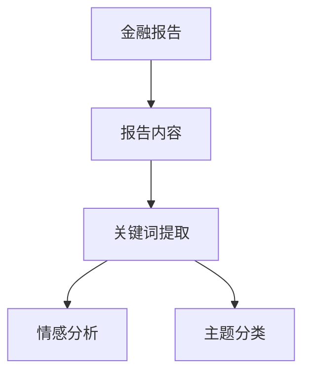
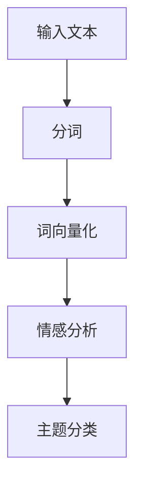
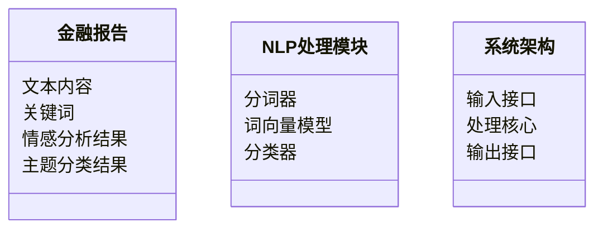
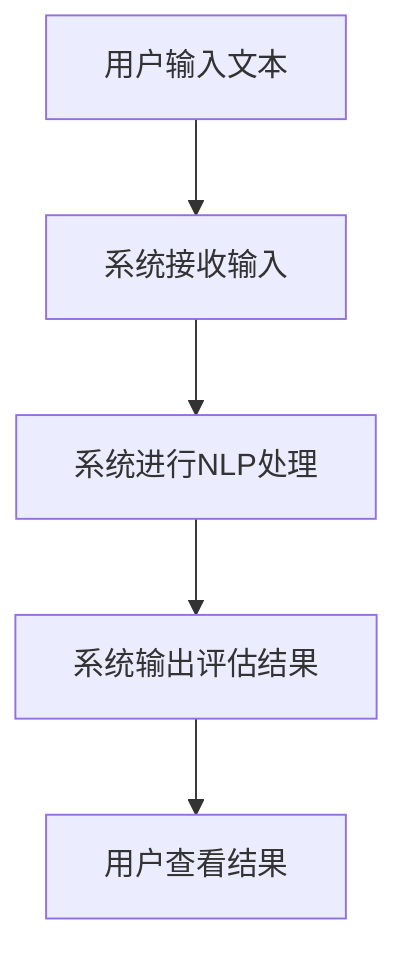

                 


# 《构建基于NLP的金融研究报告质量评估系统》

---

## 关键词：
- 自然语言处理 (NLP)
- 金融报告
- 质量评估系统
- 文本挖掘
- 情感分析
- 主题分类

---

## 摘要：
本文旨在探讨如何利用自然语言处理技术构建一个高效的金融研究报告质量评估系统。通过分析金融报告的文本内容，结合NLP技术的核心算法和数学模型，提出了一套基于BERT的多任务学习框架，用于实现报告的质量评分、关键词提取和主题分类。文章详细介绍了系统的构建过程，包括问题背景、核心概念、算法原理、系统架构设计以及实际项目实现，最终为金融行业提供了一种智能化的报告评估解决方案。

---

## 目录

---

### 第一章：背景介绍与问题分析

#### 1.1 问题背景
- 1.1.1 金融报告的重要性与复杂性
  - 金融报告在投资决策中的关键作用
  - 报告质量对投资结果的影响
- 1.1.2 传统报告评估方法的局限性
  - 人工评估的耗时性与主观性
  - 现有技术手段的不足
- 1.1.3 基于NLP的评估优势
  - 自动化与智能化的双重优势
  - 提高评估效率与准确性

#### 1.2 问题描述
- 1.2.1 金融报告质量评估的核心要素
  - 内容的全面性、逻辑性与准确性
- 1.2.2 当前评估系统的痛点
  - 人工评估的主观性与效率低下
  - 技术手段的局限性与适用性不足
- 1.2.3 NLP技术在评估中的应用潜力
  - 文本挖掘、情感分析与主题分类的结合

#### 1.3 问题解决思路
- 1.3.1 NLP技术如何赋能金融报告评估
  - 利用NLP实现关键词提取、情感分析与主题分类
- 1.3.2 系统设计的总体思路
  - 基于BERT的多任务学习框架
- 1.3.3 系统的边界与外延
  - 功能范围与适用场景的界定

---

### 第二章：核心概念与系统架构

#### 2.1 核心概念
- 2.1.1 NLP技术的核心原理
  - 词嵌入、句法分析与语义理解
- 2.1.2 金融报告质量评估的关键指标
  - 信息完整性、逻辑清晰度、语言准确性
- 2.1.3 系统功能模块的构成
  - 关键词提取模块、情感分析模块、主题分类模块

#### 2.2 实体关系分析
- 2.2.1 Mermaid实体关系图


#### 2.3 概念属性对比
- 2.3.1 NLP模型与传统规则的对比分析
  - 基于规则的局限性与基于模型的泛化能力
- 2.3.2 金融报告质量评估指标的属性特征
  - 可量化性、可解释性与客观性
- 2.3.3 系统功能模块的对比分析
  - 模块间的依赖关系与协同作用

---

### 第三章：算法原理与数学模型

#### 3.1 算法原理
- 3.1.1 基于BERT的文本表示方法
  - BERT的双向Transformer结构
  - 如何通过预训练提升上下文理解能力
- 3.1.2 情感分析与主题分类的实现流程
  - 情感分析的分类任务与主题分类的聚类任务
- 3.1.3 多任务学习的应用
  - 多任务学习如何提升模型的泛化能力

#### 3.2 数学模型
- 3.2.1 BERT模型的数学表示
$$
\text{BERT}(x) = \text{MLP}(\text{Transformer}(x))
$$

- 3.2.2 情感分析的损失函数
$$
\mathcal{L} = -\sum_{i=1}^{n} y_i \log(p_i) + (1-y_i)\log(1-p_i)
$$

#### 3.3 算法流程
- 3.3.1 Mermaid算法流程图


#### 3.4 示例说明
- 3.4.1 情感分析的案例分析
  - 输入文本：某金融报告的负面情绪分析
  - 输出结果：情感值为-0.7，对应负面情绪
- 3.4.2 主题分类的案例分析
  - 输入文本：关于货币政策的讨论
  - 输出结果：主题标签为“货币政策”

---

### 第四章：系统分析与架构设计

#### 4.1 问题场景介绍
- 4.1.1 系统的使用场景
  - 金融机构内部的报告评估
  - 投资者的辅助决策工具
- 4.1.2 系统的目标用户
  - 金融分析师、投资经理与研究人员

#### 4.2 系统功能设计
- 4.2.1 领域模型设计


#### 4.3 系统架构设计
- 4.3.1 系统架构图


#### 4.4 系统接口设计
- 4.4.1 输入接口
  - 文本输入格式与数据预处理
- 4.4.2 输出接口
  - 评估结果的格式与展示方式

#### 4.5 系统交互设计
- 4.5.1 Mermaid序列图


---

### 第五章：项目实战与代码实现

#### 5.1 项目环境安装
- 5.1.1 安装Python与相关库
  - `pip install transformers`
  - `pip install torch`
  - `pip install numpy`

#### 5.2 系统核心实现
- 5.2.1 关键词提取模块
```python
from transformers import BertTokenizer, BertModel
import torch

tokenizer = BertTokenizer.from_pretrained('bert-base-uncased')
model = BertModel.from_pretrained('bert-base-uncased')

def extract_keywords(text):
    inputs = tokenizer(text, return_tensors='np')
    outputs = model(**inputs)
    # ...（关键词提取逻辑）
    return keywords
```

- 5.2.2 情感分析模块
```python
def sentiment_analysis(text):
    inputs = tokenizer(text, return_tensors='np')
    outputs = model(**inputs)
    sentiment_score = outputs[0].argmax().item()
    return 'positive' if sentiment_score > 0.5 else 'negative'
```

- 5.2.3 主题分类模块
```python
def topic_classification(text):
    # ...（主题分类逻辑）
    return topic_label
```

#### 5.3 代码应用解读与分析
- 5.3.1 代码实现的细节
  - 如何处理不同长度的文本输入
  - 如何优化模型性能
- 5.3.2 系统实现的关键点
  - 模型训练与微调
  - 数据预处理与特征提取

#### 5.4 实际案例分析
- 5.4.1 案例1：关键词提取
  - 输入文本：某金融报告内容
  - 输出结果：提取的关键词列表
- 5.4.2 案例2：情感分析
  - 输入文本：某公司财务报告
  - 输出结果：情感分析结果为“positive”或“negative”
- 5.4.3 案例3：主题分类
  - 输入文本：某行业趋势分析
  - 输出结果：主题分类结果

#### 5.5 项目小结
- 5.5.1 项目实现的关键点总结
  - 模型选择与优化
  - 数据处理与特征提取
- 5.5.2 系统实现的注意事项
  - 模型训练的计算资源需求
  - 数据隐私与安全问题

---

### 第六章：总结与展望

#### 6.1 系统优势总结
- 6.1.1 系统的核心优势
  - 高效性与准确性
  - 智能化与自动化
- 6.1.2 系统的创新点
  - 基于BERT的多任务学习框架
  - 实现了金融报告质量评估的自动化

#### 6.2 改进建议
- 6.2.1 系统的局限性
  - 对小样本数据的适应性不足
  - 情感分析的粒度问题
- 6.2.2 系统改进的方向
  - 引入迁移学习与领域自适应技术
  - 提升模型的可解释性与透明度

#### 6.3 未来展望
- 6.3.1 系统的未来发展
  - 拓展到更多金融领域
  - 实现实时报告评估功能
- 6.3.2 技术趋势
  - 多模态分析与跨语言处理
  - 智能辅助决策系统的深化应用

---

## 作者：
AI天才研究院/AI Genius Institute  
禅与计算机程序设计艺术 /Zen And The Art of Computer Programming

