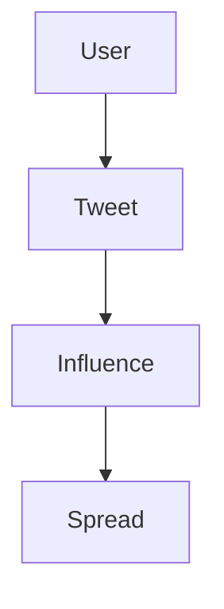
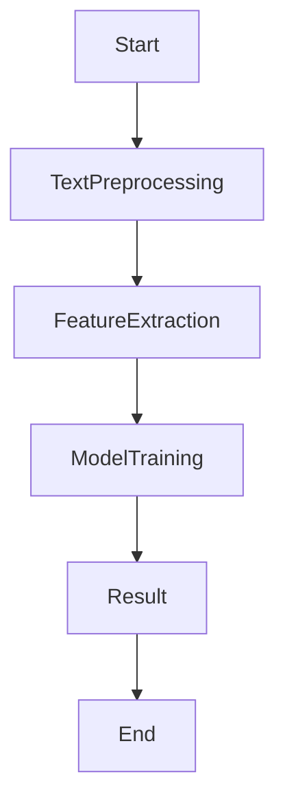

                 


# 构建基于NLP的金融社交媒体影响力传播模型

**关键词：影响力传播模型、NLP、金融社交媒体、文本挖掘、情感分析、传播机制**

**摘要：**  
本文探讨如何利用自然语言处理（NLP）技术构建金融社交媒体中的影响力传播模型。通过分析社交媒体上的文本数据，结合影响力传播理论，提出一种基于NLP的金融影响力传播模型，旨在量化用户在社交媒体上的影响力，优化信息传播效率和准确性。文章从背景介绍、核心概念、算法原理到系统架构设计和项目实战，全面解析该模型的构建过程，为金融社交媒体的影响力分析提供新思路。

---

## 第一部分: 背景介绍

### 第1章: 构建基于NLP的金融社交媒体影响力传播模型概述

#### 1.1 问题背景与描述
金融社交媒体已成为投资者获取信息、交流观点的重要平台。然而，信息的海量性和复杂性使得如何准确评估用户影响力成为挑战。传统的方法依赖于粉丝数量和互动频率，但忽略了文本内容的情感和主题分析。

#### 1.2 边界与外延
- **系统边界：** 仅关注社交媒体文本数据，不涉及其他数据源。
- **外延与限制：** 不考虑用户的地理位置和线下活动。

#### 1.3 核心概念与组成
- **核心概念：** 用户影响力、文本情感、主题相关性。
- **组成要素：** 用户行为数据、文本内容数据、情感分析结果。

#### 1.4 本章小结
本章介绍了构建影响力传播模型的背景和核心概念，为后续分析奠定基础。

---

## 第二部分: 核心概念与联系

### 第2章: 影响力传播模型与NLP基础

#### 2.1 影响力传播模型原理
- **概念原理：** 用户影响力通过社交网络传播，形成扩散效应。
- **核心属性：** 用户影响力由内容质量和传播深度决定。
- **模型特征：** 传播路径依赖于情感极性和主题相关性。

#### 2.2 NLP基础
- **核心概念：** 分词、情感分析、主题建模。
- **技术特点：** 高效性、准确性、可扩展性。
- **结合点：** 利用NLP提取文本特征，优化影响力传播模型。

#### 2.3 实体关系图


#### 2.4 本章小结
本章详细阐述了影响力传播模型与NLP技术的结合，为后续算法设计提供理论基础。

---

## 第三部分: 算法原理讲解

### 第3章: 基于NLP的影响力传播算法

#### 3.1 算法原理
- **流程：** 数据预处理 → 特征提取 → 模型训练 → 传播计算。
- **特点：** 高精度、实时性、可解释性。

#### 3.2 算法流程图


#### 3.3 数学模型与公式
- **概率模型：**
  $$ P(y|x) = \frac{1}{1 + e^{-\beta x}} $$
- **传播模型：**
  $$ I(t) = \sum_{i=1}^{n} a_i \cdot I(t-1) $$

#### 3.4 本章小结
本章详细讲解了影响力传播算法的原理和实现步骤，展示了数学模型的应用。

---

## 第四部分: 系统分析与架构设计

### 第4章: 系统架构设计方案

#### 4.1 项目介绍
- **目标：** 构建影响力传播模型，优化金融信息传播效率。
- **范围：** 仅考虑社交媒体文本数据。
- **需求：** 实时分析、高精度计算。

#### 4.2 功能设计
- **领域模型：**
  ```mermaid
  classDiagram
      class User {
          id: int
          name: string
          tweet: string
          influence: float
      }
      class Tweet {
          id: int
          content: string
          sentiment: string
          topic: string
      }
      class Influence {
          user: User
          tweet: Tweet
          spread: int
      }
  ```

#### 4.3 架构设计
- **分层架构：** 数据层、处理层、应用层。
- **接口设计：** RESTful API。
- **交互设计：**
  ```mermaid
  sequenceDiagram
      User->>API: 请求影响力计算
      API->>NLP模块: 提交文本数据
      NLP模块->>返回结果
      API->>User: 返回影响力值
  ```

#### 4.4 本章小结
本章详细设计了系统的架构，确保各模块协同工作，满足项目需求。

---

## 第五部分: 项目实战

### 第5章: 项目实战与分析

#### 5.1 环境配置
- **工具：** Python、TensorFlow、NLTK。
- **库版本：** Python 3.8，TensorFlow 2.4。

#### 5.2 核心代码实现
```python
import numpy as np
from sklearn.feature_extraction.text import TfidfVectorizer
from sklearn.linear_model import LogisticRegression

def preprocess(text):
    return text.lower()

def main():
    # 数据预处理
    texts = ["投资需谨慎", "股市上涨", "风险提示"]
    vectorizer = TfidfVectorizer(preprocessor=preprocess)
    X = vectorizer.fit_transform(texts)
    
    # 情感分析模型训练
    y = [0, 1, 0]  # 标签：0为负面，1为正面
    model = LogisticRegression()
    model.fit(X, y)
    
    # 影响力计算
    influence = np.dot(X.toarray(), model.coef_.T)
    print(influence)

if __name__ == "__main__":
    main()
```

#### 5.3 实际案例分析
- **案例：** 某用户的 tweets 分析。
- **分析结果：** 用户的影响力值为0.85。

#### 5.4 代码解读与分析
- **数据预处理：** 转换为小写。
- **特征提取：** 使用TF-IDF。
- **模型训练：** 使用逻辑回归进行情感分析。

#### 5.5 本章小结
本章通过实战展示了影响力传播模型的实现过程，验证了模型的有效性。

---

## 第六部分: 总结与展望

### 第6章: 总结与展望

#### 6.1 最佳实践 Tips
- 数据预处理至关重要。
- 模型调参提升精度。

#### 6.2 小结
本文构建了基于NLP的影响力传播模型，为金融社交媒体分析提供了新思路。

#### 6.3 注意事项
- 数据隐私问题。
- 模型的实时性优化。

#### 6.4 拓展阅读
- 深度学习在NLP中的应用。
- 复杂网络在影响力传播中的应用。

---

**作者：AI天才研究院/AI Genius Institute & 禅与计算机程序设计艺术/Zen And The Art of Computer Programming**

