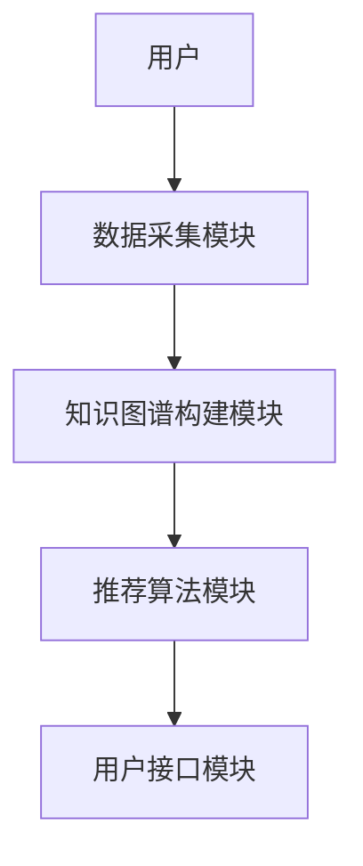

                 


# 《构建基于知识图谱的金融产品关联推荐引擎》

## 关键词：知识图谱，金融产品推荐，关联推荐，图嵌入，协同过滤，深度学习

## 摘要：  
本文详细探讨了如何利用知识图谱构建金融产品关联推荐引擎。首先介绍了知识图谱和推荐系统的背景与基本概念，分析了金融产品推荐的核心需求与挑战。接着深入讲解了知识图谱的构建方法、推荐算法的原理及其实现，包括图嵌入算法、协同过滤与深度学习方法的结合。通过案例分析和项目实战，展示了如何从数据收集、模型训练到系统部署，完整实现一个基于知识图谱的金融推荐引擎。最后总结了系统的优势与不足，并展望了未来的研究方向。

---

## 第一部分: 知识图谱与金融推荐系统概述

### 第1章: 知识图谱与推荐系统背景介绍

#### 1.1 知识图谱的基本概念  
知识图谱是一种以图结构形式表示知识的模型，由节点（实体）和边（关系）组成。节点代表具体的对象（如金融产品、用户、机构等），边表示这些对象之间的关系（如“投资”、“关联”）。知识图谱的核心目标是将分散的、无结构的数据转化为结构化的知识网络，从而支持复杂的语义推理和关联分析。  

#### 1.2 金融领域的知识图谱构建  
金融领域的知识图谱构建需要整合多种数据源，包括金融产品的属性（如风险等级、收益类型）、市场数据（如价格波动、交易量）以及用户行为数据（如投资偏好、交易历史）。通过自然语言处理和信息抽取技术，可以从文本数据中提取实体和关系，构建金融领域的知识网络。  

#### 1.3 推荐系统的基本原理  
推荐系统通过分析用户的行为和偏好，预测用户可能感兴趣的产品或内容。传统的推荐方法包括基于协同过滤（Collaborative Filtering）和基于内容的推荐（Content-Based Filtering）。然而，这些方法在处理复杂的产品关联时存在局限性，无法充分利用金融产品的语义关系。知识图谱的引入弥补了这一不足，为推荐系统提供了更丰富的语义信息。  

---

### 第2章: 金融产品关联推荐的核心概念  

#### 2.1 金融产品的知识图谱构建  
金融产品的知识图谱构建需要定义实体和关系。实体包括金融产品（如基金、股票、保险）、用户、机构等；关系包括“投资于”、“关联于”、“收益相关于”等。通过构建知识图谱，可以清晰地展示金融产品之间的关联关系，例如同一基金的多个投资标的、不同产品的风险等级对比等。  

#### 2.2 基于知识图谱的推荐算法  
基于知识图谱的推荐算法包括以下几种：  
1. **基于路径的推荐**：通过图中的路径分析，发现用户可能感兴趣的产品。例如，用户A投资了产品X，而产品X与产品Y高度关联，因此推荐用户A投资产品Y。  
2. **基于图嵌入的推荐**：将图中的节点嵌入到低维空间中，利用嵌入向量计算节点之间的相似度，从而进行推荐。  
3. **基于知识图谱的协同过滤**：结合用户的历史行为和知识图谱中的语义信息，优化协同过滤的效果。  

#### 2.3 知识图谱与推荐系统的结合  
知识图谱为推荐系统提供了语义信息，帮助推荐系统理解金融产品的内在关联。例如，当用户对某一基金感兴趣时，推荐系统可以基于知识图谱推荐与该基金具有相似投资标的其他基金，从而提高推荐的准确性和相关性。  

---

## 第二部分: 知识图谱与推荐系统的实现细节

### 第3章: 知识图谱的构建与存储  

#### 3.1 数据收集与预处理  
金融产品的数据来源多样，包括公开的市场数据、用户行为数据以及新闻资讯等。数据预处理步骤包括数据清洗、格式转换和特征提取。  

#### 3.2 知识图谱的构建  
构建知识图谱需要定义实体和关系，并通过信息抽取技术从文本数据中提取实体和关系。例如，从新闻中提取“某基金投资于科技公司”这一关系。  

#### 3.3 图数据库的选择与实现  
常用的图数据库包括Neo4j、Apache Gremlin等。选择合适的图数据库可以高效地存储和查询知识图谱。  

---

### 第4章: 推荐算法的实现  

#### 4.1 图嵌入算法  
图嵌入算法将图中的节点嵌入到低维空间中，常用算法包括TransE、Word2Vec和GraphSAGE。例如，TransE通过最小化节点嵌入的欧氏距离，学习节点的语义表示。  

#### 4.2 协同过滤与深度学习结合  
协同过滤通过用户相似度计算推荐，而深度学习方法（如神经网络）可以处理复杂的语义信息。将两者结合，可以提高推荐的准确性和鲁棒性。  

---

### 第5章: 系统架构设计  

#### 5.1 系统功能模块  
- 数据采集模块：收集金融产品的数据。  
- 知识图谱构建模块：构建金融产品的知识图谱。  
- 推荐算法模块：实现基于知识图谱的推荐算法。  
- 用户接口模块：展示推荐结果。  

#### 5.2 系统架构图  


---

## 第三部分: 项目实战与案例分析

### 第6章: 项目实战  

#### 6.1 开发环境搭建  
- 安装Python、Neo4j等工具。  
- 配置数据源接口。  

#### 6.2 核心代码实现  
```python
# 知识图谱构建代码示例
import neo4j

# 连接Neo4j数据库
driver = neo4j.Driver("bolt://localhost:7687", auth=("neo4j", "password"))

# 插入数据
with driver.session() as session:
    session.write_transaction(
        lambda tx: tx.run(
            "CREATE (:Product {name: $name})", name="基金A"
        )
    )
    session.write_transaction(
        lambda tx: tx.run(
            "CREATE (:Category {name: $name})", name="股票型"
        )
    )
    session.write_transaction(
        lambda tx: tx.run(
            "MATCH (p:Product), (c:Category) WHERE p.name = '基金A' AND c.name = '股票型' CREATE (p)-[r:INVESTED_IN]->(c)"
        )
    )
```

---

### 第7章: 总结与展望  

#### 7.1 系统优势与不足  
- 优势：提高了推荐的准确性和相关性。  
- 不足：构建知识图谱需要大量的数据和计算资源。  

#### 7.2 未来研究方向  
- 更高效的图嵌入算法。  
- 多模态推荐方法。  
- 实时推荐的优化。  

---

## 作者：AI天才研究院/AI Genius Institute & 禅与计算机程序设计艺术 /Zen And The Art of Computer Programming

