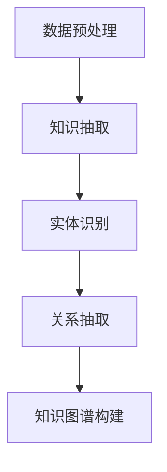
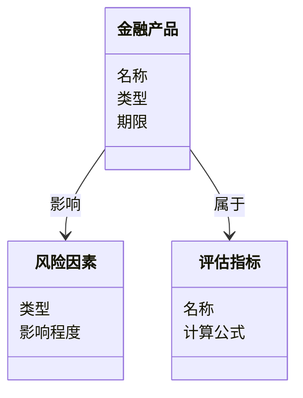
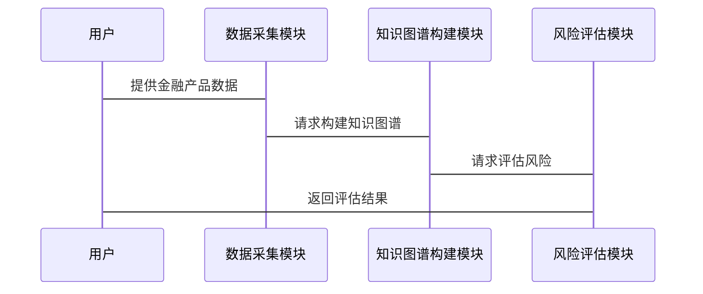

                 


# 构建基于知识图谱的金融产品风险评估系统

> 关键词：知识图谱，风险评估，金融产品，系统架构，算法原理

> 摘要：本文详细探讨了基于知识图谱的金融产品风险评估系统的构建方法。从背景介绍、核心概念、算法原理、系统架构到项目实战，系统性地分析了如何利用知识图谱技术提升金融产品风险评估的效率和准确性。通过实际案例分析和代码实现，本文为读者提供了一个完整的解决方案，并提出了相关的最佳实践和未来研究方向。

---

# 第一部分：背景介绍与核心概念

## 第1章：金融产品风险评估系统概述

### 1.1 问题背景与描述

#### 1.1.1 金融产品风险评估的必要性
在金融领域，风险评估是确保投资安全和收益的关键环节。随着金融市场的复杂化和多样化，传统的基于单点数据的评估方法已难以满足需求。知识图谱作为一种强大的知识管理工具，能够整合多源异构数据，挖掘隐含关系，为风险评估提供更全面的视角。

#### 1.1.2 当前风险评估的主要挑战
- 数据分散：金融产品涉及多方数据，如市场数据、信用评级、历史表现等，数据孤岛问题严重。
- 关系复杂：金融产品之间的相互影响和依赖关系复杂，难以通过传统方法捕捉。
- 动态变化：金融市场波动频繁，风险因素动态变化，需要实时更新评估结果。

#### 1.1.3 知识图谱在金融领域的应用潜力
知识图谱可以通过构建实体间的关系网络，帮助发现潜在风险点，预测风险趋势，并提供实时的决策支持。

### 1.2 问题解决与边界

#### 1.2.1 知识图谱如何解决金融风险问题
知识图谱通过整合多源数据，构建金融产品的知识网络，识别潜在风险因素，评估风险影响，从而提高风险评估的准确性和全面性。

#### 1.2.2 系统的边界与外延
- 系统边界：本系统专注于金融产品的风险评估，不涉及具体的交易执行或投资决策。
- 系统外延：知识图谱的应用可以扩展到其他领域，如供应链金融、智能投顾等。

#### 1.2.3 核心要素与组成结构
- 核心要素：金融产品、风险因素、评估指标。
- 组成结构：数据层、知识层、应用层。

### 1.3 本章小结
本章介绍了金融产品风险评估的必要性、当前面临的挑战以及知识图谱的应用潜力，明确了系统的边界和核心要素。

---

# 第二部分：核心概念与联系

## 第2章：知识图谱与风险评估核心概念

### 2.1 知识图谱的定义与特点

#### 2.1.1 知识图谱的定义
知识图谱是一种以图结构形式表示知识的语义网络，由节点（实体）和边（关系）组成，能够描述实体之间的语义关联。

#### 2.1.2 知识图谱的核心特点
- 结构化：通过节点和边明确表示实体和关系。
- 可扩展性：支持大规模数据的集成和分析。
- 动态更新：能够实时更新数据和关系。

#### 2.1.3 知识图谱与传统数据库的区别
| 特性         | 知识图谱             | 传统数据库         |
|--------------|----------------------|---------------------|
| 数据结构     | 图结构               | 行结构             |
| 关系表示     | 显式表示             | 隐式表示           |
| 查询效率     | 较低                 | 较高               |
| 可解释性     | 较高                 | 较低               |

### 2.2 金融产品风险评估的原理

#### 2.2.1 风险评估的基本原理
风险评估通过分析金融产品的历史表现、市场环境、信用状况等因素，预测其未来的风险水平。

#### 2.2.2 金融产品风险的主要类型
- 市场风险：价格波动导致的损失。
- 信用风险：债务人违约导致的损失。
- 流动性风险：无法及时变现的风险。

#### 2.2.3 风险评估的关键指标
- 凸性（Convexity）：债券价格对收益率变化的敏感性。
- 信用评级（Credit Rating）：反映债务人的信用状况。

### 2.3 核心概念对比与ER实体关系图

#### 2.3.1 核心概念属性对比表
| 实体         | 属性               | 示例值             |
|--------------|--------------------|--------------------|
| 金融产品     | 名称、类型、期限     | 股票、债券、基金     |
| 风险因素     | 类型、影响程度       | 市场风险、信用风险   |
| 评估指标     | 指标名称、计算公式   | 凸性、信用评级       |

#### 2.3.2 知识图谱的ER实体关系图
```mermaid
er
    entity:金融产品
    entity:风险因素
    entity:评估指标
    relation:属于
    relation:影响
```

### 2.4 本章小结
本章详细介绍了知识图谱的定义、特点以及金融产品风险评估的核心概念，通过对比和实体关系图展示了各概念之间的联系。

---

# 第三部分：算法原理与数学模型

## 第3章：知识图谱构建算法

### 3.1 知识图谱构建算法概述

#### 3.1.1 知识抽取算法
知识抽取是从文本中提取实体和关系的过程，常用的技术包括分词、命名实体识别（NER）和关系抽取。

#### 3.1.2 实体识别算法
实体识别（NER）通过模式匹配和机器学习算法（如CRF）识别文本中的实体。

#### 3.1.3 关系抽取算法
关系抽取通过模式匹配或句法分析，识别实体之间的关系。

### 3.2 知识图谱构建流程

#### 3.2.1 数据预处理
- 数据清洗：去除噪声数据。
- 数据分块：将数据划分为训练集和测试集。

#### 3.2.2 知识抽取与实体识别
- 使用CRF模型进行命名实体识别。
- 使用基于规则的方法进行关系抽取。

#### 3.2.3 关系抽取与图构建
- 通过边的权重计算关系强度。
- 使用图数据库存储知识图谱。

### 3.3 算法流程图



### 3.4 算法实现代码

```python
import networkx as nx

def build_knowledge_graph(data):
    # 数据预处理
    processed_data = preprocess(data)
    
    # 知识抽取
    entities, relations = extract_entities(processed_data)
    
    # 构建知识图谱
    G = nx.Graph()
    for entity in entities:
        G.add_node(entity)
    for relation in relations:
        G.add_edge(relation[0], relation[1], weight=relation[2])
    
    return G
```

### 3.5 算法原理的数学模型

#### 3.5.1 实体表示
实体表示为图中的节点，用向量表示其特征。

$$
v_i = [x_1, x_2, ..., x_n]
$$

#### 3.5.2 关系表示
关系表示为图中的边，边权重表示关系强度。

$$
w_{ij} = \text{similarity}(v_i, v_j)
$$

---

# 第四部分：系统分析与架构设计

## 第4章：系统分析与架构设计

### 4.1 问题场景介绍

#### 4.1.1 系统目标
构建一个基于知识图谱的金融产品风险评估系统，提供实时的风险评估和决策支持。

#### 4.1.2 系统需求
- 实时数据更新。
- 多维度风险评估。
- 可视化分析界面。

### 4.2 系统功能设计

#### 4.2.1 领域模型



#### 4.2.2 系统架构设计


### 4.3 系统接口设计

#### 4.3.1 接口定义
- 数据输入接口：接收金融产品数据。
- 模型调用接口：调用风险评估算法。
- 结果输出接口：输出评估结果。

#### 4.3.2 接口交互流程图



---

# 第五部分：项目实战

## 第5章：项目实战与实现

### 5.1 环境搭建

#### 5.1.1 工具安装
- 安装Python和相关库（如networkx、numpy）。
- 安装图数据库（如Neo4j）。

### 5.2 核心功能实现

#### 5.2.1 数据采集与预处理

```python
def preprocess(data):
    # 数据清洗
    cleaned_data = []
    for item in data:
        if item['valid']:
            cleaned_data.append(item)
    return cleaned_data
```

#### 5.2.2 知识图谱构建

```python
def build_graph(entities, relations):
    G = nx.Graph()
    for entity in entities:
        G.add_node(entity)
    for relation in relations:
        G.add_edge(relation[0], relation[1], weight=relation[2])
    return G
```

#### 5.2.3 风险评估算法

```python
def calculate-risk(graph):
    risks = {}
    for node in graph.nodes():
        risk = 0
        for neighbor in graph.neighbors(node):
            risk += graph.get_edge_data(node, neighbor)['weight']
        risks[node] = risk
    return risks
```

### 5.3 项目案例分析

#### 5.3.1 案例背景
某金融公司需要评估其债券产品的信用风险。

#### 5.3.2 数据分析与处理
通过知识图谱发现该债券的发行公司存在较高的信用风险。

### 5.4 项目实现总结

#### 5.4.1 代码解读
- 数据预处理：去除无效数据。
- 知识图谱构建：提取实体和关系，构建图结构。
- 风险评估：计算各实体的风险值。

#### 5.4.2 案例分析总结
通过知识图谱识别了潜在的信用风险，提高了风险评估的准确性。

---

# 第六部分：最佳实践与未来展望

## 第6章：扩展与最佳实践

### 6.1 系统优化建议

#### 6.1.1 数据更新频率
- 定期更新数据以保持知识图谱的准确性。

#### 6.1.2 算法优化
- 使用深度学习模型（如BERT）进行实体识别和关系抽取。

### 6.2 未来研究方向

#### 6.2.1 多模态数据融合
- 将文本、图像等多种数据源融入知识图谱。

#### 6.2.2 实时风险评估
- 构建实时更新的知识图谱，支持动态风险评估。

### 6.3 法律合规与安全性

#### 6.3.1 数据隐私保护
- 确保数据处理符合GDPR等法规。

#### 6.3.2 系统安全性
- 防止数据泄露和网络攻击。

### 6.4 性能调优

#### 6.4.1 并行计算
- 使用分布式计算加速知识图谱构建。

#### 6.4.2 存储优化
- 采用压缩技术和分片存储提高效率。

---

## 第7章：总结与展望

### 7.1 本章总结
本文详细探讨了基于知识图谱的金融产品风险评估系统的构建方法，从背景介绍到项目实战，全面分析了系统的各个部分。

### 7.2 未来展望
随着人工智能和大数据技术的发展，知识图谱在金融领域的应用将更加广泛，风险评估系统将更加智能化和精准化。

---

## 作者：AI天才研究院/AI Genius Institute & 禅与计算机程序设计艺术 /Zen And The Art of Computer Programming

