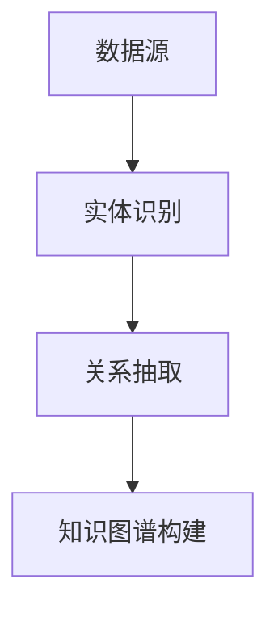
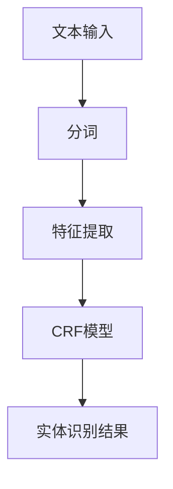
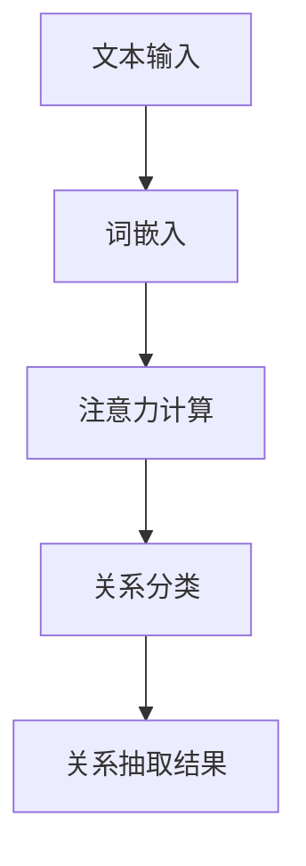
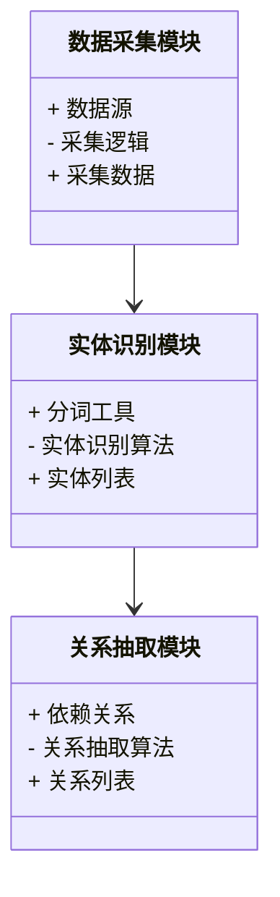
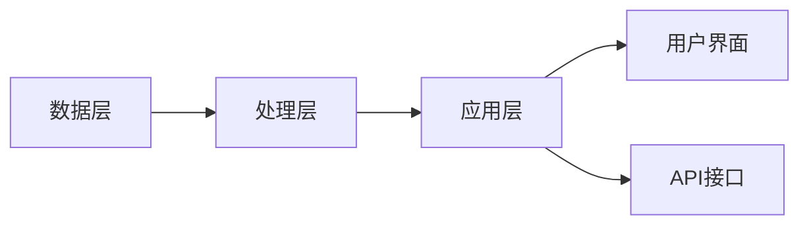
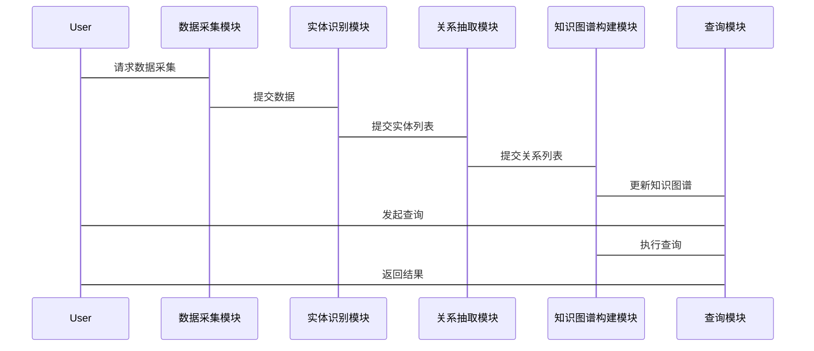

                 


# 构建基于知识图谱的金融监管合规追踪系统

## 关键词：知识图谱，金融监管，合规追踪，实体识别，关系抽取，系统架构

## 摘要：
本文探讨了构建基于知识图谱的金融监管合规追踪系统，分析了传统监管方法的不足，并详细阐述了知识图谱在金融监管中的应用。文章从背景介绍、核心概念、算法原理、系统架构到项目实战，全面解析了构建该系统的关键步骤和技术细节，为读者提供了一套完整的解决方案。

---

# 第一部分: 基于知识图谱的金融监管合规追踪系统概述

## 第1章: 金融监管与合规追踪的背景与挑战

### 1.1 金融监管的现状与问题
#### 1.1.1 传统金融监管的痛点
- **数据分散**：金融机构数据分散，难以全局分析。
- **关联性弱**：传统方法难以发现跨机构的关联风险。
- **效率低下**：人工审核耗时，难以应对海量数据。

#### 1.1.2 合规追踪的难点与挑战
- **复杂网络**：金融交易网络复杂，追踪困难。
- **实时性要求高**：需要快速响应潜在风险。
- **数据异构性**：多源数据格式多样，整合困难。

#### 1.1.3 知识图谱在金融监管中的潜力
- **结构化数据**：知识图谱提供结构化语义网络，便于分析。
- **语义理解**：通过语义理解提升监管准确性。
- **高效查询**：支持复杂查询，快速定位问题。

### 1.2 知识图谱的基本概念
#### 1.2.1 知识图谱的定义与特点
- **定义**：知识图谱是结构化的语义网络，由实体和关系组成。
- **特点**：语义丰富、结构化、动态更新。

#### 1.2.2 知识图谱与其他技术的区别
- **与数据库的区别**：数据库关注结构化数据，知识图谱注重语义。
- **与传统知识库的区别**：知识图谱更具动态性和关联性。

#### 1.2.3 知识图谱在金融领域的应用前景
- **风险控制**：识别关联风险，预防金融犯罪。
- **合规管理**：自动化合规检查，提升效率。
- **智能监管**：支持智能决策，优化监管流程。

### 1.3 本章小结
- **金融监管的痛点与挑战**：数据分散、关联性弱、效率低下。
- **知识图谱的核心价值**：提供结构化语义网络，提升监管效率。
- **本书的研究目标与意义**：构建知识图谱驱动的合规追踪系统，解决监管难题。

---

# 第二部分: 知识图谱的构建与核心概念

## 第2章: 知识图谱的构建流程

### 2.1 知识图谱的构建步骤
#### 2.1.1 数据采集与预处理
- **数据来源**：金融机构报告、新闻、公告等。
- **预处理**：清洗、去重、格式统一。

#### 2.1.2 实体识别与关系抽取
- **实体识别**：使用NLP技术识别公司、个人、机构等实体。
- **关系抽取**：识别实体间的关联关系，如“拥有”、“关联”。

#### 2.1.3 知识融合与存储
- **知识融合**：整合多源数据，消除冲突。
- **存储方式**：使用图数据库存储实体和关系。

### 2.2 知识图谱的表示方法
#### 2.2.1 实体与关系的表示
- **实体**：节点，属性包括名称、ID、地址。
- **关系**：边，属性包括时间、类型、权重。

#### 2.2.2 知识图谱的存储方式
- **图数据库**：如Neo4j，支持高效查询。
- **RDF存储**：使用RDF格式存储知识。

#### 2.2.3 知识图谱的可视化
- **工具**：使用Gephi、NetworkX进行可视化。
- **方法**：节点和边的布局优化。

### 2.3 知识图谱的核心概念与联系
#### 2.3.1 实体识别的 Mermaid 流程图


#### 2.3.2 实体与关系的属性特征对比表格
| 属性 | 实体 | 关系 |
|------|------|------|
| 类型 | 公司、个人、机构 | 拥有、关联、合规 |
| 属性值 | 名称、ID、地址 | 时间、类型、权重 |

### 2.4 本章小结
- **知识图谱的构建流程**：从数据采集到知识融合。
- **实体与关系的核心属性**：实体和关系的属性对比。
- **知识图谱在金融监管中的应用**：支持高效查询和分析。

---

# 第三部分: 知识图谱的算法原理

## 第3章: 实体识别与关系抽取算法

### 3.1 实体识别算法
#### 3.1.1 基于CRF的实体识别模型
- **CRF模型**：条件随机场，用于序列标注。
- **流程**：
  1. 数据预处理：分词、去除停用词。
  2. 特征提取：词性、位置、上下文。
  3. 模型训练：使用CRF进行序列标注。
  4. 实体识别：对文本进行标注，提取实体。

#### 3.1.2 实体识别的 Mermaid 流程图


#### 3.1.3 实体识别的Python代码实现
```python
import spacy

nlp = spacy.load("en_core_web_sm")
doc = nlp("Apple is a company based in USA.")
for token in doc:
    print(token.text, token.pos_, token.ent_type_)
```

#### 3.1.4 实体识别的数学模型
- **CRF模型**：用于序列标注，公式如下：
  $$ P(y|x) = \frac{1}{Z} \exp(\sum_{i=1}^n \sum_{k} \lambda_k f_k(x, y)) $$
  其中，$Z$ 是归一化因子，$\lambda_k$ 是特征权重。

### 3.2 关系抽取算法
#### 3.2.1 基于注意力机制的关系抽取模型
- **注意力机制**：用于捕捉句子中重要部分的特征。
- **流程**：
  1. 词嵌入：将文本转换为向量。
  2. 注意力计算：计算每个词的权重。
  3. 关系抽取：基于注意力权重进行关系分类。

#### 3.2.2 关系抽取的 Mermaid 流程图


#### 3.2.3 关系抽取的Python代码实现
```python
import tensorflow as tf
from tensorflow.keras.layers import Dense, Dropout, Bidirectional, LSTM

model = tf.keras.Sequential([
    Bidirectional(LSTM(64, return_sequences=True)),
    Dropout(0.5),
    Dense(2, activation='softmax')
])
```

#### 3.2.4 关系抽取的数学模型
- **注意力机制公式**：
  $$ \alpha_i = \frac{\exp(e_i)}{\sum_{j} \exp(e_j)} $$
  其中，$e_i$ 是第i个词的注意力得分。

---

# 第四部分: 系统分析与架构设计

## 第4章: 金融监管合规追踪系统的架构设计

### 4.1 系统需求分析
- **功能需求**：合规检查、风险预警、数据可视化。
- **性能需求**：高可用性、实时性、可扩展性。

### 4.2 系统功能设计
#### 4.2.1 功能模块划分
- 数据采集模块：负责数据的收集和预处理。
- 实体识别模块：识别文本中的实体。
- 关系抽取模块：抽取实体间的关联关系。
- 知识图谱构建模块：构建和存储知识图谱。
- 系统查询模块：支持复杂查询和分析。

#### 4.2.2 功能模块的 Mermaid 类图


### 4.3 系统架构设计
#### 4.3.1 分层架构
- **数据层**：存储原始数据和知识图谱。
- **处理层**：处理数据，构建知识图谱。
- **应用层**：提供用户界面和API接口。

#### 4.3.2 系统架构的 Mermaid 架构图


### 4.4 系统接口设计
- **数据接口**：提供REST API，供其他系统调用。
- **查询接口**：支持复杂查询，返回结构化结果。

### 4.5 系统交互设计
#### 4.5.1 交互流程


### 4.6 本章小结
- **系统需求分析**：明确功能和性能需求。
- **系统架构设计**：采用分层架构，模块化设计。
- **系统交互设计**：支持高效的数据处理和用户查询。

---

# 第五部分: 项目实战

## 第5章: 金融监管合规追踪系统的实现

### 5.1 环境配置
- **安装Python库**：spaCy、networkx、tensorflow。
- **安装图数据库**：Neo4j。

### 5.2 核心代码实现
#### 5.2.1 数据采集与预处理
```python
import requests
import json

def fetch_data(url):
    response = requests.get(url)
    return json.loads(response.text)
```

#### 5.2.2 实体识别与关系抽取
```python
import spacy

nlp = spacy.load("en_core_web_sm")
doc = nlp("Apple is a company based in USA.")
entities = [ent.text for ent in doc.ents]
print(entities)
```

#### 5.2.3 知识图谱构建
```python
from neo4j import GraphDatabase

def create_graph(neo4j_uri, neo4j_user, neo4j_password):
    driver = GraphDatabase.driver(neo4j_uri, auth=(neo4j_user, neo4j_password))
    session = driver.session()
    session.run("CREATE (a:Company {name: 'Apple'})")
    session.run("CREATE (b:Country {name: 'USA'})")
    session.run("MATCH (a:Company), (b:Country) CREATE (a)-[:LOCATED_IN]->(b)")
    session.close()
```

### 5.3 案例分析
#### 5.3.1 数据来源：金融机构报告
- **数据处理**：清洗、去重、格式统一。
- **实体识别**：识别公司、个人、机构等实体。
- **关系抽取**：抽取实体间的关联关系。

#### 5.3.2 系统查询与分析
- **查询示例**：查找某公司及其关联机构。
- **分析结果**：生成可视化图表，展示关联网络。

### 5.4 本章小结
- **环境配置**：安装必要的库和工具。
- **核心代码实现**：数据采集、实体识别、知识图谱构建。
- **案例分析**：通过实际案例展示系统的应用和效果。

---

# 第六部分: 总结与展望

## 第6章: 金融监管合规追踪系统的总结与展望

### 6.1 最佳实践
- **数据隐私**：确保数据安全和隐私保护。
- **系统维护**：定期更新知识图谱，保持准确性。
- **技术优化**：探索更高效的算法和工具。

### 6.2 小结
- **核心内容回顾**：知识图谱在金融监管中的应用。
- **系统构建总结**：从数据处理到系统实现的完整流程。

### 6.3 注意事项
- **数据质量**：确保数据准确性和完整性。
- **系统性能**：优化查询效率和响应时间。
- **团队协作**：跨学科合作，确保系统实用性和可维护性。

### 6.4 拓展阅读
- **推荐书籍**：《知识图谱：概念、方法与应用》。
- **推荐论文**：关于知识图谱在金融监管中的应用研究。

---

# 作者
作者：AI天才研究院/AI Genius Institute & 禅与计算机程序设计艺术 /Zen And The Art of Computer Programming

