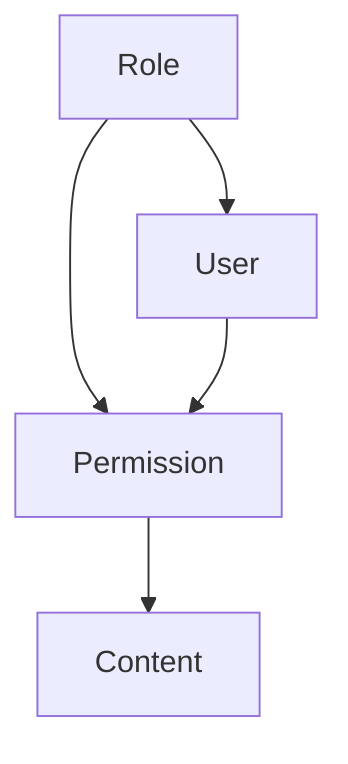
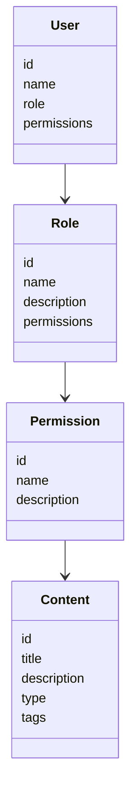
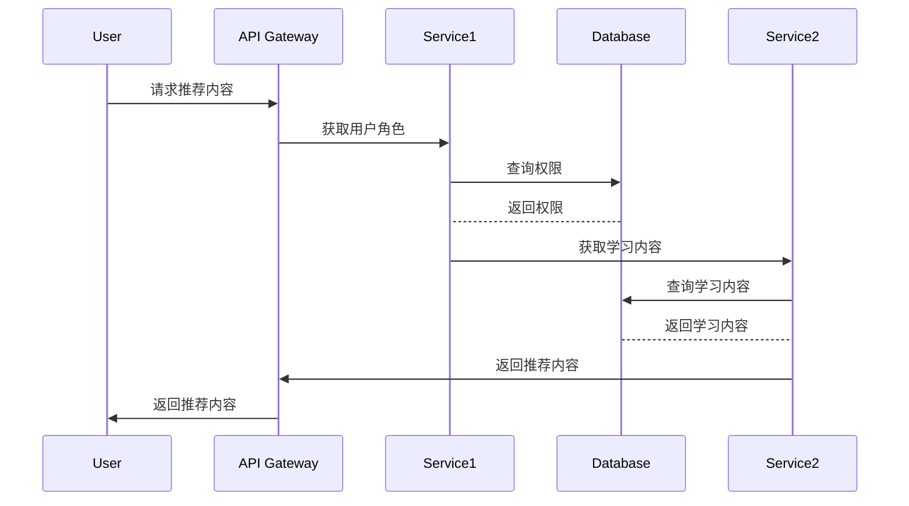

                 


# 构建智能企业合规培训系统：基于角色的个性化学习内容生成

## 关键词：企业合规培训系统，基于角色的访问控制（RBAC），个性化学习推荐，机器学习算法，系统架构设计

## 摘要：本文探讨如何构建一个智能企业合规培训系统，重点介绍基于角色的个性化学习内容生成方法。通过分析RBAC模型在企业培训中的应用，结合机器学习推荐算法，设计并实现了一个智能化的合规培训系统，为企业员工提供个性化的学习内容推荐，提升培训效率和效果。

---

# 第一部分：智能企业合规培训系统背景与核心概念

## 第1章：企业合规培训系统的背景与问题

### 1.1 企业合规培训的重要性

#### 1.1.1 合规培训的定义与作用
企业合规培训是指企业为确保员工遵守相关法律法规、行业标准和企业内部规章制度而进行的培训。合规培训的作用包括提升员工的法律意识、降低企业的法律风险、提高员工的专业能力等。

#### 1.1.2 企业合规培训的现状与挑战
传统的合规培训通常采用统一的培训内容和方式，难以满足不同岗位、不同职责的员工的个性化需求。这种一刀切的培训方式可能导致培训效果不佳，员工参与度低，甚至影响企业的合规目标。

#### 1.1.3 基于角色的个性化学习需求
在企业中，不同岗位的员工有不同的职责和权限，因此需要个性化的学习内容。例如，财务人员需要了解财务合规知识，而法务人员则需要了解法律合规知识。基于角色的个性化学习能够提高培训的针对性和效率。

---

### 1.2 个性化学习的必要性

#### 1.2.1 个性化学习的定义与特点
个性化学习是指根据学习者的背景、能力、兴趣和需求，定制个性化的学习计划和内容。其特点是灵活性、针对性和高效性。

#### 1.2.2 企业合规培训中的个性化学习场景
在企业合规培训中，个性化学习可以通过以下方式实现：
- 根据员工的岗位角色推荐相关合规知识。
- 根据员工的学习进度和掌握程度调整学习内容。
- 根据员工的反馈和需求动态调整学习计划。

#### 1.2.3 基于角色的学习内容生成问题
如何根据员工的角色生成个性化的学习内容是企业合规培训系统的核心问题之一。这需要结合角色信息、学习内容的知识点、员工的学习偏好等多个因素。

---

### 1.3 本章小结
本章介绍了企业合规培训的重要性，分析了传统合规培训的局限性，并提出了基于角色的个性化学习需求。个性化学习能够提高培训的效率和效果，是企业合规培训系统的重要发展方向。

---

## 第2章：基于角色的个性化学习系统核心概念

### 2.1 基于角色的访问控制模型（RBAC）

#### 2.1.1 RBAC模型的定义与核心要素
RBAC（基于角色的访问控制）是一种基于角色的安全管理模型。其核心要素包括：
- **角色**：定义员工在企业中的职责和权限。
- **权限**：定义员工可以访问的资源和操作。
- **用户**：员工需要通过角色获得权限。
- **资源**：企业中的数据、系统和功能。

#### 2.1.2 RBAC与传统权限管理的对比
传统的权限管理通常是基于用户直接分配权限，而RBAC是通过角色来间接分配权限。RBAC的优势在于可以简化权限管理，提高权限分配的灵活性和一致性。

#### 2.1.3 RBAC在企业合规培训中的应用
在企业合规培训中，RBAC模型可以用于根据员工的角色生成个性化学习内容。例如，财务部门的员工需要学习财务合规知识，而法务部门的员工需要学习法律合规知识。

#### 2.1.4 RBAC的实体关系图


---

### 2.2 个性化学习推荐系统

#### 2.2.1 个性化推荐算法的原理
个性化推荐系统通过分析用户的行为数据、偏好和需求，利用算法生成个性化的推荐内容。常见的推荐算法包括协同过滤、基于内容的推荐和深度学习推荐。

#### 2.2.2 基于角色的学习内容生成策略
基于角色的学习内容生成策略结合了RBAC模型和推荐算法。例如，根据员工的角色和历史学习行为，推荐相关的合规知识点。

#### 2.2.3 个性化学习推荐的实现方式
个性化学习推荐可以通过以下方式实现：
- 基于角色的协同过滤推荐：根据员工角色的相似性推荐学习内容。
- 基于角色的内容推荐：根据学习内容的标签和员工角色的匹配度推荐内容。
- 基于深度学习的推荐：利用神经网络模型分析员工的角色和学习行为，生成推荐内容。

---

### 2.3 本章小结
本章介绍了基于角色的访问控制模型（RBAC）及其在企业合规培训中的应用，分析了个性化学习推荐系统的原理和实现方式。RBAC模型为个性化学习推荐提供了角色信息，而推荐算法则根据角色信息生成个性化的学习内容。

---

## 第3章：基于角色的个性化学习推荐算法原理

### 3.1 协同过滤推荐算法

#### 3.1.1 协同过滤算法的定义与原理
协同过滤是一种基于用户行为数据的推荐算法。其基本原理是通过分析用户的历史行为（如点击、购买、评分等）找到与当前用户相似的用户，推荐这些用户喜欢的内容。

#### 3.1.2 基于用户的协同过滤实现
基于用户的协同过滤实现步骤如下：
1. 收集用户的行为数据。
2. 计算用户之间的相似度（如余弦相似度）。
3. 根据相似用户的偏好推荐内容。

#### 3.1.3 基于物品的协同过滤实现
基于物品的协同过滤实现步骤如下：
1. 收集用户的行为数据。
2. 计算物品之间的相似度。
3. 根据用户的历史行为推荐相似的物品。

---

### 3.2 基于内容的推荐算法

#### 3.2.1 基于内容的推荐原理
基于内容的推荐算法通过分析学习内容的特征（如关键词、标签等）生成推荐内容。其核心是根据内容的相似度进行推荐。

#### 3.2.2 文本相似度计算方法
文本相似度计算方法包括余弦相似度、Jaccard相似度和BM25等。例如，BM25是一种常用的文本相似度计算方法，适用于搜索和推荐场景。

#### 3.2.3 基于向量空间模型的推荐实现
基于向量空间模型的推荐实现步骤如下：
1. 对学习内容进行文本预处理（如分词、去除停用词）。
2. 构建学习内容的向量表示（如TF-IDF向量）。
3. 计算用户和内容的相似度，推荐最相关的学习内容。

---

### 3.3 深度学习推荐算法

#### 3.3.1 基于神经网络的推荐算法
基于神经网络的推荐算法利用深度学习模型（如卷积神经网络和循环神经网络）分析用户和内容的特征，生成推荐内容。

#### 3.3.2 基于深度学习的推荐实现
基于深度学习的推荐实现步骤如下：
1. 收集用户的行为数据和内容特征。
2. 构建深度学习模型（如BERT）进行特征提取。
3. 根据模型预测结果推荐学习内容。

---

### 3.4 本章小结
本章介绍了协同过滤、基于内容的推荐和深度学习推荐算法的原理和实现方式。这些算法可以根据员工的角色和历史学习行为生成个性化的学习内容推荐。

---

## 第4章：系统分析与架构设计方案

### 4.1 问题场景介绍
企业合规培训系统需要根据员工的角色生成个性化的学习内容推荐。系统需要处理大量的学习内容、用户数据和推荐请求。

### 4.2 项目介绍
本项目旨在开发一个智能企业合规培训系统，核心功能包括：
1. 用户角色管理：根据员工的岗位信息分配角色。
2. 学习内容管理：存储和管理合规知识点。
3. 个性化推荐：根据角色和学习行为生成推荐内容。

### 4.3 系统功能设计（领域模型）

#### 4.3.1 领域模型设计


### 4.4 系统架构设计

#### 4.4.1 系统架构设计
```mermaid
graph TD
    Client --> API Gateway
    API Gateway --> Service1
    Service1 --> Database
    API Gateway --> Service2
    Service2 --> Database
```

#### 4.4.2 接口设计
系统接口设计包括：
1. 用户登录与注册接口。
2. 角色和权限管理接口。
3. 学习内容管理接口。
4. 推荐算法接口。

#### 4.4.3 交互流程设计


---

## 第5章：项目实战

### 5.1 环境安装
项目实战需要安装以下工具和库：
- Python 3.8+
- Flask框架
- TensorFlow
- Scikit-learn
- NLTK

### 5.2 系统核心实现源代码

#### 5.2.1 用户角色管理代码
```python
class Role:
    def __init__(self, id, name, description, permissions):
        self.id = id
        self.name = name
        self.description = description
        self.permissions = permissions

class User:
    def __init__(self, id, name, role):
        self.id = id
        self.name = name
        self.role = role
```

#### 5.2.2 推荐算法实现代码
```python
from sklearn.metrics.pairwise import cosine_similarity

def collaborative_filtering(user_id, user_matrix):
    user_vector = user_matrix[user_id]
    similarity = cosine_similarity(user_matrix)
    similar_users = similarity[user_id].argsort()[::-1][1:]
    recommended_contents = []
    for user in similar_users:
        recommended_contents.extend(user_matrix[user].indices)
    return recommended_contents
```

### 5.3 代码应用解读与分析
代码解读：
- `Role`类表示用户角色，包含角色ID、名称、描述和权限。
- `User`类表示用户，包含用户ID、名称和角色。
- `collaborative_filtering`函数实现基于用户的协同过滤推荐算法。

### 5.4 实际案例分析
以一个财务部门员工为例，系统会根据其角色推荐财务合规相关的学习内容。

### 5.5 项目小结
本章通过实际代码实现了一个基于角色的个性化学习推荐系统，展示了如何在企业合规培训中应用推荐算法。

---

## 第6章：最佳实践、小结、注意事项和拓展阅读

### 6.1 最佳实践
1. 数据预处理：确保数据的完整性和准确性。
2. 模型优化：根据实际需求优化推荐算法。
3. 系统安全性：确保用户数据和学习内容的安全性。

### 6.2 小结
本文详细介绍了如何构建一个智能企业合规培训系统，重点讲解了基于角色的个性化学习内容生成方法。通过结合RBAC模型和推荐算法，系统能够根据员工的角色和学习行为生成个性化的学习内容推荐。

### 6.3 注意事项
1. 数据隐私：确保用户数据和学习内容的隐私安全。
2. 系统性能：优化系统性能，确保推荐响应速度。
3. 模型更新：定期更新推荐模型，保持推荐的准确性。

### 6.4 拓展阅读
1. 基于深度学习的推荐系统。
2. RBAC模型的扩展应用。
3. 个性化学习的其他应用场景。

---

## 附录：术语表

- **RBAC**：基于角色的访问控制（Role-Based Access Control）。
- **协同过滤**：一种基于用户行为数据的推荐算法。
- **内容推荐**：基于内容特征的推荐算法。

---

## 作者：AI天才研究院/AI Genius Institute & 禅与计算机程序设计艺术 /Zen And The Art of Computer Programming

