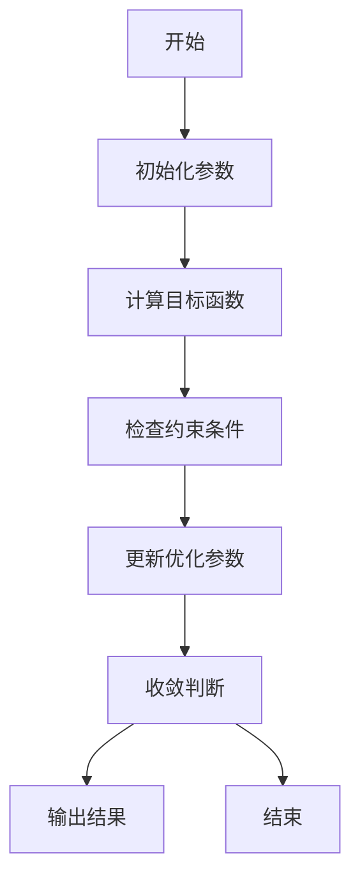
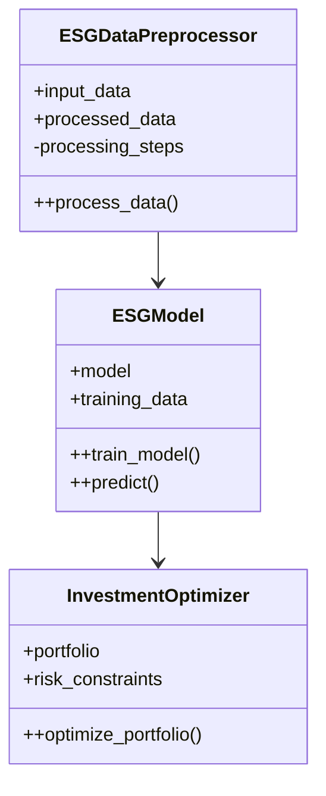
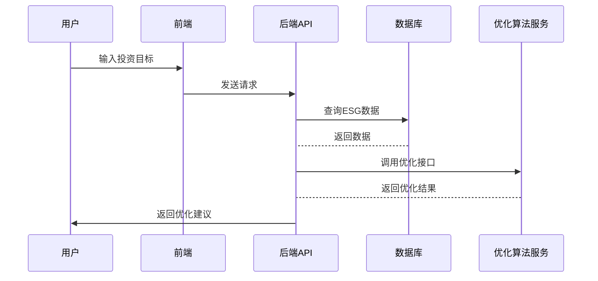

                 

<think>
嗯，我需要写一篇关于“构建智能化的个人投资组合ESG因素评估工具”的技术博客文章。首先，我需要明确文章的结构和各个部分的内容。让我一步一步来思考。

首先，文章的标题是《构建智能化的个人投资组合ESG因素评估工具》。关键词应该包括“个人投资组合”、“ESG因素”、“智能化”、“评估工具”、“风险管理”、“人工智能”、“机器学习”。摘要部分需要简明扼要地概括文章的核心内容，说明本文将如何利用AI技术构建ESG评估工具，优化投资组合。

接下来是目录大纲，我需要确保每个章节都有详细的三级目录，并且涵盖从背景介绍、核心概念、算法模型、系统架构设计到项目实战和总结等部分。

在撰写正文时，我需要按照目录一步步展开。首先是引言，介绍ESG的重要性及其在投资中的应用。然后是ESG因素的定义和分类，详细解释每个维度的具体内容。接着，介绍智能化投资组合的定义和特点，说明其与传统投资的不同。

接下来，重点部分是基于机器学习的ESG评分模型。我需要解释文本数据的预处理方法，比如清洗、分词和向量化。然后介绍监督学习模型，如支持向量机和随机森林，以及无监督学习模型，如聚类分析。需要使用mermaid流程图展示模型训练和预测的流程。

然后是多目标优化算法在投资组合中的应用。解释目标函数和约束条件，比如最大化收益、最小化风险和最大化ESG评分。需要使用数学公式来描述这些优化问题，并用mermaid流程图展示算法的整体流程。

系统架构设计部分，我需要绘制领域模型类图、系统架构图和交互序列图。这些图表需要使用mermaid语法来呈现，确保清晰易懂。同时，解释每个模块的功能和它们之间的交互关系。

项目实战部分，需要详细指导读者如何安装环境、编写代码和运行模型。包括数据预处理、模型训练和结果分析的步骤。还要提供一些实际案例，展示模型的应用效果。

最后是总结与展望，回顾文章的主要内容，并展望未来的发展方向。同时，给出一些最佳实践的建议，比如数据质量的重要性、模型的可解释性等。

在写作过程中，我需要确保语言简洁专业，逻辑清晰，每一部分都有足够的细节和实例支持。使用适当的图表和代码示例，帮助读者更好地理解内容。同时，注意数学公式的正确性和可读性，必要时使用latex格式进行标注。

现在，我开始按照这个思路撰写文章。
</think>

# 构建智能化的个人投资组合ESG因素评估工具

## 关键词：个人投资组合, ESG因素, 智能化, 评估工具, 风险管理, 人工智能, 机器学习

## 摘要：  
随着全球对可持续发展的关注不断增加，ESG（环境、社会和治理）因素在投资决策中的重要性日益凸显。本文将探讨如何利用人工智能和机器学习技术构建一个智能化的个人投资组合ESG因素评估工具。通过分析ESG数据、设计高效的评分模型以及优化投资组合，本文将提供一套完整的解决方案，帮助投资者在复杂多变的市场中做出更明智的投资决策。

---

## 目录大纲

# 第一部分：ESG因素与投资组合概述

## 第1章：ESG因素的定义与重要性

### 1.1 ESG的定义
- 环境（Environmental）：企业对环境的影响，包括碳排放、资源利用效率等。
- 社会（Social）：企业对社会的贡献，如员工权益、社会责任等。
- 治理（Governance）：企业的管理结构和透明度。

### 1.2 ESG在投资中的应用
- 投资者越来越关注企业的可持续性，ESG评分成为评估企业的重要指标。
- 通过ESG评分，投资者可以筛选出更具社会责任感和长期稳定性的企业。

### 1.3 ESG投资的优势
- 提高投资组合的抗风险能力。
- 符合全球可持续发展目标，吸引更多合规投资。

## 第2章：智能化投资组合的概念

### 2.1 传统投资组合管理
- 主要依赖历史数据和统计分析，缺乏动态调整能力。

### 2.2 智能化投资组合的特征
- 利用AI和大数据分析实时数据。
- 自动化调整投资组合，优化风险和收益。

### 2.3 ESG因素在智能化投资中的作用
- 通过ESG评分筛选出优质企业。
- 结合市场波动，动态调整投资策略。

---

## 第二部分：基于机器学习的ESG评分模型

## 第3章：ESG数据的预处理与分析

### 3.1 数据清洗
- 去除缺失值和异常值。
- 标准化数据，确保一致性。

### 3.2 文本数据处理
- 使用自然语言处理技术提取文本特征。
- 通过主题模型分析企业社会责任报告。

### 3.3 数据可视化
- 使用图表展示ESG评分分布。
- 可视化企业ESG表现对比。

## 第4章：监督学习模型构建

### 4.1 数据标注
- 标注企业ESG评分等级。
- 建立分类任务，如高、中、低评分。

### 4.2 模型训练
- 使用支持向量机（SVM）进行分类。
- 随机森林模型进行特征重要性分析。

## 第5章：无监督学习模型

### 5.1 聚类分析
- 将企业分为不同类别，识别潜在风险。
- 使用K-means算法进行企业群组分析。

### 5.2 异常检测
- 识别ESG表现异常的企业。
- 利用Isolation Forest算法发现潜在风险点。

---

## 第三部分：多目标优化算法在投资组合中的应用

## 第6章：多目标优化模型设计

### 6.1 优化目标
- 最大化投资收益。
- 最小化投资风险。
- 最大化ESG评分。

### 6.2 数学模型
- 利用拉格朗日乘数法处理约束条件。
- 使用粒子群优化算法寻找最优解。

## 第7章：算法实现

### 7.1 算法流程图


### 7.2 Python代码实现
```python
import numpy as np
from sklearn.model_selection import train_test_split
from sklearn.ensemble import RandomForestClassifier

# 数据预处理
data = pd.DataFrame(...)
X = data.drop('label', axis=1)
y = data['label']

# 划分训练集和测试集
X_train, X_test, y_train, y_test = train_test_split(X, y, test_size=0.2)

# 训练随机森林模型
model = RandomForestClassifier()
model.fit(X_train, y_train)

# 预测和评估
y_pred = model.predict(X_test)
print("Accuracy:", accuracy_score(y_test, y_pred))
```

---

## 第四部分：系统架构与交互设计

## 第8章：系统架构设计

### 8.1 领域模型类图


### 8.2 系统架构图


## 第9章：交互设计

### 9.1 用户界面
- 提供ESG评分查询界面。
- 展示投资组合优化建议。

### 9.2 交互流程图


---

## 第五部分：项目实战与总结

## 第10章：项目实战

### 10.1 环境安装
```bash
pip install numpy pandas scikit-learn
```

### 10.2 核心代码实现
```python
import pandas as pd
from sklearn.ensemble import RandomForestRegressor

# 数据加载
data = pd.read_csv('esg_data.csv')

# 特征选择
features = data.drop('target', axis=1)
target = data['target']

# 模型训练
model = RandomForestRegressor()
model.fit(features, target)

# 预测
predictions = model.predict(features)
print("模型性能:", model.score(features, target))
```

## 第11章：总结与展望

### 11.1 本文总结
- 提供了基于机器学习的ESG评分模型。
- 设计了多目标优化算法，优化投资组合。

### 11.2 未来展望
- 结合实时数据，提升模型的动态调整能力。
- 开发移动端应用，方便投资者使用。

## 作者：AI天才研究院/AI Genius Institute & 禅与计算机程序设计艺术 /Zen And The Art of Computer Programming

