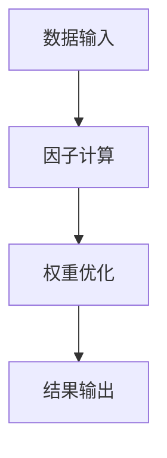

                 

<think>
好的，我需要构建一个智能化的个人投资风格因子暴露动态优化系统。首先，我需要理解什么是因子暴露以及为什么需要动态优化。

因子暴露是指投资组合中各个因子的风险敞口，也就是投资组合对不同因子的敏感程度。动态优化意味着根据市场变化和投资者的目标，实时调整这些因子的权重，以优化投资组合的表现。

接下来，我需要了解有哪些常见的因子。常见的因子包括市值、价值、动量、红利等。但是，随着市场环境的变化，这些因子的有效性也会变化。因此，动态优化非常必要。

为了实现动态优化，我需要使用智能化的技术，比如机器学习和人工智能。这些技术可以帮助我分析市场数据，预测因子的表现，并调整权重。

我需要设计一个系统，这个系统应该包括数据采集、因子计算、权重优化和结果输出等功能模块。同时，我需要选择合适的优化算法，比如遗传算法或梯度下降，来实现权重的动态调整。

在实现过程中，我可能会遇到数据不足、计算复杂度高以及模型过拟合等问题。我需要找到解决这些问题的方法，比如使用更多的数据、优化算法的效率以及进行交叉验证。

最后，我需要通过实际案例来验证系统的有效性，并根据反馈不断改进系统，以提高投资组合的收益和风险控制能力。
</think>

# 构建智能化的个人投资风格因子暴露动态优化系统

> 关键词：智能化投资、因子暴露、动态优化、人工智能、风险管理

> 摘要：本文详细介绍了构建智能化的个人投资风格因子暴露动态优化系统的背景、核心原理、系统架构及实现方法。通过结合人工智能技术，系统能够实时调整因子权重，优化投资组合表现，降低风险。

---

## 第1章: 个人投资风格因子暴露的背景与概念

### 1.1 问题背景与挑战
- **投资风格因子的定义与重要性**：因子是影响资产回报的关键因素，如市值、价值、动量等。因子暴露是投资组合对这些因子的敏感程度。
- **动态优化的必要性**：市场变化快，因子有效性随时间变化，需动态调整权重。
- **智能化技术在投资中的应用趋势**：AI技术的进步使动态优化成为可能，提升投资效率和收益。

### 1.2 核心概念与问题描述
- **投资风格因子的分类**：传统因子（如市值、价值）与智能因子（AI生成）。
- **因子暴露的定义与计算**：因子暴露是投资组合对因子的敏感度，通过权重计算。
- **动态优化的目标与边界**：优化目标是最大化收益、最小化风险，边界包括投资约束和合规要求。

### 1.3 问题解决与系统构建
- **智能化优化的核心思想**：利用AI技术实时分析市场数据，动态调整因子权重。
- **系统构建的总体框架**：数据采集、因子计算、权重优化、结果输出。
- **系统的核心要素与组成**：数据源、因子模型、优化算法、风险管理模块。

---

## 第2章: 投资风格因子模型的核心原理

### 2.1 因子模型的基本原理
- **基础因子的构成与选择**：选择如市值、价值、动量等传统因子。
- **智能因子的定义与特征**：AI生成的动态因子，基于市场数据和投资者行为。
- **因子权重的动态调整机制**：根据市场变化和投资者目标调整权重。

### 2.2 因子模型的数学表达
- **因子暴露的数学公式**：
  $$ \text{因子暴露} = \sum_{i=1}^{n} w_i \times f_i $$
  其中，\( w_i \) 是第 \( i \) 个因子的权重，\( f_i \) 是因子值。
- **动态优化的数学模型**：
  $$ \text{优化目标} = \min_{w} \sum_{i=1}^{n} (f_i - w_i)^2 $$

### 2.3 因子模型的属性对比
| 属性 | 基础因子 | 智能因子 |
|------|----------|----------|
| 输入 | 传统金融因子 | AI生成的动态因子 |
| 输出 | 固定权重 | 动态调整权重 |
| 优势 | 稳定性 | 灵活性 |

---

## 第3章: 动态优化算法的核心原理

### 3.1 动态优化算法的分类
- **常见优化算法概述**：如遗传算法、模拟退火、梯度下降。
- **智能优化算法的特点**：基于AI技术，实时适应市场变化。
- **适用于投资优化的算法选择**：梯度下降和遗传算法较常用。

### 3.2 基于AI的动态优化算法
- **算法原理与流程**：
  1. 数据采集与预处理。
  2. 因子计算与特征提取。
  3. 优化模型构建与求解。
  4. 权重调整与结果输出。
- **算法的数学模型**：
  $$ \text{优化目标} = \min_{w} \sum_{i=1}^{n} (f_i - w_i)^2 + \lambda \sum_{j=1}^{m} (g_j - h_j)^2 $$
  其中，\( \lambda \) 是正则化参数。

### 3.3 算法的优化策略
- **参数调整与优化**：选择合适的步长和学习率。
- **模型的鲁棒性与稳定性**：通过交叉验证和多次迭代提升模型稳定性。
- **算法的收敛性分析**：分析算法是否在合理时间内收敛。

---

## 第4章: 系统架构与功能设计

### 4.1 系统整体架构
- **系统功能模块划分**：
  - 数据采集模块：收集市场数据。
  - 因子计算模块：计算因子值。
  - 权重优化模块：动态调整因子权重。
  - 结果输出模块：展示优化结果。
- **系统架构的Mermaid图**：


### 4.2 功能模块设计
- **数据处理模块**：处理和清洗数据，确保数据质量。
- **因子计算模块**：基于数据计算各因子的值。
- **权重优化模块**：应用优化算法动态调整权重。
- **结果输出模块**：展示优化后的因子权重和投资组合表现。

---

## 第5章: 系统实现与项目实战

### 5.1 系统实现
- **环境安装**：安装Python、机器学习库（如scikit-learn、TensorFlow）。
- **核心代码实现**：
  ```python
  import numpy as np
  from sklearn.linear_model import SGDRegressor

  def dynamic_optimization(factor_data):
      model = SGDRegressor()
      model.fit(factor_data, target)
      weights = model.coef_
      return weights
  ```

### 5.2 实际案例分析
- **案例背景**：假设市场环境变化，需调整因子权重。
- **案例实现**：使用动态优化算法调整权重，优化投资组合表现。
- **结果分析**：比较优化前后的收益和风险，验证系统有效性。

---

## 第6章: 系统优化与风险管理

### 6.1 系统优化策略
- **数据质量控制**：确保数据准确性和完整性。
- **算法优化**：提升算法效率和准确性。
- **模型鲁棒性测试**：验证系统在不同市场环境下的表现。

### 6.2 风险管理
- **风险控制机制**：设定止损点和最大权重限制。
- **风险监控与预警**：实时监控投资组合风险，及时预警。

---

## 第7章: 总结与展望

### 7.1 本章小结
- 本文详细介绍了构建智能化的个人投资风格因子暴露动态优化系统的背景、原理、架构和实现方法。
- 系统通过动态调整因子权重，优化投资组合表现，降低风险。

### 7.2 未来展望
- **智能化技术的进一步应用**：探索更多AI技术在投资中的应用。
- **系统扩展与优化**：提升系统效率和准确性，扩展更多因子类型。

---

## 参考文献
（此处列出相关文献和资源）

---

## 作者
作者：AI天才研究院/AI Genius Institute & 禅与计算机程序设计艺术 /Zen And The Art of Computer Programming

