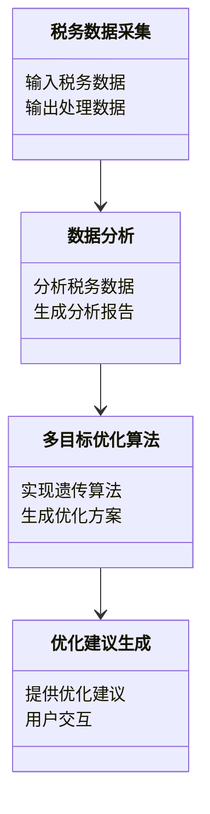
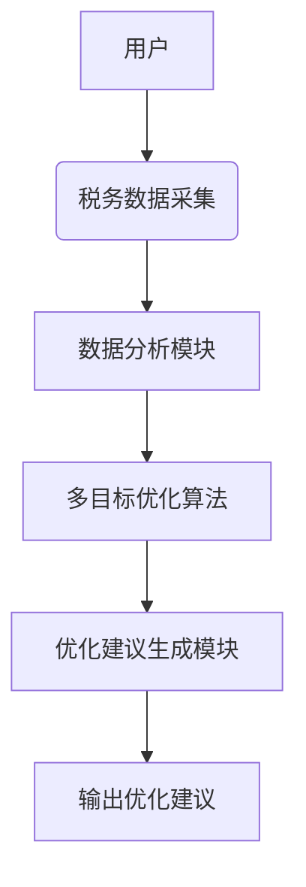
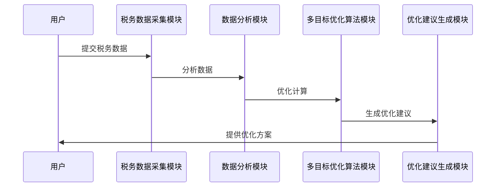
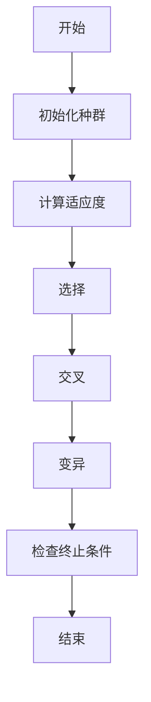

                 


# 《构建智能化的个人税务筹划多目标优化助手》

## 关键词：个人税务筹划，多目标优化，人工智能，遗传算法，系统架构

## 摘要：  
随着个人税务筹划需求的增加，智能化助手的开发变得至关重要。本文探讨如何利用多目标优化算法，特别是遗传算法，构建一个高效的个人税务筹划系统。通过系统架构设计和实战案例，详细讲解算法实现和应用场景，帮助读者掌握智能化税务助手的核心技术。

---

# 第一部分: 引言

## 第1章: 个人税务筹划的智能化需求

### 1.1 个人税务筹划的重要性

- **1.1.1 税务筹划的基本概念**  
  税务筹划是指通过合法手段优化税务负担，最大化个人或企业的利益。随着税收政策的复杂化，个人税务筹划的需求日益增长。

- **1.1.2 个人税务筹划的核心目标**  
  个人税务筹划的核心目标是降低税负，同时确保合规性。常见的税务筹划场景包括收入分配、资产配置、税务优惠选择等。

- **1.1.3 智能化税务筹划的优势**  
  传统税务筹划依赖人工计算和经验，效率低且易出错。智能化助手通过多目标优化算法，能够快速提供最优解决方案，提高效率和准确性。

### 1.2 多目标优化在税务筹划中的应用

- **1.2.1 多目标优化的定义与特点**  
  多目标优化是指在多个目标之间寻求最优解的过程。在税务筹划中，目标可能包括税负最小化、风险最小化和收益最大化。

- **1.2.2 多目标优化在税务筹划中的必要性**  
  税务问题通常涉及多个相互冲突的目标，例如减少税款和降低风险。多目标优化能够平衡这些目标，找到最优解。

- **1.2.3 智能化助手的实现路径**  
  利用人工智能和多目标优化算法，构建智能化税务助手，能够实时分析税务数据，提供个性化建议。

---

## 第2章: 多目标优化算法基础

### 2.1 多目标优化算法概述

- **2.1.1 多目标优化的基本概念**  
  多目标优化问题通常涉及多个目标函数和约束条件。例如，在税务筹划中，目标函数可能包括税款、风险和收益，约束条件可能包括法律法规。

- **2.1.2 常见的多目标优化算法**  
  常见的多目标优化算法包括遗传算法（Genetic Algorithm, GA）、粒子群优化（Particle Swarm Optimization, PSO）和多目标进化算法（Multi-objective Evolutionary Algorithm, MOEA）。

- **2.1.3 算法选择与适用场景**  
  遗传算法适用于复杂问题，适合处理多目标优化中的非线性和组合问题。

### 2.2 基于遗传算法的多目标优化

- **2.2.1 遗传算法的基本原理**  
  遗传算法是一种模拟生物进化过程的优化算法，包括选择、交叉和变异三个主要步骤。

- **2.2.2 遗传算法在多目标优化中的应用**  
  在税务筹划中，遗传算法可以用于优化税款、风险和收益等目标。例如，通过交叉和变异操作，生成新的优化方案。

- **2.2.3 算法实现步骤**  
  1. 初始化种群：随机生成一组初始解。  
  2. 计算适应度：评估每个解的目标函数值。  
  3. 选择：基于适应度值选择优秀解。  
  4. 交叉：生成新的解。  
  5. 变异：随机改变部分解。  
  6. 重复步骤，直到满足终止条件。

---

## 第3章: 个人税务筹划的智能化需求分析

### 3.1 税务环境的复杂性

- **3.1.1 税收政策的多样性**  
  不同地区的税收政策差异大，且经常变化，增加了税务筹划的复杂性。

- **3.1.2 税务计算的复杂性**  
  税务计算涉及多个因素，如收入、支出、资产等，计算过程复杂。

- **3.1.3 个人税务筹划的挑战**  
  个人税务筹划需要综合考虑多个因素，且容易受到政策变化的影响。

### 3.2 智能化税务助手的功能需求

- **3.2.1 功能模块划分**  
  智能化税务助手通常包括数据采集、分析、优化建议生成和执行监控等功能模块。

- **3.2.2 用户交互界面设计**  
  友好的用户界面是智能化助手的重要组成部分，包括数据输入、结果展示和操作指引。

- **3.2.3 数据处理与分析需求**  
  税务助手需要处理大量的税务数据，进行数据分析和建模，以提供优化建议。

---

## 第4章: 系统架构设计

### 4.1 项目目标与范围

- **4.1.1 项目目标**  
  构建一个智能化的个人税务筹划多目标优化助手，能够快速提供最优税务方案。

- **4.1.2 项目范围**  
  项目范围包括系统设计、算法实现、功能开发和测试优化。

### 4.2 系统功能设计

- **4.2.1 功能模块划分**  
  系统功能模块包括数据采集、分析、优化、建议生成和执行监控。

- **4.2.2 领域模型类图**  
  使用mermaid绘制领域模型类图，展示各模块之间的关系。



### 4.3 系统架构设计

- **4.3.1 系统架构图**  
  使用mermaid绘制系统架构图，展示系统的整体结构。



### 4.4 系统接口设计

- **4.4.1 接口设计**  
  系统接口包括数据输入接口、优化算法接口和结果输出接口。

### 4.5 系统交互流程图

- **4.5.1 交互流程图**  
  使用mermaid绘制系统交互流程图，展示用户与系统之间的交互过程。



---

## 第5章: 算法原理讲解

### 5.1 遗传算法实现步骤

- **5.1.1 遗传算法流程图**  
  使用mermaid绘制遗传算法流程图，展示算法的执行步骤。



- **5.1.2 遗传算法代码实现**  
  使用Python编写遗传算法代码，实现多目标优化。

```python
import random

def fitness(individual):
    # 定义适应度函数，计算税款、风险和收益
    tax = sum(individual)
    risk = max(individual)
    return (tax, risk)

def crossover(parent1, parent2):
    # 单点交叉
    point = random.randint(0, len(parent1)-1)
    child1 = parent1[:point] + parent2[point:]
    child2 = parent2[:point] + parent1[point:]
    return child1, child2

def mutation(individual):
    # 突变操作
    point = random.randint(0, len(individual)-1)
    individual[point] = 1 - individual[point]
    return individual

# 初始化种群
population = [[random.randint(0,1) for _ in range(10)] for _ in range(100)]

# 迭代优化
for _ in range(100):
    # 计算适应度
    fitness_list = [fitness(individual) for individual in population]
    # 选择
    selected = [population[i] for i in range(len(population)) if fitness_list[i][0] < 50 and fitness_list[i][1] < 3]
    # 交叉
    new_population = []
    while len(new_population) < len(population):
        parent1 = random.choice(selected)
        parent2 = random.choice(selected)
        child1, child2 = crossover(parent1, parent2)
        new_population.append(child1)
        new_population.append(child2)
    # 变异
    for i in range(len(new_population)):
        new_population[i] = mutation(new_population[i])
    population = new_population

# 输出最优解
best = min(population, key=lambda x: (sum(x), max(x)))
print("最优解：", best)
print("税款：", sum(best))
print("风险：", max(best))
```

---

## 第6章: 项目实战

### 6.1 环境搭建

- **6.1.1 安装Python和相关库**  
  安装Python 3.8及以上版本，安装`random`和`mermaid`库。

### 6.2 系统核心实现

- **6.2.1 核心代码实现**  
  实现多目标优化算法，包括适应度函数、选择、交叉和变异操作。

### 6.3 案例分析

- **6.3.1 案例分析**  
  通过具体案例，展示如何利用智能化助手进行税务优化，包括数据输入、算法计算和结果输出。

### 6.4 项目总结

- **6.4.1 项目总结**  
  总结项目实现的关键点和经验教训，提出改进建议。

---

## 第7章: 最佳实践与展望

### 7.1 小结

- **7.1.1 核心内容总结**  
  总结本文的核心内容，强调多目标优化算法在税务筹划中的应用。

### 7.2 注意事项

- **7.2.1 实践中的注意事项**  
  提醒读者在实践中注意数据安全、算法选择和合规性问题。

### 7.3 拓展阅读

- **7.3.1 拓展阅读建议**  
  建议读者进一步阅读多目标优化算法的相关文献，了解最新的研究进展。

---

## 作者：AI天才研究院/AI Genius Institute & 禅与计算机程序设计艺术 /Zen And The Art of Computer Programming

---

**文章末尾：**

感谢您的阅读！希望本文能够帮助您理解如何构建智能化的个人税务筹划多目标优化助手。如果您有任何问题或建议，请随时与我们联系。

---

**全文完**

