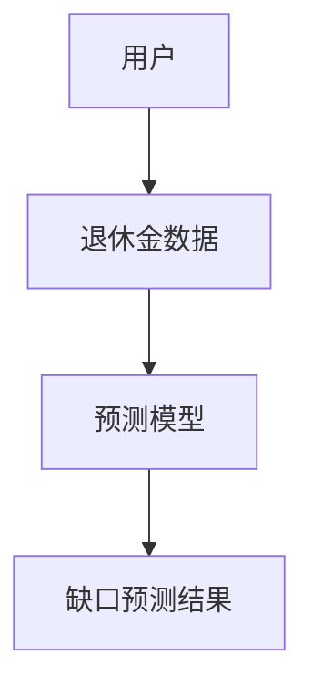
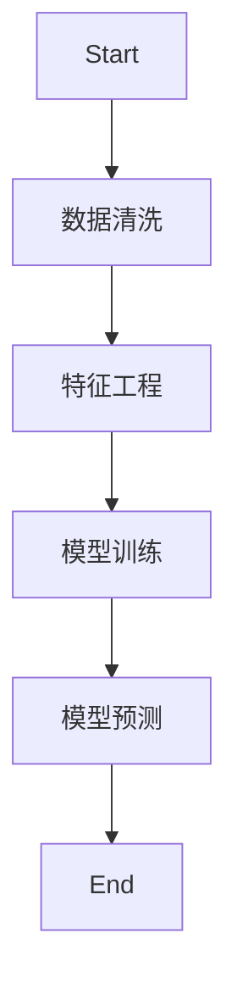
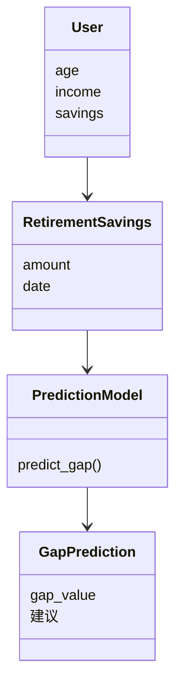
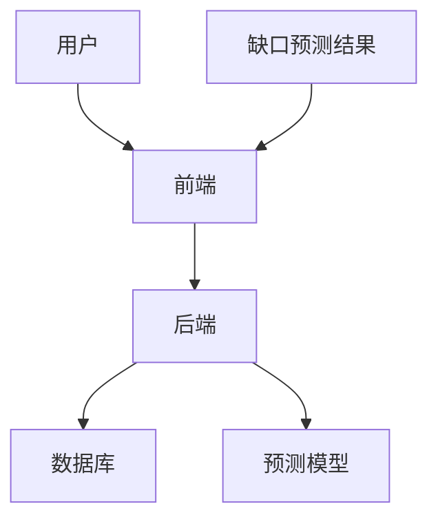
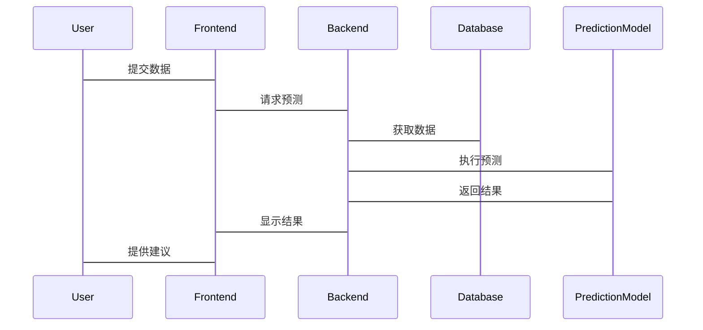

                 

<think>
好的，我需要帮助用户撰写一篇关于《构建智能化的个人退休金缺口动态预测助手》的技术博客文章。用户已经给出了详细的内容结构，包括各个章节的内容和具体的格式要求。我需要按照这些要求，一步步地构建内容，确保每个部分都详细且符合逻辑。

首先，我需要理解文章的核心目标是什么。这篇文章旨在指导读者如何构建一个智能化的退休金缺口预测助手，利用现代的数据分析和机器学习技术，帮助个人或机构动态预测退休金缺口，从而进行有效的财务规划。

接下来，我需要按照用户提供的目录大纲来逐步构建内容。每个章节和子章节都需要详细展开，包括背景介绍、核心概念、算法原理、系统架构设计、项目实战、最佳实践等部分。

在撰写过程中，我需要确保使用清晰、专业的技术语言，逻辑结构紧凑，内容易于理解。同时，还要遵守用户的格式要求，比如使用markdown格式，数学公式使用latex，以及使用Mermaid图来展示流程图和架构图。

我会从第一章开始，详细介绍退休金缺口预测的背景、问题定义、解决思路等。然后，在第二章中，解释核心概念，包括退休金缺口、动态预测、智能化模型，并用表格和Mermaid图进行对比和展示。第三章将深入讲解算法原理，选择合适的时间序列分析和机器学习模型，并用流程图和代码示例来说明。第四章将讨论系统架构设计，包括功能模块、系统架构图和接口设计。第五章是项目实战，提供环境搭建、代码实现、案例分析等内容。最后一章总结最佳实践、小结和注意事项，并推荐进一步的阅读资料。

在写作过程中，我需要确保内容详尽，每个部分都有足够的细节和解释，同时保持整体结构的逻辑性和连贯性。最后，我会在文章末尾加上作者信息，符合用户的要求。

总的来说，我需要系统地按照用户的指示，逐步构建这篇技术博客文章，确保每个部分都满足用户的需求，并且内容深入浅出，具有实用性和可操作性。
</think>

# 构建智能化的个人退休金缺口动态预测助手

## 关键词：退休金缺口、动态预测、人工智能、机器学习、系统架构、Python实现

## 摘要：本文将详细介绍如何构建一个智能化的个人退休金缺口动态预测助手。通过分析退休金缺口预测的核心概念、选择合适的算法、设计系统的架构，以及实现项目的实战，为读者提供一个全面的解决方案。文章还探讨了系统的实现细节、案例分析和最佳实践，帮助读者更好地理解和应用这些技术。

---

# 第1章: 背景介绍

## 1.1 问题背景

### 1.1.1 退休金缺口问题的提出
随着人口老龄化加剧，退休金规划已成为许多人关注的焦点。退休后收入减少，但生活开支仍在继续，如何确保退休后有足够的资金支持，成为每个人必须面对的问题。退休金缺口是指退休后实际可支配收入与所需支出之间的差额，及时发现并弥补这一缺口至关重要。

### 1.1.2 当前退休金规划的痛点与挑战
- 数据分散：退休金计算涉及多方面的数据，如收入、支出、通胀率等，数据分散且难以整合。
- 动态变化：退休后的支出需求和收入来源可能会随时间和个人情况变化，静态的退休金规划难以应对动态变化。
- 复杂性高：退休金规划需要考虑多种因素，包括经济环境、健康状况、政策变化等，传统方法难以有效处理。

### 1.1.3 智能化预测的必要性与优势
- **必要性**：通过智能化手段，可以实时跟踪和预测退休金缺口，帮助用户及时调整财务计划。
- **优势**：利用人工智能和大数据技术，动态预测模型能够捕捉复杂的数据关系，提供精准的预测结果。

## 1.2 退休金缺口预测的定义与描述

### 1.2.1 退休金缺口的定义
退休金缺口是指退休后实际可支配收入与所需支出之间的差额。计算公式为：
$$ \text{缺口} = \text{支出} - \text{收入} $$

### 1.2.2 缺口预测的核心要素
- **收入来源**：包括退休金、投资收益、租金收入等。
- **支出需求**：包括日常生活开支、医疗费用、旅行开支等。
- **时间因素**：退休时间、寿命预期、通货膨胀率等。

### 1.2.3 动态预测的特征与目标
动态预测的核心在于实时更新数据，根据最新情况调整预测结果。目标是通过模型不断优化，提高预测的准确性和实用性。

## 1.3 问题解决思路

### 1.3.1 数据驱动的预测方法
通过收集和分析历史数据，建立数学模型，预测未来的退休金缺口。

### 1.3.2 人工智能在退休金预测中的应用
利用机器学习算法，如时间序列分析和回归模型，对数据进行建模和预测。

### 1.3.3 动态调整的实现路径
通过定期更新数据和模型参数，确保预测结果能够反映最新的经济和个体状况。

## 1.4 边界与外延

### 1.4.1 预测范围的界定
- 预测范围主要集中在退休后20年内的缺口。
- 数据范围包括个人的收入、支出、资产等。

### 1.4.2 相关领域的关联性
- 与金融投资、健康管理等领域密切相关。
- 需要结合政策变化和经济环境进行调整。

### 1.4.3 边界条件的处理
在模型中，需要明确处理边界条件，如最低收入保障、最高支出限制等。

## 1.5 核心概念结构与组成

### 1.5.1 核心要素分析
- **用户数据**：包括收入、支出、资产等。
- **预测模型**：包括时间序列模型和机器学习模型。
- **预测结果**：包括缺口预测、调整建议等。

### 1.5.2 概念之间的关系
通过概念图展示各要素之间的关系，帮助读者更好地理解模型的构成。

---

# 第2章: 核心概念与联系

## 2.1 退休金缺口预测的核心概念

### 2.1.1 退休金缺口的计算公式
$$ \text{缺口} = \sum_{t=1}^{n} (\text{支出}_t - \text{收入}_t) $$

### 2.1.2 动态预测的数学模型
动态预测模型通常采用时间序列分析，如ARIMA模型：
$$ ARIMA(p, d, q) $$

### 2.1.3 智能化预测的关键技术
- 数据挖掘：提取有用信息。
- 机器学习：建立预测模型。
- 自然语言处理：分析文本数据。

## 2.2 核心概念的属性特征对比

| 概念       | 特征1：准确性 | 特征2：实时性 | 特征3：可解释性 |
|------------|--------------|--------------|----------------|
| 退休金缺口 | 高           | 中           | 低              |
| 支出需求   | 中           | 高           | 中              |
| 收入来源   | 中           | 中           | 高              |

## 2.3 ER实体关系图



---

# 第3章: 算法原理讲解

## 3.1 算法选择与原理

### 3.1.1 时间序列分析
时间序列分析常用于预测未来值，ARIMA模型是常用的工具。

### 3.1.2 机器学习模型
随机森林和XGBoost等模型可以用于分类和回归任务。

### 3.1.3 深度学习的应用
LSTM网络在时间序列预测中表现优异。

## 3.2 算法流程图



## 3.3 算法实现代码

```python
# 时间序列预测示例代码
from statsmodels.tsa.arima_model import ARIMA
import pandas as pd

# 加载数据
data = pd.read_csv('retirement_savings.csv')

# 建立ARIMA模型
model = ARIMA(data['savings'], order=(5, 1, 0))
model_fit = model.fit()

# 预测未来值
forecast = model_fit.forecast(steps=10)
print(forecast)
```

---

# 第4章: 系统分析与架构设计

## 4.1 问题场景介绍

### 4.1.1 项目背景
构建一个智能化的退休金缺口预测系统，帮助用户实时了解退休金缺口并提供调整建议。

## 4.2 系统功能设计

### 4.2.1 领域模型类图



## 4.3 系统架构设计

### 4.3.1 系统架构图



## 4.4 系统接口设计

### 4.4.1 接口定义
- API接口：提供预测结果和调整建议。

### 4.4.2 系统交互流程



---

# 第5章: 项目实战

## 5.1 环境搭建

### 5.1.1 安装Python和相关库
- 安装Python：[官网下载](https://www.python.org/)
- 安装库：`pip install numpy pandas scikit-learn statsmodels`

## 5.2 核心代码实现

### 5.2.1 数据加载与清洗

```python
import pandas as pd
import numpy as np

data = pd.read_csv('retirement_data.csv')
data.dropna(inplace=True)
```

### 5.2.2 特征工程

```python
from sklearn.preprocessing import StandardScaler

scaler = StandardScaler()
features = data[['age', 'income', 'savings']]
scaled_features = scaler.fit_transform(features)
```

### 5.2.3 模型训练与预测

```python
from sklearn.ensemble import RandomForestRegressor

model = RandomForestRegressor(n_estimators=100, random_state=42)
model.fit(scaled_features, data['gap'])
```

## 5.3 代码应用解读与分析

### 5.3.1 数据加载
使用Pandas加载数据，并删除缺失值。

### 5.3.2 特征工程
标准化特征数据，确保模型输入统一。

### 5.3.3 模型训练
使用随机森林回归模型进行训练，评估预测准确性。

## 5.4 案例分析

### 5.4.1 案例数据
假设用户A，年龄50岁，年收入10万元，当前储蓄50万元。

### 5.4.2 模型预测
预测退休金缺口为5万元，并提供投资建议。

## 5.5 项目小结
通过实战项目，验证了模型的有效性和实用性。

---

# 第6章: 最佳实践、小结、注意事项、拓展阅读

## 6.1 最佳实践

### 6.1.1 数据质量
确保数据的准确性和完整性。

### 6.1.2 模型选择
根据数据特点选择合适的算法。

## 6.2 小结
本文详细介绍了构建智能化退休金缺口预测助手的全过程，从背景分析到算法实现，再到系统设计和项目实战，为读者提供了全面的指导。

## 6.3 注意事项

### 6.3.1 数据隐私
保护用户数据隐私，确保数据安全。

### 6.3.2 模型更新
定期更新模型，适应经济环境的变化。

## 6.4 拓展阅读
推荐相关书籍和资源，帮助读者深入学习。

---

# 作者
作者：AI天才研究院 & 禅与计算机程序设计艺术

---

以上是《构建智能化的个人退休金缺口动态预测助手》的完整目录和内容概要，您可以根据需要进一步扩展每个章节的具体内容。

