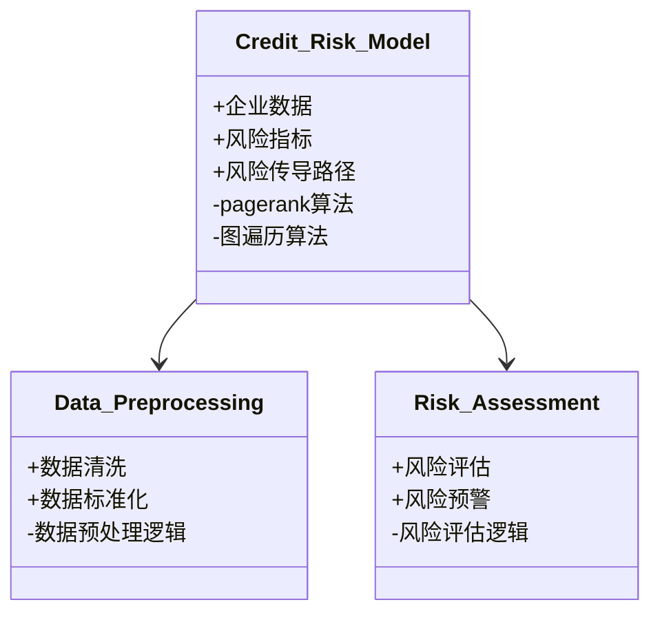
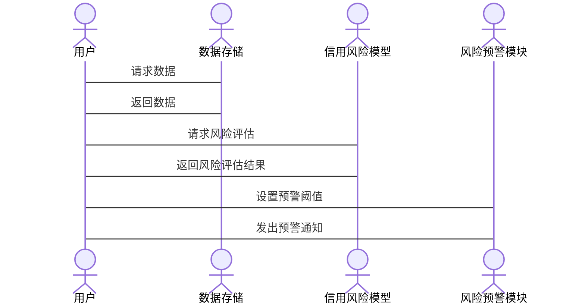

                 


# 构建智能化的企业信用风险传导模型

> 关键词：信用风险传导模型，智能化，企业信用风险，风险评估，人工智能

> 摘要：本文详细探讨了构建智能化的企业信用风险传导模型的关键步骤和方法，从理论基础到实际应用，结合数据驱动和人工智能技术，分析了模型的设计原理、算法实现、系统架构以及实际案例，旨在为企业信用风险管理提供新的思路和解决方案。

---

# 第一部分: 企业信用风险传导模型的背景与核心概念

## 第1章: 企业信用风险传导模型的背景介绍

### 1.1 问题背景
#### 1.1.1 信用风险的基本概念
信用风险是指企业在履行合同义务时，由于企业自身或外部环境的变化，导致企业无法履行债务或履行能力下降而给债权人带来的损失风险。信用风险是企业在经营过程中面临的核心风险之一。

#### 1.1.2 信用风险传导的经济意义
信用风险的传导是指一个企业的信用风险可能会通过供应链、合作伙伴、金融市场等渠道传导给其他相关方。这种传导机制在经济系统中具有重要的影响，可能导致连锁反应，引发系统性风险。

#### 1.1.3 传统信用风险模型的局限性
传统的信用风险模型主要基于统计分析和财务指标，难以捕捉企业之间的复杂关系和动态变化。特别是在全球化和数字化的背景下，企业之间的关联性日益增强，传统的模型难以满足智能化和实时性的要求。

### 1.2 问题描述
#### 1.2.1 信用风险传导的定义
信用风险传导是指企业之间的信用风险通过直接或间接的渠道相互影响的过程。

#### 1.2.2 信用风险传导的关键特征
- **复杂性**：企业之间的关系错综复杂，风险传导路径多样。
- **动态性**：随着市场环境的变化，风险传导的强度和方向也会发生变化。
- **系统性**：局部风险可能引发系统性风险，影响整个经济体系。

#### 1.2.3 信用风险传导的复杂性
企业之间的信用风险传导不仅受到企业自身经营状况的影响，还受到外部环境、市场波动、政策变化等多种因素的影响。

### 1.3 问题解决
#### 1.3.1 数据驱动的信用风险分析方法
通过收集和分析企业的经营数据、市场数据、财务数据等，利用大数据和人工智能技术，构建智能化的信用风险传导模型。

#### 1.3.2 智能化信用风险传导模型的设计目标
- 实现对企业信用风险的实时监测和预测。
- 精准识别信用风险的传导路径和影响范围。
- 提供风险预警和应对策略。

#### 1.3.3 智能化信用风险传导模型的优势
- 能够捕捉企业之间的复杂关系和动态变化。
- 具备高精度和实时性，能够及时发现潜在风险。
- 可以提供个性化的风险管理解决方案。

### 1.4 模型的边界与外延
#### 1.4.1 模型的适用范围
- 适用于企业间的信用风险分析。
- 适用于供应链金融、银企合作等场景。

#### 1.4.2 模型的限制条件
- 数据质量和完整性对模型的准确性有直接影响。
- 模型的复杂性可能导致计算成本较高。

#### 1.4.3 模型与其他信用风险模型的关系
智能化信用风险传导模型是对传统信用风险模型的补充和优化，能够更好地适应复杂多变的经济环境。

### 1.5 概念结构与核心要素组成
#### 1.5.1 模型的核心要素
- 企业数据：包括企业经营数据、财务数据、市场数据等。
- 风险指标：如违约概率（PD）、违约损失率（LGD）等。
- 风险传导路径：包括供应链、合作伙伴、金融市场等。

#### 1.5.2 模型的逻辑结构
1. 数据采集与预处理：收集企业的相关信息，清洗和标准化数据。
2. 风险评估：通过机器学习算法，评估企业的信用风险。
3. 风险传导分析：识别风险传导路径，评估风险的扩散范围和影响程度。
4. 风险预警与应对策略：根据模型预测结果，制定相应的风险管理策略。

#### 1.5.3 模型的输入输出关系
- 输入：企业的经营数据、市场数据、财务数据等。
- 输出：企业的信用风险评估结果、风险传导路径分析、风险预警信息。

---

## 第2章: 企业信用风险传导模型的核心概念与联系

### 2.1 核心概念原理
#### 2.1.1 信用风险的基本属性
- 传染性：信用风险可以通过企业之间的关联传导给其他企业。
- 系统性：局部风险可能导致系统性风险。

#### 2.1.2 风险传导的机制
- 直接传导：企业之间的直接债务关系，如供应链上的企业。
- 间接传导：通过市场、金融产品等间接渠道传导。

### 2.2 概念属性特征对比
| 概念       | 特征             |
|------------|------------------|
| 传染性     | 风险通过企业间传导 |
| 系统性     | 影响范围广泛      |
| 可控性     | 可通过模型预测和干预 |

### 2.3 ER实体关系图架构
```mermaid
er
actor Credit_Risk_Entities {
  id: string
  name: string
  financial_data: string
  market_data: string
}

actor Credit_Risk_Relationships {
  id: string
  entity1_id: string
  entity2_id: string
  relationship_type: string
}

actor Credit_Risk_Transmission {
  id: string
  source_entity_id: string
  target_entity_id: string
  transmission_path: string
  risk_level: int
}
```

---

## 第3章: 企业信用风险传导模型的算法原理

### 3.1 算法原理概述
智能化信用风险传导模型采用机器学习算法，结合图论和网络分析技术，分析企业之间的关联关系，评估信用风险的传导路径和影响程度。

### 3.2 算法实现步骤
1. 数据采集与预处理：收集企业的经营数据、市场数据、财务数据等。
2. 构建企业关系图：将企业之间的关系表示为图结构，节点代表企业，边表示企业之间的关联。
3. 计算节点风险值：基于节点的重要性，采用pagerank算法计算每个节点的风险值。
4. 识别风险传导路径：通过图遍历算法，识别风险从高风险节点向其他节点传导的路径。
5. 风险评估与预警：根据风险值和传导路径，评估风险的影响程度，并制定相应的预警策略。

### 3.3 核心算法的实现
#### 3.3.1 Pagerank算法
Pagerank算法用于评估图中节点的重要性，可以应用于企业关系图中节点的风险评估。

代码示例：
```python
import networkx as nx

def pagerank(G, alpha=0.85):
    return nx.pagerank(G, alpha)
```

#### 3.3.2 图遍历算法
广度优先搜索（BFS）用于识别风险传导路径。

代码示例：
```python
import networkx as nx

def bfs(G, start_node):
    visited = []
    queue = [start_node]
    while queue:
        node = queue.pop(0)
        if node not in visited:
            visited.append(node)
            queue.extend(list(G.neighbors(node)))
    return visited
```

### 3.4 数学模型与公式
#### 3.4.1 Pagerank算法公式
$$
P(i) = (1 - \alpha) + \alpha \sum_{j \in I(i)} \frac{P(j)}{d(j)}
$$

其中，$P(i)$ 表示节点 $i$ 的pagerank值，$\alpha$ 是阻尼系数，$I(i)$ 是节点 $i$ 的入边节点集合，$d(j)$ 是节点 $j$ 的出度。

#### 3.4.2 风险传导模型公式
$$
R(i) = \sum_{j \in N(i)} w(i,j) \cdot R(j)
$$

其中，$R(i)$ 表示节点 $i$ 的风险值，$N(i)$ 是节点 $i$ 的邻居节点集合，$w(i,j)$ 是节点 $i$ 和 $j$ 之间的权重。

---

## 第4章: 企业信用风险传导模型的系统分析与架构设计

### 4.1 项目背景
企业信用风险传导模型旨在通过智能化手段，帮助企业识别和管理信用风险，降低潜在损失。

### 4.2 系统功能设计
#### 4.2.1 领域模型


#### 4.2.2 系统架构


#### 4.2.3 接口设计
- 数据接口：用于数据的输入和输出。
- 模型接口：用于与外部系统集成，如ERP系统、金融系统等。

#### 4.2.4 交互流程


---

## 第5章: 企业信用风险传导模型的项目实战

### 5.1 环境安装
- 安装Python和必要的库：numpy、pandas、networkx、matplotlib。
- 数据存储和处理工具：如MySQL、MongoDB。

### 5.2 核心实现
#### 5.2.1 数据预处理
```python
import pandas as pd

data = pd.read_csv('企业数据.csv')
data = data.dropna()
data = data.astype('float')
```

#### 5.2.2 构建企业关系图
```python
import networkx as nx

G = nx.Graph()
G.add_edges_from([('企业A', '企业B'), ('企业B', '企业C')])
```

#### 5.2.3 计算节点风险值
```python
pagerank_scores = nx.pagerank(G)
print(pagerank_scores)
```

#### 5.2.4 风险传导路径分析
```python
start_node = '企业A'
path = bfs(G, start_node)
print(path)
```

### 5.3 案例分析
#### 5.3.1 数据分析
分析企业之间的关系，识别高风险节点和风险传导路径。

#### 5.3.2 模型训练
通过历史数据训练模型，优化参数，提高模型的准确性和实时性。

#### 5.3.3 结果展示
可视化风险传导路径和风险预警信息，帮助用户直观理解风险分布和传导过程。

### 5.4 项目小结
通过项目实战，验证了模型的有效性和实用性，进一步优化了模型的算法和系统架构，提高了模型的准确性和实时性。

---

## 第6章: 企业信用风险传导模型的总结与展望

### 6.1 总结
本文详细探讨了构建智能化的企业信用风险传导模型的关键步骤和方法，从理论基础到实际应用，结合数据驱动和人工智能技术，分析了模型的设计原理、算法实现、系统架构以及实际案例，为企业信用风险管理提供了新的思路和解决方案。

### 6.2 注意事项
- 数据质量对模型的准确性有直接影响，需要确保数据的完整性和准确性。
- 模型的实时性要求较高，需要优化算法和系统架构，提高计算效率。
- 风险预警的及时性对企业的风险管理至关重要，需要建立高效的预警机制。

### 6.3 未来研究方向
- 结合区块链技术，提高模型的可信度和安全性。
- 研究动态网络分析技术，提高模型的实时性和动态性。
- 探索多模态数据的融合，进一步提高模型的准确性和智能性。

---

作者：AI天才研究院/AI Genius Institute & 禅与计算机程序设计艺术/Zen And The Art of Computer Programming

