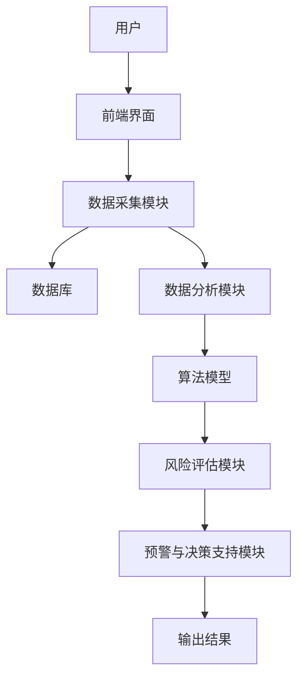

                 


# 构建智能化的企业资金流动性风险动态管理平台

> 关键词：资金流动性风险，智能化管理，动态管理平台，人工智能，风险管理，企业财务

> 摘要：资金流动性风险是企业在经营过程中面临的重要风险之一，传统的静态管理方式已经难以应对市场的快速变化。本文提出构建一个智能化的资金流动性风险动态管理平台，通过实时数据采集、智能分析和预警功能，帮助企业实现对资金流动性的动态监控和管理，从而降低风险，提高企业的财务稳健性。本文详细探讨了平台的构建目标、核心算法、系统架构和实现步骤，并通过案例分析展示了平台的实际应用效果。

---

# 第一部分: 资金流动性风险动态管理平台的背景与概述

## 第1章: 资金流动性风险与智能化管理概述

### 1.1 资金流动性风险的定义与重要性

#### 1.1.1 资金流动性风险的定义
资金流动性风险是指企业在一定时期内无法及时获得足够的资金来应对负债偿还、日常经营或其他财务需求的风险。这种风险可能来自市场波动、供应链问题或企业内部管理不善。

#### 1.1.2 资金流动性风险对企业的影响
- 影响企业的短期偿债能力，可能导致企业无法按时偿还债务，引发信用危机。
- 影响企业的日常经营，可能导致生产中断或供应链断裂。
- 影响企业的财务信誉，可能导致合作伙伴和客户的信任度下降。

#### 1.1.3 资金流动性风险的管理目标
- 实现资金的高效配置，确保企业在不同时间段内拥有足够的资金支持。
- 提前预警潜在的资金短缺风险，采取预防措施避免危机发生。
- 优化资金使用效率，降低企业的财务成本。

### 1.2 智能化管理的必要性

#### 1.2.1 传统资金流动性风险管理的局限性
- 依赖人工分析，效率低且容易出错。
- 数据更新不及时，难以应对市场的快速变化。
- 缺乏预测能力，无法提前预知潜在风险。

#### 1.2.2 智能化管理的优势与特点
- 利用人工智能和大数据技术，实现实时监控和智能预测。
- 自动化分析和预警，提高管理效率和准确性。
- 可扩展性强，能够适应不同规模和复杂度的企业需求。

#### 1.2.3 智能化管理的实现路径
- 引入机器学习算法，建立资金流动性的预测模型。
- 实时采集和处理多源数据，包括财务数据、市场数据和供应链信息。
- 构建动态管理平台，提供实时监控和决策支持。

### 1.3 动态管理平台的构建目标

#### 1.3.1 平台的功能定位
- 实时监控企业的资金流动情况，提供动态的财务分析。
- 基于历史数据和市场趋势，预测未来的资金流动需求。
- 提供风险预警功能，帮助企业在潜在风险发生前采取应对措施。

#### 1.3.2 平台的核心价值
- 提高资金管理的效率和准确性，降低企业的财务风险。
- 优化资金配置，提高资金使用效率，降低成本。
- 提供决策支持，帮助企业制定更加科学的资金管理策略。

#### 1.3.3 平台的预期效果
- 实现资金流动性的实时监控和智能预测。
- 提供多维度的风险分析和预警，帮助企业及时应对潜在风险。
- 通过数据驱动的决策支持，提高企业的财务稳健性。

### 1.4 本章小结
本章详细介绍了资金流动性风险的定义、重要性和管理目标，探讨了智能化管理的必要性及其优势。通过构建智能化的资金流动性风险动态管理平台，企业能够实现对资金流动性的实时监控和智能预测，从而有效降低财务风险，提高企业的财务稳健性。

---

## 第2章: 资金流动性风险的多维度分析

### 2.1 资金流动性风险的维度分解

#### 2.1.1 时间维度的流动性分析
- 短期流动性分析：关注企业在未来几周或几个月内的资金需求。
- 中期流动性分析：关注未来半年到一年的资金流动情况。
- 长期流动性分析：关注未来几年的资金规划和安排。

#### 2.1.2 空间维度的流动性分析
- 区域性流动性分析：分析不同地区或部门的资金流动情况。
- 行业性流动性分析：比较同行业其他企业的资金流动状况。

#### 2.1.3 业务维度的流动性分析
- 销售业务流动性分析：关注销售回款的速度和金额。
- 采购业务流动性分析：关注采购付款的及时性和成本。
- 投资业务流动性分析：关注投资项目的资金投入和回收情况。

### 2.2 资金流动性的关键指标

#### 2.2.1 现金流预测指标
- 自由现金流（Free Cash Flow）：企业在一定时期内产生的现金净流量。
- 现金流入预测：预测未来一定时期内企业的现金收入情况。
- 现金流出预测：预测未来一定时期内企业的现金支出情况。

#### 2.2.2 资金周转率指标
- 应收账款周转率：衡量企业应收账款的周转效率。
- 存货周转率：衡量企业存货的周转效率。
- 总资产周转率：衡量企业总资产的周转效率。

#### 2.2.3 资金充裕度指标
- 资金充足率：衡量企业在一定时期内资金的充足程度。
- 现金储备充足率：衡量企业应急资金的储备情况。
- 流动资产与流动负债比例：衡量企业的短期偿债能力。

### 2.3 资金流动性的风险评估模型

#### 2.3.1 风险评估模型的构建
- 基于机器学习的预测模型：利用历史数据和市场信息，预测未来的资金流动情况。
- 基于时间序列分析的预测模型：通过分析历史数据的时序特性，预测未来的资金流动趋势。

#### 2.3.2 模型的输入变量与输出结果
- 输入变量：包括财务数据、市场数据、供应链信息等。
- 输出结果：包括资金流动的预测值、风险等级、预警信号等。

#### 2.3.3 模型的验证与优化
- 模型的验证：通过历史数据验证模型的准确性和稳定性。
- 模型的优化：根据实际应用情况，不断优化模型的参数和结构。

### 2.4 本章小结
本章从多维度分析了资金流动性风险，包括时间维度、空间维度和业务维度的分析。同时，提出了资金流动性的关键指标和风险评估模型，为构建智能化的资金流动性风险动态管理平台提供了理论基础。

---

## 第3章: 动态管理平台的核心框架

### 3.1 平台的整体架构

#### 3.1.1 平台的功能模块划分
- 数据采集模块：负责实时采集企业的财务数据、市场数据和供应链信息。
- 数据分析模块：利用机器学习和时间序列分析等技术，对数据进行分析和预测。
- 风险评估模块：基于分析结果，评估资金流动性的风险等级。
- 预警与决策支持模块：根据风险评估结果，提供预警信号和决策建议。

#### 3.1.2 平台的核心价值
- 提供实时监控和智能预测，帮助企业实现对资金流动性的动态管理。
- 通过风险评估和预警功能，降低企业的财务风险。
- 提供数据驱动的决策支持，优化企业的资金配置和使用效率。

### 3.2 平台的核心算法

#### 3.2.1 时间序列分析算法
- ARIMA模型：用于预测未来的资金流动趋势。
- LSTM模型：用于处理复杂的时间序列数据，捕捉数据中的长期依赖关系。

#### 3.2.2 机器学习算法
- 线性回归：用于预测资金流动的线性关系。
- 支持向量回归（SVR）：用于非线性关系的预测。
- 随机森林：用于特征重要性分析和预测。

#### 3.2.3 算法的实现步骤
1. 数据预处理：包括数据清洗、特征提取和数据归一化。
2. 模型训练：利用训练数据训练机器学习模型。
3. 模型预测：基于训练好的模型，预测未来的资金流动情况。
4. 模型评估：通过指标如均方误差（MSE）、R平方值等，评估模型的预测精度。

### 3.3 平台的系统架构设计

#### 3.3.1 系统功能设计
- 数据采集与处理：实时采集企业的财务数据、市场数据和供应链信息。
- 数据存储：将数据存储在数据库中，便于后续分析和查询。
- 数据分析与预测：利用算法模型对数据进行分析和预测。
- 风险评估与预警：根据分析结果，评估风险等级并提供预警信号。

#### 3.3.2 系统架构图


#### 3.3.3 系统接口设计
- 数据采集接口：与企业的财务系统、市场数据供应商和供应链系统对接。
- 数据分析接口：提供API供其他模块调用数据分析结果。
- 预警接口：当风险等级达到预设阈值时，触发预警信号。

### 3.4 本章小结
本章详细介绍了动态管理平台的整体架构和核心算法，包括时间序列分析和机器学习算法的实现步骤。同时，通过系统架构图展示了平台的各个功能模块及其交互关系，为后续的系统实现提供了指导。

---

## 第4章: 动态管理平台的实现与应用

### 4.1 项目实战

#### 4.1.1 环境安装
- 安装Python编程语言和必要的开发工具。
- 安装机器学习库如scikit-learn、TensorFlow和Keras。
- 安装数据库和数据可视化工具如MySQL、Pandas和Matplotlib。

#### 4.1.2 核心代码实现
```python
import pandas as pd
import numpy as np
from sklearn.model_selection import train_test_split
from sklearn.metrics import mean_squared_error
import tensorflow as tf
from tensorflow.keras.models import Sequential
from tensorflow.keras.layers import LSTM, Dense

# 数据预处理
data = pd.read_csv('financial_data.csv')
features = data[['revenue', 'expenses', 'net_income']]
labels = data['cash_flow']

# 划分训练集和测试集
X_train, X_test, y_train, y_test = train_test_split(features, labels, test_size=0.2, random_state=42)

# 构建LSTM模型
model = Sequential()
model.add(LSTM(50, input_shape=(None, 3)))
model.add(Dense(1))
model.compile(loss='mean_squared_error', optimizer='adam')

# 训练模型
model.fit(X_train, y_train, epochs=50, batch_size=32, verbose=1)

# 预测和评估
y_pred = model.predict(X_test)
print('均方误差:', mean_squared_error(y_test, y_pred))
```

#### 4.1.3 实际案例分析
- 数据来源：某制造企业的财务数据，包括收入、支出和现金流等。
- 模型训练：利用企业的历史数据训练LSTM模型，预测未来的现金流情况。
- 风险评估：根据预测结果，评估企业在未来几个月内的资金流动性风险，并提供相应的预警和决策建议。

### 4.2 项目总结

#### 4.2.1 项目成果
- 成功构建了智能化的资金流动性风险动态管理平台。
- 通过实际案例验证了平台的有效性和实用性。

#### 4.2.2 项目的意义
- 提高了企业的资金管理效率和准确性。
- 降低了企业的资金流动性风险，提高了财务稳健性。
- 为企业的决策提供了数据支持和科学依据。

### 4.3 本章小结
本章通过项目实战展示了动态管理平台的实现过程，包括环境安装、核心代码实现和实际案例分析。通过项目的实施，验证了平台的有效性和实用性，为企业的资金流动性风险管理提供了新的思路和方法。

---

## 第5章: 最佳实践与未来展望

### 5.1 最佳实践 tips

#### 5.1.1 数据质量管理
- 确保数据的准确性和完整性，避免因数据质量问题影响模型的预测精度。
- 定期更新和维护数据，确保数据的及时性和有效性。

#### 5.1.2 模型优化与维护
- 根据实际应用情况，不断优化模型的参数和结构。
- 定期验证模型的预测精度，及时调整模型以适应市场变化。

#### 5.1.3 平台的可扩展性
- 设计模块化的系统架构，便于未来扩展和升级。
- 支持多种数据源和多种算法模型的集成，提高平台的灵活性和适应性。

### 5.2 小结
智能化的资金流动性风险动态管理平台为企业提供了实时监控和智能预测的能力，能够有效降低企业的资金流动性风险，提高财务稳健性。通过最佳实践的分享，希望能够为企业在构建和优化平台的过程中提供有价值的指导。

### 5.3 未来展望
随着人工智能和大数据技术的不断发展，资金流动性风险动态管理平台将更加智能化和自动化。未来，可以进一步研究和应用更先进的算法和技术，如深度学习、自然语言处理和强化学习，进一步提高平台的预测精度和决策能力。

---

## 作者

作者：AI天才研究院/AI Genius Institute & 禅与计算机程序设计艺术 /Zen And The Art of Computer Programming

---

通过构建智能化的企业资金流动性风险动态管理平台，企业能够实现对资金流动性的实时监控和智能预测，从而有效降低财务风险，提高企业的财务稳健性。本文详细探讨了平台的构建目标、核心算法、系统架构和实现步骤，并通过案例分析展示了平台的实际应用效果。未来，随着技术的不断进步，资金流动性风险动态管理平台将更加智能化和自动化，为企业提供更加全面和精准的决策支持。

