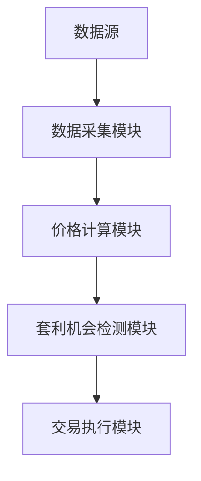
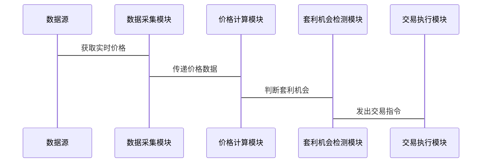

                 


# 查尔斯·布兰德的契约型封闭基金套利

> 关键词：契约型封闭基金，套利，金融数学，系统架构，Python实现

> 摘要：本文深入探讨了查尔斯·布兰德的契约型封闭基金套利策略，从其背景、核心概念、算法原理、系统架构到实际项目实现，逐一进行详细分析。通过理论与实践相结合的方式，帮助读者全面理解这一复杂的金融套利机制。

---

## 目录大纲

1. [背景介绍](#背景介绍)
   - [1.1 契约型封闭基金的定义与特点](#11-契约型封闭基金的定义与特点)
   - [1.2 套利的基本概念与原理](#12-套利的基本概念与原理)
2. [核心概念与联系](#核心概念与联系)
   - [2.1 套利的核心原理](#21-套利的核心原理)
   - [2.2 套利与契约型封闭基金的关系](#22-套利与契约型封闭基金的关系)
3. [算法原理与数学模型](#算法原理与数学模型)
   - [3.1 套利算法的基本流程](#31-套利算法的基本流程)
   - [3.2 套利的数学模型与公式](#32-套利的数学模型与公式)
4. [系统分析与架构设计](#系统分析与架构设计)
   - [4.1 系统架构图](#41-系统架构图)
   - [4.2 系统交互流程](#42-系统交互流程)
5. [项目实战：Python实现](#项目实战-_-python实现)
   - [5.1 环境配置](#51-环境配置)
   - [5.2 核心代码实现](#52-核心代码实现)
   - [5.3 案例分析](#53-案例分析)
6. [最佳实践与总结](#最佳实践与总结)
   - [6.1 实践总结](#61-实践总结)
   - [6.2 风险提示](#62-风险提示)

---

## 正文

### 1. 背景介绍

#### 1.1 契约型封闭基金的定义与特点

契约型封闭基金是一种特殊的基金类型，其运作基于契约而非公司章程，具有以下特点：

- **封闭性**：基金份额在初始发行后不再开放申购或赎回，投资者需通过二级市场交易基金份额。
- **收益分配**：收益主要来源于投资标的的增值，管理人收取固定管理费用。
- **风险隔离**：由于基金运作独立，投资者的收益与风险相对固定。

#### 1.2 套利的基本概念与原理

套利是指利用不同市场或资产之间的价格差异，通过同时买入低价资产和卖出高价资产，从中获利的交易策略。其核心在于发现和利用价格差异，通常分为跨市场套利和跨期套利两类。

### 2. 核心概念与联系

#### 2.1 套利的核心原理

套利的数学模型可以表示为：

$$ \text{套利利润} = \min(p_1, p_2) - \max(p_1, p_2) $$

其中，\( p_1 \) 和 \( p_2 \) 分别代表两个市场的价格。当 \( p_1 \neq p_2 \) 时，套利机会存在。

#### 2.2 套利与契约型封闭基金的关系

契约型封闭基金的套利策略可以通过以下步骤实现：

1. 识别价格差异：比较同一资产在不同市场的价格。
2. 建立头寸：买入低价市场，卖出高价市场。
3. 平仓获利：当价格差异消失时，同时平仓以锁定利润。

### 3. 算法原理与数学模型

#### 3.1 套利算法的基本流程

套利算法的流程如下：

1. 数据采集：获取不同市场的实时价格数据。
2. 计算价差：比较价格差异。
3. 判断机会：确认是否存在套利空间。
4. 执行交易：同时买入和卖出。
5. 监控市场：跟踪市场变化，及时平仓。

#### 3.2 套利的数学模型与公式

套利的数学模型可以表示为：

$$ \text{套利收益} = \sum_{i=1}^{n} (p_i^{\text{买}} - p_i^{\text{卖}}) $$

其中，\( p_i^{\text{买}} \) 和 \( p_i^{\text{卖}} \) 分别表示买入和卖出的价格。

### 4. 系统分析与架构设计

#### 4.1 系统架构图

以下是套利系统的架构图：



#### 4.2 系统交互流程

套利系统的交互流程如下：



### 5. 项目实战：Python实现

#### 5.1 环境配置

- 安装必要的库：
  ```bash
  pip install pandas numpy matplotlib
  ```

#### 5.2 核心代码实现

以下是Python代码实现：

```python
import pandas as pd
import numpy as np

def calculate_spread(price1, price2):
    return abs(price1 - price2)

def is_arbitrage_opportunity(price1, price2, threshold=0.01):
    return calculate_spread(price1, price2) > threshold

def execute_arbitrage(price1, price2):
    if price1 < price2:
        return "买入价格1，卖出价格2"
    else:
        return "买入价格2，卖出价格1"

# 示例数据
price_market1 = 100
price_market2 = 105

# 计算价差
spread = calculate_spread(price_market1, price_market2)

# 判断套利机会
if is_arbitrage_opportunity(price_market1, price_market2):
    strategy = execute_arbitrage(price_market1, price_market2)
    print("套利策略：", strategy)
else:
    print("无套利机会")
```

#### 5.3 案例分析

假设市场1的价格为98，市场2的价格为100，套利策略为买入市场1，卖出市场2，预期收益为2。

### 6. 最佳实践与总结

#### 6.1 实践总结

- 套利机会的识别和交易执行需要高效的算法和系统支持。
- 风险控制是套利策略成功的关键，需考虑市场波动、交易成本等因素。

#### 6.2 风险提示

- 市场波动可能导致套利机会消失。
- 交易成本可能影响套利收益。

---

作者：AI天才研究院 & 禅与计算机程序设计艺术

