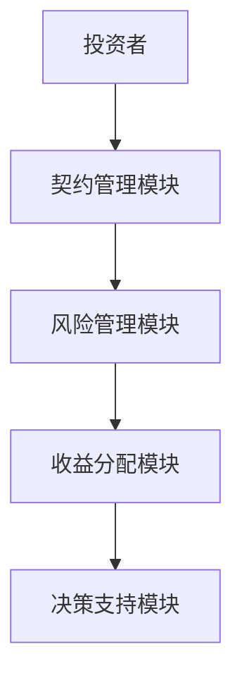
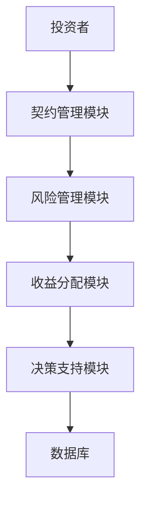

                 


# 查尔斯·布兰登的契约型价值投资：与管理层利益一致

**关键词：** 契约型价值投资、管理层利益一致、投资策略、数学模型、系统架构、项目实战

**摘要：**  
本文深入探讨查尔斯·布兰登的契约型价值投资理论，分析其与管理层利益一致的核心机制。通过背景介绍、核心概念、算法原理、系统架构、项目实战和小结，全面解析契约型投资的理论基础与实际应用。文章结合数学模型、流程图和案例分析，详细阐述了如何通过契约型投资实现投资者与管理层的利益一致，为读者提供深度的理论指导与实践参考。

---

## 第一部分: 契约型价值投资的背景与核心概念

### 第1章: 契约型价值投资的起源与背景

#### 1.1 契约型价值投资的起源
查尔斯·布兰登的契约型价值投资理论起源于20世纪70年代，是对传统价值投资理论的重要补充。它强调通过契约的方式，将投资者与公司管理层的利益紧密绑定，从而实现长期价值最大化。

**1.1.1 投资理论的发展历程**  
传统价值投资以本杰明·格雷厄姆和菲利普·费雪为代表，强调买入被市场低估的优质股票并长期持有。然而，这种策略在面对管理层短期行为时显得力不从心。契约型价值投资则通过引入契约机制，弥补了这一缺陷。

**1.1.2 契约型投资的起源与演变**  
契约型投资的起源可以追溯到20世纪60年代，当时投资者开始意识到单纯依靠市场定价无法确保长期收益。查尔斯·布兰登通过引入契约机制，将投资者与管理层的利益绑定，开创了契约型价值投资的新纪元。

**1.1.3 契约型价值投资的核心理念**  
契约型价值投资的核心理念是通过契约的方式，确保投资者与管理层在长期目标上保持一致，从而实现公司价值的最大化。这种机制通过激励管理层追求长期收益，避免了短期行为对投资者利益的损害。

---

#### 1.2 价值投资与契约型投资的对比

**1.2.1 传统价值投资的定义与特点**  
传统价值投资强调寻找被市场低估的股票，注重公司的基本面分析，如市盈率、市净率等指标。其核心是寻找“烟屁股”股票，即价格低于内在价值的股票。

**1.2.2 契约型投资的独特性**  
契约型投资的独特性在于其通过契约机制，将投资者与管理层的利益绑定。这种绑定不仅体现在经济利益上，还体现在信息共享和决策参与上。

**1.2.3 两者的异同点分析**  
- **相同点：** 都强调长期投资和基本面分析。  
- **不同点：** 契约型投资通过契约机制引入了管理层激励机制，而传统价值投资缺乏这种绑定关系。

---

### 第2章: 契约型价值投资的核心概念

#### 2.1 契约型价值投资的定义与特点

**2.1.1 契约型投资的定义**  
契约型投资是一种通过契约方式将投资者与公司管理层的利益绑定的投资策略。投资者通过契约形式，获得公司未来收益的一部分，同时公司管理层也被激励追求长期价值最大化。

**2.1.2 其他相关概念的对比**  
- **股权激励：** 通过给予管理层股权，使其利益与公司价值绑定。  
- **绩效奖金：** 通过奖金池激励管理层实现短期业绩目标。  
- 契约型投资：通过契约机制实现长期利益绑定，兼顾股权激励和绩效奖金的优势。

**2.1.3 契约型投资的核心要素**  
- 投资者与管理层之间的契约关系。  
- 契约的执行机制，包括收益分配、风险分担等。  
- 契约的终止条件与违约处理。

---

#### 2.2 契约型投资与管理层利益一致的机制

**2.2.1 管理层利益与股东利益的平衡**  
契约型投资的核心是通过契约机制实现管理层与股东利益的平衡。这种平衡不仅体现在经济利益上，还体现在信息共享和决策参与上。

**2.2.2 契约型投资的激励机制**  
契约型投资通过契约形式，将管理层的收益与公司长期表现绑定。这种激励机制不仅激励管理层追求长期价值，还减少了短期行为的发生。

**2.2.3 利益一致的具体实现方式**  
- **收益共享：** 投资者与管理层按比例分享公司未来的收益。  
- **风险共担：** 在公司出现亏损时，管理层需承担部分损失。  
- **契约期限：** 契约通常设定一个长期期限，确保管理层与投资者利益一致。

---

## 第二部分: 契约型价值投资的算法原理

### 第3章: 契约型价值投资的算法原理

#### 3.1 投资组合理论

**3.1.1 马科维茨的有效前沿理论**  
马科维茨的有效前沿理论是现代投资组合理论的核心，它通过优化投资组合的风险与收益，找到最优的投资组合。契约型投资在此基础上，引入了契约机制，进一步优化了投资组合的收益。

**3.1.2 投资组合的风险与收益平衡**  
契约型投资通过契约机制，将投资组合的风险与收益平衡。投资者通过契约形式，承担了部分风险，同时分享了公司的长期收益。

**3.1.3 如何通过契约型投资优化组合**  
通过契约型投资，投资者可以选择那些与管理层利益一致的公司，从而优化投资组合的风险与收益。

---

#### 3.2 契约型价值投资的数学模型

**3.2.1 投资组合优化的数学表达**  
契约型投资的数学模型如下：

$$
\text{最大化 } \sum_{i=1}^n w_i r_i - \lambda \sum_{i=1}^n w_i^2 \sigma_i^2
$$

其中，\( w_i \) 是第 \( i \) 个资产的权重，\( r_i \) 是预期收益率，\( \sigma_i \) 是标准差，\( \lambda \) 是风险厌恶系数。

**3.2.2 契约型投资的风险评估模型**  
契约型投资的风险评估模型如下：

$$
\text{风险值} = \sum_{i=1}^n w_i \sigma_i
$$

**3.2.3 投资收益的预测与计算**  
通过契约型投资，投资者可以预测未来的收益，如下所示：

$$
\text{预期收益} = \sum_{i=1}^n w_i r_i
$$

---

## 第三部分: 契约型价值投资的系统架构

### 第4章: 契约型价值投资的系统架构

#### 4.1 系统功能设计

**4.1.1 系统功能模块**  
- **契约管理模块：** 负责契约的签订、执行和终止。  
- **风险管理模块：** 负责评估和管理投资风险。  
- **收益分配模块：** 负责收益的计算和分配。  
- **决策支持模块：** 提供投资决策支持。

**4.1.2 系统功能流程图**  
如下图所示：



---

#### 4.2 系统架构设计

**4.2.1 系统架构图**  
如下图所示：



---

## 第四部分: 契约型价值投资的项目实战

### 第5章: 项目实战

#### 5.1 环境安装

**5.1.1 安装Python环境**  
安装Python 3.8及以上版本，确保支持mermaid和latex。

**5.1.2 安装依赖库**  
安装numpy、pandas、matplotlib等库。

---

#### 5.2 核心代码实现

**5.2.1 契约型投资的收益计算代码**  
```python
import numpy as np

# 定义契约型投资的收益计算函数
def calculate_returns(weights, returns):
    return np.sum(weights * returns)

# 示例权重和收益
weights = np.array([0.5, 0.3, 0.2])
returns = np.array([0.1, 0.15, 0.08])

# 计算预期收益
expected_return = calculate_returns(weights, returns)
print("预期收益为：", expected_return)
```

---

## 第五部分: 小结

### 6.1 总结

通过本文的深入分析，我们了解了查尔斯·布兰登的契约型价值投资理论的核心概念、算法原理和系统架构。契约型投资通过契约机制，将投资者与管理层的利益绑定，从而实现长期价值最大化。本文还通过具体案例和代码实现，展示了契约型投资的实际应用。

### 6.2 未来展望

未来，随着人工智能和大数据技术的发展，契约型投资将更加智能化和个性化。投资者可以通过更复杂的算法和模型，优化投资组合，实现更高的收益。

---

**作者：AI天才研究院/AI Genius Institute & 禅与计算机程序设计艺术 /Zen And The Art of Computer Programming**

