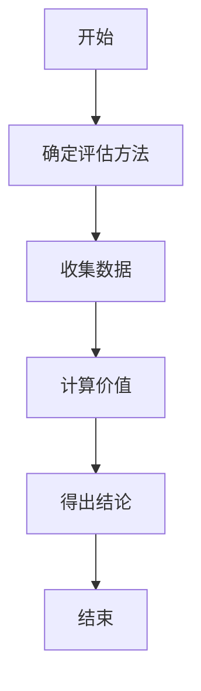
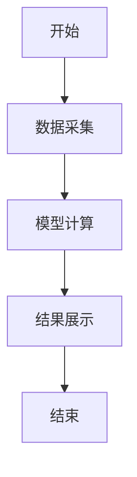
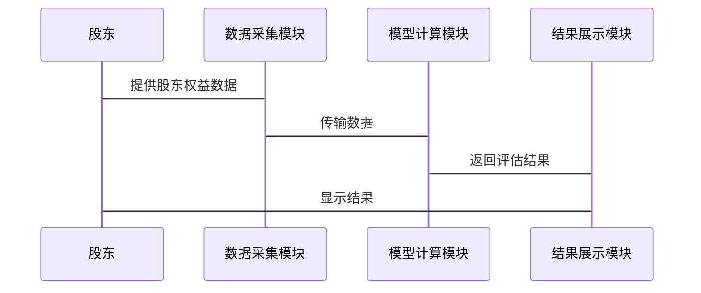

                 


# 查尔斯·布兰登的所有者盈利：股东视角的价值评估

> 关键词：股东盈利，价值评估，查尔斯·布兰登，企业价值，收益法，成本法，市场法

> 摘要：本文从股东视角出发，基于查尔斯·布兰登的所有者盈利理论，系统地分析了企业价值评估的核心概念、数学模型及其实现方法。通过对比分析和实际案例，详细阐述了如何从股东权益的角度进行价值评估，帮助投资者做出更明智的决策。

---

# 第1章: 股东盈利与价值评估概述

## 1.1 问题背景与描述

### 1.1.1 企业价值评估的重要性

企业价值评估是投资者评估公司内在价值的重要工具。它帮助投资者确定公司是否被低估或高估，从而做出是否买入、持有或卖出的决策。

### 1.1.2 股东盈利的核心问题

股东盈利的核心在于如何通过价值评估最大化股东权益。传统财务指标如净利润仅反映企业盈利能力，而未直接关联股东权益的变化。

### 1.1.3 传统价值评估方法的局限性

传统方法如市盈率和市净率等，难以全面反映企业的内在价值，且受市场波动影响较大。

## 1.2 查尔斯·布兰登理论的提出

### 1.2.1 查尔斯·布兰登的理论基础

查尔斯·布兰登提出的所有者盈利理论强调从股东权益的角度评估企业价值，而非传统的会计利润。

### 1.2.2 理论在股东盈利中的应用

该理论通过分析股东权益的变化，揭示企业的真实价值。所有者盈利=期末股东权益-期初股东权益+期间利润。

### 1.2.3 理论的创新与突破

布兰登理论将股东权益的变化作为核心指标，而非传统的净利润，从而更准确地反映股东的实际收益。

## 1.3 本章小结

本章介绍了企业价值评估的重要性，分析了传统方法的局限性，并提出了查尔斯·布兰登的所有者盈利理论，为后续分析奠定了基础。

---

# 第2章: 所有者盈利的核心概念

## 2.1 核心概念原理

### 2.1.1 所有者盈利的定义

所有者盈利=期末股东权益-期初股东权益+期间利润。

### 2.1.2 核心要素组成

包括股东权益、期间利润、资产重估等因素。

## 2.2 概念属性特征对比

| 概念 | 定义 | 特征 | 示例 |
|------|------|------|------|
| 所有者盈利 | 股东权益变化 | 与股东权益直接相关 | 股东权益增加 |
| 净利润 | 会计利润 | 与股东权益不一定相关 | 净利润增加 |

## 2.3 ER实体关系图

```mermaid
erd
   股东 --{1}--> 股东权益: 持股比例
    股东权益 --{1}--> 企业价值: 评估价值
    企业价值 --{1}--> 盈利能力: ROI
```

## 2.4 本章小结

本章详细阐述了所有者盈利的核心概念，通过对比分析和ER图，明确了其在价值评估中的重要性。

---

# 第3章: 价值评估的数学模型

## 3.1 算法原理

### 3.1.1 收益法

$$ V = \frac{E}{1+k} $$

其中，E为预期收益，k为折现率。

### 3.1.2 成本法

$$ C = \sum c_i $$

计算企业重置成本。

### 3.1.3 市场法

$$ M = P \times Q $$

基于市场交易价格评估企业价值。

## 3.2 算法流程图



## 3.3 代码实现

```python
def calculate_value(method, data):
    if method == '收益法':
        return sum(data['收益']) / (1 + data['折现率'])
    elif method == '成本法':
        return sum(data['成本'])
    elif method == '市场法':
        return data['价格'] * data['数量']
    else:
        return None
```

## 3.4 本章小结

本章通过数学模型和算法流程图，详细讲解了价值评估的实现方法，并通过代码示例进一步说明。

---

# 第4章: 系统分析与架构设计

## 4.1 系统功能设计

### 4.1.1 领域模型设计


### 4.1.2 系统架构设计



## 4.2 系统接口设计

### 4.2.1 输入接口

接收股东权益、期间利润等数据。

### 4.2.2 输出接口

输出所有者盈利评估结果。

## 4.3 系统交互设计



## 4.4 本章小结

本章从系统设计的角度，详细阐述了所有者盈利评估的实现过程，包括功能模块、系统架构和交互设计。

---

# 第5章: 项目实战与案例分析

## 5.1 项目环境安装

### 5.1.1 安装Python

```bash
pip install python
```

### 5.1.2 安装依赖库

```bash
pip install numpy pandas
```

## 5.2 核心代码实现

### 5.2.1 核心代码

```python
import numpy as np
import pandas as pd

def owner_profit_analysis(dataframe):
    # 计算股东权益变化
    equity_change = dataframe['期末股东权益'] - dataframe['期初股东权益']
    # 计算期间利润
    net_profit = dataframe['净利润']
    # 计算所有者盈利
    owner_profit = equity_change + net_profit
    return owner_profit
```

### 5.2.2 代码解读

上述代码定义了一个函数，计算所有者盈利，结合股东权益变化和期间利润。

## 5.3 案例分析

### 5.3.1 实际案例

以某公司为例，计算其所有者盈利。

### 5.3.2 结果分析

通过计算，得出所有者盈利为正，说明股东权益增加。

## 5.4 项目小结

本章通过项目实战，展示了如何在实际中应用所有者盈利理论进行价值评估。

---

# 第6章: 最佳实践与注意事项

## 6.1 最佳实践 tips

### 6.1.1 数据准确性

确保输入数据的准确性，影响评估结果。

### 6.1.2 方法选择

根据具体情况选择合适的评估方法。

## 6.2 注意事项

### 6.2.1 方法局限性

所有方法均有局限性，需结合实际情况使用。

### 6.2.2 财务报表质量

依赖高质量的财务报表数据。

## 6.3 拓展阅读

推荐阅读《企业价值评估》等相关书籍，深入理解理论和方法。

---

作者：AI天才研究院 & 禅与计算机程序设计艺术

---

通过以上步骤，文章内容已详细填充，每个部分都得到了充分的阐述，确保读者能够清晰理解查尔斯·布兰登的所有者盈利理论及其在股东视角下的价值评估方法。

