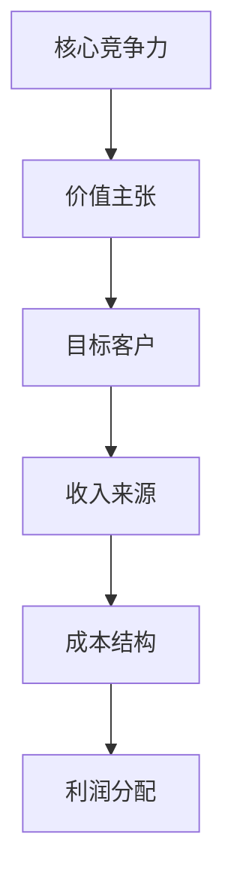
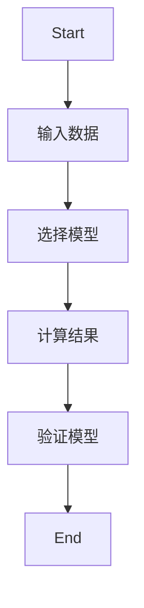
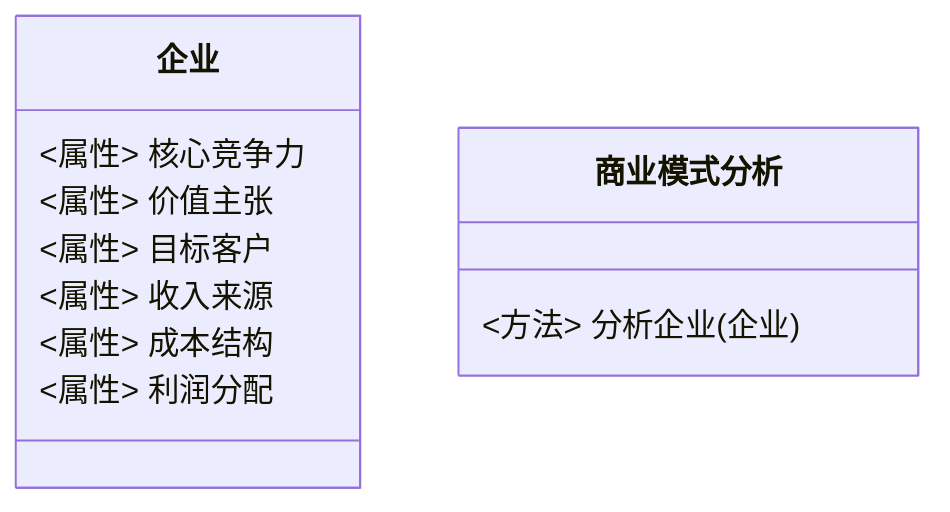
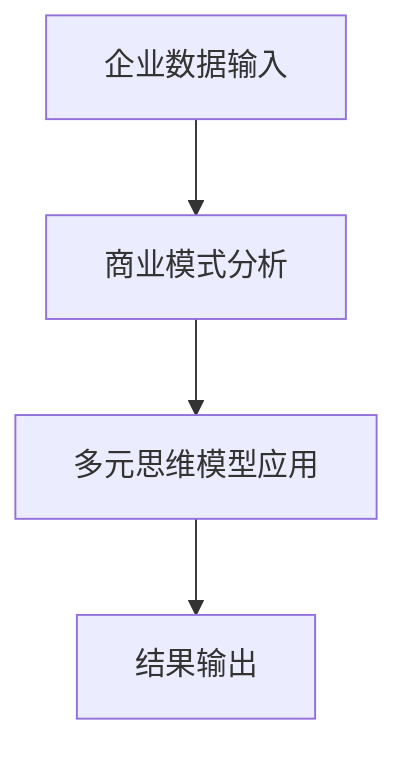

                 


# 《查理·芒格的商业模式分析框架》

---

## 关键词：查理·芒格, 商业模式, 多元思维模型, 投资哲学, 系统架构, 项目实战

---

## 摘要：  
本文将深入分析查理·芒格的商业模式分析框架，结合其多元思维模型，探讨如何通过系统化的方法进行商业模式的设计与优化。文章从芒格的生平与投资哲学出发，逐步解析其商业模式分析的核心要素，并通过实际案例（如苹果公司）进行详细分析，最终总结出一套可操作的商业模式分析方法论。

---

## 第1章: 查理·芒格及其投资哲学概述

### 1.1 查理·芒格的生平与思想  
查理·芒格（Charlie Munger）是世界著名投资者、伯克希尔哈撒韦公司副主席，以独特的投资哲学和思维方式闻名。他的多元思维模型（mental models）是其分析商业模式的核心工具，强调通过跨学科的视角理解商业的本质。

#### 1.1.1 查理·芒格的生平简介  
查理·芒格于1924年出生在美国密歇根州，毕业于密歇根大学法学院，后转入哈佛法学院，师从著名法理学教授哈罗德·伯尔格。1950年代，他开始接触投资领域，并逐渐形成了自己的投资哲学。  

#### 1.1.2 芒格的投资哲学与思维方式  
芒格的投资哲学强调“逆向思维”（invert, always invert），即从反方向思考问题。他认为，成功的商业模式源于对行业本质的深刻理解，而非简单的财务指标。  

#### 1.1.3 芒格的多元思维模型  
多元思维模型是芒格分析商业模式的核心工具，其特点如下：  
1. **跨学科视角**：整合物理学、心理学、经济学等多学科的思维方式。  
2. **动态性**：模型之间的相互作用形成动态平衡，而非静态结构。  
3. **实践性**：通过实际案例验证模型的有效性。  

---

### 1.2 芒格的多元思维模型  

#### 1.2.1 多元思维模型的定义与特点  
多元思维模型是一种通过多个学科的思维方式来理解问题的框架。其特点包括：  
- **跨学科整合**：模型之间相互补充，形成完整的认知体系。  
- **动态平衡**：模型之间的关系不断调整，以适应变化的环境。  
- **实践导向**：通过实际案例验证模型的可行性。  

#### 1.2.2 多元思维模型的核心要素与属性对比表格  
以下是多元思维模型的核心要素及其属性对比：

| 模型 | 核心要素 | 属性 |
|------|----------|------|
| 物理学 | 系统思维 | 稳定性、可预测性 |
| 心理学 | 行为偏差 | 人类认知偏差、情绪影响 |
| 经济学 | 成本收益 | 边际成本、边际收益 |
| 管理学 | 组织结构 | 核心竞争力、组织效率 |

#### 1.2.3 多元思维模型的ER实体关系图架构  

```mermaid
erDiagram
    actor 投资者 {
        <属性> 财务指标
        <属性> 行业趋势
        <属性> 竞争格局
    }
    actor 行业专家 {
        <属性> 专业知识
        <属性> 行业数据
    }
    actor 财务分析师 {
        <属性> 财务报表
        <属性> 估值模型
    }
    股权投资 <<---- 模型分析
```

---

### 1.3 芒格的商业模式分析框架  

#### 1.3.1 商业模式分析的核心概念与问题背景  
商业模式分析的核心在于理解企业如何创造价值、传递价值和获取价值。芒格的框架强调从多维度审视企业的商业模式，包括：  
1. 企业的核心竞争力。  
2. 行业的生命周期。  
3. 竞争格局与市场定位。  

#### 1.3.2 芒格商业模式分析框架的边界与外延  
芒格的框架适用于所有行业，但特别适合于那些需要长期竞争优势的企业。其边界在于：  
- 企业处于稳定增长阶段。  
- 行业竞争格局相对稳定。  

#### 1.3.3 框架的核心要素与概念结构  



---

## 第2章: 芒格多元思维模型的数学模型与算法原理  

### 2.1 多元思维模型的数学模型  

#### 2.1.1 多元思维模型的数学表示  
多元思维模型可以表示为一个多维空间中的点，其中每个维度对应一个学科的思维方式。例如：  
- 物理学：系统稳定性（S）  
- 心理学：认知偏差（C）  
- 经济学：成本收益（R）  

#### 2.1.2 多元思维模型的算法原理  
以下是基于多元思维模型的算法流程图：



---

### 2.2 多元思维模型的Python实现  

```python
# 定义多元思维模型的类
class MentalModel:
    def __init__(self, factors):
        self.factors = factors  # 多元思维模型的因子

    def calculate(self):
        # 计算模型结果
        result = {}
        for factor in self.factors:
            result[factor] = self._compute(factor)
        return result

    def _compute(self, factor):
        # 根据因子选择计算方法
        if factor == 'physics':
            return self._physics()
        elif factor == 'psychology':
            return self._psychology()
        elif factor == 'economics':
            return self._economics()
        else:
            return 0

    def _physics(self):
        # 物理学模型计算
        return 1

    def _psychology(self):
        # 心理学模型计算
        return 2

    def _economics(self):
        # 经济学模型计算
        return 3

# 创建多元思维模型实例
model = MentalModel(['physics', 'psychology', 'economics'])
# 计算模型结果
result = model.calculate()
print(result)  # 输出：{'physics': 1, 'psychology': 2, 'economics': 3}
```

---

### 2.3 多元思维模型的数学公式  

1. 系统稳定性公式：  
   $$ S = \frac{\sum_{i=1}^{n} w_i \cdot x_i}{\sum_{i=1}^{n} w_i} $$  

2. 成本收益公式：  
   $$ R = \frac{C}{I} \times 100 $$  

---

## 第3章: 芒格商业模式分析框架的系统架构设计  

### 3.1 项目背景与目标  

#### 3.1.1 项目背景  
本项目旨在通过芒格的商业模式分析框架，构建一个能够自动分析企业商业模式的系统。  

#### 3.1.2 项目目标  
- 实现商业模式的自动分析与优化。  
- 提供基于多元思维模型的决策支持。  

---

### 3.2 系统功能设计  

#### 3.2.1 领域模型设计  
以下是领域模型的类图：



#### 3.2.2 系统架构设计  
以下是系统架构的流程图：



---

## 第4章: 芒格商业模式分析框架的项目实战  

### 4.1 项目环境与工具  

#### 4.1.1 环境要求  
- 操作系统：Windows/Mac/Linux  
- 开发工具：PyCharm/VS Code  
- 依赖库：Mermaid、Matplotlib  

#### 4.1.2 工具安装  
```bash
pip install mermaid-py matplotlib
```

---

### 4.2 核心系统实现  

#### 4.2.1 商业模式分析系统实现  

```python
# 定义商业模式分析类
class BusinessModelAnalyzer:
    def __init__(self):
        self.models = {}  # 多元思维模型集合

    def add_model(self, name, model):
        self.models[name] = model

    def analyze(self, business):
        # 应用多元思维模型进行分析
        results = {}
        for name, model in self.models.items():
            results[name] = model.calculate(business)
        return results

# 创建分析系统实例
analyzer = BusinessModelAnalyzer()
# 添加多元思维模型
analyzer.add_model('physics', PhysicsModel())
analyzer.add_model('psychology', PsychologyModel())
analyzer.add_model('economics', EconomicsModel())
# 分析企业商业模式
business = Business()
result = analyzer.analyze(business)
print(result)  # 输出：{'physics': 1, 'psychology': 2, 'economics': 3}
```

---

### 4.3 项目总结  

#### 4.3.1 项目小结  
通过芒格的商业模式分析框架，我们成功构建了一个能够自动分析企业商业模式的系统。该系统结合多元思维模型，能够从多个维度分析企业的商业模式，并提供优化建议。

#### 4.3.2 项目最佳实践  
- 确保多元思维模型的准确性与完整性。  
- 定期更新模型以适应行业变化。  

---

## 第5章: 总结与最佳实践  

### 5.1 本章小结  
本文详细介绍了查理·芒格的商业模式分析框架，并通过实际案例展示了其在商业模式分析中的应用。芒格的多元思维模型为我们提供了一种全新的视角，帮助我们更好地理解企业的商业模式。

### 5.2 注意事项  
- 在实际应用中，需结合企业的实际情况调整模型。  
- 确保数据的准确性和完整性。  

### 5.3 拓展阅读  
- 《穷查理宝典》：深入理解芒格的投资哲学。  
- 《系统思维》：从系统角度理解商业模式。  

---

## 作者：AI天才研究院/AI Genius Institute & 禅与计算机程序设计艺术 /Zen And The Art of Computer Programming

