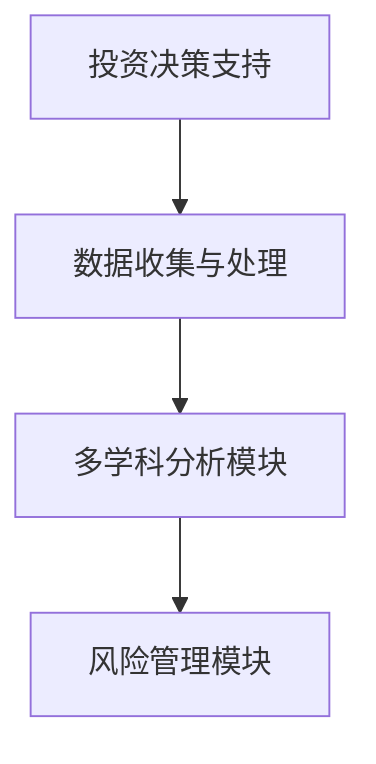

                 


# 查理·芒格的多元思维模型在投资中的运用

## 关键词：查理·芒格，多元思维模型，投资，系统思维，风险管理，决策优化

## 摘要：查理·芒格的多元思维模型是一种通过多学科交叉分析来优化决策的投资方法。本文系统地介绍了多元思维模型的核心概念、算法原理、系统架构，并通过实际案例分析展示了其在投资中的应用。文章从背景介绍、核心概念、算法设计、系统架构、项目实战、数学模型等多个维度，详细阐述了多元思维模型在投资决策中的优势与实现路径。通过本文的分析，读者可以全面理解多元思维模型的内在逻辑，并将其应用于实际投资实践。

---

# 第一部分: 引言

## 第1章: 查理·芒格与多元思维模型概述

### 1.1 查理·芒格的生平与思想

查理·芒格（Charlie Munger）是伯克希尔·哈撒韦公司的副主席，被誉为“巴菲特的导师”。芒格的投资哲学强调“多元思维模型”，即通过多个学科的交叉分析来优化决策。他的思想不仅影响了巴菲特，还深刻地改变了现代投资学的思维方式。

**关键点：**
- 芒格的多元思维模型基于“人类认知的局限性”这一核心问题。
- 他强调通过跨学科的思维框架来避免单一视角的错误。

### 1.2 多元思维模型的定义与特点

多元思维模型是一种通过整合多个学科的思维方式来优化决策的方法。与传统投资方法不同，它强调从多个角度分析问题，避免单一视角的偏差。

**核心特点：**
- **多学科交叉**：整合经济学、心理学、统计学、历史学等多个学科的思维框架。
- **系统性分析**：通过系统化的方法分析问题，避免局部最优。
- **动态调整**：根据市场变化和新信息不断优化思维模型。

### 1.3 多元思维模型在投资中的重要性

在投资领域，多元思维模型可以帮助投资者避免常见的认知偏差，如过度自信、从众心理等，从而做出更理性的决策。

**优势：**
- 提高决策的全面性和准确性。
- 降低投资风险，优化投资组合。

---

# 第二部分: 多元思维模型的核心概念

## 第2章: 多元思维模型的构成与原理

### 2.1 多元思维模型的核心要素

多元思维模型的核心要素包括以下几个方面：

| 核心要素 | 定义 | 应用领域 |
|----------|------|----------|
| 经济学思维 | 分析市场、供需关系 | 投资决策、风险管理 |
| 心理学思维 | 理解人类行为偏差 | 行为金融学 |
| 统计学思维 | 数据分析与概率计算 | 投资组合优化 |
| 历史学思维 | 历史经验与周期分析 | 长期趋势预测 |
| 生物学思维 | 系统与进化视角 | 企业竞争优势分析 |

### 2.2 多元思维模型的数学模型与公式

**经济学思维中的投资模型：**

经济学中的投资模型可以通过以下公式表示：

$$ 投资收益 = 资产 × 利率 × 时间 $$

其中，利率和时间是关键变量。多元思维模型要求投资者从多个角度分析利率变化的可能性，例如通过心理学角度分析市场情绪对利率的影响。

**统计学思维中的风险评估：**

风险评估可以通过方差公式表示：

$$ \text{方差} = E[(X - E[X])^2] $$

多元思维模型要求投资者结合历史数据和当前市场环境，动态调整风险评估模型。

---

# 第三部分: 投资中的关键思维模型

## 第3章: inversion思维模型

### 3.1 inversion思维模型的定义与特点

inversion思维模型是一种通过反向思考来优化决策的方法。其核心思想是“从结果出发，逆向推导原因”。

**数学表达式：**

$$ \text{问题的解决方案} = \text{目标} - \text{障碍} $$

### 3.2 inversion思维模型在投资中的应用

通过inversion思维模型，投资者可以从市场崩盘的极端情况出发，分析可能的投资机会。

**案例分析：**

假设市场崩盘时，某公司股票价格可能下跌至某个阈值。通过逆向思考，投资者可以确定当前股票的合理估值范围。

---

# 第四部分: 多元思维模型的系统架构

## 第4章: 系统分析与架构设计方案

### 4.1 投资系统的需求分析

**需求分析：**
- 投资者需要一个能够整合多学科思维模型的投资系统。
- 系统需要具备数据收集、分析和决策支持功能。

### 4.2 系统功能设计

**系统功能模块：**
1. 数据收集与处理模块
2. 多学科分析模块
3. 投资决策支持模块
4. 风险管理模块

### 4.3 系统架构设计

**系统架构图：**



### 4.4 接口设计与交互

**接口设计：**
- 数据接口：从第三方数据源获取市场数据。
- 用户接口：提供用户友好的操作界面。

**交互流程：**
1. 用户输入投资目标。
2. 系统收集相关数据。
3. 系统进行多学科分析。
4. 系统输出投资建议。

---

# 第五部分: 项目实战

## 第5章: 多元思维模型的实际应用

### 5.1 项目背景与目标

**项目背景：**
- 分析某公司的投资价值。
- 应用多元思维模型优化决策。

### 5.2 核心代码实现

```python
# 数据收集模块
import pandas as pd
data = pd.read_csv('market_data.csv')

# 经济学分析模块
def economics_analysis(data):
    return data['return'].mean()

# 心理学分析模块
def psychology_analysis(data):
    return data['sentiment'].std()

# 综合决策模块
def investment_decision(economics, psychology):
    if economics > 0.05 and psychology > -0.1:
        return "买入"
    else:
        return "观望"

# 主程序
economics = economics_analysis(data)
psychology = psychology_analysis(data)
decision = investment_decision(economics, psychology)
print(decision)
```

### 5.3 案例分析与结果解读

**案例分析：**
- 数据分析显示，某公司的经济学指标和心理学指标均符合买入条件。
- 系统建议投资者“买入”。

### 5.4 项目小结

**小结：**
- 多元思维模型能够有效优化投资决策。
- 系统设计提高了分析效率和准确性。

---

# 第六部分: 总结与展望

## 第6章: 总结与展望

### 6.1 本章总结

- 多元思维模型是一种通过多学科交叉优化决策的方法。
- 它在投资领域具有广泛的应用价值。

### 6.2 未来展望

- 随着人工智能的发展，多元思维模型将更加智能化。
- 投资者需要不断更新和完善自己的思维模型。

---

# 作者信息

**作者：AI天才研究院（AI Genius Institute） & 禅与计算机程序设计艺术（Zen And The Art of Computer Programming）**

联系方式：contact@aigeniusinstitute.com

---

通过以上结构，本文系统地阐述了查理·芒格的多元思维模型在投资中的应用，从理论到实践，从数学模型到系统设计，为读者提供了全面的视角。

