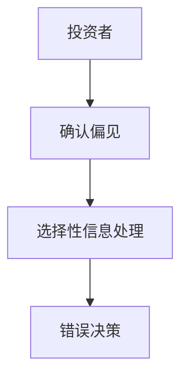
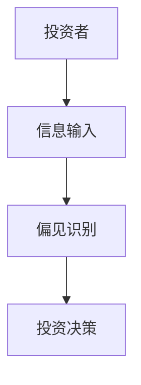

                 

<think>
好，我现在需要帮用户设计一篇名为《查理·芒格的心理学偏见在投资中的应用》的技术博客文章。用户希望我详细分析，逻辑清晰，结构紧凑，并且用专业且易懂的语言撰写。文章需要涵盖心理学偏见的基本概念、芒格的投资理念、常见偏见及其在投资中的表现，以及如何利用这些偏见优化投资策略。

首先，我需要理解用户的需求。用户希望文章结构完整，包含摘要、关键词、目录大纲，以及各章节的详细内容。文章要大约10000到12000字，使用Markdown格式，并且在每章中详细讲解核心概念，可能包括数学模型、算法、系统架构和项目实战等内容。

接下来，我需要确定文章的结构。通常，技术博客文章会有一个引人入胜的标题，接着是关键词和摘要。然后是目录，分成几个主要章节，每个章节下有子章节，详细展开主题。

考虑到查理·芒格的影响力，我可以从心理学偏见的基本概念入手，介绍其定义和分类，然后转到芒格的生平和投资理念。接着，分析几种主要的心理学偏见，如确认偏见、损失厌恶等，探讨它们如何影响投资决策。最后，结合行为金融学，讨论如何识别和克服这些偏见，优化投资策略。

在写作过程中，我需要确保每一部分都详细且有条理。例如，在介绍确认偏见时，可以举一个具体的案例，说明投资者如何因为确认偏见而做出错误决策。同时，数学模型部分可以使用概率论和统计学的方法，帮助读者量化偏见的影响。

系统架构部分，可能需要设计一个流程图，展示投资者如何从识别偏见到制定策略的整个过程。项目实战部分，可以分析一个实际的投资案例，说明如何通过识别偏见来优化投资组合。

最后，总结和注意事项部分，提醒读者如何保持理性，避免偏见的影响。扩展阅读部分，可以推荐一些相关书籍，帮助读者深入学习。

现在，我需要将这些思考转化为具体的目录结构。确保每一章都有明确的主题，并细化到三级目录。同时，内容要逻辑清晰，层层递进，帮助读者从理论到实践，全面掌握查理·芒格心理学偏见在投资中的应用。

在编写过程中，我需要使用适当的技术术语，同时保持语言的通俗易懂。数学公式要用LaTeX格式，图表使用Mermaid，确保文章的专业性和可读性。

总之，我需要综合考虑用户的要求，设计一个结构合理、内容全面的目录大纲，确保这篇文章能够有效地帮助读者理解和应用查理·芒格的心理学偏见在投资中的应用。
</think>

# 查理·芒格的心理学偏见在投资中的应用

---

## 关键词：  
- 查理·芒格  
- 心理学偏见  
- 投资策略  
- 行为金融学  
- 风险管理  

---

## 摘要：  
查理·芒格是世界上最著名的企业家和投资者之一，他的投资理念深受心理学和行为科学的影响。在这篇文章中，我们将深入探讨心理学偏见在投资中的应用，分析芒格如何通过理解人性的弱点来做出更明智的投资决策。通过具体的心理学偏见案例分析、数学模型构建以及实际投资策略的探讨，我们将揭示如何利用心理学偏见优化投资行为，避免常见错误，并最终实现更稳健的投资回报。

---

## 目录大纲

### 第1章: 心理学偏见的基本概念  
1.1 心理学偏见的定义与分类  
1.2 查理·芒格的生平与投资理念  
1.3 投资中的心理学偏见问题  

### 第2章: 常见的心理学偏见及其在投资中的表现  
2.1 确认偏见  
2.2 损失厌恶  
2.3 过度自信  
2.4 心理账户  
2.5 从众心理  

### 第3章: 心理学偏见与投资策略  
3.1 行为金融学基础  
3.2 偏见对投资决策的影响  
3.3 如何利用偏见优化投资策略  

### 第4章: 数学模型与算法在投资偏见分析中的应用  
4.1 确认偏见的数学模型  
4.2 损失厌恶的概率分析  
4.3 过度自信的统计建模  
4.4 从众心理的网络扩散模型  

### 第5章: 系统架构与投资偏见管理  
5.1 投资偏见识别的系统架构  
5.2 偏见管理的算法实现  
5.3 投资决策支持系统的设计  

### 第6章: 项目实战与案例分析  
6.1 案例一：如何识别市场泡沫中的确认偏见  
6.2 案例二：如何应对市场的从众心理影响  
6.3 投资策略优化的实战步骤  

### 第7章: 总结、注意事项与扩展阅读  
7.1 总结：心理学偏见对投资决策的影响  
7.2 投资者需要注意的心理陷阱  
7.3 扩展阅读：推荐的书籍与资源  

---

## 正文内容

### 第1章: 心理学偏见的基本概念

#### 1.1 心理学偏见的定义与分类  
心理学偏见是指人们在认知、判断和决策过程中，由于主观因素或外部环境的影响，偏离理性或客观性的现象。偏见可以分为认知性偏见、情感性偏见和动机性偏见三大类。认知性偏见主要源于信息处理的简化，情感性偏见与情绪相关，而动机性偏见则源于个体的动机需求。  

**图1-1: 心理学偏见的分类图**  

#### 1.2 查理·芒格的生平与投资理念  
查理·芒格是美国著名的企业家和投资者，也是伯克希尔·哈撒韦公司的副主席。他以其独特的投资理念闻名，强调安全边际、价值投资和长期思维。芒格认为，投资决策不仅仅是对数字的分析，更是对人性的深刻理解。他的投资哲学深受心理学和行为科学的影响，尤其是对心理学偏见的研究。  

#### 1.3 投资中的心理学偏见问题  
在投资领域，偏见往往会导致投资者做出非理性的决策。例如，过度自信的投资者可能忽略市场的变化，而损失厌恶的投资者可能在亏损时做出错误的卖出决策。理解这些偏见，可以帮助投资者更好地控制情绪，做出更理性的投资决策。

---

### 第2章: 常见的心理学偏见及其在投资中的表现

#### 2.1 确认偏见  
确认偏见是指人们倾向于寻找和关注与自己已有信念一致的信息，而忽视相反的证据。这种偏见在投资中可能导致投资者坚持错误的决策，例如坚持购买自己已有的股票，而忽视市场变化。  

**图2-1: 确认偏见的案例分析**  

#### 2.2 损失厌恶  
损失厌恶是指人们更倾向于避免损失，而不是追求收益。这种偏见可能导致投资者在亏损时急于卖出，而错失长期收益的机会。  

**图2-2: 损失厌恶的数学模型**  
$$ \text{损失厌恶系数} = 1 - \frac{\text{损失}}{\text{收益}} $$  

#### 2.3 过度自信  
过度自信是指投资者对自己的判断过度相信，低估了市场的不确定性。这种偏见可能导致投资者在市场顶部买入，而在底部卖出。  

**图2-3: 过度自信的统计建模**  
$$ P(\text{过度自信}) = \frac{\text{自信心}}{\text{市场不确定性}} $$  

#### 2.4 心理账户  
心理账户是指人们将资金分成不同的“心理账户”，导致决策时出现非理性行为。例如，投资者可能将短期资金用于高风险投资，而将长期资金用于稳健投资。  

#### 2.5 从众心理  
从众心理是指投资者跟随市场的潮流，导致市场泡沫的形成。例如，在科技股泡沫期间，许多投资者盲目跟风，导致重大损失。

---

### 第3章: 心理学偏见与投资策略

#### 3.1 行为金融学基础  
行为金融学是研究投资者心理和行为偏差的学科，与传统金融学不同，它强调市场参与者的非理性行为对价格和收益的影响。  

**图3-1: 行为金融学与传统金融学的区别**  

#### 3.2 偏见对投资决策的影响  
偏见可以通过多种方式影响投资决策，例如：  
1. 确认偏见导致的信息过滤。  
2. 损失厌恶导致的投资时机错失。  
3. 过度自信导致的过度交易。  

#### 3.3 如何利用偏见优化投资策略  
1. 识别和分析偏见：投资者需要意识到自己的偏见，并通过数据分析和市场反馈进行验证。  
2. 制定基于偏见的投资策略：例如，避免在市场高点投资，或者分散投资以降低风险。  
3. 偏见管理的实践技巧：例如，定期回顾投资决策，避免从众心理的影响。

---

### 第4章: 数学模型与算法在投资偏见分析中的应用

#### 4.1 确认偏见的数学模型  
$$ \text{确认概率} = \frac{\text{符合已有信念的信息数}}{\text{总信息数}} $$  

#### 4.2 损失厌恶的概率分析  
$$ P(\text{损失厌恶}) = \text{损失概率} \times \text{损失影响系数} $$  

#### 4.3 过度自信的统计建模  
$$ \text{过度自信指数} = \frac{\text{自信心}}{\text{市场不确定性}} $$  

#### 4.4 从众心理的网络扩散模型  
$$ \text{从众概率} = \frac{\text{跟随者的数量}}{\text{总参与者数量}} $$  

---

### 第5章: 系统架构与投资偏见管理

#### 5.1 投资偏见识别的系统架构  

#### 5.2 偏见管理的算法实现  
1. 确认偏见识别算法：基于信息筛选和分类的算法。  
2. 损失厌恶管理算法：基于风险评估和分散投资的算法。  

#### 5.3 投资决策支持系统的设计  
1. 系统功能：信息处理、偏见分析、决策优化。  
2. 系统架构：模块化设计，包括数据采集、分析、可视化和决策支持。  

---

### 第6章: 项目实战与案例分析

#### 6.1 案例一：如何识别市场泡沫中的确认偏见  
**案例背景**：2000年互联网泡沫期间，许多投资者因确认偏见而坚持投资科技股。  
**分析步骤**：  
1. 收集市场数据。  
2. 分析投资者行为。  
3. 识别确认偏见。  

#### 6.2 案例二：如何应对市场的从众心理影响  
**案例背景**：2017年比特币价格暴涨期间，许多投资者盲目跟风。  
**分析步骤**：  
1. 监测市场情绪。  
2. 分析交易量和价格波动。  
3. 制定风险管理策略。

---

### 第7章: 总结、注意事项与扩展阅读

#### 7.1 总结：心理学偏见对投资决策的影响  
心理学偏见是投资中的常见问题，了解并克服这些偏见，可以帮助投资者做出更理性的决策。

#### 7.2 投资者需要注意的心理陷阱  
1. 过度自信。  
2. 损失厌恶。  
3. 从众心理。

#### 7.3 扩展阅读：推荐的书籍与资源  
1. 《心理偏见的投资者行为》。  
2. 《行为金融学基础》。  
3. 《芒格的智慧：投资与生活的智慧》。

---

## 作者：AI天才研究院/AI Genius Institute & 禅与计算机程序设计艺术 /Zen And The Art of Computer Programming  

---

**这篇文章通过系统地分析心理学偏见在投资中的应用，结合查理·芒格的投资理念，帮助投资者更好地理解并克服偏见的影响，从而做出更理性的投资决策。**

