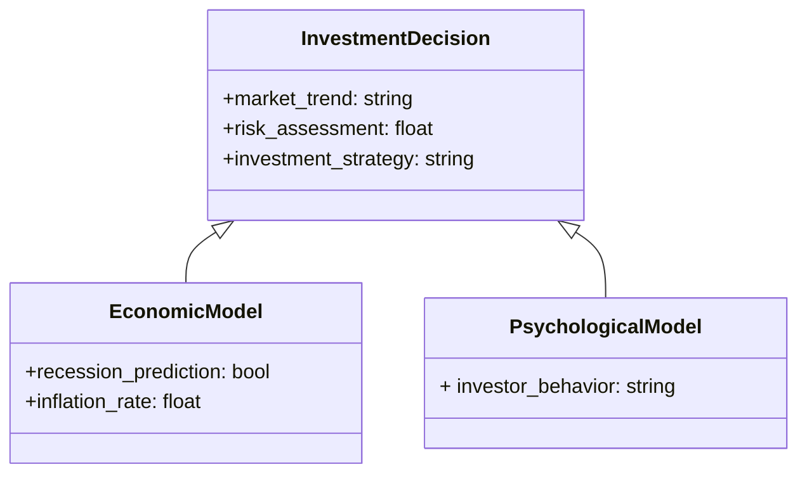

                 


# 查理·芒格的阅读学习方法

---

## 关键词

- 查理·芒格
- 阅读学习方法
- 多元思维模型
- 知识体系构建
- 跨学科整合
- 系统性学习

---

## 摘要

查理·芒格的阅读学习方法以其独特的多元思维模型为核心，强调跨学科整合和系统性思考。本文详细解析了芒格的阅读策略、知识体系构建方法，并通过实际案例展示了如何将这些方法应用于投资、决策和自我提升等领域。文章还探讨了多元思维模型的数学基础和算法实现，结合Python代码示例，深入剖析了芒格阅读方法的科学性和实践性。

---

## 正文

### 第一章 查理·芒格的阅读学习方法概述

#### 1.1 多元思维模型的背景与意义

多元思维模型（Mental Models）是查理·芒格提出的一种知识管理方法，旨在通过跨学科的学习，构建一个多维度的知识网络。这种方法的核心在于将不同领域的知识模型化，并通过模型之间的相互作用来解决问题。

**1.1.1 问题背景**

在信息爆炸的时代，传统单一学科的学习方式已难以应对复杂问题。芒格意识到，真正的智慧来源于跨学科的整合，而不是单一领域的精通。

**1.1.2 核心概念**

- **模型化思维**：将知识转化为可操作的模型，便于理解和应用。
- **跨学科整合**：通过多个学科的模型相互作用，形成全面的思考框架。

**1.1.3 理论基础**

芒格的多元思维模型结合了心理学、经济学、统计学等多个领域的知识，强调模型的动态更新和应用。

---

### 第二章 多元思维模型的核心要素

#### 2.1 多元思维模型的定义与特点

**2.1.1 多元思维模型的定义**

多元思维模型是指将不同学科的核心原理和方法论转化为可操作的模型，并通过这些模型的组合来解决实际问题。

**2.1.2 多元思维模型的特点**

- **跨学科性**：整合多个学科的知识。
- **系统性**：模型之间相互关联，形成完整的知识体系。
- **动态性**：随着知识的更新，模型不断优化。

#### 2.2 多元思维模型的数学模型

**2.2.1 数学模型的构建**

多元思维模型可以看作是一个图结构，其中每个节点代表一个模型，边表示模型之间的关系。

**公式：**
$$
\text{模型关系} = \sum_{i=1}^{n} w_i \cdot m_i
$$

其中，\( w_i \) 是模型 \( m_i \) 的权重，表示其在特定问题中的重要性。

#### 2.3 多元思维模型的Python实现

**2.3.1 环境安装与配置**

安装必要的库：

```bash
pip install networkx matplotlib
```

**2.3.2 核心代码实现**

```python
import networkx as nx
import matplotlib.pyplot as plt

# 创建多元思维模型的图结构
G = nx.DiGraph()

# 添加节点
G.add_nodes_from(['Economics', 'Psychology', 'Statistics', 'Philosophy'])

# 添加边
G.add_edges_from([('Economics', 'Psychology'), ('Statistics', 'Philosophy')])

# 绘制图表
plt.figure(figsize=(10, 8))
nx.draw(G, with_labels=True, edge_color='blue', node_color='lightblue', alpha=0.8)
plt.show()
```

---

### 第三章 多元思维模型的系统分析与架构设计

#### 3.1 系统功能设计

**3.1.1 问题场景**

假设我们需要构建一个投资决策系统，利用多元思维模型来分析市场趋势。

**3.1.2 领域模型设计**

使用mermaid类图描述：



**3.1.3 系统架构设计**

使用mermaid架构图：


---

### 第四章 项目实战

#### 4.1 阅读计划制定

**4.1.1 阶段一：知识储备**

选择涵盖多个学科的经典书籍，如《经济学原理》、《心理学与生活》等。

**4.1.2 阶段二：模型构建**

通过阅读和总结，将每个学科的核心模型提取出来，并建立它们之间的联系。

---

### 第五章 总结与建议

#### 5.1 最佳实践

- **持续学习**：定期更新知识体系。
- **跨学科学习**：广泛涉猎不同领域的知识。
- **模型优化**：根据实际情况调整模型权重。

#### 5.2 注意事项

- 避免知识碎片化，注重模型的系统性构建。
- 不要盲目追求模型的数量，而应注重质量和应用效果。

#### 5.3 拓展阅读

推荐书籍：
- 《穷查理宝典》
- 《思考，快与慢》
- 《数学模型方法论》

---

## 作者信息

作者：AI天才研究院 & 禅与计算机程序设计艺术

---

通过这篇文章，我们详细探讨了查理·芒格的阅读学习方法，从理论到实践，从模型构建到系统设计，为读者提供了一个全面的学习框架。希望这些内容能帮助读者在信息爆炸的时代，更好地构建自己的知识体系，提升决策能力。

