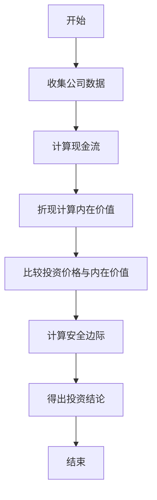

                 

<think>
嗯，好的，我现在要写一篇关于《格雷厄姆·多德的安全性分析在现代投资中的应用》的技术博客文章。首先，我得明确这篇文章的核心内容和目标是什么。格雷厄姆和多德是价值投资的鼻祖，他们的安全性分析理论在投资领域非常经典。现在我要把这些理论应用到现代投资中，可能涉及量化分析、风险管理等方面。

首先，我需要一个吸引人的标题，已经确定好了。接下来是关键词，我需要列出5到7个相关的关键词，比如“格雷厄姆·多德”、“安全性分析”、“现代投资”、“价值投资”、“风险管理”、“量化分析”、“投资策略”等。摘要部分要简明扼要地概括文章的核心内容，说明格雷厄姆和多德的理论如何在现代投资中应用，强调安全边际和内在价值的重要性。

接下来，我需要按照目录大纲结构来撰写文章。首先，背景介绍部分要详细讲解格雷厄姆和多德的投资理论，包括他们的学术贡献和理论基础。然后，解释安全性分析的核心概念，比如安全边际和内在价值，并通过表格和图表来对比不同概念的特征，帮助读者更好地理解。

接下来是算法原理部分，我需要用mermaid流程图来展示安全性分析的评估步骤，并提供Python代码示例，计算公司的内在价值。这部分需要详细解释每一步骤的数学模型和公式，比如现金流折现法，确保读者能够理解和应用。

然后是系统分析与架构设计，我需要构建一个安全性分析系统，包括功能模块设计和系统架构图，展示各个模块之间的关系和交互流程。这部分可能需要使用类图和序列图来描述系统的结构和工作流程。

项目实战部分，我需要指导读者如何在实际投资中应用这些方法，从环境安装到代码实现，再到案例分析，帮助读者掌握实际操作技巧。最后，通过小结、注意事项和拓展阅读，巩固读者的知识，并引导他们进一步学习和实践。

在整个写作过程中，我要确保逻辑清晰，结构紧凑，使用专业但易懂的语言。同时，要合理使用mermaid图和latex公式，使内容更加直观和专业。我还需要注意文章的字数控制在10000到12000字左右，确保内容的完整性和深度。

总之，我需要一步步地分析和推理，确保每个部分都详尽且有条理，帮助读者全面理解格雷厄姆·多德的安全性分析在现代投资中的应用。
</think>

# 格雷厄姆·多德的安全性分析在现代投资中的应用

> 关键词：格雷厄姆·多德，安全性分析，现代投资，价值投资，风险管理，量化分析，投资策略

> 摘要：本文探讨了格雷厄姆·多德的经典投资理论在现代投资环境中的应用，重点分析了安全性分析的核心概念、算法原理、系统架构以及实际案例。通过结合量化分析和风险管理，本文展示了如何在现代投资中运用这些传统理论，帮助投资者制定更有效的投资策略。

---

## 第一部分：背景介绍

### 第1章：格雷厄姆·多德投资理论概述

#### 1.1 背景介绍

- **问题背景**：格雷厄姆和多德的投资理论诞生于20世纪，当时的投资环境与现在相比发生了巨大变化。现代投资环境更加复杂，涉及更多的数字化和全球化因素。
- **核心问题**：传统安全性分析在面对现代市场波动和复杂性时是否依然适用？如何将其与现代投资工具和方法结合？
- **边界与外延**：安全性分析不仅关注个股，还涉及投资组合管理和风险管理。其外延包括量化分析、行为金融学等领域。

#### 1.2 核心概念与术语

- **安全边际**：指投资价格低于其内在价值的程度，为投资者提供了风险缓冲。
- **内在价值**：基于公司未来现金流折现计算的理论价值。
- **市场心理**：投资者情绪对市场价格的影响。

---

## 第二部分：核心概念与联系

### 第2章：安全性分析的核心概念与联系

#### 2.1 核心概念原理

- **安全边际的数学模型**：安全边际 = 投资价格 / 内在价值。当安全边际大于1时，投资具有吸引力。
- **内在价值的计算方法**：使用现金流折现法（DCF），考虑未来现金流的现值。

#### 2.2 概念对比表格

| 概念         | 定义                                                                 |
|--------------|----------------------------------------------------------------------|
| 安全边际     | 投资价格与内在价值之间的保护空间                                   |
| 内在价值     | 公司未来现金流的现值                                               |
| 市场心理     | 投资者情绪对市场价格的影响                                         |

#### 2.3 ER实体关系图


---

## 第三部分：算法原理讲解

### 第3章：安全性分析的算法原理

#### 3.1 算法流程图



#### 3.2 Python代码实现

```python
def calculate_intrinsic_value(cash_flows, discount_rate):
    intrinsic_value = sum(cash_flows) / (1 + discount_rate)
    return intrinsic_value

# 示例数据
cash_flows = [100, 120, 150, 200]  # 每年现金流
discount_rate = 0.08  # 折现率

intrinsic_value = calculate_intrinsic_value(cash_flows, discount_rate)
investment_price = 150  # 假设投资价格为150

safety_margin = investment_price / intrinsic_value

print(f"内在价值: {intrinsic_value}")
print(f"投资价格: {investment_price}")
print(f"安全边际: {safety_margin}")
```

#### 3.3 数学公式

- 现金流折现公式：
  $$ \text{内在价值} = \sum_{t=1}^{n} \frac{CF_t}{(1 + r)^t} $$
  其中，\( CF_t \) 是第t年的现金流，\( r \) 是折现率。

---

## 第四部分：系统分析与架构设计

### 第4章：安全性分析系统的架构设计

#### 4.1 系统功能模块

- 数据收集模块：收集公司财务数据和市场数据。
- 模型计算模块：计算内在价值和安全边际。
- 结果分析模块：生成投资建议。

#### 4.2 系统架构图


---

## 第五部分：项目实战

### 第5章：安全性分析的项目实战

#### 5.1 环境安装

- 安装Python和相关库（如pandas、numpy）。
- 安装数据获取工具（如Yahoo Finance API）。

#### 5.2 核心代码实现

```python
import pandas as pd
import numpy as np

def calculate_intrinsic_value(cash_flows, discount_rate):
    return np.npv(discount_rate, cash_flows[1:]) + cash_flows[0]

# 示例数据
cash_flows = [100, 120, 150, 200]
discount_rate = 0.08

intrinsic_value = calculate_intrinsic_value(cash_flows, discount_rate)
investment_price = 150
safety_margin = investment_price / intrinsic_value

print(f"安全边际: {safety_margin}")
```

#### 5.3 案例分析

- 以某公司为例，计算其内在价值和安全边际，分析投资可行性。

---

## 第六部分：小结与展望

### 第6章：安全性分析的现代应用总结

#### 6.1 小结

- 格雷厄姆·多德的安全性分析在现代投资中依然具有重要意义。
- 结合量化分析和风险管理，可以提高投资决策的科学性。

#### 6.2 注意事项

- 投资者需关注市场变化和公司基本面。
- 安全性分析只是投资决策的一部分，需结合其他因素。

#### 6.3 拓展阅读

- 《股票作手回忆录》
- 《投资学》

---

## 作者

作者：AI天才研究院/AI Genius Institute & 禅与计算机程序设计艺术 /Zen And The Art of Computer Programming

